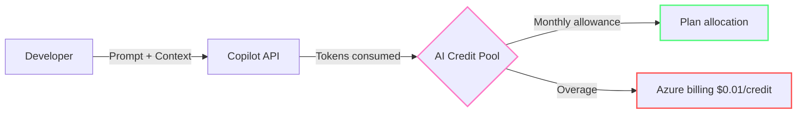
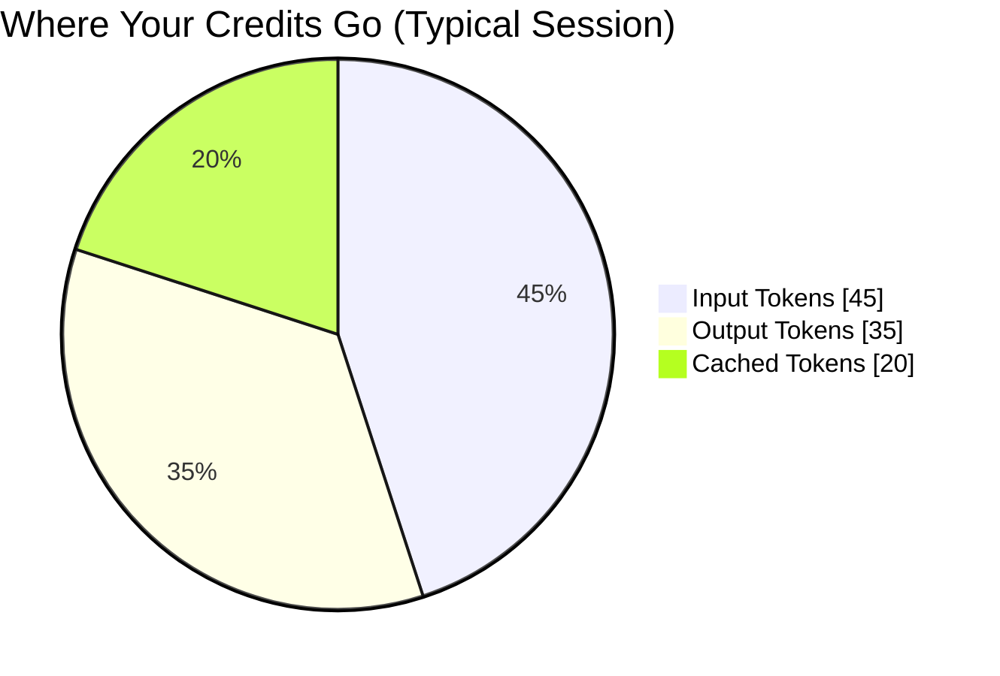
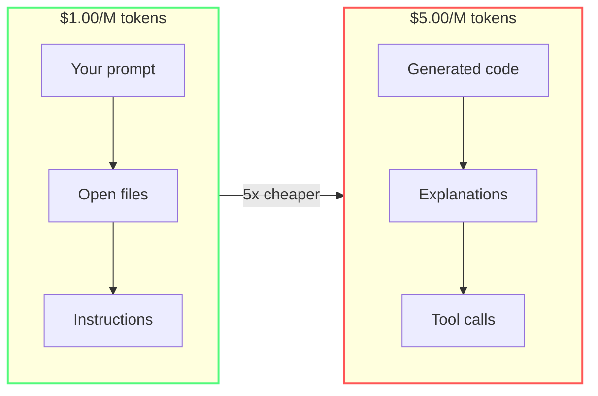
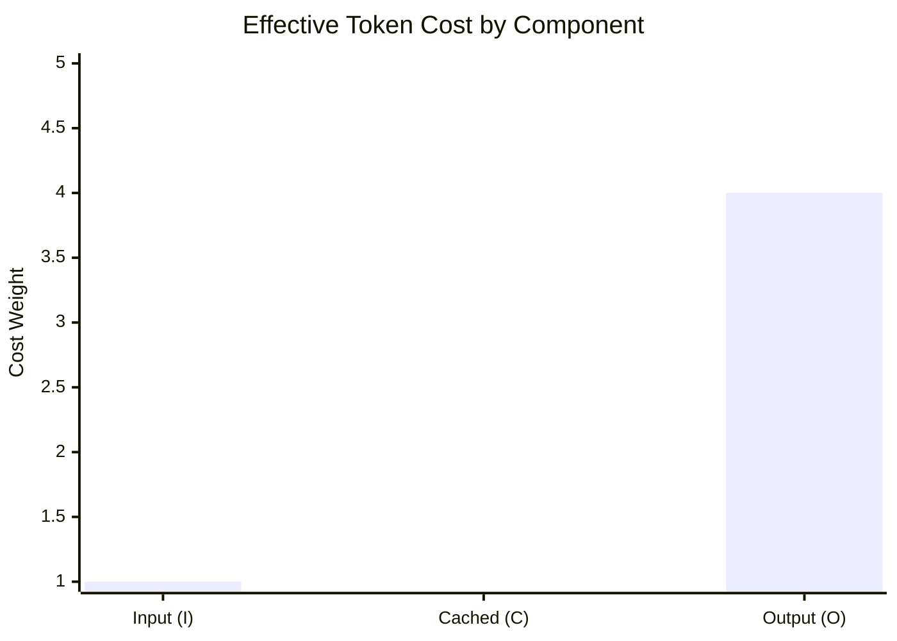

import { Steps, Tabs, TabItem } from "@astrojs/starlight/components";

# The Hidden Tax: Understanding AI Credit Costs

Starting **June 1, 2026**, GitHub moved Copilot billing to a **Usage-Based Billing (UBB)** model. Every interaction — chat, agent, CLI, API calls — is measured in tokens and deducted from a shared pool of **AI Credits**. [^1]

[^1]: [GitHub Copilot is moving to usage-based billing](https://github.blog/news-insights/company-news/github-copilot-is-moving-to-usage-based-billing/) — GitHub Blog. See also [Usage-based billing for organizations and enterprises](https://docs.github.com/en/copilot/concepts/billing/organizations-and-enterprises/usage-based-billing) — GitHub Docs.

This module explains what that means for your wallet.

---

## What Is UBB and Why Should You Care

Under the old model, you paid a flat fee per seat. Your heaviest user cost the same as someone who never opened chat. Under UBB, **you pay for what you use**.

The key insight: **not all usage costs the same**. The split between input tokens (what you send) and output tokens (what the model generates) dramatically affects your burn rate.

---

## Where Your Tokens Go

Every Copilot request has three token categories:

:::note[Illustrative proportions]
These proportions are typical examples; the actual split varies by model, project, and workflow.
:::

- **Input tokens** — your prompt, open files, conversation history, system instructions
- **Output tokens** — the model's response (code, explanations, tool calls)
- **Cached tokens** — reused from previous requests when prefix matches

:::note[Why output is the real cost driver]
Output tokens can cost approximately **4–8x more** than input tokens per million, depending on the model. A verbose model response burns credits far faster than a lengthy prompt.
:::

---

## AI Credits Per Plan

Each paid plan includes a monthly credit allowance, and Free has a smaller capped allowance. When that allowance runs out, additional usage is billed at **$0.01 per credit**. [^2]

| Plan | Monthly Credits | Value | Pooling |
|------|----------------|-------|---------|
| Copilot Free | Limited | $0 | No chat pool |
| Copilot Pro | 1,500[^3] | $15 | Individual only |
| Copilot Pro+ | 7,000[^3] | $70 | Individual only |
| Copilot Max | 20,000[^3] | $200 | Individual only |
| Copilot Business | 1,900/license | $19 | **Enterprise pool** |
| Copilot Enterprise | 3,900/license | $39 | **Enterprise pool** |

[^2]: [Models and pricing for GitHub Copilot](https://docs.github.com/en/copilot/reference/copilot-billing/models-and-pricing) — GitHub Docs. Reference rates for additional usage.
[^3]: Individual plan credit allowances updated per [Usage-based billing for individuals](https://docs.github.com/en/copilot/concepts/billing/usage-based-billing-for-individuals) — GitHub Docs.

:::note[Plan allowances can change]
For individual plans, GitHub now splits included usage into **base credits** plus a variable **flex allotment**, so totals like **1,500**, **7,000**, and **20,000** are current allowances rather than permanent promises. Check the live plan page before copying these numbers into a budget or slide deck.[^3]
:::

:::caution[Enterprise pooling is a double-edged sword]
One developer wasting tokens drains the shared budget for the whole organization. A single unoptimized agent loop can cost the team hundreds of credits.
:::

---

## The Asymmetric Pricing Problem

Here's where most teams get surprised. Output tokens are dramatically more expensive than input tokens.

For Claude Haiku 4.5: **$1.00/M input → $5.00/M output** (5x multiplier).
For powerful models like Claude Opus 4.8: **$5.00/M input → $25.00/M output**.

The takeaway: **what the model says back to you costs 5x what you send it**. Long, chatty responses are the fastest way to burn through credits.

---

## Measuring What Matters: Effective Tokens

Raw token count is misleading. A 10K-token session with 60% cache hits is dramatically cheaper than a 5K-token session with zero cache hits. GitHub engineers introduced the **Effective Tokens (ET)** formula to normalize this in their May 2026 write-up on token efficiency:[^5]

$$
ET = m \times (1.0 \times I + 0.1 \times C + 4.0 \times O)
$$

Where:
- **m** — model multiplier (normalizes price differences when switching models mid-workflow)
- **I** — fresh input tokens (1.0x weight)
- **C** — cached input tokens (0.1x weight — up to 90% cheaper)
- **O** — output tokens (4.0x weight — the real cost driver)

[^5]: GitHub, [Improving token efficiency in GitHub Agentic Workflows](https://github.blog/news-insights/product-news/improving-token-efficiency-in-github-agentic-workflows/) — published May 7, 2026 and updated May 13, 2026.

:::tip[ET in practice]
GitHub reported a **62% reduction** in effective tokens over 109 execution cycles in its auto-issue-triage workflow — just by restructuring how context was composed. Across all analyzed workflows, GitHub reported ET savings ranging from **19% to 62%**.
:::

The insight: **optimizing for raw token count misses the point**. A request with high cache reuse costs a fraction of a "smaller" request with no cache hits. This is why keeping your prompt prefix stable (Module 2) matters more than writing shorter prompts.

---

## What's Free vs What Costs

Not everything in Copilot costs credits. The split is crucial:

| Free (no credits) | Costs Credits |
|---|---|
| Inline code completions (Ghost Text) | Copilot Chat messages |
| Next Edit Suggestions | Agent mode sessions |
| | CLI copilot commands |
| | PR summaries |
| | Custom model fine-tuning |

:::tip[Maximum ROI]
Use **inline completions** for routine coding. They're unlimited and free. Reserve chat and agents for tasks that genuinely need reasoning.
:::

---

## Model Pricing Reference

Here are the current Claude model prices (per 1M tokens) available in Copilot: [^4]

:::note[Check live model rates]
Plan allowances are relatively stable, but model catalogs and per-token rates move faster. Treat the table below as a current snapshot and use GitHub Docs as the source of truth before budgeting or training others on exact rates.[^4]
:::

| Model | Input $/M | Output $/M | Best For |
|-------|-----------|------------|----------|
| Claude Haiku 4.5 | $1.00 | $5.00 | Quick edits, regex, tests |
| Claude Sonnet 4.6 | $3.00 | $15.00 | General development |
| Claude Opus 4.8 | $5.00 | $25.00 | Architecture, complex bugs |
| Claude Fable 5 | $10.00 | $50.00 | Strategic planning |

OpenAI and Google models follow similar patterns — lightweight tiers are significantly cheaper.

[^4]: [Models and pricing for GitHub Copilot](https://docs.github.com/en/copilot/reference/copilot-billing/models-and-pricing) — GitHub Docs. Reference rates per 1M tokens for additional usage.

:::note[Auto mode saves automatically]
Keep your model selector on "Auto" when possible. Copilot routes simple questions to cheaper models, giving your team a variable discount.
:::

---

## Enterprise Considerations

If you're on Business or Enterprise:

- **Pooled budget** — all credits are shared at the billing entity level
- **No per-user caps** — one heavy user affects everyone
- **Overage billing** — when the pool empties, additional usage becomes metered spend at $0.01/credit
- **Content exclusion** — admins can block certain file types from being sent as context

### What This Means for Team Leads

The financial incentive aligns with good engineering practice:
1. Set up `.github/copilot-instructions.md` with output-minimizing rules
2. Educate the team on model selection (don't use Opus for a string split)
3. Monitor credit consumption via GitHub admin dashboard
4. Create `.copilotignore` for build artifacts and test fixtures

---

:::tip[Continue Learning]
Now that you understand the cost model, learn [how Copilot builds context](/token-economy-course/en/02-context-model) — it explains why every request costs what it does. Then jump to [Quick Wins](/token-economy-course/en/04-quick-wins) for immediate savings.
:::

---

## Key Takeaways

- **1 AI Credit = $0.01 USD**
- Output tokens cost **5x more** than input tokens
- Inline completions are **free** — use them aggressively
- Enterprise credits are **pooled** — one person's waste hurts the whole team
- Auto mode gives you **automatic discounts** on simple queries

*Estimated reading time: 10 minutes*
