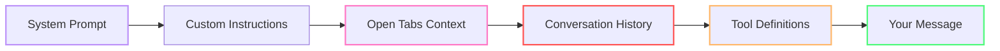
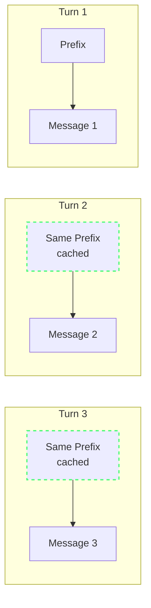
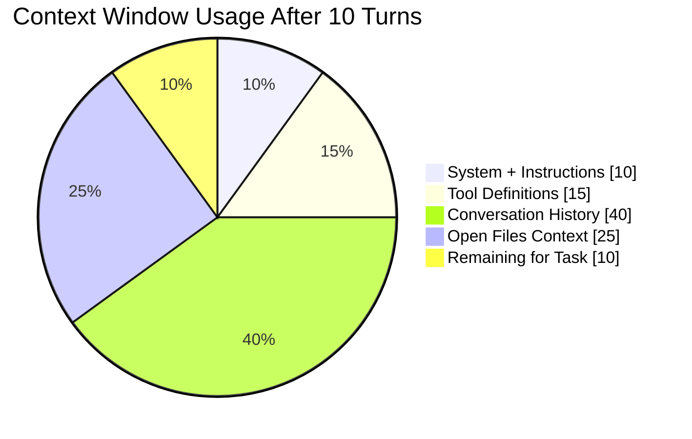
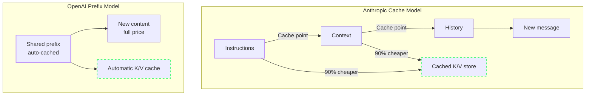

import { Steps, Tabs, TabItem } from "@astrojs/starlight/components";

# How Copilot Builds Context

Every time you press Enter in Copilot Chat, a surprisingly large payload leaves your machine. Understanding what's in that payload — and how Copilot decides what to include — is the key to controlling your token burn.

---

:::note[Case Study: Team Alpha]
Team Alpha discovered that their 'quick question about auth' was sending 15 open tabs as context — ~8,000 tokens of irrelevant files with every request. Understanding the context model cut their waste immediately: 14,200 → 12,500 credits.
:::

## Anatomy of a Copilot Request

Here's what gets packaged and sent with every chat message or agent step:



| Component | What It Is | Typical Size |
|-----------|-----------|-------------|
| **System Prompt** | Model-level instructions (role, capabilities) | ~500 tokens |
| **Custom Instructions** | `.github/copilot-instructions.md`, `AGENTS.md` | ~50–1000+ tokens |
| **Open Tabs** | Visible editor files, auto-included as context | ~500–10,000+ tokens |
| **Conversation History** | All previous messages in the current thread | ~0–20,000+ tokens |
| **Tool Definitions** | MCP server schemas, tool descriptions | ~500–5000+ tokens |
| **Your Message** | The actual prompt you typed | ~10–500 tokens |

:::note[Illustrative size estimates]
These token ranges are approximate and vary by project, files, instructions, tools, and conversation length.
:::

:::tip[The fixed tax]
System prompt + custom instructions are sent **every single time**, regardless of the question. This is your baseline token cost per request.
:::

---

## The Prompt Prefix

In an agentic session, a large share of every request repeats across turns: system instructions, tool definitions, repository context, and conversation history. This repeated beginning is the **prompt prefix**.



The prompt prefix is the **single biggest lever** for token optimization. When the prefix stays stable, the provider can cache it. When you change context — open a new file, switch branches, add instructions — you invalidate the cache and pay full price.

---

## How Context Window Fills Up

Copilot models have a maximum context window (128K–200K tokens depending on model). Here's what a typical long session looks like:



When the window fills, the model starts **forgetting** earlier context. It can't see the file you referenced 5 turns ago. The solution isn't a bigger window — it's using less per turn.

---

## Prefix Caching vs Cache Breakpoints

This is where provider implementation matters. The two major approaches:

### Anthropic: Cache Breakpoints

Anthropic lets you **explicitly mark** sections of the prompt as cacheable. The first N tokens become a cache entry that persists across requests. Cache hits are ~90% cheaper than fresh computation.[^1]

[^1]: [Prompt caching](https://docs.anthropic.com/en/docs/build-with-claude/prompt-caching) — Anthropic Docs. Savings depend on the model and cache behavior.

### OpenAI: Automatic Prompt Prefix

OpenAI caches the **shared prefix** automatically. When identical tokens appear at the start of consecutive requests, the inference engine reuses the computed state. There's no manual control — it either matches or it doesn't.



:::note[Cache economics]
Cached tokens are dramatically cheaper than fresh tokens. A useful mental model is **~10% of fresh cost on Anthropic** (about a 90% discount) and **~50% on OpenAI**, though exact pricing depends on model and tier. That means a **10K-token session with 60% cache hits can be cheaper than a 5K-token session with zero hits**.
:::

:::caution[What breaks the cache]
Any change to the prompt prefix invalidates the cache: switching models, changing custom instructions, opening/closing a file, or even the conversation history growing past the cache boundary.
:::

:::tip[When to /clear vs When to Stay]

| Situation | Action | Why |
|-----------|--------|-----|
| Same task, multiple steps | Stay in session | Caching compounds across turns |
| Task complete, new unrelated task | Start fresh | Stale context pollutes answers |
| Long session (10+ turns), same task | Compact-and-continue | Summarize, paste into new thread |
| Model switching needed | Use subagent, don't switch main | Switching breaks cache entirely |

:::

---

## The "Local Metric" Trap

Here's a dangerous misconception: **you can't see the real cost from your local setup**.

What you observe locally:
- Response time
- Number of messages sent
- Approximate code quality

What you **can't** see:
- Actual token count per request (without debug logging)
- Split between input, output, and cached tokens
- Pooled credit consumption for your team
- How your usage compares to others in your org

This leads to blind spots. A developer who "only asked 20 questions" may have consumed thousands of tokens per question because the context window was bloated.

:::tip[Enable debug logging to see actual counts]
```json
// VS Code settings.json
"github.copilot.chat.agentDebugLog.fileLogging.enabled": true
```
Then open Chat view → **...** → **Show Agent Debug Logs** → open the **Summary** tab to see token counts per request.
:::

---

## Common Cache-Busting Mistakes

The painful part of prefix caching is that tiny, innocent-looking changes can force a full rebuild. These are the repeat offenders:

| Mistake | What happens | Why it matters | How to fix it |
|---------|--------------|----------------|---------------|
| **Timestamps in system prompts** | Every request produces a different prefix hash, so the cache misses on every call. | You pay full price repeatedly for instructions that were supposed to be reusable. | Move the changing detail into a later message — for example a `<system-reminder>` block — instead of rewriting the top-level system prompt. |
| **Switching models mid-session** | The new model can't reuse the old model's cached KV state. | Model changes force a full rebuild right when the conversation is largest. | Keep the main thread on one model; use a subagent for one-off cheaper tasks instead of switching the main session. |
| **Changing tools mid-session** | Adding or removing MCP servers changes the tool prefix, invalidating downstream cache segments. | Tool schemas are often large, so a tool change can be an expensive cache reset. | Configure the toolset before you begin the session and keep it stable while you work. |
| **Non-deterministic tool ordering** | The same tools in a different order produce a different serialized prefix. | The provider only sees bytes and hashes, not your intent. Same meaning, different order, same miss. | Use a stable, deterministic ordering for tool definitions every time. |
| **JSON key randomization** | Languages like Go and Swift can emit object keys in a different order, changing the cached prefix. | Semantically identical payloads can still miss the cache if their serialized form changes. | Use ordered serialization or normalize key order before sending tool payloads. |
| **Modifying instructions mid-session** | Editing `copilot-instructions.md` or `AGENTS.md` changes the always-on instruction layer for the next turn. | That breaks the system/custom-instructions cache and forces a full prefix rebuild. | Update instructions between tasks, then intentionally start a fresh session so the rebuild happens once, on purpose. |

:::note[Rule of thumb]
If a change affects **tools**, **top-level instructions**, or the **early shared history**, assume the cache just exploded and budget accordingly.
:::

---

## Fork Conversations

Type `/fork` in the chat input to create a new session that **inherits the entire conversation history**. You can also hover over an earlier message and choose **Fork Conversation** to branch from that specific checkpoint.

Use forking when you want to explore an alternative approach or ask a side question without paying the prefix cost again. Unlike `/clear` and `/compact`, forking is for divergent exploration — parallel tracks — not for continuing the same task in a smaller context.

See [Fork a chat session](https://code.visualstudio.com/docs/agents/run/sessions/manage-sessions#_fork-a-chat-session) in the VS Code documentation.

:::tip[Practical takeaway]
Fork before experimenting with a risky approach: keep the original thread intact, and explore the alternative in a branch that already has the relevant context.
:::

---

## What It Means for Your Workflow

Understanding the context model leads to four practical rules:

1. **Keep the prefix stable** — avoid unnecessary file switching during a session
2. **Reset at task boundaries** — clear chat when switching tasks. Within a single task, keep the session alive to benefit from prefix caching.
3. **Minimize always-on instructions** — keep `copilot-instructions.md` lean, use `.prompt.md` files for specialized rules
4. **Ground before exploration** — make sure the workspace semantic index is available, use `#codebase` to explicitly ground a request in the indexed codebase, and include relevant files, errors, constraints, and success criteria in your prompt. Use symbol-aware search and focused MCP/CLI tools for authoritative data, and put stable project conventions in custom instructions so the agent does not have to rediscover them every session. See [Semantic search](https://code.visualstudio.com/docs/agents/reference/workspace-context#_semantic-search).

These patterns can reduce your per-request context by 40–60%, depending on the project and workflow.

---

## How Prompt Caching Works

Prompt caching is the single biggest driver of token savings in Copilot. When the shared prompt prefix stays stable, providers can reuse the model state already computed for system instructions, tools, repository context, and conversation history instead of processing those tokens from scratch.

### Cache Mechanics Across Providers

Different model providers implement caching differently — and the differences affect your costs.

| Provider | Cache Type | Explicit Control? | Write Cost | Hit Cost | Default TTL |
|----------|-----------|-------------------|------------|----------|-------------|
| OpenAI (GPT-5.x) | Auto + Manual | Yes — `prompt_cache_breakpoint` | 1.25x | 0.1x (90% off) | Configurable |
| Anthropic (Claude) | Manual | Yes — `cache_control` | 1.25x–2.0x | 0.1x (90% off) | 5 min |
| DeepSeek (V4 Pro) | Disk-based | No (implicit) | None | 0.5x (50% off) | N/A |
| Google (Gemini 3.5) | Context-based | No (implicit) | None | Varied | Session |

For the day-to-day mistakes that break the cache, see the Common Cache-Busting Mistakes section above.

OpenAI GPT-5.x supports extended caching with `prompt_cache_retention: "24h"`. VS Code Copilot measured a **+919% hit-rate improvement after 40–60 minute gaps** and **+338% after 30–40 minute gaps**. This is especially valuable for async workflows where turns are minutes apart.

### Extended TTL Changes the Economics of Async Work

OpenAI's 24-hour retention window can keep the expensive prefix alive across normal developer pauses instead of losing the cache between asynchronous turns. For workflows with longer gaps between requests, that means fewer cold starts and lower effective token cost.

:::caution[The Anthropic TTL controversy]
In March 2026, Anthropic silently changed their default cache TTL from **1 hour to 5 minutes**. This caused massive, silent cost spikes for async systems — caches expired between requests, and every turn paid full price.

If you're on Anthropic-backed models (Claude in Copilot), keep sessions active and continuous. Long pauses between turns can cost you the cache. If your workflow is highly async, OpenAI's configurable retention window on GPT-5.x gives you more control.
:::

### What This Means for You

- **Don't modify system instructions mid-session.** If you must, accept the one-time cache miss and keep going.
- **Monitor for silent cache failures.** Use Copilot debug logging (`github.copilot.chat.agentDebugLog.fileLogging.enabled`) to check actual token counts.
- **Choose providers for async workflows.** OpenAI's configurable TTL gives highly asynchronous workflows more control than Anthropic's fixed 5-minute window.

:::tip[Continue Learning]
Understanding the context model makes [The Hidden Tax](/vibe-on-budget/en/01-hidden-tax) numbers concrete. Apply this knowledge with [Quick Wins](/vibe-on-budget/en/04-quick-wins).
:::

---

## Practice

1. Start a new chat session. Before sending any message, count how many editor tabs you have open. Close all but the 3 most relevant ones. This is your baseline.
2. Enable debug logging: set `github.copilot.chat.agentDebugLog.fileLogging.enabled` to `true` in settings. After your next chat session, open Agent Debug Logs → Summary and note the input/output token split.
3. In a single session, ask 3 related questions about the same file. Use Cache Explorer to check: did your cache hit rate improve after the first turn?

## Key Takeaways

- Every request includes a **fixed prefix** (system instructions, tools, history) plus your message
- The **prompt prefix** is cacheable — but easily invalidated
- Anthropic uses **cache breakpoints** (manual), OpenAI uses **automatic prefix matching**
- **Conversation history** is the fastest-growing part of the context window
- You can't measure what you can't see — **enable debug logging** to understand your real cost

*Estimated reading time: 10 minutes*
