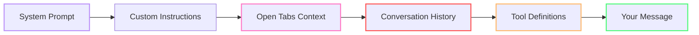
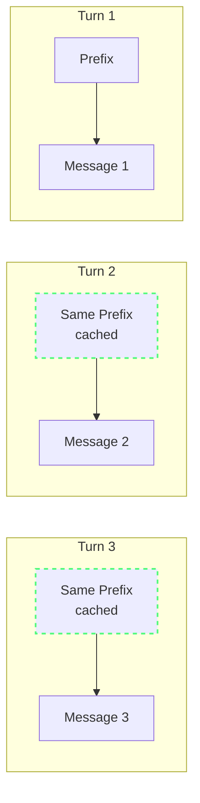
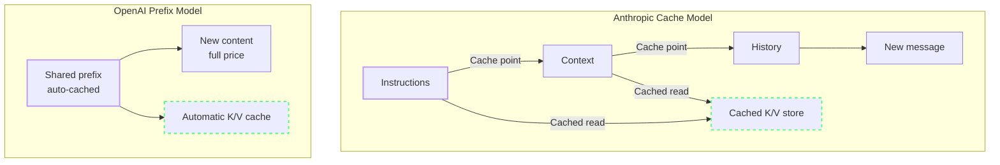

import { Steps, Tabs, TabItem } from "@astrojs/starlight/components";

# How Copilot Builds Context

Every time you press Enter in Copilot Chat, a surprisingly large payload leaves your machine. Understanding what's in that payload — and how Copilot decides what to include — is the key to controlling your token burn.

---

:::
## Anatomy of a Copilot Request 🟢

Here's a practical model of the material that can contribute to a chat request or agent step. OpenAI's prompt-caching documentation explicitly describes rendered instructions, developer messages, tools, and conversation history as part of the cached context.[^m2-1]



| Component | What It Is | Size |
|-----------|-----------|-------------|
| **System Prompt** | Model-level instructions (role, capabilities) | Varies by model and client |
| **Custom Instructions** | `.github/copilot-instructions.md`, `AGENTS.md` | Varies by workspace |
| **Open Tabs** | Visible editor files, auto-included as context | Varies by files and settings |
| **Conversation History** | All previous messages in the current thread | Grows with the session |
| **Tool Definitions** | [MCP (Model Context Protocol — an open protocol for AI-tool communication)](https://modelcontextprotocol.io/) server schemas, tool descriptions | Varies by enabled tools |
| **Your Message** | The actual prompt you typed | Varies by request |

:::note[No fixed component size]
The client and provider determine the final rendered request; do not treat these rows as universal token budgets.[^m2-2]
:::

:::tip[The recurring prefix]
System instructions, tools, and reusable conversation context can recur in later requests. This is the part providers can often cache when the prefix matches.[^m2-1]
:::

*(See [Glossary](/vibe-on-budget/en/glossary) for definitions of context window, prompt prefix, and other key terms.)*

---

## The Prompt Prefix 🟡

In an agentic session, a large share of every request repeats across turns: system instructions, tool definitions, repository context, and conversation history. This repeated beginning is the **prompt prefix**.



The prompt prefix is a major token-optimization lever. When the prefix stays stable, providers can reuse it; when the rendered prefix changes, the affected cache entry may no longer match.[^m2-1][^m2-3]

---

## How Context Window Fills Up 🟢

Models have model-specific context limits, and current provider documentation lists limits that vary substantially by model. Treat the limit published for the selected model as authoritative rather than assuming a universal 128K–200K range.[^m2-4][^m2-5][^m2-6] Here's how context can accumulate during a long session:

System instructions, tools, conversation history, and file context all compete for the selected model's available context; the proportions are workload-dependent.[^m2-1][^m2-4][^m2-5][^m2-6]

When the available context limit is reached, earlier material may need to be truncated, summarized, or otherwise excluded by the client or provider. The practical response is to manage the material sent per turn and verify the selected model's limit.[^m2-4][^m2-5][^m2-6]

---

## Prefix Caching vs Cache Breakpoints 🟡

This is where provider implementation matters. The two major approaches:

### Anthropic: [Cache Breakpoints](https://docs.anthropic.com/en/docs/build-with-claude/prompt-caching)

Anthropic lets you **explicitly mark** prompt blocks as cacheable. Those marked prefixes can persist across requests. Cache reads are priced at 10% of standard input pricing on Anthropic's current pricing documentation; the exact result depends on model, cache tier, and request shape.[^m2-7][^m2-9]

### OpenAI: [Automatic Prompt Prefix](https://platform.openai.com/docs/guides/prompt-caching)

OpenAI prompt caching reuses matching shared prefixes automatically on supported models. Current documentation also describes explicit cache-breakpoint controls for models that support them.[^m2-1]



:::note[Cache economics]
Under Anthropic's documented 10%-of-standard cache-read price, 10K input tokens with 60% cache reads have a 4.6K-token-equivalent input charge before cache-write and output charges; 5K uncached tokens have a 5K-token input charge. Thus, **10K tokens with 60% cache hits can be cheaper than 5K with zero hits**, but only under comparable model pricing and after accounting for writes and output.[^m2-7]
:::

:::caution[What breaks the cache]
Any change to the relevant shared prefix can prevent a cache match. Model switches, instruction changes, tool-definition changes, and changed early history should therefore be treated as cache-risk events rather than guaranteed misses in every implementation.[^m2-1][^m2-3]
:::

:::tip[When to /clear vs When to Stay]

| Situation | Action | Why |
|-----------|--------|-----|
| Same task, multiple steps | Stay in session | Caching compounds across turns |
| Task complete, new unrelated task | Start fresh | Stale context pollutes answers |
| Long session (10+ turns), same task | Compact-and-continue | Summarize, paste into new thread |
| Model switching needed | Use subagent, don't switch main | Switching breaks cache entirely |

:::

---

## The "Local Metric" Trap 🟢

Here's a dangerous misconception: local response behavior alone does not expose every provider-side token or cache metric. VS Code provides agent debug logging to inspect session diagnostics.[^m2-8]

What you observe locally:
- Response time
- Number of messages sent
- Approximate code quality

What you **can't** see:
- Actual token count per request (without debug logging)
- Split between input, output, and cached tokens
- Pooled credit consumption for your team
- How your usage compares to others in your org

Use the debug view and provider usage data instead of inferring cost from message count alone.[^m2-7][^m2-8]

:::tip[Enable debug logging to see actual counts]
```json
// VS Code settings.json
"github.copilot.chat.agentDebugLog.fileLogging.enabled": true
```
Then open Chat view → **...** → **Show [Agent Debug Logs](https://code.visualstudio.com/docs/agents/agent-troubleshooting/chat-debug-view)**. VS Code documents the debug view and its file-logging settings for investigating agent sessions.[^m2-8]
:::

---

## Common Cache-Busting Mistakes 🟡

The painful part of prefix caching is that changes to the shared serialized prefix can prevent a cache match. These are common risk patterns documented in provider guidance:[^m2-1][^m2-3]

| Mistake | What happens | Why it matters | How to fix it |
|---------|--------------|----------------|---------------|
| **Timestamps in system prompts** | Every request produces a different prefix hash, so the cache misses on every call. | You pay full price repeatedly for instructions that were supposed to be reusable. | Move the changing detail into a later message — for example a `<system-reminder>` block — instead of rewriting the top-level system prompt. |
| **Switching models mid-session** | The new model can't reuse the old model's cached KV state. | Model changes force a full rebuild right when the conversation is largest. | Keep the main thread on one model; use a subagent for one-off cheaper tasks instead of switching the main session. |
| **Changing tools mid-session** | Adding or removing MCP servers changes the tool prefix, invalidating downstream cache segments. | Tool schemas are often large, so a tool change can be an expensive cache reset. | Configure the toolset before you begin the session and keep it stable while you work. |
| **Non-deterministic tool ordering** | The same tools in a different order produce a different serialized prefix. | The provider only sees bytes and hashes, not your intent. Same meaning, different order, same miss. | Use a stable, deterministic ordering for tool definitions every time. |
| **JSON key randomization** | Languages like Go and Swift can emit object keys in a different order, changing the cached prefix. | Semantically identical payloads can still miss the cache if their serialized form changes. | Use ordered serialization or normalize key order before sending tool payloads. |
| **Modifying instructions mid-session** | Editing `copilot-instructions.md` or `AGENTS.md` changes the always-on instruction layer for the next turn. | That breaks the system/custom-instructions cache and forces a full prefix rebuild. | Update instructions between tasks, then intentionally start a fresh session so the rebuild happens once, on purpose. |

:::note[Rule of thumb]
If a change affects **tools**, **top-level instructions**, or the **early shared history**, assume the cache just exploded and budget accordingly.
:::

---

## Fork Conversations 🟡

Type `/fork` in the chat input to create a new session that **inherits the entire conversation history**. You can also hover over an earlier message and choose **Fork Conversation** to branch from that specific checkpoint.

Use forking when you want to explore an alternative approach or ask a side question without paying the prefix cost again. Unlike `/clear` and [/compact](https://code.visualstudio.com/docs/agents/run/sessions/manage-sessions#_compact-conversation-context), forking is for divergent exploration — parallel tracks — not for continuing the same task in a smaller context.

See [Fork a chat session](https://code.visualstudio.com/docs/agents/run/sessions/manage-sessions#_fork-a-chat-session) in the VS Code documentation. The [/compact](https://code.visualstudio.com/docs/agents/run/sessions/manage-sessions#_compact-conversation-context) command manages conversation context.[^m2-15]

:::tip[Practical takeaway]
Fork before experimenting with a risky approach: keep the original thread intact, and explore the alternative in a branch that already has the relevant context.
:::

---

## What It Means for Your Workflow

Understanding the context model leads to four practical rules:

1. **Keep the prefix stable** — avoid unnecessary file switching during a session
2. **Reset at task boundaries** — clear chat when switching tasks. Within a single task, keep the session alive to benefit from prefix caching.
3. **Minimize always-on instructions** — keep `copilot-instructions.md` lean, use `.prompt.md` files for specialized rules
4. **Ground before exploration** — make sure the workspace semantic index is available, use `#codebase` to explicitly ground a request in the indexed codebase, and include relevant files, errors, constraints, and success criteria in your prompt. Use symbol-aware search and focused MCP/CLI tools for authoritative data, and put stable project conventions in custom instructions so the agent does not have to rediscover them every session. See [Semantic search](https://code.visualstudio.com/docs/agents/reference/workspace-context#_semantic-search).[^m2-16]

Measure the effect in your own workspace: the useful baseline is the request and cache data exposed by the client and provider.[^m2-2][^m2-7]

---

## How Prompt Caching Works

Prompt caching is an important source of token savings when requests repeat context. When the shared prompt prefix stays stable, providers can reuse the model state already computed for system instructions, tools, repository context, and conversation history instead of processing those tokens from scratch.[^m2-1]

### Cache Mechanics Across Providers

Different model providers implement caching differently — and the differences affect your costs.

| Provider | Cache Type | Explicit Control? | Write Cost | Hit Cost | Default TTL |
|----------|-----------|-------------------|------------|----------|-------------|
| OpenAI (GPT-5.x) | Prefix caching; supported models also expose breakpoints | Supported controls vary by model | See current pricing | Up to 90% discount on cached input | See model/API documentation[^m2-1] |
| Anthropic (Claude) | Explicit or automatic prefix caching | Yes — `cache_control` | 1.25x for 5-minute writes; 2x for 1-hour writes | 0.1x (90% off) | 5 min or 1 hour[^m2-9] |
| DeepSeek | Disk-based prefix caching | No code changes required | Not stated in the cited guide | See current API pricing | No fixed TTL stated[^m2-10] |
| Google (Gemini) | Named context-cache resources | Yes — create/use a cache resource | Model-dependent | Model-dependent | Explicit cache expiration[^m2-11] |

For the day-to-day mistakes that break the cache, see the Common Cache-Busting Mistakes section above.

OpenAI documents prompt-cache retention controls, including extended retention of up to 24 hours in supported deployments; availability and defaults depend on the model, organization, and data-retention policy. Cache reuse is not a guarantee, so monitor hit data rather than budgeting as if every request will hit.[^m2-1][^m2-12]

:::caution[The Anthropic TTL controversy]
Anthropic's April 23, 2026 postmortem describes a cache-related Claude Code regression.[^m2-13] Particula Tech separately reports that a March 2026 change reduced an implicit prompt-cache TTL from **1 hour to 5 minutes** for some requests and describes resulting cost increases; that account is third-party reporting, not an Anthropic pricing guarantee.[^m2-14]

If you're on Anthropic-backed models, set the documented TTL explicitly where the integration permits it and monitor cache reads. Long pauses can outlast a short TTL; provider retention controls differ.[^m2-9][^m2-12]
:::

### What This Means for You

- **Don't modify system instructions mid-session.** If you must, accept the one-time cache miss and keep going.
- **Monitor for silent cache failures.** Use Copilot debug logging (`github.copilot.chat.agentDebugLog.fileLogging.enabled`) to check actual token counts.
- **Choose providers for async workflows.** Provider cache-retention controls differ; compare the selected model's documented TTL and monitor cache reads.[^m2-9][^m2-12]

:::tip[Continue Learning]
Understanding the context model makes [The Hidden Tax](/vibe-on-budget/en/01-hidden-tax) numbers concrete. Apply this knowledge with [Quick Wins](/vibe-on-budget/en/04-quick-wins).
:::

---

## Practice

1. Start a new chat session. Before sending any message, count how many editor tabs you have open. Close all but the 3 most relevant ones. This is your baseline.
2. Enable debug logging: set `github.copilot.chat.agentDebugLog.fileLogging.enabled` to `true` in settings. After your next chat session, open Agent Debug Logs → Summary and note the input/output token split.
3. In a single session, ask 3 related questions about the same file. Use Cache Explorer to check: did your cache hit rate improve after the first turn?

## Key Takeaways

- A request combines a reusable **prefix** (instructions, tools, history) with the current message.[^m2-1]
- The **prompt prefix** can be cached — but matching depends on the provider and request.[^m2-1][^m2-9]
- Anthropic supports **cache controls**, and OpenAI supports automatic prefix caching plus model-dependent breakpoint controls.[^m2-1][^m2-9]
- **Conversation history** can grow with each turn and consume context capacity.[^m2-1][^m2-4][^m2-5][^m2-6]
- You can't measure what you can't see — **enable debug logging** to understand your real cost.[^m2-8]

[^m2-1]: [Prompt caching](https://developers.openai.com/api/docs/guides/prompt-caching) — OpenAI, accessed 2026-09-07.
[^m2-2]: [AI settings reference](https://code.visualstudio.com/docs/agents/reference/ai-settings) — Visual Studio Code, accessed 2026-09-07.
[^m2-3]: [How Claude Code uses prompt caching](https://code.claude.com/docs/en/prompt-caching) — Anthropic, accessed 2026-09-07.
[^m2-4]: [Claude models overview](https://docs.anthropic.com/en/docs/about-claude/models/overview) — Anthropic, accessed 2026-09-07.
[^m2-5]: [GPT-5 model documentation](https://developers.openai.com/api/docs/models/gpt-5) — OpenAI, accessed 2026-09-07.
[^m2-6]: [Gemini models](https://ai.google.dev/gemini-api/docs/models) — Google, accessed 2026-09-07.
[^m2-7]: [Pricing](https://platform.claude.com/docs/en/about-claude/pricing) — Anthropic, accessed 2026-09-07.
[^m2-8]: [Chat debug view](https://code.visualstudio.com/docs/agents/agent-troubleshooting/chat-debug-view) — Visual Studio Code, accessed 2026-09-07.
[^m2-9]: [Prompt caching](https://docs.anthropic.com/en/docs/build-with-claude/prompt-caching) — Anthropic, accessed 2026-09-07.
[^m2-10]: [Context caching](https://api-docs.deepseek.com/guides/kv_cache/) — DeepSeek, accessed 2026-09-07.
[^m2-11]: [Context caching](https://ai.google.dev/gemini-api/docs/caching) — Google, accessed 2026-09-07.
[^m2-12]: [Prompt caching with Azure OpenAI](https://learn.microsoft.com/en-us/azure/foundry/openai/how-to/prompt-caching) — Microsoft, accessed 2026-09-07.
[^m2-13]: [An update on recent Claude Code quality reports](https://www.anthropic.com/engineering/april-23-postmortem) — Anthropic, April 23, 2026.
[^m2-14]: [Anthropic Prompt Cache TTL Cut to 5 Minutes: How to Fix It](https://particula.tech/blog/anthropic-prompt-cache-ttl-5-minute-regression-debugging) — Particula Tech, accessed 2026-09-07.
[^m2-15]: [Fork a chat session](https://code.visualstudio.com/docs/agents/run/sessions/manage-sessions#_fork-a-chat-session) — Visual Studio Code, accessed 2026-09-07.
[^m2-16]: [Semantic search](https://code.visualstudio.com/docs/agents/reference/workspace-context#_semantic-search) — Visual Studio Code, accessed 2026-09-07.
