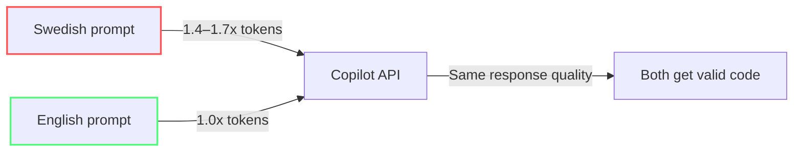

import { Steps, Tabs, TabItem } from "@astrojs/starlight/components";

# Skriv snålare prompts

Du ser nu vad saker kostar — och du vet att output är den största kostnadsdrivaren. Varje gång du skriver en prompt betalar du för både input OCH output. Output kostar ~5× mer. Så det smartaste du kan göra är att be om mindre output. Inte sämre output — *mindre*. Här är teknikerna.

*(Se [glossary](/vibe-on-budget/en/glossary) för definitioner av tokenizer, meta-prompt och caveman-speak.)*

Prompt engineering lärs oftast ut som en kvalitetsfråga. Här använder vi det som en kostnadsfråga: behåll intentionen och kraven som förbättrar resultatet, men ta bort ord som inte gör jobbet.



---

## Vaghetens kostnad 🟢

Varje tvetydigt ord i prompten kan tvinga modellen att generera fler output-tokens — resonemang, garderingar, förtydliganden och alternativ. Output kostar ungefär fem gånger mer än input, så vaghet kan bli bokstavligt talat fem gånger dyrare än tydlighet.[^m5-7]

**Före (vag, dyr):**
> "Can you look at this function and make it better? I think it might be a bit slow."

**Efter (specifik, billig):**
> "Refactor #file:calc.ts to use Map instead of nested for-loops. O(1) lookup. Code only."

Den andra versionen använder 70 procent färre input-tokens (8 ord mot 24) och producerar ungefär 90 procent färre output-tokens eftersom modellen inte behöver skriva en förklaring.

**Verifiera:** Kör samma uppgift med din gamla promptstil och den nya bullet-stilen. Hovra över båda svaren och jämför kreditkostnaden.

---

## Bullets slår prosa 🟢

Prosa med hela meningar och artiga hälsningar använder tokens på grammatik. Bullets gör uppgift, krav och outputformat skannbara utan att ta bort användbar intention.

**Prosa (dyr):**
```
Hello! Could you please help me write a function that validates
an email address? I'd like it to check for the @ symbol and make
sure there's a domain name present. Thank you!
```

**Bullets (billiga):**
```
- Write email validation function
- Check: @ symbol present, domain after @
- Return boolean
- Code only, no explanation
```

**Skillnaden:** 38 tokens → 18 tokens. På 100 prompts sparar du 2 000 input-tokens, plus output-tokens från kortare svar.

Den större vinsten är att undvika ett vagt svar som kräver en uppföljning. Lägg acceptanskriterierna bredvid uppgiften:

**Före (artig men otydlig):**
```
Could you take a look at the checkout code and improve it? It would be great
if you could make it more reliable and perhaps add some tests. Please explain
what you changed.
```

**Efter (avgränsad och körbar):**
```
- Inspect #file:checkout.ts and #file:checkout.test.ts
- Fix duplicate order submission on network retry
- Add one regression test for retry after 503
- Preserve public API
- Return 3-bullet summary
```

Den andra prompten använder tokens på information som ändrar implementationen — inte på artighet eller en bred önskan om att "förbättra" något.

**Verifiera:** Jämför en prompt skriven som prosa med samma instruktion som bullets. Hovra över svaren och kontrollera om både input- och outputkostnaden går ner.

---

## Fäst intentionen i koden 🟢

Att i chatten beskriva vad koden *redan gör* är slöseri — modellen läser ju filen själv. Referera i stället filen och lägg till en kommentar som fångar *vad du vill uppnå*. Kommentaren blir en intentionssignal som modellen läser tillsammans med koden.

**Före** (beskriver kod i chatten — redundant):

> "I have a function that processes user data. It takes a list of users and filters out inactive ones, then sorts by registration date. Can you add pagination with 100 per page sorted by registrationDate desc?"

**Efter** (kommentar i koden + kort chattmeddelande):

*I `processUsers.ts`:*
```typescript
// TODO: Add pagination, limit 100 per page, sort by registrationDate desc
export function processUsers(users: User[]) { /* ... */ }
```

*I chatten:*
> `#file:processUsers.ts` — implementera TODO:n

Samma resultat, men chattmeddelandet är 3 ord istället för 40+. Modellen läser filen direkt och använder kommentaren som uppgiftsbeskrivning — ingen redundant kodbeskrivning och mindre risk för att modellen gissar fel om vad koden gör.

### Intentionskommentarer med `// AI:`

För återkommande preferenser kan du använda `// AI:` som en mer permanent krok — en kommentar riktad direkt till modellen:

```typescript
// AI: This function is called 10k times/sec. Prioritize speed over readability.
function hotPath(data: Input[]): Output[] { /* ... */ }
```

*I chatten räcker det sedan med:*
> `#file:hotPath.ts` — refaktorera enligt AI-kommentaren

:::note[Ingen officiell feature]
`// AI:` är ett community-mönster, inte en inbyggd VS Code-funktion. Det fungerar eftersom agenten automatiskt läser öppna filer och `#`-nämnda filer — kommentaren blir en del av kontexten oavsett prefix. `TODO:`, `HACK:` eller `NOTE:` fungerar på samma sätt.
:::

Poängen är densamma: du slipper upprepa samma instruktion i varje chattmeddelande. Modellen läser kommentaren tillsammans med koden varje gång filen är i kontext.

**Verifiera:** Kör en uppgift där du först beskriver koden i chatten och sedan bara refererar filen med en `// AI:`-kommentar. Jämför hover-kostnaden.

---

## Caveman-speak: praktisk kompression 🟢[^m5-4]

Caveman-speak tar bort artiklar, prepositioner, artighet och grammatik — och behåller semantiska nyckelord. Det är en säker, måttlig teknik för tokenminskning.

| Normal engelska | Caveman-speak | Tokenbesparing |
|---|---|---|
| "Can you please help me write a function that parses a CSV file?" | "Write CSV parser. Code only." | ~12% |
| "What's the best way to handle errors in this async function?" | "Best error handling pattern for #file:fetch.ts async." | ~10% |
| "Could you review my code and tell me if there are any security issues?" | "Security audit #file:auth.ts. OWASP Top 10. Critical only." | ~14% |

:::note[Oberoende benchmark]
Oberoende tester av [JetBrains (juli 2026)](https://blog.jetbrains.com/ai/2026/07/speak-to-ai-agents-like-cavemen-tosave-tokens/) mätte 8,5 procent sparade output-tokens över 82 parvisa uppgifter.[^m5-1] Det är mindre än det marknadsförda påståendet, så se det som ett benchmarkresultat — inte en garanti.
:::

**Verifiera:** Ta dina 3 vanligaste prompts. Skriv om dem i caveman-stil. Jämför hover-kostnaden.

---

## Meta-prompts för outputkontroll 🟡

Styr hur långt svaret får bli med explicita begränsningar:

| Användning | Meta-prompt |
|---|---|
| Bug explanation | "Answer max 3 bullet points, 10 words each. Skip grammar." |
| Code review | "Critical flaws only. No positive feedback, no suggestions." |
| State sync | "Summarize in dense 3-line state-sync for new thread." |
| Boilerplate | "Exclude imports, setup, config. Core algorithm only." |
| Lazy mode | "Ask 2 targeted questions before generating any code." |
| Test generation | "Generate Vitest test. Include happy path + 2 edge cases. AAA pattern." |

**Verifiera:** Lägg till en output-begränsning i din prompt. Kör samma uppgift och jämför hover-kostnaden.

---

## Code-only: ask for code, not explanations 🟢

For coding tasks, unchanged code and unsolicited explanations are often pure output cost. Add this to `.github/copilot-instructions.md`:

```
# Output format
- Return code blocks only. Strip all prose, greetings, explanations.
- No markdown text outside the codeblock.
- Replace unchanged code with: // ... existing code ...
```

:::note[What is copilot-instructions.md?]
A file in your repo (`.github/copilot-instructions.md`) that VS Code automatically reads and includes as instructions in every chat request. You write the rules once — Copilot follows them always. More on this in [Module 4](/vibe-on-budget/en/04-lean-project).
:::

The cited optimization guide reports **40–70% fewer output tokens** for code generation with a code-only instruction.[^m4-2]

**Verifiera:** Lägg till code-only-instruktionen i din `.github/copilot-instructions.md`. Kör en vanlig uppgift och jämför hover-kostnaden före/efter.

---

## Shouldn't I just install a token-saving tool? 🟡

After three sections of manual techniques, the question is fair: *isn't there a tool that does this automatically?*

**Short answer:** no, not automatically. A token-saving tool can actually make you *more expensive*.

[RTK (Rust Token Killer)](https://github.com/rtk-ai/rtk) is the most well-known example. It's a CLI proxy that compresses shell output before the model reads it — the project advertises 60–90% token reduction.[^m5-3]

When [JetBrains tested RTK in July 2026](https://blog.jetbrains.com/ai/2026/07/rtk-claude-code-token-savings/) across 80 paired tasks, the result was the opposite: **7.6% *higher* cost**.[^m5-2]

Why did a token-saving tool cost more?

- Compressed output sometimes hid just enough detail to trigger extra exploration rounds
- Cache pricing means many "saved" input tokens were already nearly free
- When the agent has to redo a task, the extra round eats the initial savings

**Longer answer:** Token-saving tools measure input tokens, not total cost. What gets compressed away can force extra rounds — and a single extra round costs more than all the tokens you "saved". Rule of thumb: always measure yourself, trust independent benchmarks.

:::tip[The cheapest call?]
Which LLM call costs the least? The one you never send.[^m5-9] Before you prompt: can the answer be computed without AI? A `grep`, a `sort`, a quick script — all cheaper than an agent round.
:::

---

## When compression backfires 🟡

The techniques you just learned — bullets, caveman-speak, code-only — are all forms of *prompt compression*: you remove words to save tokens. But compression only works when it keeps the information the model needs to make the right decision. Here's when extra text is worth the cost:

| Situation | Varför vara utförlig? | Rekommendation |
|---|---|---|
| Komplex arkitektur | Full kontext behövs för rätt design | Komprimera inte |
| Säkerhetsgranskning | Missad nyans = missad sårbarhet | Skriv utförliga prompts |
| Första mötet med en ny kodbas | Modellen behöver en ordentlig orientering | Ta med alla relevanta filer |
| Refaktorering över flera filer | Få instruktioner → fel implementation | Var tydlig med scope |

Regeln: **komprimera output, inte intention**. Behåll namn, krav, edge cases och acceptanskriterier. Ta bort hälsningar, upprepad kontext och förklaringar av kod som modellen kan läsa direkt.

Jämför avvägningen:

**För komprimerad:**
```
- Fix auth
- Make secure
- Code only
```

**Komprimerad utan att tappa intention:**
```
- Inspect #file:auth.ts and #file:auth.test.ts
- Fix session fixation after login
- Preserve refresh-token rotation
- Add regression test for reused session ID
- Return changed lines only
```

Den första prompten är kort men tvingar fram upptäckt, förtydliganden eller en riskabel gissning. Den andra tar bort utfyllnad men behåller säkerhetsgränsen och verifieringsmålet. Några extra input-tokens kostar mindre än en misslyckad implementation och dess uppföljningar.

---

## Summering

Du skriver nu prompts som kostar mindre. Men varje gång du skickar en prompt följer dina projektfiler med — vare sig du vill eller inte. Nästa: hur du bygger ett projekt som inte läcker tokens.

## Nästa

Gå vidare till [Modul 4: Ett snålt projekt](/vibe-on-budget/en/04-lean-project). Vill du repetera kostnadsmätningen först, gå tillbaka till [Modul 2: Pris och mätning](/vibe-on-budget/en/02-price-and-measurement).

---

## Praktik

1. Ta dina tre senaste Copilot-prompts. Skriv om dem som bullets och jämför hover-kostnaden.
2. Lägg till en `// AI:`-kommentar i en funktion du ofta frågar Copilot om. Referera sedan filen med `#file:` i stället för att beskriva den.
3. Testa code-only på samma koduppgift. Mät output-tokens före och efter.

## Viktiga lärdomar

- **Bullets** använder ungefär hälften så många tokens som prosa för samma intention
- **Referera filer direkt** med `#file:` — beskriv inte kod som redan finns i projektet
- **Caveman-speak** är en liten men verklig vinst — oberoende tester mätte ungefär 8,5 procent output-besparing
- **Meta-prompts** styr outputens längd, där den stora kostnaden ofta finns
- **Code-only** kan minska output med 40–70 procent i kodgenereringsuppgifter enligt den citerade guiden
- **Mät verktyg oberoende** — en proxy kan minska tokens och ändå höja kostnaden
- **Överkomprimera inte** — 20 sparade tokens som orsakar ett felaktigt svar kostar mer

*Beräknad lästid: 10 minuter*

[^m5-1]: [Speaking to AI Agents like Cavemen Saves 65% of Tokens. We Test](https://blog.jetbrains.com/ai/2026/07/speak-to-ai-agents-like-cavemen-tosave-tokens/) — JetBrains, July 2026. Reports the paired SkillsBench benchmark and measured 8.5% output-token savings.
[^m5-2]: [rtk Claude Code Token Savings: A Skill Trial Benchmark](https://blog.jetbrains.com/ai/2026/07/rtk-claude-code-token-savings/) — JetBrains, July 2026. Reports +7.6% cost at low reasoning effort across 80 paired tasks and no change at high effort.
[^m5-3]: [rtk-ai/rtk](https://github.com/rtk-ai/rtk) — the project's source repository and advertised command-output compression range.
[^m5-4]: [JuliusBrussee/caveman](https://github.com/JuliusBrussee/caveman) — the Caveman tool repository tested by JetBrains.
[^m5-7]: [Modul 2: Pris och mätning](/vibe-on-budget/en/02-price-and-measurement) — kursens pristabell dokumenterar det illustrativa exemplet med $1/M input mot $5/M output.
[^m5-9]: [The cheapest LLM call is the one you don't make](https://dev.to/xuanyi/the-cheapest-llm-call-is-the-one-you-dont-make-a-caching-layer-that-actually-pays-off-59e) — practical caching-efficiency discussion; used here as an efficiency principle, not as a claim of original authorship.
[^m4-2]: [Output Control — Token Optimization Guide](https://olivomarco.github.io/github-copilot-token-optimization/05-output-control/) — Olivio Marco, accessed 2026-09-07.
