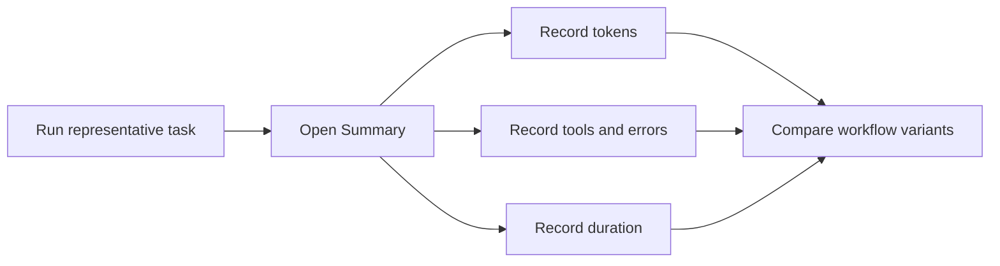
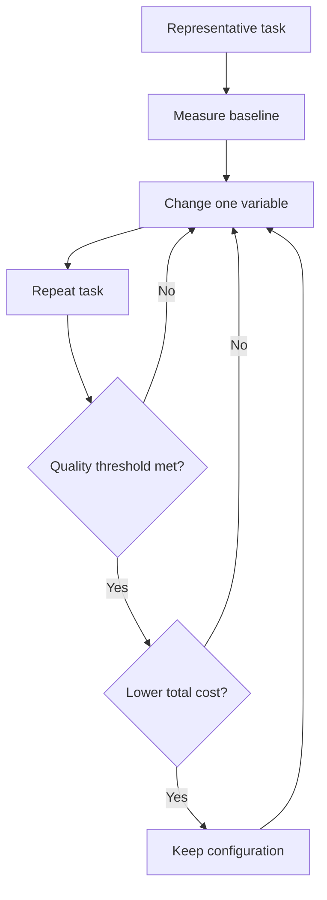

import { Steps, Tabs, TabItem } from "@astrojs/starlight/components";

# Measure Before You Cut

Optimization without measurement is guesswork. You may remove a tool that was saving time, shorten a prompt that prevented retries, or switch models without knowing whether the change helped.

This chapter gives you a small measurement toolkit inside VS Code. Use it to answer four questions:

- Which individual requests are expensive?
- How much has the whole session consumed?
- How close are you to your monthly allowance?
- Which workflow changes reduce cost without lowering quality?

---

## Per-request credit hover

The fastest way to inspect a request is to hover over the Copilot response in Chat. VS Code shows the **credit consumption** for that turn. This is the cost of one request, not the total cost of the conversation.

Use this view while comparing similar prompts. A short question can still be expensive if it carries a large context, many tool definitions, or a long agent loop. Conversely, a longer prompt may be cheap if the surrounding context is small and stable.

### A quick comparison

1. Ask Copilot to perform a representative task.
2. Hover over the response and record the credit consumption.
3. Repeat the same task after changing one variable.
4. Compare the result and the quality of the output.

:::note[What to record]
Record the task, model, prompt variant, credits, duration, and whether the result needed a retry. A cheaper first response is not a saving if it creates two expensive follow-up turns.
:::

**Action:** Pick one task you perform regularly and record the credit consumption of three comparable requests.

---

## Session cumulative cost

Per-request cost is useful, but it does not show the full bill for a long agent session. The **context window control** in the Chat input field provides the cumulative view. Hover over it or click it to inspect the total credits and token breakdown for the current session.


This view complements the per-turn hover:

| View | Answers | Best for |
|---|---|---|
| Response hover | How much did this turn cost? | Comparing prompts and individual steps |
| Context window control | How much has this session cost? | Finding expensive sessions and growing context |

A session can become expensive even when no single request looks alarming. Conversation history, tool calls, and repeated context accumulate. Check the session total before deciding that a workflow is efficient.

:::tip[Measure complete tasks]
A useful unit is the whole task: first prompt, tool calls, corrections, retries, and final answer. Record the total session cost alongside the quality of the result.
:::

**Takeaway:** Use the hover for local decisions and the context window control for the total cost of finishing a task.

---

## Monthly dashboard

The **Copilot status bar** in VS Code gives you a monthly perspective. Select it to open the status dashboard, where you can see how much of your monthly allowance you have used. The dashboard includes AI credits and, for Copilot Free, inline suggestions.


The monthly dashboard is not a replacement for per-request data. It is a budget signal. If usage rises quickly, use the detailed views to find the cause instead of simply trying to send fewer messages.

Look for patterns such as:

- A project whose agent sessions consistently consume more credits
- A model that produces many retries for a particular task
- A tool-heavy workflow that spends more on exploration than implementation
- A change in your weekly usage after adding instructions or MCP servers

:::caution[Allowance is not a quality metric]
Using fewer credits is not automatically better. A low-cost workflow that produces incorrect code, misses tests, or requires manual repair may cost more overall.
:::

**Action:** Check your status dashboard once a week and note the percentage used, your main task types, and any noticeable change from the previous week.

---

## `/chronicle:cost-tips`

You can ask VS Code for personalized recommendations based on your recent activity. Run `/chronicle:cost-tips` in any chat. It analyzes recent session history and returns practical suggestions for reducing usage.

This is useful when you know that spending has increased but cannot immediately see why. The recommendations can point you toward expensive patterns such as repeated retries, oversized context, or inefficient session boundaries.

:::note[Privacy and interpretation]
Treat recommendations as hypotheses to test. Check them against your own task quality and the credit data shown in VS Code before changing your workflow.
:::

Read more about querying session history with Chronicle in the [VS Code documentation](https://code.visualstudio.com/docs/agents/run/sessions/session-history#_query-session-history-with-chronicle).

**Action:** Run `/chronicle:cost-tips` after a week of normal work and choose one recommendation to test—not all of them at once.

---

## Agent Debug Logs — Summary view

For detailed evidence, enable file logging in VS Code settings:

```json
"github.copilot.chat.agentDebugLog.fileLogging.enabled": true
```

Then open **Chat view → ... → Show Agent Debug Logs → Summary**. The Summary view gives you a session-level record including:

- Input, output, and total token counts
- Tool calls
- Errors
- Duration
- Session and request details

This is the view to use when the credit hover tells you that something is expensive but not why. Long duration, repeated tool calls, or errors followed by retries often explain the difference.



:::tip[Create a small baseline]
For one representative task, write down quality, credits, input tokens, output tokens, duration, tool calls, and errors. You now have a baseline that can be compared after every controlled change.
:::

**Takeaway:** Use Summary when you need diagnostic detail, not just a cost number.

---

## Cache Explorer view

Agent Debug Logs also include **Cache Explorer**. It shows prompt cache hit rates and how many input tokens were reused. This matters because two sessions with similar token counts can have different costs when one reuses more cached input.

Use Cache Explorer to investigate questions such as:

- Did repeated turns reuse the stable prompt prefix?
- Did changing tools, instructions, or models reduce cache hits?
- Are input tokens being recomputed when they should be reusable?

The [Cache Explorer documentation](https://code.visualstudio.com/docs/agents/agent-troubleshooting/cache-explorer) explains the view and the available details.

:::caution[Do not optimize cache hits in isolation]
A higher cache hit rate is useful only when the cached context is still relevant. Keeping a stale, oversized session alive can improve reuse while making the overall task slower and less accurate.
:::

**Action:** Inspect Cache Explorer for one long session and note the hit rate, reused input tokens, and the point where the cache changed.

---

## The optimization loop

The goal is not to minimize credits at any cost. The goal is to meet a quality threshold with the lowest reliable cost.

Use this loop throughout the course:

<Steps>
1. **Run a representative task and measure the baseline.** Record quality, credits, tokens, duration, tool calls, and errors.
2. **Change one variable.** Choose the model, available tools, delegation strategy, or grounding source—but not several at once.
3. **Repeat the same task.** Keep the task, success criteria, and evaluation method as consistent as possible.
4. **Compare and keep the better configuration.** Keep the configuration that meets your quality threshold at the lowest cost.
</Steps>



For example, do not change the model, remove half your tools, and rewrite your instructions in one experiment. If the result improves, you will not know which change helped. If it gets worse, you will not know what to restore.

This loop is the recurring method for the rest of the course. Every technique can be validated with the same evidence: the result is good enough, and the work costs less or takes less time.

:::tip[Use a quality threshold]
Define “good enough” before comparing costs: tests pass, required files change, no critical errors appear, and the result needs no more than one small correction. Without a threshold, cost optimization can quietly become quality reduction.
:::

**Action:** Create a four-row experiment log for your next task: baseline, one change, repeat, decision.

---

## Key Takeaways

- Hover over a response to see the credit consumption for one request.
- Use the context window control to see cumulative credits and token breakdown for the session.
- Use the Copilot status dashboard to monitor your monthly allowance.
- Run `/chronicle:cost-tips` for personalized suggestions based on recent activity.
- Use Agent Debug Logs Summary to inspect tokens, tool calls, errors, and duration.
- Use Cache Explorer to understand cache hits and reused input tokens.
- Change one variable at a time and keep the lowest-cost configuration that meets your quality threshold.

*Estimated reading time: 7 minutes*
