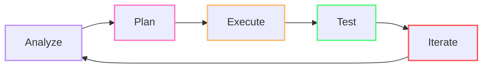
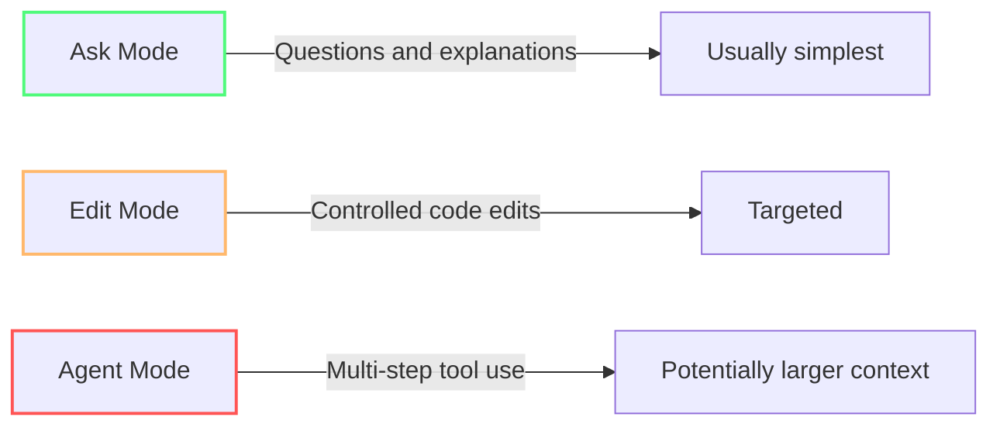
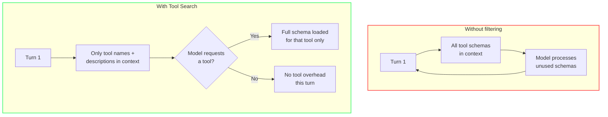
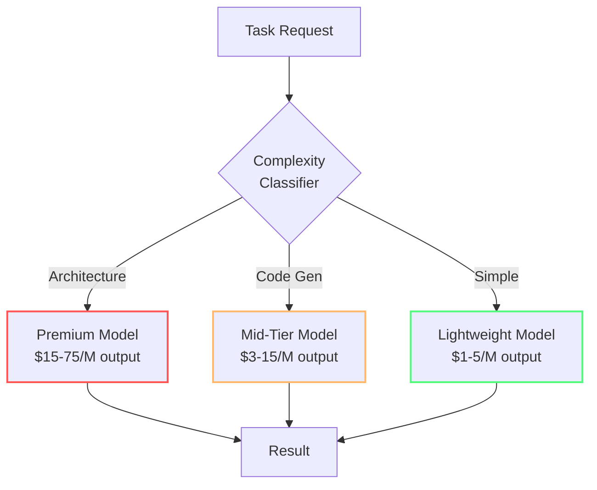
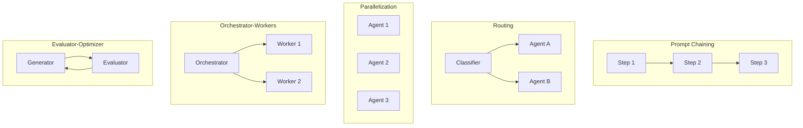

import { Steps, Tabs, TabItem } from "@astrojs/starlight/components";

# Kör agenter och MCP utan slöseri

Du har byggt en snål motor. Nu ska vi prata om gaspedalen. Agenter kan göra otroliga saker — men de kan också loopa, testa, iterera, och bränna krediter i en loop du inte ser. Det här är inte "använd inte agenter". Det är "använd agenter MED avsikt".

I [Modul 4 — Bygg ett snålt projekt](/vibe-on-budget/en/04-lean-project) gjorde du projektet snålt som standard. Här gör du själva körningen snål: rätt läge, rätt modell, rätt agentomfång och rätt MCP-yta för uppgiften.[^m7-1]

---

## 🟢 Agentloopen

Varje agentuppgift är i praktiken en återkopplingsloop med fem steg:

*(Se [Glossary](/vibe-on-budget/en/glossary) för definitioner av agentic loop, harness, tool registry och embedding vector.)*



| Steg | Vad som händer | Kostnadsdrivare |
|------|----------------|-----------------|
| **Analyze** | Agenten läser filer och samlar kontext | Input-tokens från tillförd kontext |
| **Plan** | Agenten väljer angreppssätt och verktyg | Output-tokens för resonemang |
| **Execute** | Agenten skriver kod och kör kommandon | Output-tokens (kodgenerering) + verktygsanrop |
| **Test** | Agenten kör tester och granskar resultat | Verktygsanrop (terminal) + input (testutdata) |
| **Iterate** | Agenten rättar fel och provar igen | Hela loopen startar om — sammansatt kostnad |

Varje ytterligare iteration lägger till fler meddelanden, verktygsresultat och mer kontext i konversationen. VS Code beskriver kontextfönstret som summan av användarmeddelandet, historiken, instruktionerna, refererade filer och verktygsutdata.[^m7-2]

:::tip[Var du bryter loopen]
Det mest tokeneffektiva stället att stoppa agenten är efter **Test**. Om testerna passerar, stoppa där — låt inte agenten iterera vidare för att "förbättra" fungerande kod. Använd stoppvillkor som: "After tests pass, stop and wait for review."
:::

---

## 🟢 De tre lägena och deras relativa kostnad[^m7-11]

Copilot Chat har tre lägen med tydligt olika kostnadsprofiler:



| Läge | Bäst för | Kostnadsprofil | Risk |
|------|----------|----------------|------|
| **[Ask Mode](https://code.visualstudio.com/docs/chat/chat-overview)** | Frågor, förklaringar, kodgranskning | Samtalsstöd utan verktygsloop | Lägre operativ räckvidd |
| **[Edit Mode](https://github.blog/ai-and-ml/github-copilot/copilot-ask-edit-and-agent-modes-what-they-do-and-when-to-use-them/)** | Riktade kodändringar | Fokuserade redigeringar | Mer kontrollerat |
| **[Agent Mode](https://code.visualstudio.com/docs/chat/chat-overview)** | Flerfilsändringar, komplexa uppgifter | Kan använda verktyg och iterera | **Högre kontext- och verktygspotential** |

:::caution[Agent mode has a higher baseline]
Agent mode loads system instructions, tool registry, and file context before the first response. The baseline is therefore higher than Ask Mode and Edit Mode. VS Code uses prompt caching to reuse prefixes between turns — the first request is the most expensive, the rest are cheaper.
:::

---

## 🟡 [Thinking Effort](https://code.visualstudio.com/docs/agent-customization/language-models#_configure-thinking-effort)

Thinking effort styr hur mycket resonemang modellen lägger på varje begäran. Högre nivå kan ge mer analys och högre latens, så nivån ska matcha uppgiften.[^m7-3]

VS Code sätter standarder baserat på utvärderingar och använder adaptivt resonemang. Modellen avgör alltså ofta själv hur mycket den behöver tänka beroende på uppgiftens komplexitet. För de flesta uppgifter räcker standardläget.

:::caution[Öka bara när det faktiskt lönar sig]
Höj thinking effort endast för verkligt komplexa problem, som arkitekturplanering eller flerstegs-felsökning. Att höja nivån för rutinjobb ökar latens och kreditförbrukning utan att nödvändigtvis förbättra resultatet.
:::

---

## 🟡 The hidden cost of MCP servers

MCP servers expose tools the agent can discover and invoke. Every tool has a schema — name, description, parameters — that gets sent in context. More servers = more schemas = higher baseline per request.[^m7-4]

VS Code's token efficiency blog post (June 2026) describes two built-in mechanisms already helping you:[^m7-5]

1. **Prompt prefix caching** — system instructions, tool registries, and repeated context are reused across turns. The first request in a session is the most expensive; the rest benefit from the cache.
2. **Tool filtering (Tool Search)** — instead of sending all tool schemas to the model every time, VS Code selects relevant tools based on your task via embedding-guided routing.



### 🟡 MCP server math

An MCP tool definition contains structured metadata like name, description, and input schema. The serialized size varies with content, so estimate from real definitions rather than multiplying by a magic constant.[^m7-6]

| Scenario | Action |
|----------|--------|
| Small tool set | Keep only the servers needed for the task |
| Larger tool set | Use tool configuration or profiles to narrow the active surface |
| Unknown tool set | Inspect actual schemas before estimating context cost |

In practice: **tools with good names and clear descriptions get found; vague tools get overlooked**. Name your MCP tools so they describe the problem they solve without bloating the context.

:::note[Tool selection is implementation-dependent]
Exactly how filtering and caching work can change as VS Code and Copilot evolve. Rely on current product documentation rather than assuming a specific algorithm forever.[^m7-2][^m7-5]
:::

---

## 🟡 Så avgränsar du agenter för tokeneffektivitet

### 1. Börja med Ask Mode eller Edit Mode

Börja alltid med det billigaste läget som faktiskt kan lösa uppgiften. Agent Mode är inte standardvalet — det är eskaleringsvägen.

```
❌ Agent mode for a regex question → $0.15
✅ Ask mode for the same question → $0.01
```

**Tumregel:** Om uppgiften rör en fil, använd Edit Mode. Om det är en fråga, använd Ask Mode. Eskalera bara till Agent Mode när uppgiften verkligen kräver flerfilsmedvetenhet eller verktygskörning.

---

## 🟢 Välj rätt modell för rätt jobb

Alla uppgifter behöver inte samma modell. Lättviktsmodeller räcker ofta för rutinjobb: enkla frågor, strängmanipulation, regex, docstrings och mindre formattering. Spara Sonnet eller andra premium-/GPT-4-klassmodeller till det som faktiskt motiverar dem: komplex arkitektur, djup felsökning och ändringar över flera filer.

En regexfråga i Ask Mode med en lättviktsmodell kostar en bråkdel av samma fråga i Agent Mode med en premiummodell. Öppna modellväljaren i VS Code och välj medvetet: Auto när du vill ha bekväm routing, manuell modell när du redan vet hur tung uppgiften är.[^m7-8]

### En enkel modellrouterstrategi

En bra routingstrategi matchar uppgiftens komplexitet mot modellens kapacitet och pris. Inga generella procentsiffror garanterar besparing här — rätt mix beror på din arbetslast.[^m7-8]

| Uppgiftstyp | Primär modell | Reservmodell | Rimlig kostnadstanke |
|-------------|---------------|--------------|----------------------|
| Arkitekturbeslut | Claude Opus | GPT-5.4 | Hög — men motiverad för sällsynta, svåra beslut |
| Kodgenerering | Claude Sonnet | DeepSeek R1 | Mellan — när kvalitet och fart båda spelar roll |
| Enkla tester | GPT-5.4-mini | Mistral-Small | Låg |
| Kodgranskning | Claude Sonnet | GPT-5.4-mini | Mellan |
| Regex, formatering | Claude Haiku | GPT-5.4-mini | Mycket låg |



**Så använder du modellväljaren i VS Code:**

1. **Låt den stå på Auto när det passar** — GitHub beskriver Auto som en routingmekanism som tar hänsyn till uppgiftens komplexitet och systemets hälsa.[^m7-8]
2. **Byt manuellt när du redan vet nivån på jobbet:**
   - Haiku eller annan lätt modell för regex, strängmanipulation, docstrings och boilerplate
   - Sonnet för allmän utveckling och ändringar över flera filer
   - Premium-/GPT-4-klassmodeller för arkitekturgranskning, säkerhetsjobb och komplex felsökning
3. **Byt inte modell mitt i en tung session för en enda billig fråga** — ombyggd cache kan äta upp hela besparingen
4. **Betala inte premiumpris för enkla uppgifter** när en billigare modell kan leverera samma kvalitet.[^m7-9]

:::tip[80/20 för modellval]
Det mesta vardagsarbetet kan routas billigare än du tror. Spara de dyra modellerna till de få turer där du faktiskt behöver mer resonemang, mer räckvidd eller större säkerhetsmarginal.
:::

### Så fungerar Auto model selection

Auto model selection klassificerar varje begäran innan den når modellen. Enkla frågor kan då routas till billigare modeller automatiskt, medan mer komplexa uppgifter får en starkare modell utan att du behöver växla manuellt för varje tur.

| Uppgiftstyp | Modellrutt |
|-----------|-------------|
| Enkel fråga eller kodförklaring | Snabb/billig modell |
| Enfilsändring eller liten refaktorering | Mellannivåmodell |
| Flerfilsändring, komplex planering eller verktygsorkestrering | Mest kapabel modell |

Eftersom Auto väger in både komplexitet och tillgänglighet kan den reservera högre kostnadsnivåer till de uppgifter som verkligen behöver dem. Den faktiska besparingen beror fortfarande på arbetslasten och vilka modeller som ingår i din plan.[^m7-8]

---

## 🟡 Scoped custom agents

I stället för en enda [`@workspace`](https://code.visualstudio.com/docs/chat/chat-participants)-agent som laddar kontext från hela projektet, skapa domänspecifika agenter:

| Custom Agent | Context Scope | Tools | Best For |
|--------------|--------------|-------|----------|
| **Frontend** | `src/components/`, `src/styles/` | File read/write, terminal | UI changes |
| **Database** | `prisma/`, `migrations/` | File read/write, DB MCP | Schema changes |
| **Testing** | `tests/`, `src/` | File read/write, terminal | Test writing |
| **Security** | Any | File read, security MCP | Audits |

Scoped agents minskar ofta irrelevanta instruktioner, filer och verktyg per begäran. Mät utfallet i ditt eget repo i stället för att anta en fast tokenbesparing.[^m7-7]

:::tip[Verifiera]
Skapa en scoped agent för ett domänområde. Kör en uppgift med @workspace, notera session-kostnaden i context window control. Kör samma uppgift med din scoped agent. Jämför.
:::

---

## 🟡 Sätt stoppvillkor

Berätta för agenten när den ska sluta. Tydliga gränser hjälper dig att hålla uppgiften inom tänkt kontext- och verktygsbudget.[^m7-2]

```
Add pagination to the users endpoint.
If you encounter errors, stop and report — do not attempt fixes.
Maximum 3 tool calls. After edits, stop for review.
```

---

## 🟡 Rensa bort oanvända MCP-servrar

Gå igenom dina VS Code-inställningar och inaktivera MCP-servrar du inte använder aktivt:

```json
// settings.json — only keep what you need for current task
{
  "github.copilot.chat.agent.mcpServers": {
    "filesystem": true,
    "terminal": true,
    "github": false,  // not needed for frontend work
    "database": false // not needed for this task
  }
}
```

Ännu bättre: skapa **VS Code-profiler** med olika MCP-uppsättningar:
- **Coding profile**: filsystem + terminal
- **DevOps profile**: GitHub CLI + deployverktyg
- **Database profile**: database MCP + schema tools

**Konfigurera verktyg för just den här förfrågan:** Använd knappen **Configure Tools** i chattens inmatningsfält för att välja enskilda verktyg eller MCP-servrar. Det kompletterar både custom agents och profiler genom att ge dig en snabb per-request-justering utan att du behöver ändra global konfiguration.

---

## Batcha repetitiva operationer

Upprepade submit-, poll- och retrieve-anrop lägger till mellanresultat i modellens kontextfönster. För deterministiska eller bulkiga arbetsflöden är det ofta bättre att köra loopen utanför agentkonversationen och bara återföra slutresultatet till modellen.[^m7-12]

:::tip[Flytta repetitivt arbete utanför konversationen]
I stället för att låta agenten köra och analysera många nästan identiska databasfrågor en i taget kan du skriva ett granskat skript som gör hela körningen och returnerar en kort sammanfattning. Benchmarka gärna båda arbetssätten först — den faktiska besparingen beror på verktygen, resultaten och uppgiften.
:::

---

## 🟡 Fem subagentmönster som sparar tokens

Anthropic beskriver fem komponerbara mönster för agentarbetsflöden: prompt chaining, routing, parallelization, orchestrator-workers och evaluator-optimizer. Tokenkonsekvensen beror på hur du implementerar dem och vilken arbetslast du kör.[^m7-10]



| Mönster | Hur det fungerar | Operativ trade-off | Bäst för |
|---------|------------------|--------------------|----------|
| **Prompt Chaining** | Utdata från steg 1 blir indata till steg 2 | Sekventiella beroenden | Flerstegsuppgifter (schema → query → test) |
| **Routing** | En klassificerare skickar arbetet till en specialiserad agent | Lägger till ett klassificeringssteg | Triagering: bugg vs feature vs fråga |
| **Parallelization** | Oberoende agenter kör samtidigt | Använder parallellt arbete | Flera oberoende analyser |
| **Orchestrator-Workers** | En orkestrerare planerar och delegerar | Lägger till koordination | Komplexa funktioner över flera filer |
| **Evaluator-Optimizer** | En generator producerar och en evaluator granskar | Lägger till granskning och ev. omtag | Kvalitetskritiskt, säkerhetskänsligt arbete |

:::tip[Mest medveten kvalitetsloop]
**Evaluator-Optimizer** lägger till en granskningsloop, så använd den när kvalitetsvinsten motiverar extra generering och utvärdering. **Orchestrator-Workers** är ofta rätt val när du vill dela upp ett större jobb i tydliga delar utan att en enda agent måste bära allt själv.[^m7-10]
:::

**Praktisk slutsats:** Du använder ofta redan dessa mönster implicit. Poängen är att välja dem medvetet. För en komplex flerfilsfeature passar Orchestrator-Workers. För säkerhets- eller kvalitetskritisk kod passar Evaluator-Optimizer.

---

## 🟡 Fällan med cache vid modellbyte

Att byta modell mitt i en session låter smart — använd en dyr modell för arkitektur och byt sedan till en billig för en enkel följdfråga. Men promptcacher är **modellspecifika**.

**Nuvarande GitHub-vägledning:** Auto model selection följer naturliga cachegränser, och GitHub noterar att modellbyte mitt i en session kan öka kostnaden utan att kvalitetsvinsten räcker till.[^m7-8]

**Lösningen — subagenter:** Behåll huvudsessionen på den primära modellen och starta en billigare subagent för den enstaka enkla uppgiften. Subagenten börjar med kall cache, men det är ofta billigare än att bygga om hela huvudsessionens kontext.

**När byte faktiskt kan vara värt det:**
- I början av en session, innan mycket historik samlats
- När kostnaden för fel modell multiplicerat med återstående turer överstiger kostnaden för att bygga om cachen

Se [Modul 1 — Vad händer när du trycker Enter?](/vibe-on-budget/en/01-what-happens) för fler mönster som bryter cachen.

---

## Practical MCP hygiene checklist

1. **Review regularly** — list all connected MCP servers and remove the ones you don't need.
2. **Profile your sessions** — keep workflow-specific MCP config in the right VS Code profile or workspace config.[^m7-7]
3. **Name tools well** — use descriptive names so the filtering finds them.
4. **Prefer deterministic tools** — for terminal jobs, it's often better to run the command in a controlled way and feed back the result than to let the agent loop freely.
5. **Measure your MCP tax** — inspect real tool definitions and keep only the tools needed for the workflow; there's no universal `tools × 200` rule.[^m7-6]

---

## Summering

- Börja med **Ask Mode** eller **Edit Mode** och eskalera först när uppgiften kräver Agent Mode.
- Välj **lätt modell för lätt jobb** och spara premiumkapacitet till arkitektur, felsökning och flerfilsändringar.
- Håll **agenter scoped** och **MCP-ytan liten** så att mindre brus skickas med varje tur.
- Sätt **stoppvillkor** så att agenten inte fortsätter bränna krediter efter att målet redan är uppnått.

---

## Nästa

Fortsätt till [Modul 6 — Vibe coding utan skuld](/vibe-on-budget/en/06-vibe-coding).

Du kan tekniken nu. Du skriver snålt, ditt projekt är snålt, dina agenter är scoped. Men den svåraste frågan återstår: hur gör du allt detta UTAN att tappa flow? Hur vibear du utan att samla på dig teknisk skuld som sen kostar tokens att städa upp?

---

## Practice

1. Kontrollera dina anslutna MCP-servrar i VS Code. Inaktivera dem du inte behöver för det aktuella arbetsflödet.
2. Nästa gång du behöver ett enkelt svar: använd Ask Mode med en lätt modell i stället för Agent Mode med en tyngre modell. Jämför kreditvisningen för en liknande fråga.
3. Skapa en scoped custom agent (med **Configure Tools** i chatten) för ett tydligt domänområde och jämför den mot `@workspace` på samma typ av uppgift.

## Key Takeaways

- Agent Mode kan använda verktyg och iterera — använd Ask Mode/Edit Mode för enklare arbete
- Välj **lätt modell för rutinuppgifter** och spara premiumkapacitet till arkitektur, felsökning och flerfilsändringar
- MCP-verktygsdefinitioner varierar i storlek; håll den aktiva verktygsytan relevant och mät verklig användning
- Skapa **scoped custom agents** i stället för en enda monolitisk `@workspace`-agent
- Sätt **stoppvillkor** för att förhindra skenande agentloopar
- VS Code-profiler kan separera arbetsflödesspecifik MCP-konfiguration

*Estimated reading time: 10 minutes*

[^m7-1]: [Use chat in VS Code](https://code.visualstudio.com/docs/chat/chat-overview) — Microsoft, n.d.; [Context](https://code.visualstudio.com/docs/agents/concepts/context) — Microsoft, n.d.
[^m7-2]: [Context](https://code.visualstudio.com/docs/agents/concepts/context) — Microsoft, n.d.
[^m7-3]: [Configure thinking effort](https://code.visualstudio.com/docs/agent-customization/language-models#_configure-thinking-effort) — Microsoft, n.d.
[^m7-4]: [Add and manage MCP servers in VS Code](https://code.visualstudio.com/docs/agent-customization/mcp-servers) — Microsoft, n.d.; [Tools](https://modelcontextprotocol.io/specification/draft/server/tools) — Model Context Protocol, n.d.
[^m7-5]: [Improving token efficiency for GitHub Copilot in VS Code](https://code.visualstudio.com/blogs/2026/06/17/improving-token-efficiency-in-github-copilot) — Microsoft, June 17, 2026.
[^m7-6]: [Tools](https://modelcontextprotocol.io/specification/draft/server/tools) — Model Context Protocol, n.d.; [MCP tool-schema overhead discussion](https://github.com/modelcontextprotocol/modelcontextprotocol/issues/2808) — Model Context Protocol, n.d.
[^m7-7]: [MCP configuration reference](https://code.visualstudio.com/docs/agents/reference/mcp-configuration) — Microsoft, n.d.; [Custom agents in VS Code](https://code.visualstudio.com/docs/agent-customization/custom-agents) — Microsoft, n.d.
[^m7-8]: [About Copilot auto model selection](https://docs.github.com/en/copilot/concepts/models/auto-model-selection) — GitHub, n.d.
[^m7-9]: [Copilot billing and pricing](https://docs.github.com/en/copilot/reference/copilot-billing/models-and-pricing) — GitHub, n.d.
[^m7-10]: [Building effective agents](https://www.anthropic.com/engineering/building-effective-agents) — Anthropic, December 19, 2024.
[^m7-11]: [Chat modes](https://code.visualstudio.com/docs/agents/chat/modes) — Microsoft, n.d.; [Use chat in VS Code](https://code.visualstudio.com/docs/chat/chat-overview) — Microsoft, n.d.
[^m7-12]: [Optimizing your AI usage to maximize efficiency and reduce cost](https://docs.github.com/en/copilot/tutorials/optimize-ai-usage) — GitHub, n.d.
