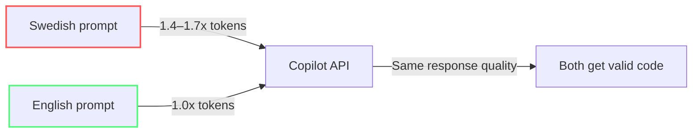

import { Steps, Tabs, TabItem } from "@astrojs/starlight/components";

# Writing Prompts That Cost Less

Module 4 gave you one-time configuration changes — instructions and settings you set once and forget. This module teaches the ongoing skill of writing every prompt efficiently. Same goal (fewer tokens), different timeframe (every time you type).

Prompt engineering is usually taught for *quality*. This module teaches it for *cost*: keep the intent and constraints that improve the result, while removing words that do not.

---

:::note[Case Study: Team Alpha]
Team Alpha's standups had been in Swedish. Switching prompt language to English and using bullet format saved ~1,700 tokens/day across the team. Combined with intent comments: 8,900 → 8,200 credits.
:::

## The Token Cost of Vagueness

Every ambiguous word in your prompt forces the model to generate more output tokens — reasoning chains, hedging language, clarifications, options. Output tokens cost 5x input, so vagueness is literally 5x more expensive than being specific.

**Before (vague, expensive):**
> "Can you look at this function and make it better? I think it might be a bit slow."

**After (specific, cheap):**
> "Refactor #file:calc.ts to use Map instead of nested for-loops. O(1) lookup. Code only."

The second version is 70% fewer input tokens (8 words vs 24) and produces ~90% fewer output tokens because the model doesn't generate explanations.

---

## Structure Your Prompt: Bullets > Prose

Prose prompts with full sentences and polite greetings waste tokens on grammar. Bullet points make the task, constraints, and output format scannable without removing useful intent.

**Prose (expensive):**
```
Hello! Could you please help me write a function that validates
an email address? I'd like it to check for the @ symbol and make
sure there's a domain name present. Thank you!
```

**Bullet points (cheap):**
```
- Write email validation function
- Check: @ symbol present, domain after @
- Return boolean
- Code only, no explanation
```

**The difference:** 38 tokens → 18 tokens. Over 100 prompts, that's 2,000 tokens saved on input alone, plus the output tokens from shorter responses.

The bigger win is avoiding a vague answer that needs a follow-up. Put the acceptance criteria beside the task:

**Before (polite but underspecified):**
```
Could you take a look at the checkout code and improve it? It would be great
if you could make it more reliable and perhaps add some tests. Please explain
what you changed.
```

**After (scoped and actionable):**
```
- Inspect #file:checkout.ts and #file:checkout.test.ts
- Fix duplicate order submission on network retry
- Add one regression test for retry after 503
- Preserve public API
- Return unified diff and 3-bullet summary
```

The second prompt spends tokens on information that changes the implementation, not on politeness or a broad request to "improve" something.

---

## Attach Intent to Code Instead of Explaining

Instead of describing what your code does in natural language (wasting tokens on both descriptions and the model re-reading your code), reference the file and add a comment that captures your intent.

**Before:**
> "I have a function that processes user data. It takes a list of users and filters out inactive ones, then sorts by registration date..."

**After:**
```
#file:processUsers.ts
// TODO: Add pagination, limit 100 per page, sort by registrationDate desc
```

The model reads the code directly and uses your comment as the intent signal. No redundant description, no hallucinations about what the code does.

:::tip[Intent comments]
Add `// AI:` comments in your code as hooks:
```typescript
// AI: This function is called 10k times/sec. Prioritize speed over readability.
```
The model will read the comment together with the code, saving you a full explanation in chat.
:::

---

## Caveman-Speak: Practical Token Compression

Caveman-speak strips articles, prepositions, politeness, and grammar — keeping only semantic keywords. It's a safe, modest technique for token reduction.

| Normal English | Caveman-Speak | Token Savings |
|---|---|---|
| "Can you please help me write a function that parses a CSV file?" | "Write CSV parser. Code only." | ~12% |
| "What's the best way to handle errors in this async function?" | "Best error handling pattern for #file:fetch.ts async." | ~10% |
| "Could you review my code and tell me if there are any security issues?" | "Security audit #file:auth.ts. OWASP Top 10. Critical only." | ~14% |

:::note[Independent benchmark]
Independent testing by JetBrains (July 2026) measured ~8.5% output token savings across 82 paired tasks. This is less than advertised claims but genuine and safe — round to ~10% as a practical rule-of-thumb.
:::

---

## Meta-Prompts for Output Control

Control output verbosity with explicit constraints:

| Use Case | Meta-Prompt |
|---|---|
| Bug explanation | "Answer max 3 bullet points, 10 words each. Skip grammar." |
| Code review | "Critical flaws only. No positive feedback, no suggestions." |
| State sync | "Summarize in dense 3-line state-sync for new thread." |
| Boilerplate | "Exclude imports, setup, config. Core algorithm only." |
| Lazy mode | "Ask 2 targeted questions before generating any code." |
| Test generation | "Generate Vitest test. Include happy path + 2 edge cases. AAA pattern." |

---

## Tools That Don't Deliver: The RTK Case Study

RTK (Rust Token Killer) is a CLI proxy that compresses shell output before the model reads it. The vendor advertises 60-90% token reduction.

- **Advertised:** 60–90% token reduction
- **JetBrains measured:** **+7.6% more expensive** in July 2026 across 80 paired tasks

Why did a compression tool cost more?

- Compressed output sometimes hid just enough detail to trigger extra exploration turns
- Cache pricing means many “saved” input tokens were already close to free
- When the agent needs a rerun, the extra round trip wipes out the initial win

**Lesson:** A tool's self-reported savings measure its counterfactual, not your bill. Always look for independent benchmarks.

:::tip[Cheap beats clever]
The cheapest LLM call is the one you don't make. Pre-compute deterministic data outside the agent loop.
:::

---

## English vs Swedish: A 1.4–1.7× Token Difference

Swedish tokenizes **~1.4–1.7× less efficiently** than English, depending on the tokenizer. Older tokenizers (GPT-4, Mistral) show a wider gap (~1.7×); newer tokenizers (GPT-5 o200k) narrow it to ~1.4–1.5×. This is because English has shorter average word length and more common subword patterns.

```
English: "Create login validation. Handle empty fields."
→ ~7 tokens

Swedish: "Skapa inloggningsvalidering. Hantera tomma fält."
→ ~12 tokens (~1.5x more)
```

The practical impact: **prompt in English even if you chat in Swedish**. The response will come back correctly, and you save ~30–40% token cost, depending on the tokenizer.



:::note[It adds up]
For a team sending 10,000 prompts/month, the English-vs-Swedish difference alone could save ~30,000 tokens. At $5/M output tokens, 30K tokens = $0.15. The real savings from language choice come from compounding across thousands of requests.
:::

---

:::tip[Continue Learning]
Pair prompt techniques with [Project Setup](/vibe-on-budget/en/06-project-setup) for full-stack token efficiency. For advanced patterns, see [Agents, Tools & MCP Hygiene](/vibe-on-budget/en/07-agents-mcp).
:::

---

## When Compression Backfires

Not all prompts should be compressed. Compression is useful only when it preserves the information the model needs to make the right decision. Here's when verbosity is worth the cost:

| Situation | Why Be Verbose | Recommendation |
|---|---|---|
| Complex architecture | Full context needed for correct design | Don't compress |
| Security audit | Missing nuance = missed vulnerability | Write complete prompts |
| First interaction with a new codebase | Model needs thorough orientation | Include all relevant files |
| Cross-file refactoring | Sparse instructions → wrong implementation | Be explicit about scope |

The rule: **compress output, not intent**. Keep names, constraints, edge cases, and success criteria. Remove greetings, repeated context, and explanations of code the model can inspect directly.

Compare the trade-off:

**Too compressed:**
```
- Fix auth
- Make secure
- Code only
```

**Compressed without losing intent:**
```
- Inspect #file:auth.ts and #file:auth.test.ts
- Fix session fixation after login
- Preserve refresh-token rotation
- Add regression test for reused session ID
- Return changed lines only
```

The first prompt is short but forces discovery, clarification, or a risky guess. The second removes filler while keeping the security boundary and verification target. A few extra input tokens are cheaper than a failed implementation and its follow-up turns.

---

## Practice

1. Take your last 3 Copilot prompts. Rewrite each in bullet format. Count the approximate token difference (1 token ≈ 4 chars in English).
2. Add an `// AI:` comment to a function you frequently ask Copilot about. Next time, reference the file with `#file:` instead of describing it.
3. If you usually prompt in Swedish, write your next 5 prompts in English. Check if the response quality is the same.

## Key Takeaways

- **Bullet points** use half the tokens of prose for the same intent
- **Reference files directly** (#file:) — don't describe what's already in code
- **Caveman-speak** is a small but real win — roughly ~10% output savings in independent tests
- **Meta-prompts** control output verbosity (where the real cost is)
- **Benchmark tools independently** — a proxy can reduce tokens and still raise your bill
- **Prompt in English** even if you think in Swedish — ~30–40% token savings, depending on the tokenizer
- **Don't over-compress** — saving 20 tokens that causes a wrong answer costs more

*Estimated reading time: 10 minutes*
