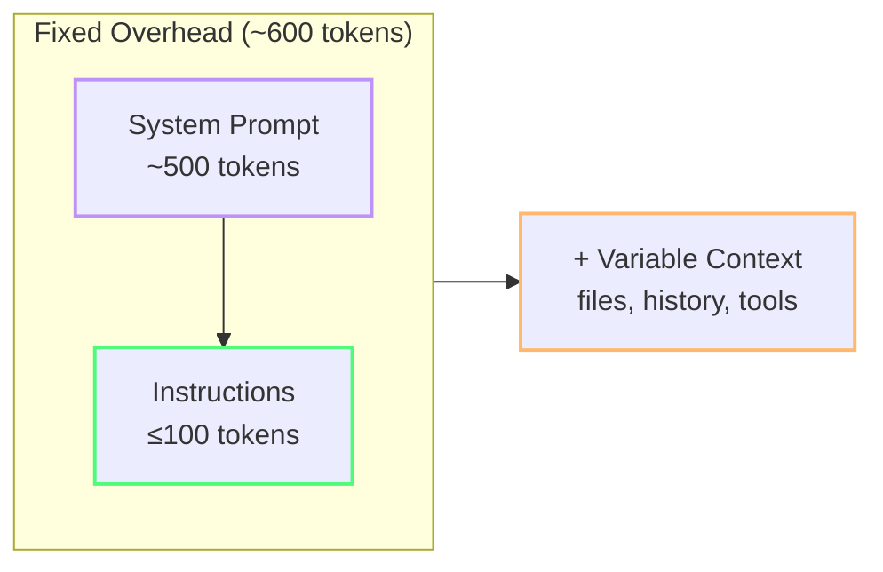

import { Steps, Tabs, TabItem } from "@astrojs/starlight/components";

# Project Setup for Token Efficiency

The files you create (or don't create) in your project affect what an agent can use as context on each request.[^m6-1] This module walks through files and configurations that can reduce unnecessary context project-wide.

---

:::
## The Always-On Tax 🟢

These files can be applied automatically or included as workspace context, depending on the tool and configuration:[^m6-1][^m6-2]

| File | Loaded When | Role |
|---|---|---|
| `.github/copilot-instructions.md` | Automatically, when supported | Repository-wide instructions |
| [`AGENTS.md`](https://docs.github.com/en/copilot/customizing-copilot/adding-custom-instructions) | Agent-specific tooling | Agent instructions |
| Open editor tabs | May be included as context | Workspace context |
| VS Code settings (Copilot section) | When the feature reads them | Behavior and limits |

*(See [Glossary](/vibe-on-budget/en/glossary) for always-on tax, lazy-loading, and AGENTS.md definitions.)*

The key insight: **every always-on instruction that's "nice to have" but not "critical right now" is wasted tokens**.

---

## 1. The Minimal `copilot-instructions.md`

Most teams overstuff this file with architecture docs, style guides, and team norms. All of it is sent as system context on every request — including the one about renaming a variable.

### Template: Minimal (Token-Optimized)

```markdown
# Output format
- Code blocks only. Strip prose, greetings, explanations.
- Replace unchanged code with: // ... existing code ...
- No markdown text outside the code block.

# Language
- English for all prompts and responses
```

**That's it.** Keep the file limited to instructions that should apply broadly. It covers output compression and language choice without duplicating project documentation.[^m6-1]

### Template: Medium (Balanced)

```markdown
# Output format
- Code blocks only. Strip prose, greetings, explanations.
- Replace unchanged code with: // ... existing code ...

# Language
- English for all prompts and responses

# Project context
- Framework: Astro 5 + Starlight
- Package manager: npm
- Tests: Vitest with @testing-library/dom
- No TypeScript — use JSDoc for types
```

Adds enough context for the model to generate relevant code without painting a full architecture picture.

### What NOT to put here

- ❌ API keys or secrets (these get sent to the model!)
- ❌ Multi-page architecture documentation
- ❌ Full component library documentation
- ❌ Team coding conventions ("we write clean code")
- ❌ Outdated decisions that are no longer true

:::caution[Instruction bloat is perpetual debt]
Every line you add to `copilot-instructions.md` is paid on **every single request** by **every team member**. A 1000-line instruction file costs 500+ tokens × thousands of requests per day.
:::

### The 200-Line Ceiling 🟡

Research suggests instruction files do not stay small for long. Chakrabarti et al. found **+226%** lifetime growth in a study of instruction lifetimes across public repositories.[^m6-3] Daniel Vaughan interprets the result as a maintenance problem and recommends a practical ceiling of roughly 200 lines before pruning.[^m6-4]

> The 200-line figure is practical guidance from Vaughan's analysis, not a finding from the original paper, which reports a median of 39 instructions and a 90th percentile of 131.[^m6-3][^m6-4]

- **Around 200 lines** is a maintainability threshold, not a model-context guarantee.[^m6-4]
- **Token math:** repeated context costs scale with the number of requests. Measure the actual input and output usage for your model and workflow instead of relying on a universal token estimate.[^m6-5]

<Steps>
1. Audit your instruction files with a token counter.
2. Move topic-specific guidance into skills or `.prompt.md` files.
3. Keep the always-on layer short enough that a human can still reread and prune it in one sitting.
</Steps>

### Prompt Comments: Fighting Instruction Bloat 🟡

Research also suggests instructions accumulate because **latent reasoning** — the reason a rule exists — decays over time. Once the "why" disappears, deleting old instructions feels risky, so they linger forever.

The fix is simple: annotate important rules with an HTML comment that records the failure, the hypothesis, and the outcome.

```markdown
# Output format
- Code blocks only. Strip prose, greetings, explanations.
<!-- FAILURE: 2026-06, verbose responses burned 3x budget on output tokens.
  HYPOTHESIS: forcing code-only output cuts 50-70% output.
  OUTCOME: 62% reduction in output tokens, no quality loss. Keep. -->
```

Do not assume that HTML comments are stripped before injection. Daniel Vaughan reports comment stripping for Codex CLI, while a Claude Code issue reports that `CLAUDE.md` comments are sent verbatim.[^m6-4][^m6-6] Chakrabarti's study reports that prompt comments reduced excess instruction growth by **99.3%** in its evaluated setting.[^m6-3]

---

## 2. Lazy-Loading with `.prompt.md` Files 🟡

Instead of bloating your automatically applied instructions, create specialized prompt files that you invoke only when needed.[^m6-7]

| File | Content | When to Use |
|---|---|---|
| `frontend-style.prompt.md` | CSS conventions, component patterns | Building UI |
| `db-schema.prompt.md` | Table definitions, relationships | Writing queries |
| `testing.prompt.md` | Test conventions, mock patterns | Writing tests |

**Usage in chat:**
```
Apply rules from #file:frontend-style.prompt.md to this component.
```

The model can read the referenced file and apply its rules for that request. Prompt files are not automatically applied like custom instructions; invoke them explicitly in chat.[^m6-7]

---

## 3. The [`AGENTS.md`](https://docs.github.com/en/copilot/customizing-copilot/adding-custom-instructions) Contract 🟢

`AGENTS.md` is an agent-instruction convention used by agentic coding tools. Its exact discovery and loading behavior depends on the tool; verify the relevant agent documentation before treating it as an always-on file.[^m6-2][^m6-4]

`AGENTS.md` = **behavioral contract** (mode, scope, output format) — always loaded  
`.prompt.md` files = **domain knowledge** (architecture, conventions, known issues) — loaded on demand via `#file:`

### Minimal Token-Efficient Template

```markdown
# .github/AGENTS.md (or .copilot/agents.md)

- Mode: Ask-first. Refuse multi-step recursive folder crawls.
- Lang: English
- Scope: Execute actions locally via CLI/terminal instead of agentic search loops.
- Output: Changed code blocks ONLY. Do not return untouched wrappers/imports/setups.
- Format: High-density bullets only. Prose explanations capped at 2 sentences.
```

:::note[Architecture and specs go in `.prompt.md` files]
Put architecture documentation, recurring feature specs, and historical "known issues" in `.prompt.md` files — not in `AGENTS.md`. Load them on demand with `#file:` references. This keeps `AGENTS.md` lean (~80 tokens) and avoids paying the always-on tax for content you rarely need.

See [Lazy-Loading with `.prompt.md` Files](#2-lazy-loading-with-promptmd-files) above.
:::

Keep the contract short and move architecture documentation elsewhere.[^m6-2][^m6-4]

---

## 4. Content Exclusion with [`.copilotignore`](https://code.visualstudio.com/docs/agents/optimize-usage-guide#_exclude-files-with-copilotignore) 🟢

Copilot reads your workspace files for context. Exclude files that are never useful:

```gitignore
# .copilotignore
dist/
build/
node_modules/
tests/mock-data/
*.svg
*.csv
*.json
package-lock.json
*.lock
```

:::note[What to exclude]
- **Build artifacts** — never useful, can be large
- **Mock/test data** — inflates context, adds noise
- **Large lock files** — package-lock.json alone can be 10K+ tokens
- **Generated code** — auto-generated files, GraphQL schemas, OpenAPI specs
- **Binary/asset files** — images, audio, fonts (can't be processed anyway)
:::

Your `.gitignore` can affect which files are available to workspace indexing and search tools, so treat it as one layer of exclusion.[^m6-8]

### VS Code Exclusion Settings

VS Code provides two settings for finer-grained exclusion:

| Setting | Effect |
|---|---|
| [`files.exclude`](https://code.visualstudio.com/docs/getstarted/settings#_settings-editor) | Excludes matching files from the Explorer and related workspace views |
| [`search.exclude`](https://code.visualstudio.com/docs/getstarted/settings#_settings-editor) | Excludes matching files from search results while keeping them visible in Explorer |

```json
{
  "files.exclude": {
    "**/node_modules": true,
    "**/dist": true
  },
  "search.exclude": {
    "**/*.log": true
  }
}
```

Use `files.exclude` for things you never want to see and `search.exclude` for files you may open manually but do not want in search results.[^m6-9] See [Improve agent search with exclusion settings](https://code.visualstudio.com/docs/agents/reference/workspace-context#_improve-agent-search-with-exclusion-settings).

| Mechanism | Affects workspace index | Affects agent search | Affects Explorer | Recommended for |
|---|---|---|---|---|
| `.gitignore` | ✅ | ✅ | ❌ | Build artifacts, dependencies |
| `.copilotignore` | ✅ | ✅ | ❌ | Mock data, large JSON/CSV |
| `files.exclude` | ✅ | ✅ | ✅ | node_modules, dist |
| `search.exclude` | ❌ | ✅ | ❌ | Log files |

---

## 5. VS Code Settings for Token Efficiency

```json
{
  // Limit open files sent as context
  "github.copilot.chat.experimental.context.autoOpenTabs.max": 5,

  // Enable token debug logging
  "github.copilot.chat.agentDebugLog.fileLogging.enabled": true,

  // Default model for new chats
  "github.copilot.chat.defaultModel": "claude-haiku-4.5",

  // Agent mode settings
  "github.copilot.chat.agent.experimental.maxRequests": 20,
  "github.copilot.chat.agent.experimental.maxToolCallsPerStep": 10
}
```

| Setting | Effect |
|---|---|
| `autoOpenTabs.max: 5` | Configure how many open tabs may be added as context |
| `defaultModel: haiku` | Select the default chat model when supported |
| `maxRequests: 20` | Configure the maximum number of agent requests when supported |
| `maxToolCallsPerStep: 10` | Configure the maximum tool calls per agent step when supported |

These settings are version- and client-dependent; check the current [VS Code AI settings reference](https://code.visualstudio.com/docs/agents/reference/ai-settings) before copying them.[^m6-9]

---

## 6. The 600-Token Budget Model

Use this as a heuristic, not a hard cap: **aim for ≤100 tokens in your custom instructions**, so the always-on baseline (system prompt + instructions) stays near 600 tokens before context from open files and conversation history. The goal is to keep the *fixed overhead* minimal, not to worship an arbitrary number.

- Custom instructions: ≤ 100 tokens
- System prompt: ~500 tokens (unavoidable)
- Additional context: open files, history, tool definitions — variable, minimize where possible

:::note[Heuristic, not handcuffs]
If a high-value rule pushes you a little above 100 tokens, keep the rule and cut something less important. What matters is staying lean by default, not hitting a magic number.
:::

Use a token counting script to audit your files. These are utility examples: the `$chars / 4` heuristic is not a tokenizer and should not be treated as billing data.[^m6-10]

```powershell
# count-tokens.ps1 — rough estimation
# 1 token ≈ 4 chars in English
$files = @(".github/copilot-instructions.md", "AGENTS.md")
foreach ($f in $files) {
  if (Test-Path $f) {
    $chars = (Get-Content $f -Raw).Length
    $tokens = [math]::Floor($chars / 4)
    Write-Output "$f : ~$tokens tokens"
  }
}
```

Or a cross-platform Node.js one-liner:

```bash
node -e "['.github/copilot-instructions.md','AGENTS.md'].forEach(f=>{try{const c=require('fs').readFileSync(f,'utf8').length;console.log(f+': ~'+Math.floor(c/4)+' tokens')}catch(e){}})"
```



:::tip[Audit with actual tools]
For a more precise count, use the [Copilot SDK usage APIs](https://docs.github.com/en/copilot/how-tos/copilot-sdk/features/usage-and-billing) to read per-call token counts and accumulated usage metrics.[^m6-5]
:::

---

## 7. LLM-Generated Context Files: A Warning

Research suggests LLM-generated instruction files often hurt agent correctness while inflating token cost. Write your instruction files manually — the AI doesn't know your project's pain points better than you do.

---

:::tip[Continue Learning]
A solid project setup makes [Agents, Tools & MCP Hygiene](/vibe-on-budget/en/07-agents-mcp) more effective. Revisit [Quick Wins](/vibe-on-budget/en/04-quick-wins) for the fastest savings.
:::

---

## Practice

1. Open your `.github/copilot-instructions.md`. Count the lines. If over 200, identify which sections can move to `.prompt.md` files. If you don't have one, create it using the minimal template.
2. Create a `docs/architecture.prompt.md` file with 5-10 lines about your project's key conventions. Test it: start a new chat and use `#file:docs/architecture.prompt.md`.
3. Run the token counting script (PowerShell or Node.js) from this module against your instruction files. What's your always-on baseline?

## Key Takeaways

- **Keep `copilot-instructions.md` under 100 tokens** — output control only
- **Keep always-on instruction files short enough to reread** — around 200 lines max before attention degrades
- **Use `.prompt.md` files** for specialized rules loaded on demand
- **`AGENTS.md`** should be a lean contract (~80 tokens), not an architecture doc
- **Preserve the "why" with HTML prompt comments** — institutional memory at zero token cost
- **`.copilotignore`** eliminates irrelevant context with a single file
- **VS Code settings** cap the largest variable cost (open tabs context)
- **600-token fixed overhead** (system + instructions) keeps the always-on baseline minimal; context adds on top
- **Write instruction files manually** — autogenerated context often adds cost without improving correctness

[^m6-1]: [Adding repository custom instructions for GitHub Copilot](https://docs.github.com/en/copilot/how-tos/copilot-on-github/customize-copilot/add-custom-instructions/add-repository-instructions) — GitHub Docs, accessed September 2026.
[^m6-2]: [Custom instructions](https://code.visualstudio.com/docs/agent-customization/custom-instructions) — Visual Studio Code Documentation, accessed September 2026.
[^m6-3]: [Why Does CLAUDE.md Keep Growing? Catastrophic Remembering in Agentic Coding](https://arxiv.org/abs/2608.11095) — arXiv, 11 August 2026.
[^m6-4]: [Catastrophic Remembering: Why Your AGENTS.md Keeps Growing and How Prompt Comments Fix It](https://codex.danielvaughan.com/2026/08/12/catastrophic-remembering-agents-md-instruction-bloat-prompt-comments-codex-cli/) — Daniel Vaughan, 12 August 2026.
[^m6-5]: [Usage and billing metrics](https://docs.github.com/en/copilot/how-tos/copilot-sdk/features/usage-and-billing) — GitHub Docs, accessed September 2026.
[^m6-6]: [Strip comments from CLAUDE.md/AGENTS.md before injection](https://github.com/anthropics/claude-code/issues/83899) — Claude Code issue tracker, accessed September 2026.
[^m6-7]: [Use prompt files in VS Code](https://code.visualstudio.com/docs/agent-customization/prompt-files) — Visual Studio Code Documentation, accessed September 2026.
[^m6-8]: [How Copilot understands your workspace](https://code.visualstudio.com/docs/agents/reference/workspace-context) — Visual Studio Code Documentation, accessed September 2026.
[^m6-9]: [AI settings reference](https://code.visualstudio.com/docs/agents/reference/ai-settings) — Visual Studio Code Documentation, accessed September 2026.
[^m6-10]: Token-counting scripts in this module are utility examples, not external measurements or billing estimates.
