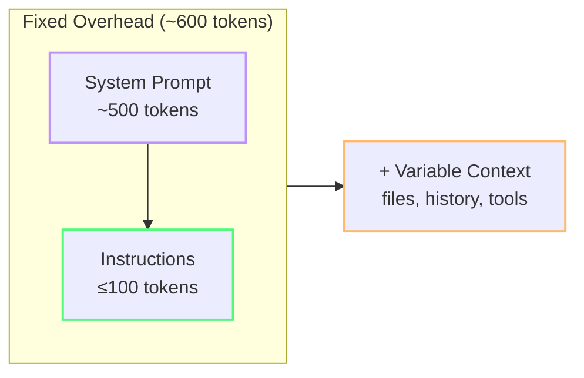

import { Steps, Tabs, TabItem } from "@astrojs/starlight/components";

# Project Setup for Token Efficiency

The files you create (or don't create) in your project determine how many tokens Copilot spends on **every** request. This module walks through the exact files and configurations that reduce token consumption project-wide.

---

:::note[Case Study: Team Alpha]
Team Alpha audited their copilot-instructions.md — 847 lines accumulated over 18 months. They trimmed it to 18 lines using the minimal template, moved architecture docs to .prompt.md files, and added .copilotignore. Always-on tax eliminated: 8,200 → 7,500 credits.
:::

## The Always-On Tax

These files are loaded on **every chat interaction**:

| File | Loaded When | Token Cost (typical) |
|---|---|---|
| `.github/copilot-instructions.md` | Always | 50–2000+ tokens |
| `AGENTS.md` | Agent mode | 200–5000+ tokens |
| Open editor tabs | Always | 500–10,000+ tokens |
| VS Code settings (Copilot section) | Always | ~50 tokens |

The key insight: **every always-on instruction that's "nice to have" but not "critical right now" is wasted tokens**.

---

## 1. The Minimal `copilot-instructions.md`

Most teams overstuff this file with architecture docs, style guides, and team norms. All of it is sent as system context on every request — including the one about renaming a variable.

### Template: Minimal (Token-Optimized)

```markdown
# Output format
- Code blocks only. Strip prose, greetings, explanations.
- Replace unchanged code with: // ... existing code ...
- No markdown text outside the code block.

# Language
- English for all prompts and responses (~1.7x token savings vs Swedish; varies by tokenizer)
```

**That's it.** 18 lines, ~50 tokens. Covers output compression (the single biggest saving) and language choice.

### Template: Medium (Balanced)

```markdown
# Output format
- Code blocks only. Strip prose, greetings, explanations.
- Replace unchanged code with: // ... existing code ...

# Language
- English for all prompts and responses

# Project context
- Framework: Astro 5 + Starlight
- Package manager: npm
- Tests: Vitest with @testing-library/dom
- No TypeScript — use JSDoc for types
```

~80 tokens. Adds enough context for the model to generate relevant code without painting a full architecture picture.

### What NOT to put here

- ❌ API keys or secrets (these get sent to the model!)
- ❌ Multi-page architecture documentation
- ❌ Full component library documentation
- ❌ Team coding conventions ("we write clean code")
- ❌ Outdated decisions that are no longer true

:::caution[Instruction bloat is perpetual debt]
Every line you add to `copilot-instructions.md` is paid on **every single request** by **every team member**. A 1000-line instruction file costs 500+ tokens × thousands of requests per day.
:::

### The 200-Line Ceiling

Research suggests instruction files do not stay small for long. Chakrabarti et al. (arXiv:2608.11095, August 2026) found that instructions grew by **+226%** over their lifetime as teams kept adding one more exception, caveat, or "temporary" rule. Daniel Vaughan, interpreting the paper, recommends a practical ceiling: if output exceeds a few hundred lines, it is time to prune.

> The 200-line figure is practical guidance from Vaughan's analysis, not a finding from the original paper, which reports a median of 39 instructions and a 90th percentile of 131.

- **200 lines ≈ 1,500–2,000 tokens** — small enough to stay in foreground attention, large enough for identity, 2–3 hard rules, and pointers to deeper docs.
- **Above 200 lines**, the model starts under-attending to early content. The file becomes invisible accretion: expensive, familiar-looking, and rarely reread end to end.
- **Token math:** a 1,247-line file (~9,400 tokens) across 1,000 turns burns **9.4M always-on tokens**. Migrate the same guidance into path-scoped files + skills, get the always-on layer down to 250 tokens, and the cost drops to **250K tokens** — a **37× reduction** for identical capabilities.

<Steps>
1. Audit your instruction files with a token counter.
2. Move topic-specific guidance into skills or `.prompt.md` files.
3. Keep the always-on layer short enough that a human can still reread and prune it in one sitting.
</Steps>

### Prompt Comments: Fighting Instruction Bloat

Research also suggests instructions accumulate because **latent reasoning** — the reason a rule exists — decays over time. Once the "why" disappears, deleting old instructions feels risky, so they linger forever.

The fix is simple: annotate important rules with an HTML comment that records the failure, the hypothesis, and the outcome.

```markdown
# Output format
- Code blocks only. Strip prose, greetings, explanations.
<!-- FAILURE: 2026-06, verbose responses burned 3x budget on output tokens.
  HYPOTHESIS: forcing code-only output cuts 50-70% output.
  OUTCOME: 62% reduction in output tokens, no quality loss. Keep. -->
```

In tools like Claude Code and Codex CLI, HTML comments are stripped before injection, so you preserve the reasoning at **zero token cost**. In Chakrabarti's 2026 field data, prompt comments reduced excess instruction growth by **99.3%**.

---

## 2. Lazy-Loading with `.prompt.md` Files

Instead of bloating your always-on file, create specialized prompt files that are loaded only when needed:

| File | Content | When to Use |
|---|---|---|
| `frontend-style.prompt.md` | CSS conventions, component patterns | Building UI |
| `db-schema.prompt.md` | Table definitions, relationships | Writing queries |
| `testing.prompt.md` | Test conventions, mock patterns | Writing tests |

**Usage in chat:**
```
Apply rules from #file:frontend-style.prompt.md to this component.
```

The model reads the file and applies the rules for this request only. No always-on tax.

---

## 3. The `AGENTS.md` Contract

`AGENTS.md` defines how Copilot should behave in **agent mode**. When present, it's loaded as system context for every agent step.

`AGENTS.md` = **behavioral contract** (mode, scope, output format) — always loaded  
`.prompt.md` files = **domain knowledge** (architecture, conventions, known issues) — loaded on demand via `#file:`

### Minimal Token-Efficient Template

```markdown
# .github/AGENTS.md (or .copilot/agents.md)

- Mode: Ask-first. Refuse multi-step recursive folder crawls.
- Lang: English (saves ~1.7x tokenizer overhead vs Swedish; varies by tokenizer)
- Scope: Execute actions locally via CLI/terminal instead of agentic search loops.
- Output: Changed code blocks ONLY. Do not return untouched wrappers/imports/setups.
- Format: High-density bullets only. Prose explanations capped at 2 sentences.
```

:::note[Architecture and specs go in `.prompt.md` files]
Put architecture documentation, recurring feature specs, and historical "known issues" in `.prompt.md` files — not in `AGENTS.md`. Load them on demand with `#file:` references. This keeps `AGENTS.md` lean (~80 tokens) and avoids paying the always-on tax for content you rarely need.

See [Lazy-Loading with `.prompt.md` Files](#2-lazy-loading-with-promptmd-files) above.
:::

~80 tokens. Covers the critical guardrails without architecture noise.

---

## 4. Content Exclusion with `.copilotignore`

Copilot reads your workspace files for context. Exclude files that are never useful:

```gitignore
# .copilotignore
dist/
build/
node_modules/
tests/mock-data/
*.svg
*.csv
*.json
package-lock.json
*.lock
```

:::note[What to exclude]
- **Build artifacts** — never useful, can be large
- **Mock/test data** — inflates context, adds noise
- **Large lock files** — package-lock.json alone can be 10K+ tokens
- **Generated code** — auto-generated files, GraphQL schemas, OpenAPI specs
- **Binary/asset files** — images, audio, fonts (can't be processed anyway)
:::

Your `.gitignore` also affects the agent: it excludes matching files from the workspace index and from agent text search/grep. Treat it as a first layer of exclusion.

**Savings:** 20–40% reduction in input token consumption. Bonus: faster responses and fewer hallucinations from irrelevant context.

### VS Code Exclusion Settings

VS Code provides two settings for finer-grained exclusion:

| Setting | Effect |
|---|---|
| `files.exclude` | Hides files completely from Explorer, the workspace index, and agent search |
| `search.exclude` | Hides files from agent text search/grep but keeps them visible in Explorer |

```json
{
  "files.exclude": {
    "**/node_modules": true,
    "**/dist": true
  },
  "search.exclude": {
    "**/*.log": true
  }
}
```

Use `files.exclude` for things you never want to see. Use `search.exclude` for log files you may open manually but do not want in search results. See [Improve agent search with exclusion settings](https://code.visualstudio.com/docs/agents/reference/workspace-context#_improve-agent-search-with-exclusion-settings).

| Mechanism | Affects workspace index | Affects agent search | Affects Explorer | Recommended for |
|---|---|---|---|---|
| `.gitignore` | ✅ | ✅ | ❌ | Build artifacts, dependencies |
| `.copilotignore` | ✅ | ✅ | ❌ | Mock data, large JSON/CSV |
| `files.exclude` | ✅ | ✅ | ✅ | node_modules, dist |
| `search.exclude` | ❌ | ✅ | ❌ | Log files |

---

## 5. VS Code Settings for Token Efficiency

```json
{
  // Limit open files sent as context
  "github.copilot.chat.experimental.context.autoOpenTabs.max": 5,

  // Enable token debug logging
  "github.copilot.chat.agentDebugLog.fileLogging.enabled": true,

  // Default model for new chats
  "github.copilot.chat.defaultModel": "claude-haiku-4.5",

  // Agent mode settings
  "github.copilot.chat.agent.experimental.maxRequests": 20,
  "github.copilot.chat.agent.experimental.maxToolCallsPerStep": 10
}
```

| Setting | Effect |
|---|---|
| `autoOpenTabs.max: 5` | Only send 5 open files as context |
| `defaultModel: haiku` | Start with cheapest model by default |
| `maxRequests: 20` | Limit agent loop depth |
| `maxToolCallsPerStep: 10` | Prevent runaway tool chains |

---

## 6. The 600-Token Budget Model

Use this as a heuristic, not a hard cap: **aim for ≤100 tokens in your custom instructions**, so the always-on baseline (system prompt + instructions) stays near 600 tokens before context from open files and conversation history. The goal is to keep the *fixed overhead* minimal, not to worship an arbitrary number.

- Custom instructions: ≤ 100 tokens
- System prompt: ~500 tokens (unavoidable)
- Additional context: open files, history, tool definitions — variable, minimize where possible

:::note[Heuristic, not handcuffs]
If a high-value rule pushes you a little above 100 tokens, keep the rule and cut something less important. What matters is staying lean by default, not hitting a magic number.
:::

Use a token counting script to audit your files:

```powershell
# count-tokens.ps1 — rough estimation
# 1 token ≈ 4 chars in English
$files = @(".github/copilot-instructions.md", "AGENTS.md")
foreach ($f in $files) {
  if (Test-Path $f) {
    $chars = (Get-Content $f -Raw).Length
    $tokens = [math]::Floor($chars / 4)
    Write-Output "$f : ~$tokens tokens"
  }
}
```

Or a cross-platform Node.js one-liner:

```bash
node -e "['.github/copilot-instructions.md','AGENTS.md'].forEach(f=>{try{const c=require('fs').readFileSync(f,'utf8').length;console.log(f+': ~'+Math.floor(c/4)+' tokens')}catch(e){}})"
```



:::tip[Audit with actual tools]
For a more precise count, use the Copilot SDK or `gh copilot` to measure actual token usage per request. Set a monthly budget target and review it with your team.
:::

---

## 7. LLM-Generated Context Files: A Warning

Research suggests LLM-generated instruction files often hurt agent correctness while inflating token cost. Write your instruction files manually — the AI doesn't know your project's pain points better than you do.

---

:::tip[Continue Learning]
A solid project setup makes [Agents, Tools & MCP Hygiene](/vibe-on-budget/en/07-agents-mcp) more effective. Revisit [Quick Wins](/vibe-on-budget/en/04-quick-wins) for the fastest savings.
:::

---

## Practice

1. Open your `.github/copilot-instructions.md`. Count the lines. If over 200, identify which sections can move to `.prompt.md` files. If you don't have one, create it using the minimal template.
2. Create a `docs/architecture.prompt.md` file with 5-10 lines about your project's key conventions. Test it: start a new chat and use `#file:docs/architecture.prompt.md`.
3. Run the token counting script (PowerShell or Node.js) from this module against your instruction files. What's your always-on baseline?

## Key Takeaways

- **Keep `copilot-instructions.md` under 100 tokens** — output control only
- **Keep always-on instruction files short enough to reread** — around 200 lines max before attention degrades
- **Use `.prompt.md` files** for specialized rules loaded on demand
- **`AGENTS.md`** should be a lean contract (~80 tokens), not an architecture doc
- **Preserve the "why" with HTML prompt comments** — institutional memory at zero token cost
- **`.copilotignore`** eliminates irrelevant context with a single file
- **VS Code settings** cap the largest variable cost (open tabs context)
- **600-token fixed overhead** (system + instructions) keeps the always-on baseline minimal; context adds on top
- **Write instruction files manually** — autogenerated context often adds cost without improving correctness

*Estimated reading time: 10 minutes*
