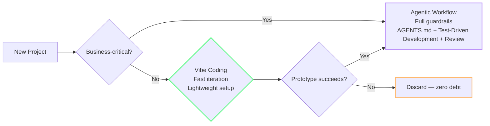
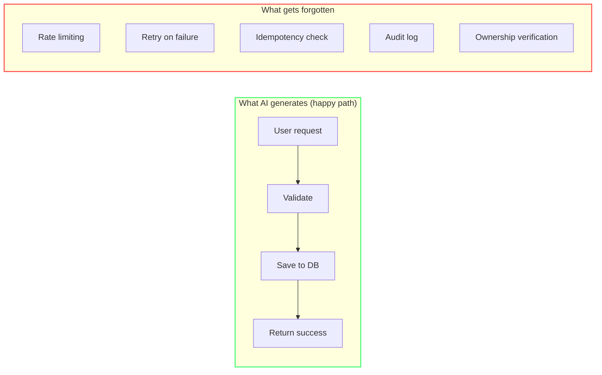
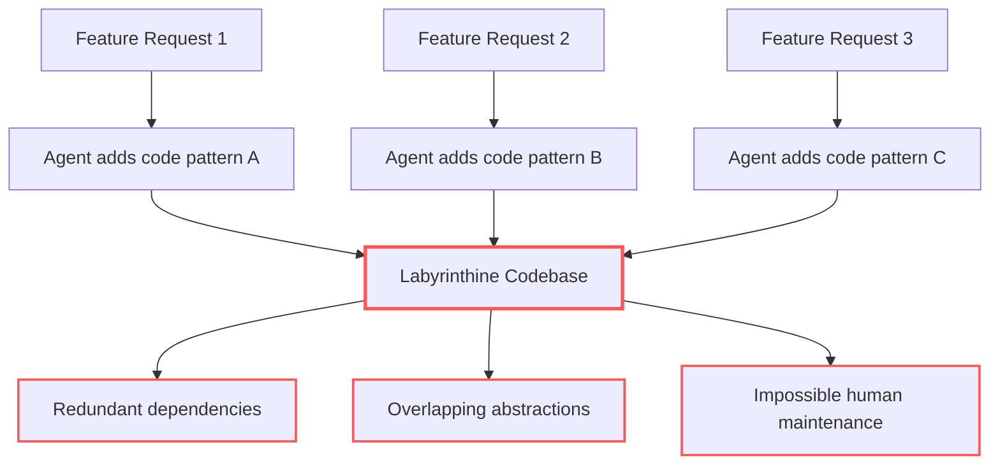
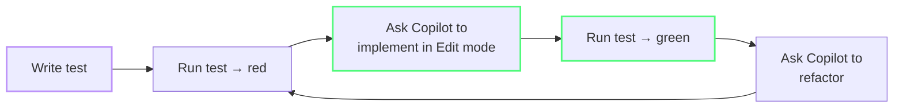
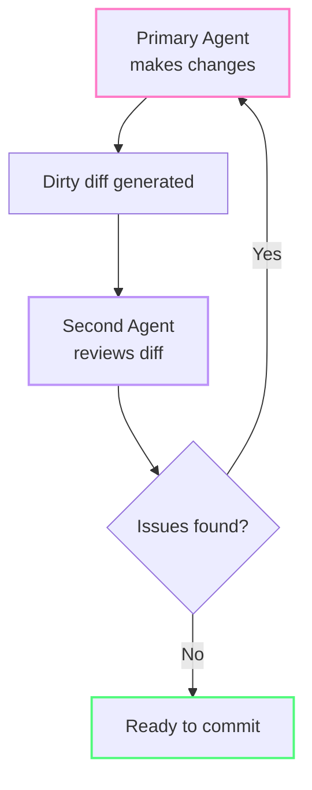

import { Steps, Tabs, TabItem } from "@astrojs/starlight/components";

# Vibea utan skuld

I förra modulen lärde du dig scopa agenter. Men även en perfekt scopad agent kan skapa kod som kostar dig tokens i månader framöver — inte i prompt-kostnad, utan i debugging, refactoring, och omskrivning. Den här modulen handlar om den dolda token-kostnaden av dålig kod.

Vibe coding — att låta AI skriva koden medan du fokuserar på intentionen — utsågs till Collins Dictionary's Word of the Year 2025 [^m8-7], efter att Andrej Karpathy använt uttrycket i ett inlägg i februari 2025 [^m8-5]. Men det finns en hake: **en Carnegie Mellon-studie kopplade Cursor-användning till varaktiga ökningar av statiska analysvarningar och kodkomplexitet** [^m8-1]. GitClear rapporterade att duplicerade kodblock ökade med 81 % mellan 2023 och 2026 [^m8-2], medan deras rapport från 2025 visade att rader kopplade till refactoring sjönk från 25 % 2021 till under 10 % 2024 [^m8-3]. Dålig kod leder till merarbete, som i sin tur leder till fler prompts, agentloopar och tokens.

Det snabbaste sättet att bränna credits är inte en dålig prompt — det är att felsöka buggar som aldrig borde ha funnits. Lösningen är alltså inte att sluta vibea, utan att bygga in skyddsräcken som hindrar små genvägar från att bli återkommande tokenkostnader.

*(Se [Glossary](/vibe-on-budget/en/glossary) för definitioner av vibe coding, agentiskt arbetsflöde, teknisk skuld och skyddsräcken.)*

---

## 🟢 Vibe Coding eller agentiskt arbetsflöde? Ett beslutsramverk

Alla projekt behöver inte samma nivå av rigor. Den viktiga frågan är var ditt projekt hamnar på axeln **verifiering kontra upptäckt**:

| If your answer is YES... | Then use... |
|---|---|
| Will the business rely on this software's output for decisions? | **Agentic Workflow** |
| Does it handle financial transactions, customer data, or authentication? | **Agentic Workflow** |
| Is the application explicitly disposable or single-use? | **Vibe Coding** |
| Is the primary goal to test an idea or hypothesis? | **Vibe Coding** |



**Vibe coding är upptäckt.** Det passar bäst när kostnaden för att misslyckas är låg och programvaran ändå ska leva kort. **Agentiska arbetsflöden är verifiering.** De använder samma AI-verktyg inom strikta ingenjörsdiscipliner: formella specifikationer, acceptanskriterier, säkerhetsgranskningar och kontinuerliga testcykler (test-first-loopar).

Faran är inte vibe coding i sig — det är att vibea fram något som senare hamnar i produktion. Ramverket ovan hjälper dig att bestämma dig *innan* du skriver kod, inte efteråt.

:::tip[Om du svarade JA på någon av de verksamhetskritiska frågorna]
Gå till [Module 5 — Agents, Tools & MCP Hygiene](/vibe-on-budget/en/05-agents-mcp) och konfigurera AGENTS.md (beteendekontrakt) + `.prompt.md`-filer (arkitekturspecifikationer) innan du skriver kod. Den initiala kostnaden för skyddsräcken är bara en bråkdel av kostnaden för att rätta produktionsincidenter.
:::

---

## 🟡 Fyra vanliga sätt AI-genererad kod går snett

Om du vet var skulden brukar samlas blir det mycket lättare att fånga den i tid:

### 1. Duplicerad logik

När AI löser en prompt skriver den kod för just den prompten. Den söker inte automatiskt igenom kodbasen efter befintliga verktyg. Resultatet kan bli fem filer med varsin `formatDate()` — alla lite olika.

**Token Cost:** Varje duplicerad funktion innebär att agenten läser, genererar och testar överflödig kod i flera filer.

**Berätta för agenten om befintliga verktyg:**

```
Use the existing utils/formatDate() function instead of writing a new one.
Check src/utils/ for existing helpers before creating new ones.
```

### 2. Oavsiktlig arkitektur

AI är bra på att fortsätta befintliga mönster, men får det svårare när inget mönster finns ännu. En vibe-kodad app får därför lätt fem halvfärdiga mönster i stället för ett konsekvent — olika felhantering i varje route, ad hoc-loggning och auth-kontroller lite överallt.

**Token Cost:** Inkonsekventa mönster tvingar agenten att upptäcka kodbasens struktur på nytt i varje session.

### 3. Uppsvällda funktioner

Ett enda AI-svar på "lägg till användarflöde" kan skapa en funktion på 300 rader som sköter formulärvalidering, databasskrivningar, e-postnotiser och affärslogik — allt på samma ställe. AI:n har inget inbyggt begrepp om [SRP (Single Responsibility Principle)](https://en.wikipedia.org/wiki/Single-responsibility_principle).

**Token Cost:** Funktioner på 300 rader innebär att agenten måste läsa hela filen som kontext för varje relaterad fråga.

### 4. Missade edge cases

AI genererar happy path bra. Däremot glöms rate limits, retries, [idempotency](https://en.wikipedia.org/wiki/Idempotence), bakgrundsjobb och scenariot där databasen inte går att nå lätt bort.

**Token Cost:** Happy-path-kod som går sönder i produktion leder till dyra felsökningssessioner.



---

### Varför agenter utan uppsikt bränner credits

## 🟡 Winchester Mystery House-problemet

När agenter itererar utan uppsikt uppstår ett särskilt arkitektoniskt antimönster. Det har fått sitt namn från det berömda huset som byggdes utan en sammanhängande ritning — och det är en av de dyraste formerna av AI-genererad teknisk skuld.



När agenter får iterera blint och lappa kodbasen funktion för funktion utan arkitektonisk överblick blir resultatet lätt labyrintkod: överflödiga beroenden, överlappande abstraktioner och fem konkurrerande mönster där ett hade räckt.

Varje överflödig abstraktion agenten hittar på är kod som måste läsas, felsökas och till slut refactoreras — och varje steg kostar tokens.

### 🟡 Metod i fyra steg för att förebygga problemet

**1. Ett resultat i en mening**
Skriv en enda mening före all kod som beskriver önskad input och output. Lås den meningen. Då hindrar du kraven från att svälla mitt i arbetet — en vanlig orsak till Winchester-arkitektur.

```
GOOD: "POST /api/upload returns { url: string, size: number } for valid images under 5MB."
BAD:  "Add file upload." (agent invents authentication, thumbnails, CDN integration...)
```

**2. Minimal sandbox**
Ju mindre projektkatalog agenten arbetar i, desto mindre utrymme får den att "uppfinna arkitektur" för triviala problem. Håll agenten begränsad till den relevanta katalogen.

**3. Verklighetskoll var tredje iteration**
Efter vart tredje agentvarv mäter du objektivt med riktiga data:

| Check | Tool |
|-------|------|
| Response time | Browser dev tools or `time` command |
| Memory usage | OS task manager or `ps` |
| Bundle size | Build tool output |
| Test coverage | Coverage reporter |

Om mätvärdena utvecklas åt fel håll efter tre iterationer, stoppa agenten och omvärdera angreppssättet.

**4. Hård gräns vid systemkritiska områden**
De här områdena vibear du **aldrig**. När uppgiften går in i något av dem ska du eskalera till hanterad infrastruktur eller handskriven, granskad kod:

- Authentication and session management
- File uploads (especially user-controlled)
- Push notifications
- Asynchronous background jobs
- Real-time state synchronization
- Payment processing

Se dem som säkerhetskänsliga gränser som kräver mänsklig granskning och etablerade kontroller, i linje med OWASP:s vägledning för AI-assisterad kodning [^m8-6].

:::caution[These aren't suggestions]
A 2026 [WIRED](https://www.wired.com/story/thousands-of-vibe-coded-apps-expose-corporate-and-personal-data-on-the-open-web/) investigation reported that RedAccess researchers found more than 5,000 vibe-coded applications with virtually no security or authentication; around 40% exposed sensitive data [^m8-4]. Security-compromised code in critical territory becomes a security incident, not a technical debt item.
:::

Agentisk kodning fungerar bäst för **integrationskod, analysverktyg och avgränsade skript** — inte för att uppfinna databaslager eller auth-system från grunden. När du tvekar: använd det som redan är beprövat.

---

## 🟢 Skyddsräcke 1: Skriv en spec först

Innan du ber en agent att "bygga funktionen" skriver du en lättviktig spec:

```
Feature: User profile page

Data model:
- User has name, email, avatar URL, role
- role is server-owned — never accept from client

API behavior:
- GET /api/users/:id — returns user profile
- 404 if user doesn't exist
- 403 if requesting user is not the profile owner or admin

Edge cases:
- Email change requires verification
- Avatar URL must be sanitized
- Rate limit: 10 requests/min per user

Exclusions:
- Do not modify the auth middleware
- Do not add new dependencies
```

En spec behöver inte vara lång — 10–15 rader räcker för att förebygga de dyraste misstagen. De viktiga delarna är datamodell, API-beteende, edge cases och vad du *inte* ska ändra.

:::tip[Spara specs som `.prompt.md`-filer]
Spara specs för återkommande funktioner i `.prompt.md`-filer (till exempel `docs/user-profile-spec.prompt.md`). Referera till dem med `#file:` när du börjar arbeta med funktionen — agenten läser filen och följer mönstren du har definierat.
:::

---

## 🟢 Skyddsräcke 2: [TDD (Test-Driven Development)](https://en.wikipedia.org/wiki/Test-driven_development) med Copilot

Test-Driven Development passar naturligt ihop med AI-kodning. Testet definierar det förväntade beteendet — AI:n implementerar det. Det fångar det vanligaste felet: **kod som ser rimlig ut men inte hanterar edge cases**.

Använd din leverantörs tokenmätning för att jämföra kostnaden för att skriva tester först med kostnaden för senare felsökning och fixar. Den användbara jämförelsen är projektspecifik; skyddsräcket är att göra det förväntade beteendet körbart före implementationen.

**Praktiskt arbetsflöde:**



---

## 🟢 Skyddsräcke 3: Automatisera granskningen

Manuell kodgranskning är ofta flaskhalsen. Automatisera den med en andra AI-passering.

### Granskning med samma modell

Det enklaste sättet är att be agenten granska sitt eget arbete efter ändringarna.

```
Review the dirty changes. Check for:
- Missing error handling
- Hardcoded values that should be config
- Functions longer than 50 lines
- Duplicate logic that exists elsewhere
- Security: any user-controlled input used without validation
```

### Granskning mellan modeller (avancerat)

Olika modeller har olika blinda fläckar. Det mest effektiva mönstret är därför att låta en andra modell granska den första modellens arbete:



Kör så många gransknings- och fixcykler som bevisen kräver. Olika modeller kan upptäcka olika blinda fläckar, så håll loopen öppen tills fynden är lösta och testerna passerar.

---

## 🟢 Skyddsräcke 4: Projektminne med `.prompt.md`-filer

`AGENTS.md` definierar *hur* agenten ska bete sig — läge, scope och outputformat. Håll den slimmad (se [Module 5](/vibe-on-budget/en/05-agents-mcp)). Men *vad* agenten ska veta om ditt projekt — arkitektur, konventioner och historiska misstag — hör hemma i separata `.prompt.md`-filer som laddas vid behov.

### Promptfil för arkitektur

Skapa `docs/architecture.prompt.md`:

```markdown
# Architecture
- API routes: /api/{resource} with Express Router
- Auth middleware in src/middleware/auth.ts
- All DB queries go through src/db/queries/

# Conventions
- No barrel files (index.ts re-exports) — import directly
- Error responses: { error: string, code: number }
- Async handlers must have .catch(next) wrapper
```

Ladda den när det behövs:
```
Apply rules from #file:docs/architecture.prompt.md. Add pagination to GET /api/users.
```

### Promptfil för kända problem

Skapa `docs/known-issues.prompt.md`:

```markdown
# Known Issues (prevents repeats)
- [2026-08-15] Agent created inline SQL instead of using query builder
    → Always use src/db/queries/ functions for DB access
- [2026-08-22] Agent omitted ownership check on DELETE /api/users/:id
    → Every user-facing endpoint needs req.user.id === target.ownerId check
```

Ladda den före relevanta uppgifter:
```
Before implementing, review #file:docs/known-issues.prompt.md. Do not repeat these mistakes.
```

:::tip[Varför uppdelningen spelar roll]
`AGENTS.md` skickas vid **varje** agentinteraktion. `.prompt.md`-filer skickas bara när du uttryckligen refererar till dem. Genom att hålla projektminnet separat från beteendereglerna sparar du hundratals tokens per agentsteg.
:::


---

## 🟢 Skyddsräcke 5: Säkerhet som hård grind

Säkerhetssårbarheter är den dyraste formen av AI-skuld. Gör säkerhetskontrollerna obligatoriska:

### Det här ska du alltid kontrollera

Innan du committar AI-genererad kod ska du kontrollera:

- [ ] **Authentication** — all authenticated endpoints require valid session
- [ ] **Authorization** — ownership checks on all user-specific resources
- [ ] **Server-owned fields** — role, plan, ownerId never accepted from client
- [ ] **Input validation** — all user input is sanitized (not just in the frontend)
- [ ] **Secrets** — no API keys, passwords, or tokens in client-side code
- [ ] **Rate limiting** — public endpoints have rate limits
- [ ] **SQL injection** — all queries use parameterized statements or ORM

### Prompt för säkerhetsaudit

```
Security audit this function. Check for OWASP Top 10.
List only critical and high severity issues. Code only.
```


---

## 90-dagarsauditen

Ungefär tre månader efter att du börjat vibea gör du en fokuserad audit:

1. **Can two users access each other's data?** — Check authorization on every endpoint
2. **Does database model match business rules?** — Look for missing constraints, wrong types
3. **Is there one pattern for routes, errors, jobs?** — Or five competing patterns?
4. **Are permissions enforced on the backend?** — Never trust the frontend for security
5. **Can the app deploy from a clean checkout?** — If not, you have dependency rot
6. **Where are secrets stored?** — They should never be in frontend code or public env vars

---

:::tip[Fortsätt lära dig]
Skyddsräcken fungerar bäst tillsammans med [Agents, Tools & MCP Hygiene](/vibe-on-budget/en/05-agents-mcp) och [Module 7 — Under the Hood](/vibe-on-budget/en/07-under-the-hood).
:::

---

## Övning

1. Skriv en spec på 10 rader för din nästa funktion. Ta med datamodell, API-beteende, edge cases och undantag. Använd den som prompt i din Copilot-förfrågan.
2. Skriv testet först vid nästa kodändring. Be sedan Copilot (i Edit-läge) att implementera det. Fångade testet något som AI:n missade?
3. Kör en säkerhetsaudit-prompt på din senaste AI-genererade funktion: "Security audit this function. OWASP Top 10. Critical only."

## Viktigaste lärdomarna

- En Carnegie Mellon-studie kopplade Cursor-användning till varaktigt fler statiska analysvarningar och högre kodkomplexitet [^m8-1] — skyddsräcken behövs
- Kodkvalitet är tokenekonomi: det kostar färre tokens att förebygga merarbete än att felsöka och refactorera det senare
- Skriv en **lättviktig spec** innan du ber agenten bygga en funktion
- Använd **TDD** — tester definierar beteendet och AI:n implementerar det
- Automatisera granskningen: **samma modell eller flera modeller** fångar sådant den första passeringen missar
- Använd **`.prompt.md`-filer som projektminne** — dokumentera arkitektur, specs och kända problem; ladda dem vid behov med `#file:`
- **Säkerhetskontroller får aldrig vara valfria** — verifiera auth, behörigheter och inputvalidering varje gång
- Gör en **90-dagarsaudit** för att upptäcka systemiska problem innan de hinner växa

*Estimated reading time: 10 minutes*

## Nästa

Du vet nu hur du vibear utan att bygga på dig teknisk skuld. Men du är inte ensam i kampen mot tokendrösen — Copilot själv jobbar på att spara åt dig. I sista modulen tittar vi på vad som händer bakom kulisserna.

[^m8-1]: [Speed at the Cost of Quality](https://arxiv.org/abs/2511.04427) — Carnegie Mellon University, 2025.
[^m8-2]: [The Maintainability Gap: 2026 AI Code Quality Research](https://www.gitclear.com/the_ai_code_quality_maintainability_gap) — GitClear, 2026.
[^m8-3]: [AI Copilot Code Quality: 2025 Data](https://www.gitclear.com/ai_assistant_code_quality_2025_research) — GitClear, 2025.
[^m8-4]: [Thousands of Vibe-Coded Apps Expose Corporate and Personal Data](https://www.wired.com/story/thousands-of-vibe-coded-apps-expose-corporate-and-personal-data-on-the-open-web/) — WIRED, 2026.
[^m8-5]: [Andrej Karpathy's February 2025 post](https://x.com/karpathy/status/1886192184808149383).
[^m8-6]: [Secure Coding with AI Cheat Sheet](https://cheatsheetseries.owasp.org/cheatsheets/Secure_Coding_with_AI_Cheat_Sheet.html) — OWASP.
[^m8-7]: [Collins Word of the Year 2025](https://www.collinsdictionary.com/us/woty) — Collins Dictionary.
