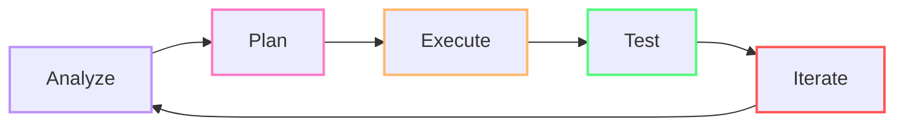
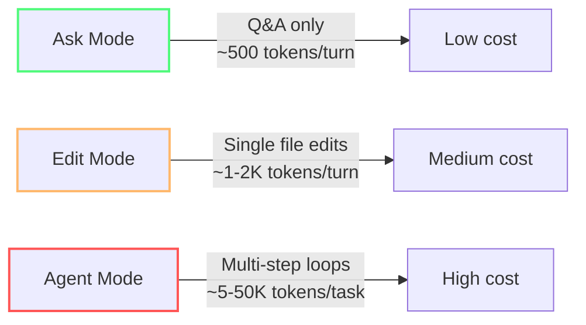
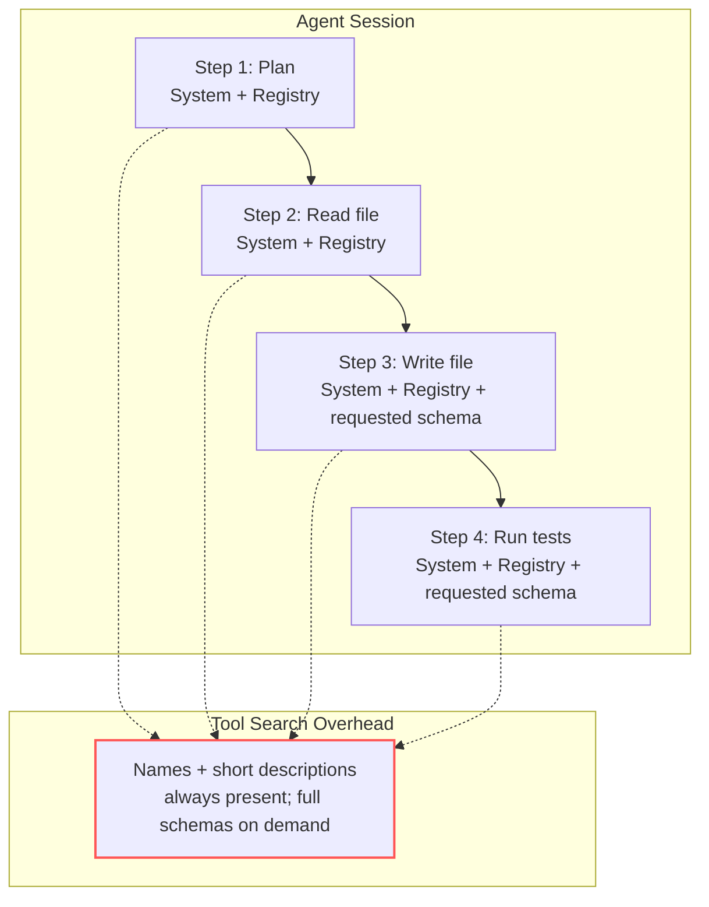
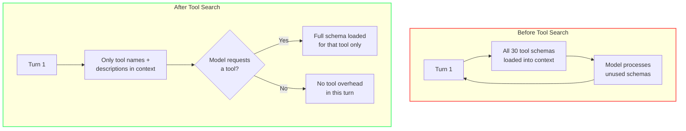
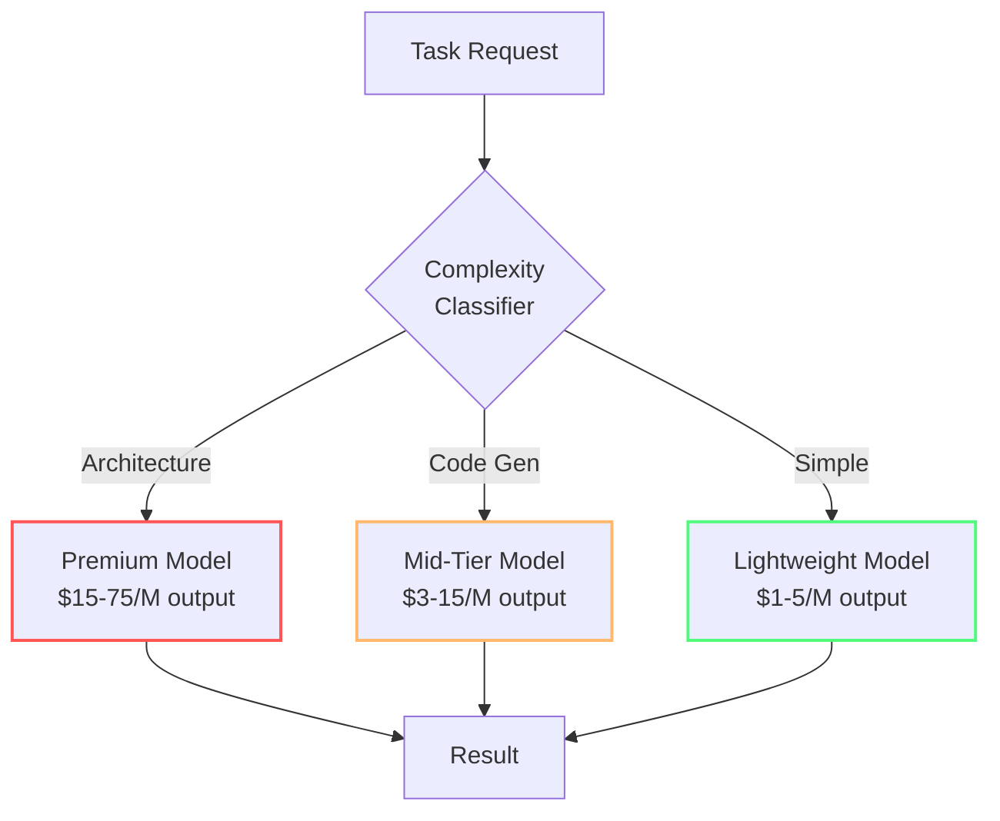
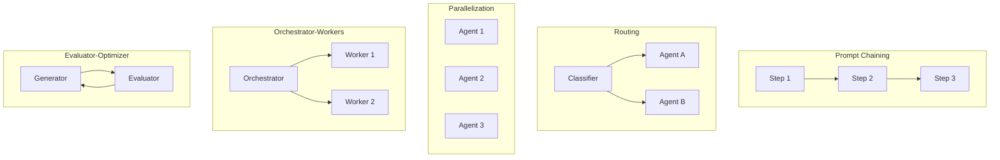
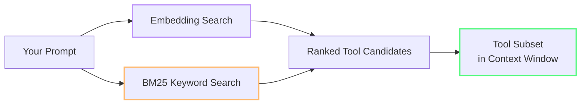

import { Steps, Tabs, TabItem } from "@astrojs/starlight/components";

# Agents, Tools & MCP Hygiene

Agent mode and MCP servers are Copilot's most powerful features — and the fastest way to burn through AI Credits. An unoptimized agent loop can consume **10x more tokens** than the same task done in Edit mode (author estimate based on typical agent loop depth).

This module teaches you when to use agents, how to scope them, and how to keep MCP servers from silently draining your budget.

---

:::note[Case Study: Team Alpha]
Team Alpha had 12 MCP servers connected — most installed 'just in case'. They pruned to 3 (filesystem, terminal, github), created VS Code profiles, and set model selector to Auto. Result: 7,500 → 6,800 credits. Their 'regex in Opus' days were over.
:::

## The Agentic Loop

Every agent task follows a continuous feedback cycle of five steps:



| Step | What Happens | Token Cost Driver |
|------|-------------|-------------------|
| **Analyze** | Agent reads files, gathers context | Input tokens from file reads |
| **Plan** | Agent decides approach, selects tools | Output tokens for reasoning chains |
| **Execute** | Agent writes code, runs commands | Output tokens (code generation) + tool calls |
| **Test** | Agent runs tests, checks results | Tool calls (terminal) + input (test output) |
| **Iterate** | Agent fixes failures, refines | Full loop restart — compound cost |

Understanding this loop explains why Agent mode costs **5–50K tokens** per task (author estimate based on typical loop depth and context size): it runs this entire cycle multiple times. Each iteration compounds the cost of every previous step.

:::tip[Where to intervene]
The most token-efficient place to break the loop is after **Test**. If the tests pass, stop the agent — don't let it iterate to "improve" working code. Use stop conditions: "After tests pass, stop and wait for review."
:::

---

## The Three Modes and Their Costs

Copilot Chat has three interaction modes, each with dramatically different token profiles:



| Mode | Best For | Typical Token Cost | Risk |
|------|----------|-------------------|------|
| **Ask** | Questions, explanations, code review | ~500 input + ~300 output | Low — one turn, no tools |
| **Edit** | Single-file changes, refactoring | ~1-2K input + ~500 output | Low — no tool loops |
| **Agent** | Multi-file changes, complex tasks | ~5-50K per task | **High** — tool loops amplify cost |

:::caution[Agent mode has higher baseline overhead]
Even with Tool Search, agent mode loads system instructions, the tool registry, and file context before the first response. That baseline is higher than Ask or Edit mode — but Tool Search prevents unused tool schemas from adding to it.
:::

---

## Thinking Effort

Thinking effort controls how much reasoning (thinking tokens) a model applies to each request. Higher effort means more thinking tokens, which increases latency and credit consumption.

VS Code sets defaults based on evaluations and has adaptive reasoning enabled. The model dynamically decides how much to think based on the complexity of the task. For most tasks, the defaults are enough.

:::caution[Increase thinking effort only when it earns its cost]
Increase thinking effort only for genuinely complex problems, such as architecture planning or multi-step debugging. Raising it for routine work adds latency and consumes more credits without necessarily improving the result. See [Configure thinking effort](https://code.visualstudio.com/docs/agent-customization/language-models#_configure-thinking-effort).
:::

---

## The Hidden Cost of MCP Servers

Every MCP server you have connected registers its tools in the agent's tool registry. Before Tool Search (mid-2025), the full schema of every tool was injected into every agent step's context window. With Tool Search, only the registry (names + short descriptions) is always-present — full schemas load on demand. See the note below for details.



:::note[Tool Search reduces this overhead]
Tool Search only keeps tool names + short descriptions in the always-present registry. Full schemas load only when the model requests a tool. Every tool the model uses still incurs its ~200 token schema cost.

Before mid-2025, all schemas loaded every step. With Tool Search, only needed tools load. Pruning unused MCP servers still matters — it shrinks the registry and reduces the chance of the model picking expensive tools for simple tasks.
:::

### The MCP Server Math

Each server adds roughly **tools × ~200 tokens per tool definition** in the **pre-Tool Search baseline**. With Tool Search, current costs are approximately **60–75% lower** because only requested tool schemas load (plus the smaller always-present registry).

| Scenario | MCP Servers | Tools | Pre-Tool Search baseline / step | Pre-Tool Search 10-step task | Current Tool Search estimate / step | Current 10-step estimate |
|----------|-------------|-------|-------------------------------|------------------------------|------------------------------------|--------------------------|
| Minimal | 2 (file + terminal) | ~10 | ~2,000 | ~20,000 | ~500–800 | ~5,000–8,000 |
| Moderate | 5 (git, db, file, terminal, browser) | ~25 | ~5,000 | ~50,000 | ~1,250–2,000 | ~12,500–20,000 |
| Heavy | 10+ (everything installed) | ~50+ | ~10,000+ | ~100,000+ | ~2,500–4,000+ | ~25,000–40,000+ |

### How Tool Search Works Internally

The harness maintains a registry of available tools with short descriptions and embedding vectors. Instead of placing every full schema in the context window, it uses the registry to identify likely candidates for the current task. When the model needs a tool, the harness retrieves that tool's full schema on demand; tools that are not requested remain out of context.



Tool Search is especially valuable in MCP-heavy setups: typical sessions send only 5–8 schemas instead of 20–30, large setups send about 10 instead of 30, and simple editing tasks may send no schemas at all. That reduces tool-related context by roughly **60–75%**, while every tool the model actually uses still incurs its schema cost.

At Claude Sonnet input pricing ($3/M input), a single heavy 10-step agent task costs ~$0.30 — from tool registry overhead alone (illustrative estimate based on the table above).

:::tip[Check your baseline with /context]
In Copilot CLI, run `/context` mid-session to see your System/Tools token consumption. In VS Code, estimate by counting active MCP servers × tools × ~200 tokens.
:::

---

## How to Scope Agents for Token Efficiency

### 1. Use Ask or Edit Mode First

Always start with the cheapest mode that can solve the problem. Agent mode is not the default — it's the escalation path.

```
❌ Agent mode for a regex question → $0.15
✅ Ask mode for the same question → $0.01
```

**Rule of thumb:** If the task touches one file, use Edit mode. If it's a question, use Ask mode. Only escalate to Agent when the task genuinely requires multi-file awareness or tool execution.

### 2. Create Scoped Custom Agents

Instead of a single `@workspace` agent that loads context from your entire project, create domain-specific agents:

| Custom Agent | Context Scope | Tools | Best For |
|--------------|--------------|-------|----------|
| **Frontend** | `src/components/`, `src/styles/` | File read/write, terminal | UI changes |
| **Database** | `prisma/`, `migrations/` | File read/write, DB MCP | Schema changes |
| **Testing** | `tests/`, `src/` | File read/write, terminal | Test writing |
| **Security** | Any | File read, security MCP | Audits |

Each scoped agent loads **far fewer tool definitions** and a **much smaller file tree** — saving 5,000–10,000+ tokens per task.

### 3. Set Stop Conditions

Tell the agent when to stop. Without explicit boundaries, agents iterate until they run out of context window or tool budget.

```
Add pagination to the users endpoint. 
If you encounter errors, stop and report — do not attempt fixes.
Maximum 3 tool calls. After edits, stop for review.
```

### 4. Prune Unused MCP Servers

Go through your VS Code settings and disable MCP servers you're not actively using:

```json
// settings.json — only keep what you need for current task
{
  "github.copilot.chat.agent.mcpServers": {
    "filesystem": true,
    "terminal": true,
    "github": false,  // not needed for frontend work
    "database": false // not needed for this task
  }
}
```

Or better: create **VS Code profiles** with different MCP sets:
- **Coding profile**: file system + terminal only
- **DevOps profile**: GitHub CLI + deployment tools
- **Database profile**: database MCP + schema tools

**Configure tools for the current request:** Use the **Configure Tools** button in the chat input field to select individual tools or MCP servers. Search in the tool picker and add another tool when the task needs it. This complements custom agents and VS Code profiles by providing a quick per-request adjustment without changing profiles or configuration. See [Tools](https://code.visualstudio.com/docs/agents/run/tools).

## Batch Repetitive Operations

Repeated submit, poll, and retrieve tool calls add intermediate results to the model's context window. For deterministic or bulk workflows, use a script or command-line tool to run the loop outside the agent conversation and return only the final result to the agent.

:::tip[Move repetitive work outside the conversation]
Instead of asking the agent to run and inspect many similar database queries one at a time, write a reviewed script that runs the query batch and produces a concise summary. Run the script through the terminal tool, then give the summary to the model for analysis. Benchmark the scripted and interactive versions of your workflow first — the savings depend on the tools, results, and task.
:::

---

### 5. Build a Model Router Strategy

Not every task needs the same model. A systematic router can save **73% in daily API costs** — reducing average spend from $15/day to $4/day — by matching task complexity to model tier (author estimate based on an illustrative workload mix).

| Task Type | Primary (Smart) | Fallback (Cheap) | Max Cost/Task |
|-----------|----------------|------------------|---------------|
| Architecture decisions | Claude Opus | GPT-5.4 | $5.00 |
| Code generation | Claude Sonnet | DeepSeek R1 | $0.50 |
| Simple tests | GPT-5.4-mini | Mistral-Small | $0.10 |
| Code review | Claude Sonnet | GPT-5.4-mini | $0.25 |
| Regex, formatting | Claude Haiku | GPT-5.4-mini | $0.02 |



**How to apply this in Copilot:**

1. **Keep the model selector on Auto** — Copilot routes simple requests to cheaper models automatically, saving ~60-70% on eligible turns (Copilot team internal estimate — independent verification not available; individual results vary by workload)
2. **Switch manually for known tiers:**
   - Haiku for: regex, string manipulation, docstrings, boilerplate
   - Sonnet for: general development, cross-file changes
   - Opus for: architecture review, security audits, complex debugging
3. **Don't switch models mid-session for a single cheap question** — the cache rebuild costs more than the savings
4. **Don't pay premium for simple work** — using Opus for a string split costs 15x more than Haiku for the same result

:::tip[The 80/20 rule of model selection]
About 80% of chat requests are simple enough for a lightweight model (author estimate based on typical request mix). If you leave the selector on a premium model "just in case," you're overpaying on 4 out of 5 requests.
:::

### How Auto Model Selection Works

Auto Model Selection classifies each request using task embeddings before it reaches the model. Copilot uses that classification to route simple requests to cheaper models automatically, while more complex work receives a stronger model. The routing adds negligible overhead and avoids requiring manual model switching for every turn.

| Task Type | Model Route |
|-----------|-------------|
| Simple Q&A or code explanation | Fast/cheap model |
| Single-file edit or small refactor | Mid-range model |
| Multi-file edit, complex planning, or tool orchestration | Most capable model |

Because roughly **60–70% of requests** are simple enough for a cheaper model (Copilot team internal estimate — independent verification not available; individual results vary by workload), leaving the selector on Auto can reduce model-related costs by about **60–70%** on eligible work while preserving higher-capability models for tasks that need them.

### 6. Five Sub-Agent Patterns That Save Tokens

Research from Anthropic identifies five organizational patterns for structuring agent work. Each has different token implications.



| Pattern | How It Works | Token Impact | Best For |
|---------|-------------|-------------|----------|
| **Prompt Chaining** | Output of step 1 becomes input to step 2 | Sequential — each step adds cost | Multi-stage tasks (schema → query → test) |
| **Routing** | Lightweight classifier directs to specialized agent | Saves tokens by avoiding full context load | Triaging: bug vs feature vs question |
| **Parallelization** | Independent agents run in sandboxed state | Parallel cost, avoids cross-agent interference | Multiple independent analyses |
| **Orchestrator-Workers** | Smart model plans, cheap models execute | 80% of work hits cheap models | Complex multi-file features |
| **Evaluator-Optimizer** | Generator produces, Evaluator reviews, Generator fixes | 2-3 cycles typical, catches errors early | Quality-critical code, security-sensitive work |

:::tip[Most token-efficient pattern]
**Evaluator-Optimizer** saves the most tokens in practice (author estimate). Catching an error in review costs 2,000 tokens. Fixing that same error after it reaches production costs 50,000+ tokens across debugging, refactoring, and re-review. The 2-3 cycle overhead pays for itself on the first caught bug.
:::

**Practical takeaway:** You're already using these patterns implicitly. Naming them helps you choose the right one deliberately. For a complex multi-file feature, Orchestrator-Workers saves tokens vs one agent doing everything. For a security audit, Evaluator-Optimizer is essential.

---

### 7. The Model-Switching Cache Trap

Switching models mid-session sounds smart — use Opus for architecture, then switch to Haiku for simple follow-ups. But prompt caches are **model-specific**.

**Anthropic's official guidance:** "If you're 100k tokens into a conversation with Opus and want to ask an easy question, it would actually be more expensive to switch to Haiku than to have Opus answer." (Source: Anthropic Engineering Blog, 'Prompt caching is everything', April 2026) The new model can't reuse the old model's cached KV state. Switching forces a full cache rebuild right when the conversation is at its largest.

**The solution — subagents:** Use the main session for the primary model, and launch a cheaper subagent for the one-off simple task. The subagent starts with a fresh (cold) cache, but that's cheaper than rebuilding the main session's entire context.

**When switching IS worth it:**
- At the very start of a session (before much history accumulates)
- When the cost of the wrong model × remaining turns exceeds the rebuild cost

See [Module 2 — Cache-Busting Mistakes](/vibe-on-budget/en/02-context-model#common-cache-busting-mistakes) for more patterns that break the cache.

---

## Tool Search: What Happens Internally

VS Code Copilot uses a dual search strategy to decide which tools to present to the model:



- **Embedding-guided search** — converts your prompt to a semantic vector and finds tools with similar descriptions (OpenAI Ada + Anthropic embedding models)
- **BM25 keyword search** — classic text matching for exact tool names and keywords
- Both results are merged and the top-N most relevant tools are injected into the context window

This means: **well-named tools with clear descriptions get found; vague ones don't**. Rename your MCP tools with descriptive names and keywords to improve retrieval without bloating the context.

:::note[Tool search runs every turn]
Every agent step re-runs the tool search against your prompt. If the task changes mid-session, the tool set changes too — which **invalidates the prompt prefix cache**.
:::

---

## Practical MCP Hygiene Checklist

1. **Audit monthly** — list all connected MCP servers. Remove any not used in the last 30 days.
2. **Profile your sessions** — create separate VS Code profiles for different workflows, each with only the MCP servers needed for that workflow.
3. **Name tools well** — use descriptive names so tool search finds them without extra context.
4. **Prefer deterministic tools** — for terminal tasks, run the command manually and paste output instead of letting the agent loop on it.
5. **Count your MCP tax** — multiply (servers × tools × 200) to estimate the pre-Tool Search baseline; with Tool Search, full schemas load only when requested.

---

:::tip[Continue Learning]
Continue with [Vibe Coding Without the Debt](/vibe-on-budget/en/08-vibe-coding-guardrails), then explore [The Big Picture](/vibe-on-budget/en/09-under-the-hood) for Copilot's internal optimizations.
:::

---

## Practice

1. Check your connected MCP servers (VS Code settings → `github.copilot.chat.agent.mcpServers`). Count them. Disable any you haven't used in the last week.
2. The next time you need a simple answer, use Ask mode instead of Agent mode. Compare the credit hover between the two modes for a similar question.
3. Create one custom agent (use the Configure Tools button in chat) scoped to a specific task domain. Use it for your next task in that domain.

## Key Takeaways

- Agent mode costs **5-50K tokens per task** — use Ask/Edit mode for simpler work
- MCP tool schemas load on demand with **Tool Search** — but every tool used still costs ~200 tokens for its schema. Fewer registered servers = leaner registry
- The pre-Tool Search baseline was **~200 tokens per tool per step**; Tool Search makes current costs approximately 60–75% lower
- Create **scoped custom agents** instead of one monolithic `@workspace` agent
- Set **stop conditions** to prevent runaway agent loops
- VS Code Profiles with different MCP sets save **5,000–10,000+ tokens per session**

*Estimated reading time: 10 minutes*
