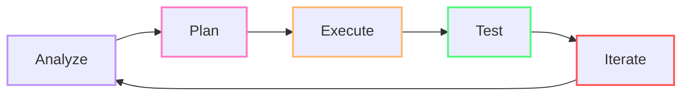
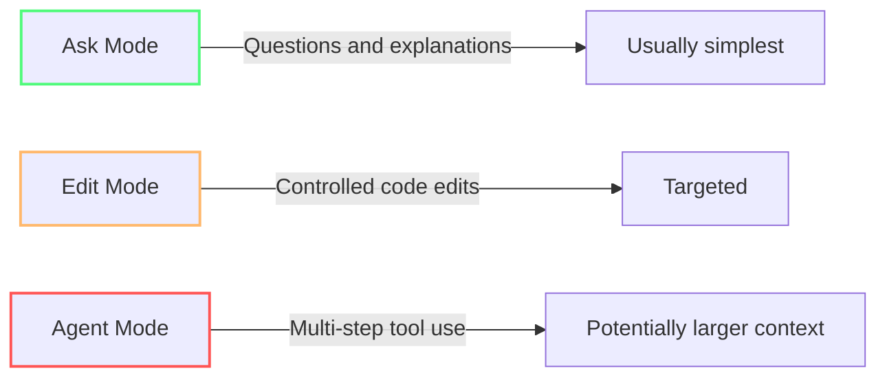
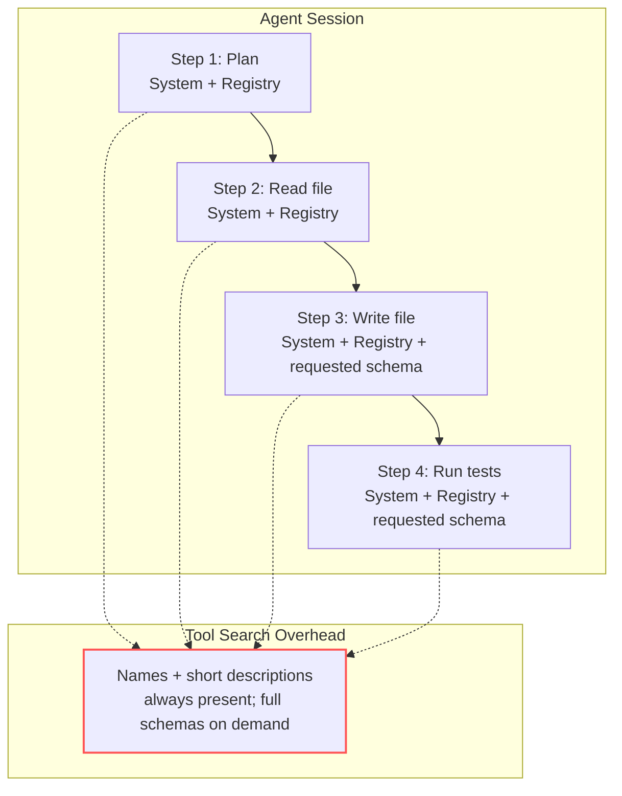
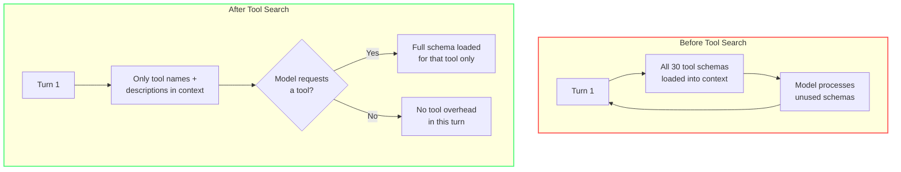
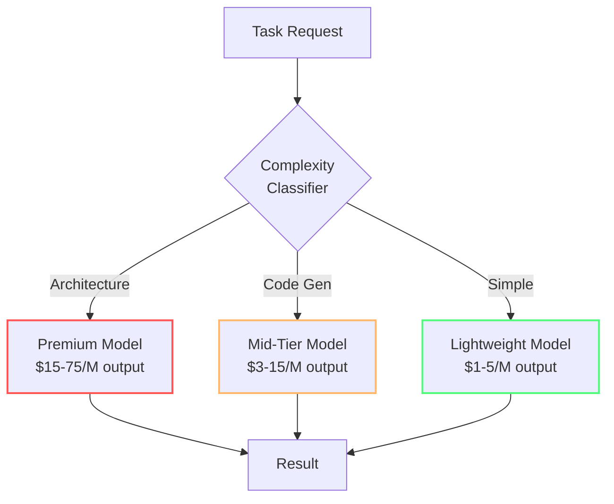
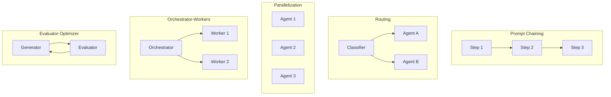
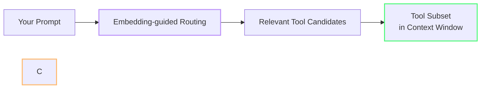

import { Steps, Tabs, TabItem } from "@astrojs/starlight/components";

# Agents, Tools & MCP Hygiene

Agent mode and MCP servers are Copilot's most powerful features — and they can increase usage because agents may use tools and iterate across a task. The actual cost depends on the model, context, tool calls, and task length.[^m7-1]

This module teaches you when to use agents, how to scope them, and how to keep MCP servers from silently draining your budget.

---

:::
## 🟢 The Agentic Loop

Every agent task can be understood as a continuous feedback cycle of five practical steps:

*(See [Glossary](/vibe-on-budget/en/glossary) for agentic loop, harness, tool registry, and embedding vector definitions.)*



| Step | What Happens | Token Cost Driver |
|------|-------------|-------------------|
| **Analyze** | Agent reads files, gathers context | Input tokens from supplied context |
| **Plan** | Agent decides approach, selects tools | Output tokens for reasoning chains |
| **Execute** | Agent writes code, runs commands | Output tokens (code generation) + tool calls |
| **Test** | Agent runs tests, checks results | Tool calls (terminal) + input (test output) |
| **Iterate** | Agent fixes failures, refines | Full loop restart — compound cost |

Each additional iteration adds more messages, tool results, and context to the conversation. VS Code documents the context window as including the user message, history, instructions, referenced files, and tool outputs.[^m7-2]

:::tip[Where to intervene]
The most token-efficient place to break the loop is after **Test**. If the tests pass, stop the agent — don't let it iterate to "improve" working code. Use stop conditions: "After tests pass, stop and wait for review."
:::

---

## 🟢 The Three Modes and Their Relative Cost[^m7-11]

Copilot Chat has three interaction modes, each with dramatically different token profiles:



| Mode | Best For | Usage profile | Risk |
|------|----------|-------------------|------|
| **[Ask Mode](https://code.visualstudio.com/docs/chat/chat-overview)** | Questions, explanations, code review | Conversational assistance | Lower operational scope |
| **[Edit Mode](https://github.blog/ai-and-ml/github-copilot/copilot-ask-edit-and-agent-modes-what-they-do-and-when-to-use-them/)** | Targeted code changes | Focused edits | More controlled |
| **[Agent Mode](https://code.visualstudio.com/docs/chat/chat-overview)** | Multi-file changes, complex tasks | Can use tools and iterate | **Higher context and tool-use potential** |

:::caution[Agent mode has higher baseline overhead]
Even with Tool Search, agent mode loads system instructions, the tool registry, and file context before the first response. That baseline is higher than Ask or Edit mode — but Tool Search prevents unused tool schemas from adding to it.
:::

---

## 🟡 [Thinking Effort](https://code.visualstudio.com/docs/agent-customization/language-models#_configure-thinking-effort)

Thinking effort controls how much reasoning a model applies to each request. Higher effort can increase reasoning work and latency, so it should match the task.[^m7-3]

VS Code sets defaults based on evaluations and has adaptive reasoning enabled. The model dynamically decides how much to think based on the complexity of the task. For most tasks, the defaults are enough.

:::caution[Increase thinking effort only when it earns its cost]
Increase thinking effort only for genuinely complex problems, such as architecture planning or multi-step debugging. Raising it for routine work adds latency and consumes more credits without necessarily improving the result. See [Configure thinking effort](https://code.visualstudio.com/docs/agent-customization/language-models#_configure-thinking-effort).
:::

---

## 🟡 The Hidden Cost of MCP Servers

MCP servers expose tools that a compatible host can discover and invoke. VS Code can manage MCP servers and their tools, while newer Copilot tool-selection work reduces the number of tools presented to the model at once.[^m7-4]



:::note[Tool Search reduces this overhead]
Tool-search systems can select a smaller relevant set of tools instead of presenting every available tool to the model. The savings are workload-dependent; there is no universal per-tool token price. Pruning unused MCP servers still keeps the available tool surface smaller.[^m7-5]
:::

### 🟡 The MCP Server Math

An MCP tool definition contains structured metadata, including a name, description, and input schema. Its serialized size varies with those fields, so estimate from the actual definitions rather than multiplying by a universal token constant.[^m7-6]

| Scenario | Practical action |
|----------|------------------|
| Small tool set | Keep only the servers needed for the task |
| Larger tool set | Use tool configuration or profiles to narrow the active set |
| Unknown tool set | Inspect the real schemas before estimating context use |

### 🔴 How [Tool Search](https://code.visualstudio.com/docs/agents/agent-troubleshooting/cache-explorer) Works Internally

VS Code's token-efficiency work describes embedding-guided tool routing and a smaller core tool set so the model receives fewer irrelevant tools. Treat implementation details as version-sensitive and follow the current VS Code documentation.[^m7-5]



Tool search is most useful when many tools are available, because relevance filtering can reduce irrelevant tool context. Do not turn that qualitative benefit into a fixed savings percentage without measuring your own workload.[^m7-5]

:::tip[Check your context]
VS Code automatically compacts older conversation content as a conversation approaches its context limit. Use the context documentation and the model's current pricing/limits rather than a fixed MCP-token multiplier.[^m7-2]
:::

---

## 🟡 How to Scope Agents for Token Efficiency

### 1. Use Ask or Edit Mode First

Always start with the cheapest mode that can solve the problem. Agent mode is not the default — it's the escalation path.

```
❌ Agent mode for a regex question → $0.15
✅ Ask mode for the same question → $0.01
```

**Rule of thumb:** If the task touches one file, use Edit mode. If it's a question, use Ask mode. Only escalate to Agent when the task genuinely requires multi-file awareness or tool execution.

### 2. Create Scoped [Custom Agents](https://code.visualstudio.com/docs/agent-customization/overview)

Instead of a single [`@workspace`](https://code.visualstudio.com/docs/chat/chat-participants) agent that loads context from your entire project, create domain-specific agents:

| Custom Agent | Context Scope | Tools | Best For |
|--------------|--------------|-------|----------|
| **Frontend** | `src/components/`, `src/styles/` | File read/write, terminal | UI changes |
| **Database** | `prisma/`, `migrations/` | File read/write, DB MCP | Schema changes |
| **Testing** | `tests/`, `src/` | File read/write, terminal | Test writing |
| **Security** | Any | File read, security MCP | Audits |

Scoped agents can reduce irrelevant instructions, files, and tools supplied to a request. Measure the result for your own repository instead of assuming a fixed token saving.[^m7-7]

### 3. Set Stop Conditions

Tell the agent when to stop. Explicit boundaries help keep a task within the intended context and tool scope.[^m7-2]

```
Add pagination to the users endpoint. 
If you encounter errors, stop and report — do not attempt fixes.
Maximum 3 tool calls. After edits, stop for review.
```

### 4. Prune Unused MCP Servers

Go through your VS Code settings and disable MCP servers you're not actively using:

```json
// settings.json — only keep what you need for current task
{
  "github.copilot.chat.agent.mcpServers": {
    "filesystem": true,
    "terminal": true,
    "github": false,  // not needed for frontend work
    "database": false // not needed for this task
  }
}
```

Or better: create **VS Code profiles** with different MCP sets:
- **Coding profile**: file system + terminal only
- **DevOps profile**: GitHub CLI + deployment tools
- **Database profile**: database MCP + schema tools

**Configure tools for the current request:** Use the **Configure Tools** button in the chat input field to select individual tools or MCP servers. Search in the tool picker and add another tool when the task needs it. This complements custom agents and VS Code profiles by providing a quick per-request adjustment without changing profiles or configuration. See [Tools](https://code.visualstudio.com/docs/agents/run/tools).

## Batch Repetitive Operations

Repeated submit, poll, and retrieve tool calls add intermediate results to the model's context window. For deterministic or bulk workflows, use a script or command-line tool to run the loop outside the agent conversation and return only the final result to the agent.[^m7-12]

:::tip[Move repetitive work outside the conversation]
Instead of asking the agent to run and inspect many similar database queries one at a time, write a reviewed script that runs the query batch and produces a concise summary. Run the script through the terminal tool, then give the summary to the model for analysis. Benchmark the scripted and interactive versions of your workflow first — the savings depend on the tools, results, and task.
:::

---

### 5. Build a Model Router Strategy

Not every task needs the same model. A routing strategy should match task complexity to model capability and price. No authoritative source was found for the specific **73%** or **$15/day → $4/day** figures, so they are not presented as general results here.[^m7-8]

| Task Type | Primary (Smart) | Fallback (Cheap) | Max Cost/Task |
|-----------|----------------|------------------|---------------|
| Architecture decisions | Claude Opus | GPT-5.4 | $5.00 |
| Code generation | Claude Sonnet | DeepSeek R1 | $0.50 |
| Simple tests | GPT-5.4-mini | Mistral-Small | $0.10 |
| Code review | Claude Sonnet | GPT-5.4-mini | $0.25 |
| Regex, formatting | Claude Haiku | GPT-5.4-mini | $0.02 |



**How to apply this in Copilot:**

1. **Keep the model selector on Auto when appropriate** — GitHub says Auto evaluates task complexity and system health, routes tasks to an optimal supported model, and gives paid plans a 10% discount on model costs while Auto is selected.[^m7-8]
2. **Switch manually for known tiers:**
   - Haiku for: regex, string manipulation, docstrings, boilerplate
   - Sonnet for: general development, cross-file changes
   - Opus for: architecture review, security audits, complex debugging
3. **Don't switch models mid-session for a single cheap question** — the cache rebuild costs more than the savings
4. **Don't pay premium rates for simple work** when a suitable lower-cost model is available; compare the current model prices before choosing.[^m7-9]

:::tip[The 80/20 rule of model selection]
The right mix is workload-specific. Use Auto or compare the published model prices rather than assuming a fixed percentage of requests belongs to a lightweight model.
:::

### How Auto Model Selection Works

Auto Model Selection classifies each request using task embeddings before it reaches the model. Copilot uses that classification to route simple requests to cheaper models automatically, while more complex work receives a stronger model. The routing adds negligible overhead and avoids requiring manual model switching for every turn.

| Task Type | Model Route |
|-----------|-------------|
| Simple Q&A or code explanation | Fast/cheap model |
| Single-file edit or small refactor | Mid-range model |
| Multi-file edit, complex planning, or tool orchestration | Most capable model |

Because Auto considers task complexity and availability, it can reserve higher-cost models for tasks that need them; the resulting savings depend on the workload and the models available under the plan.[^m7-8]

### 6. Five Sub-Agent Patterns That Save Tokens

Anthropic describes five composable patterns for structuring agent workflows: prompt chaining, routing, parallelization, orchestrator-workers, and evaluator-optimizer. The token implications depend on the implementation and workload.[^m7-10]



| Pattern | How It Works | Operational trade-off | Best For |
|---------|-------------|-------------|----------|
| **Prompt Chaining** | Output of step 1 becomes input to step 2 | Sequential dependencies | Multi-stage tasks (schema → query → test) |
| **Routing** | A classifier directs work to a specialized agent | Adds a classification step | Triaging: bug vs feature vs question |
| **Parallelization** | Independent agents run concurrently | Uses parallel work | Multiple independent analyses |
| **Orchestrator-Workers** | An orchestrator plans and delegates | Adds coordination | Complex multi-file features |
| **Evaluator-Optimizer** | A generator produces and an evaluator reviews | Adds evaluation and possible revision | Quality-critical code, security-sensitive work |

:::tip[Most token-efficient pattern]
**Evaluator-Optimizer** adds a review loop, so use it when the quality benefit justifies the extra generation and evaluation work. Anthropic presents it as one composable pattern, not as a guaranteed token-saving technique.[^m7-10]
:::

**Practical takeaway:** You're already using these patterns implicitly. Naming them helps you choose the right one deliberately. For a complex multi-file feature, Orchestrator-Workers saves tokens vs one agent doing everything. For a security audit, Evaluator-Optimizer is essential.

---

### 7. The Model-Switching Cache Trap

Switching models mid-session sounds smart — use Opus for architecture, then switch to Haiku for simple follow-ups. But prompt caches are **model-specific**.

**Current GitHub guidance:** Auto model selection routes along natural cache boundaries, and GitHub notes that switching models mid-session can increase cost without enough quality improvement. Keep model changes deliberate when a conversation has accumulated substantial context.[^m7-8]

**The solution — subagents:** Use the main session for the primary model, and launch a cheaper subagent for the one-off simple task. The subagent starts with a fresh (cold) cache, but that's cheaper than rebuilding the main session's entire context.

**When switching IS worth it:**
- At the very start of a session (before much history accumulates)
- When the cost of the wrong model × remaining turns exceeds the rebuild cost

See [Module 2 — Cache-Busting Mistakes](/vibe-on-budget/en/02-context-model#common-cache-busting-mistakes) for more patterns that break the cache.

---

## 🔴 [Tool Search](https://code.visualstudio.com/docs/agents/agent-troubleshooting/cache-explorer): What Happens Internally

VS Code Copilot's token-efficiency work describes embedding-guided tool routing to decide which tools are relevant to a request:[^m7-5]



- **Embedding-guided routing** — uses semantic relevance to select useful tools
- **Smaller tool surface** — reduces irrelevant tools presented to the model

This means: **well-named tools with clear descriptions get found; vague ones don't**. Rename your MCP tools with descriptive names and keywords to improve retrieval without bloating the context.

:::note[Tool selection is implementation-dependent]
The exact retrieval and caching behavior can change as VS Code and Copilot evolve. Rely on the current product documentation rather than assuming a particular search algorithm or cache invalidation rule.
:::

---

## Practical MCP Hygiene Checklist

1. **Audit regularly** — list all connected MCP servers and remove any you do not need.
2. **Profile your sessions** — keep workflow-specific MCP configuration in the appropriate VS Code profile or workspace configuration.[^m7-7]
3. **Name tools well** — use descriptive names so tool search finds them without extra context.
4. **Prefer deterministic tools** — for terminal tasks, run the command manually and paste output instead of letting the agent loop on it.
5. **Measure your MCP tax** — inspect actual tool definitions and keep only the tools needed for the workflow; there is no universal `tools × 200` rule.[^m7-6]

---

:::tip[Continue Learning]
Continue with [Vibe Coding Without the Debt](/vibe-on-budget/en/08-vibe-coding-guardrails), then explore [The Big Picture](/vibe-on-budget/en/09-under-the-hood) for Copilot's internal optimizations.
:::

---

## Practice

1. Check your connected MCP servers in VS Code. Disable any you do not need for the current workflow.
2. The next time you need a simple answer, use Ask mode instead of Agent mode. Compare the credit hover between the two modes for a similar question.
3. Create one custom agent (use the Configure Tools button in chat) scoped to a specific task domain. Use it for your next task in that domain.

## Key Takeaways

- Agent mode can use tools and iterate — use Ask/Edit mode for simpler work
- MCP tool definitions vary in size; keep the active tool set relevant and measure real usage
- Create **scoped custom agents** instead of one monolithic `@workspace` agent
- Set **stop conditions** to prevent runaway agent loops
- VS Code Profiles can separate workflow-specific MCP configuration

*Estimated reading time: 10 minutes*

[^m7-1]: [Use chat in VS Code](https://code.visualstudio.com/docs/chat/chat-overview) — Microsoft, n.d.; [Context](https://code.visualstudio.com/docs/agents/concepts/context) — Microsoft, n.d.
[^m7-2]: [Context](https://code.visualstudio.com/docs/agents/concepts/context) — Microsoft, n.d.
[^m7-3]: [Configure thinking effort](https://code.visualstudio.com/docs/agent-customization/language-models#_configure-thinking-effort) — Microsoft, n.d.
[^m7-4]: [Add and manage MCP servers in VS Code](https://code.visualstudio.com/docs/agent-customization/mcp-servers) — Microsoft, n.d.; [Tools](https://modelcontextprotocol.io/specification/draft/server/tools) — Model Context Protocol, n.d.
[^m7-5]: [Improving token efficiency for GitHub Copilot in VS Code](https://code.visualstudio.com/blogs/2026/06/17/improving-token-efficiency-in-github-copilot) — Microsoft, June 17, 2026.
[^m7-6]: [Tools](https://modelcontextprotocol.io/specification/draft/server/tools) — Model Context Protocol, n.d.; [MCP tool-schema overhead discussion](https://github.com/modelcontextprotocol/modelcontextprotocol/issues/2808) — Model Context Protocol, n.d.
[^m7-7]: [MCP configuration reference](https://code.visualstudio.com/docs/agents/reference/mcp-configuration) — Microsoft, n.d.; [Custom agents in VS Code](https://code.visualstudio.com/docs/agent-customization/custom-agents) — Microsoft, n.d.
[^m7-8]: [About Copilot auto model selection](https://docs.github.com/en/copilot/concepts/models/auto-model-selection) — GitHub, n.d.
[^m7-9]: [Copilot billing and pricing](https://docs.github.com/en/copilot/reference/copilot-billing/models-and-pricing) — GitHub, n.d.
[^m7-10]: [Building effective agents](https://www.anthropic.com/engineering/building-effective-agents) — Anthropic, December 19, 2024.
[^m7-11]: [Chat modes](https://code.visualstudio.com/docs/agents/chat/modes) — Microsoft, n.d.; [Use chat in VS Code](https://code.visualstudio.com/docs/chat/chat-overview) — Microsoft, n.d.
[^m7-12]: [Optimizing your AI usage to maximize efficiency and reduce cost](https://docs.github.com/en/copilot/tutorials/optimize-ai-usage) — GitHub, n.d.
