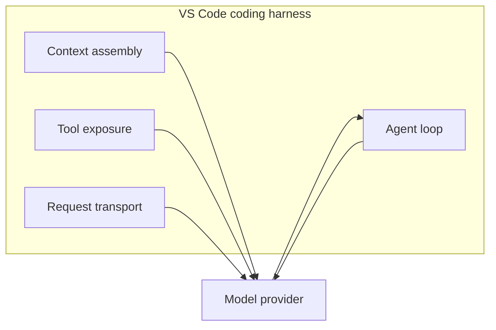
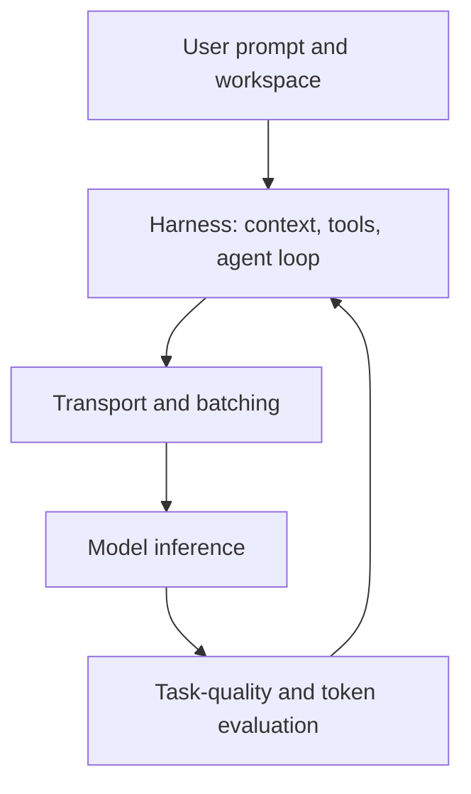

import { Steps } from "@astrojs/starlight/components";

# Vad Copilot gör åt dig

Du har gjort ditt. Du skriver snålt, du har byggt ett snålt projekt, du scoped dina agenter. Men du är inte ensam i det här — Copilot själv jobbar också på att spara tokens åt dig. Den här sista modulen handlar om vad som händer bakom kulisserna, utan att du behöver lyfta ett finger.

VS Code-teamet beskriver arbetet med tokeneffektivitet som en serie uppmätta förbättringar, inte som en enda magisk optimering. När de ändrar harnessen använder de A/B-experiment i produktion och utvärderingar mot offline-baserade uppgiftsserier. Målet är att uppgifterna ska lyckas lika bra eller bättre, samtidigt som tokenanvändningen minskar. [^m9-2]

## 🟡 De osynliga optimeringarna

Harnessen sitter mellan editorn och modellen. Den sätter ihop prompten, håller ordning på verktygen som modellen får använda, kör agentloopen och matar tillbaka verktygsresultat till senare turer. [^m9-1]

*(Se [ordlistan](/vibe-on-budget/en/glossary) för definitioner av outputkomprimering, bakgrundsbatchning, serverless och continuous batching.)*

Diagrammet visar ansvarsområden som VS Code har dokumenterat. Det betyder inte att varje förfrågan använder exakt samma interna implementation. [^m9-1]

## 🟡 1. Outputkomprimering

[VS Code](https://code.visualstudio.com/blogs) beskriver outputkomprimering som en del av harness-arbetet. Ett exempel är att ta bort radnummer från genererad kod när de inte tillför någon användbar information. Den publicerade mätningen för outputkomprimering är en **minskning av outputtokens med 5,5 %**. [^m9-2]

Samma artikel rapporterar att **Tool Search minskar tokenanvändningen med 9–11 %** genom att inte skicka med alla verktygsdefinitioner i varje förfrågan. Definitionerna laddas i stället när de behövs. [^m9-2]

Siffrorna är VS Code-teamets mätningar av Copilot-harnessen. De är alltså inte en universell komprimeringsgrad för alla modeller eller kodningsagenter. [^m9-2]

## 🟡 2. Bakgrundsarbete och batchning

Artikeln om harnessen beskriver agentiskt kodande som en iterativ loop där harnessen hanterar kontext och verktygsresultat mellan modellanropen. Med den arkitekturen blir bakgrundsarbete, som kontext- och verktygshantering, en del av systemet runt modellförfrågan — inte bara en del av modellen. [^m9-1]

Artikeln om tokeneffektivitet nämner batchning av bakgrundsarbete under inaktiv tid som en av optimeringarna teamet har utvärderat. Källan stödjer att batchningen sker, men publicerar inte de före- och eftervärden för antal förfrågningar som fanns i en tidigare version av lektionen. Därför återger vi inte de siffrorna här. [^m9-2]

## 🟡 3. Förbättringar av [WebSocket](https://developer.mozilla.org/en-US/docs/Web/API/WebSocket)

VS Code rapporterar att permanenta WebSocket-anslutningar minskar medianen för **TTFT (Time-To-First-Token)** med **19 %**. Det här är ett mått på fördröjning, inte en minskning av antalet genererade tokens. Anslutningarna använder också [TLS (Transport Layer Security)](https://en.wikipedia.org/wiki/Transport_Layer_Security) för transportsäkerhet. [^m9-2]

Snabbare transport kan påverka hur lång tid en agentisk tur tar, men den citerade källan visar inte att WebSockets minskar övergivna sessioner, antalet omförsök eller förbrukningen av autentiseringstokens. Därför gör vi inte de orsakspåståendena här. [^m9-2]

## 🟡 4. Evidensbaserad optimering

VS Code-teamet säger att de utvärderar ändringar i harnessen med A/B-experiment i produktion och offline-utvärderingar mot uppgiftsserier. Kravet är att uppgifterna ska lyckas lika bra eller bättre samtidigt som tokenanvändningen minskar. [^m9-2]

Processen gör det möjligt att jämföra behandlings- och kontrollgrupper, men den citerade artikeln publicerar inte värdena för uppgiftsresultat, fördröjning eller trohet från exempeltabellen som tidigare fanns i lektionen. Tabellen är borttagen i stället för att presentera obelagd data som mätningar. [^m9-2]

GitHubs artikel om kostnadseffektivitet beskriver på samma sätt effektivitet som en helhetsfråga: det räcker inte att minska en del av en förfrågan om ändringen samtidigt skapar mer arbete någon annanstans i uppgiften. [^m9-3]

## Vad optimeringarna betyder för ditt arbetsflöde

- Ge komplexa uppgifter tillräckligt med ostörd tid för att harnessen ska hinna hantera agentloopen och allt arbete runt den. Harnessen ansvarar för kontextmontering, verktygsexponering och återkoppling av verktygsresultat. [^m9-1]
- Håll promptarna fokuserade och kontexten relevant. GitHubs vägledning rekommenderar att du väljer en lämplig modell, strukturerar promptarna och lägger till skyddsräcken för att slutföra uppgifter effektivare och använda färre AI-credits. [^m9-4]
- Bedöm en optimering utifrån både resultatet och resursanvändningen. VS Code:s utvärderingsprocess kontrollerar uttryckligen uppgiftsresultat tillsammans med tokenanvändning. [^m9-2]

### En brasklapp: den lokala metriksfällan

Antalet tokens är inte ensamt ett komplett mått på hur effektiv en kodningsuppgift är. GitHubs diskussion om kostnadseffektivitet betonar att du ska utvärdera hela uppgiften i stället för att optimera ett enda lokalt mått. Arbete som sparas i ett steg kan nämligen ätas upp av extra arbete i ett annat. [^m9-3]

## 🔴 5. Infrastrukturekonomi (för egenhostade modeller)

Team som kör egna modeller behöver jämföra priset per token med kostnaden för att hålla dedikerad hårdvara tillgänglig. Serverless-inferens tar betalt för faktisk användning, medan dedikerad infrastruktur tar betalt för provisionerad beräkningskapacitet. Avvägningen beror på genomströmning och nyttjandegrad. [^m9-5]

### Serverless kontra dedikerad GPU

För en dedikerad GPU kan den effektiva kostnaden per miljon tokens räknas fram från GPU-priset per timme, genomströmningen och den varaktiga nyttjandegraden:

$$
\mathrm{Cost\ per\ Million} = \frac{R}{T \times 3600 \times U} \times 1{,}000{,}000
$$

Här är $R$ GPU-priset per timme, $T$ genomströmningen i tokens per sekund och $U$ nyttjandegraden. Det här är kostnadsmodellen som publicerades för den uppmätta H200-jämförelsen. [^m9-6]

DigitalOceans benchmark rapporterar en NVIDIA [H200 GPU](https://www.nvidia.com/en-us/data-center/h200/) för **$3.44 per GPU-timme**, som kör Llama 3.3 70B med FP8-kvantisering och vLLM. Den uppmätta kostnaden varierade från **$20.32 per miljon outputtokens vid batch 1** till **$0.45 per miljon outputtokens vid batch 128**. Det visar varför trafikmönster och batchning spelar roll. [^m9-6]

Samma benchmarksammanfattning rapporterar **$0.65 per miljon tokens** för den jämförda serverless-tjänsten och en **brytpunkt vid 72,2 % varaktig nyttjandegrad** för det dedikerade H200-scenariot. Vid 40 % nyttjandegrad rapporteras **$1.173 per miljon tokens** för den dedikerade konfigurationen. [^m9-7]

| Uppmätt konfiguration | Rapporterat resultat |
|---|---:|
| H200, batch 1 | $20.32 / 1M output tokens |
| H200, batch 128 | $0.45 / 1M output tokens |
| Dedicated/serverless crossover | 72.2% sustained utilization |

Det här är resultat för den namngivna hårdvaran, modellen, ramverket, arbetsbelastningen och det datum som anges i DigitalOcean-benchmarken. Det är inte universella priser för alla GPU:er eller leverantörer. [^m9-6]

**Slutsats:** ryckig trafik kan gynna inferens med användningsbaserat pris, medan dedikerad hårdvara som används kontinuerligt kan ge bättre styckekonomi. Rätt val kräver uppmätt genomströmning och nyttjandegrad för arbetsbelastningen — inte bara ett hårdvarupris. [^m9-5] [^m9-6]

## 🟡 Så hänger allt ihop: hela stacken

Den källbelagda stacken består av flera lager: harnessen sätter ihop kontext och verktyg, transporten påverkar fördröjningen, modellserveringsinfrastrukturen avgör beräkningskostnaden och utvärderingen kontrollerar att kvaliteten bevaras. [^m9-1] [^m9-2] [^m9-5]

Diagrammet är en syntes av de ansvarsområden och den utvärderingsprocess som beskrivs i de citerade VS Code- och GitHub-artiklarna. Det är inte en procentuell uppdelning av tokensparande. [^m9-1] [^m9-2] [^m9-3]

:::tip[Fortsätt lära dig]
Gå tillbaka till [kontextmodellen](/vibe-on-budget/en/01-what-happens) och [Vibe coding utan skuld](/vibe-on-budget/en/06-vibe-coding) för att använda tekniker som kompletterar harnessen. [^m9-1] [^m9-4]
:::

:::note[På horisonten: tokeneffektivitet på modellnivå]

Klicka för att visa — tekniker på forskningsstadiet

Forskning pågår också i modell- och inferenslagren:

- **Kontextpruning** väljer en föränderlig delmängd av prompttokens för beräkning. LazyLLM beskriver dynamiskt tokenurval under prefilling och decoding och rapporterar 2,34× snabbare prefilling för Llama 2 7B i en uppgift med frågor över flera dokument, samtidigt som träffsäkerheten bibehölls. [^m9-8]
- **Sparse Mixture-of-Experts (MoE)** dirigerar tokens genom utvalda experter. SHAPE-artikeln beskriver låg beräkningskostnad per token i glesa MoE-modeller, minneskostnaden för att hålla expertpoolen resident och konkurrenskraftig träffsäkerhet vid 20 % och 40 % expertpruning i de utvärderade backbone-modellerna. [^m9-9]
- **Multi-Token Prediction** levererar flera förutsägelser av framtida tokens för spekulativ decoding. Den citerade forskningen beskriver hur multi-token prediction kan generera flera tokens per steg och samtidigt förbli kompatibel med autoregressiv generering. [^m9-10]

De här artiklarna visar forskningsmetoder och uppmätta resultat i sina angivna experimentmiljöer. De visar inte att teknikerna är införda i GitHub Copilot. [^m9-8] [^m9-9] [^m9-10]

:::

## Övning

1. Öppna Cache Explorer i Agent Debug Logs för din senaste långa session. Hur hög var din cache hit rate? Hur många inputtokens återanvändes?
2. Stanna i en lång session i stället för att starta flera korta nästa gång du tar dig an en komplex uppgift. Jämför sessionens totala credits med din baslinje från Modul 3.
3. Gå igenom kursens Viktiga slutsatser från alla 7 moduler. Välj de 3 tekniker som skulle spara flest tokens åt dig och använd dem den här veckan.

## Resan: Från Enter-tryck till full kontroll

Du började med att trycka på Enter och hoppas på det bästa. Nu har du en helt annan karta över vad som händer — och hur du själv kan styra det:

- **Modul 1:** Du lärde dig vad tokens är.
- **Modul 2:** Du såg vad de kostar.
- **Modul 3:** Du lärde dig skriva snålare prompts.
- **Modul 4:** Du byggde ett snålt projekt.
- **Modul 5:** Du lärde dig köra agenter utan slöseri.
- **Modul 6:** Du lärde dig vibea utan skuld.
- **Modul 7:** Du såg vad Copilot gör automatiskt.

Det fina är att du inte behöver välja mellan att arbeta snabbt och att arbeta smart. När du kombinerar dina egna vanor med Copilots automatiska optimeringar får du mer gjort med mindre slöseri — och full kontroll över när tokens faktiskt är värda att använda.

## Viktiga slutsatser

- Copilot-harnessen sätter ihop kontext, exponerar verktyg, kör agentloopen och matar tillbaka resultat till modellen. [^m9-1]
- VS Code rapporterar 5,5 % lägre outputtokenanvändning från outputkomprimering, 9–11 % lägre tokenanvändning från Tool Search och 19 % lägre median-TTFT från permanenta WebSocket-anslutningar i de citerade mätningarna. [^m9-2]
- VS Code validerar ändringar med A/B-experiment i produktion och offline-utvärderingar mot uppgiftsserier. [^m9-2]
- Kostnaden för en dedikerad GPU beror på genomströmning, batchning och nyttjandegrad. Den citerade H200-benchmarken rapporterar en brytpunkt på 72,2 % mot sitt jämförda serverless-pris. [^m9-6] [^m9-7]
- Kontextpruning, gles MoE-pruning och multi-token prediction stöds här av forskningsartiklar — inte av något påstående om att teknikerna används i Copilot. [^m9-8] [^m9-9] [^m9-10]

*Beräknad lästid: 7 minuter*

[^m9-1]: [The Coding Harness Behind GitHub Copilot in VS Code](https://code.visualstudio.com/blogs/2026/05/15/agent-harnesses-github-copilot-vscode) — Julia Kasper, Megan Rogge, and Aaron Munger, Visual Studio Code, May 15, 2026.
[^m9-2]: [Improving token efficiency for GitHub Copilot in VS Code](https://code.visualstudio.com/blogs/2026/06/17/improving-token-efficiency-in-github-copilot) — Ryan Caldwell and Bhavya U, Visual Studio Code, June 17, 2026.
[^m9-3]: [How we make AI coding more cost efficient without sacrificing task quality](https://github.blog/ai-and-ml/github-copilot/how-we-make-ai-coding-more-cost-efficient-without-sacrificing-task-quality/) — GitHub, 2026.
[^m9-4]: [Optimize your AI usage to maximize efficiency and reduce cost](https://docs.github.com/en/copilot/tutorials/optimize-ai-usage) — GitHub Docs, 2026.
[^m9-5]: [LLM Inference Cost Per Token: Serverless vs. Dedicated Comparison](https://lyceum.technology/magazine/inference-cost-per-token-provider-comparison/) — Maximilian Niroomand, Lyceum Technology, 2026.
[^m9-6]: [Token Economics Across Traffic Profiles on Dedicated GPUs](https://www.digitalocean.com/community/tutorials/llm-inference-cost) — DigitalOcean Community, July 8, 2026.
[^m9-7]: [The Inference Cost Model Nobody Has Published: Token Economics Across Traffic Profiles on Dedicated GPUs](https://daily.dev/posts/the-inference-cost-model-nobody-has-published-token-economics-across-traffic-profiles-on-dedicated--ddrg6yxfh) — DigitalOcean Community, July 8, 2026.
[^m9-8]: [LazyLLM: Dynamic Token Pruning for Efficient Long Context LLM Inference](https://arxiv.org/abs/2407.14057) — Minsik Cho, Thomas Merth, Sachin Mehta, Mohammad Rastegari, and Mahyar Najibi, arXiv, 2024.
[^m9-9]: [SHAPE: Coalition-Aware Expert Pruning for Sparse Mixture-of-Experts LLMs](https://arxiv.org/abs/2606.09886) — Alizen et al., arXiv, submitted June 3, 2026.
[^m9-10]: [Faster Language Models with Better Multi-Token Prediction](https://arxiv.org/abs/2410.17765) — arXiv, 2024.
