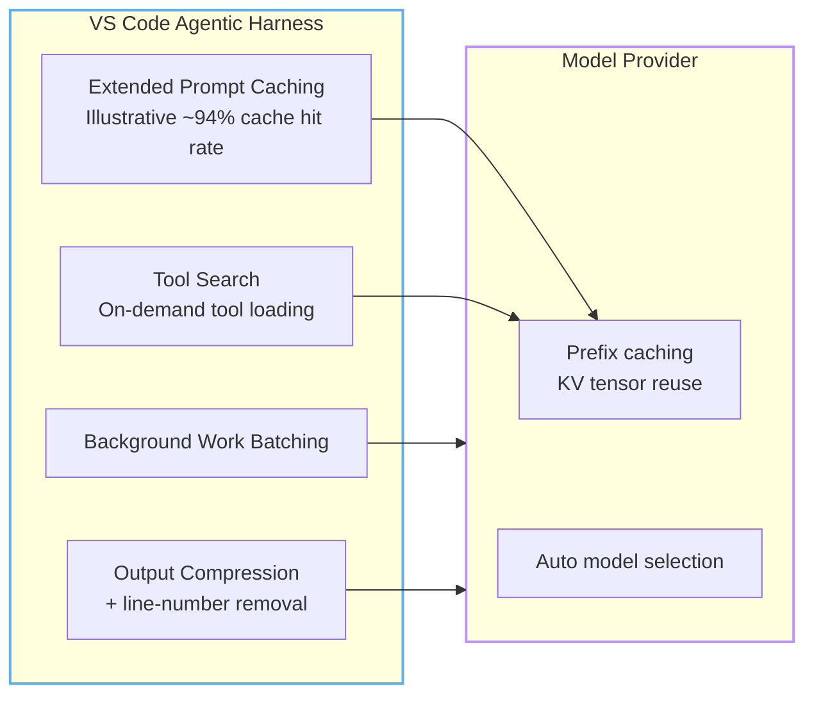
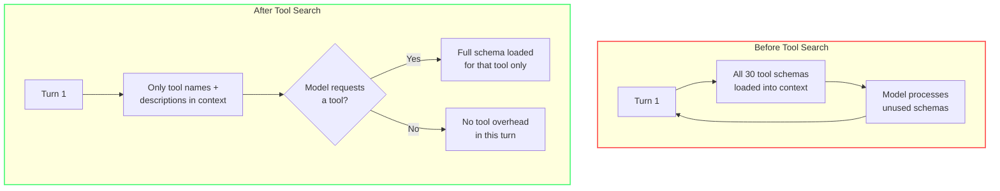
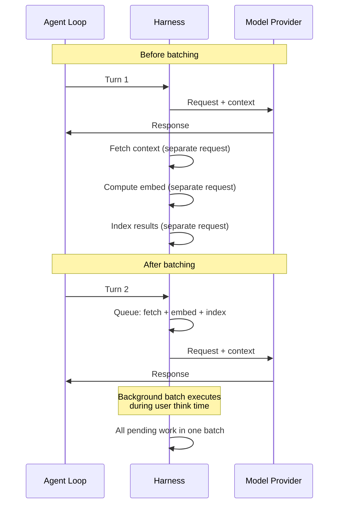
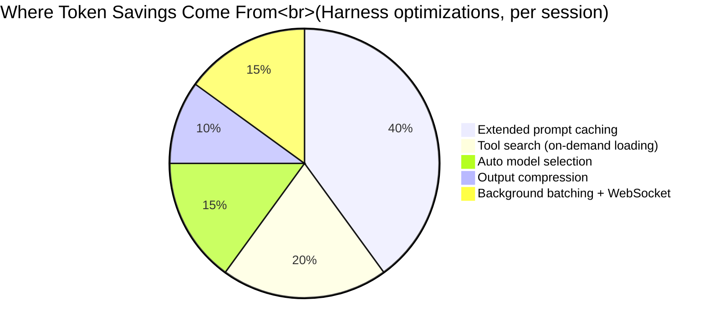

import { Steps } from "@astrojs/starlight/components";

# Under the Hood

Every module so far has been about **what you can do** — write shorter prompts, prune MCP servers, configure instruction files. This module is about **what Copilot does for you automatically**.

While you're optimizing your side, the VS Code and GitHub engineering teams ship infrastructure-level improvements that cut token consumption and latency without any user action. These optimizations are invisible — but they save more tokens daily than all the prompt tricks combined.

---

## The Invisible Optimizations

Every Copilot request passes through the **harness** (the agentic framework in VS Code) before reaching the model provider. The harness's job is to assemble context, manage tools, and route requests. Since mid-2025, the harness has been the focus of a sustained token-efficiency push.

The result is a steady stream of small wins that compound:

The optimizations split into two categories:
- **Harness-level** (VS Code team): how context is prepared, batched, and delivered
- **Provider-level** (OpenAI/Anthropic): how model state is cached and computed

Together, they form a stack that makes every agentic turn cheaper than it was three months ago — with no change to the code you write.

---

## 1. Extended Prompt Caching

The single most impactful optimization. Every agentic request has a **prompt prefix** — the repeated beginning shared across turns: system instructions, tool definitions, repository context, and conversation history.

**Before caching**: every request recomputed the full prefix from scratch. Processing the same instructions on turn 2 cost the same as turn 1.

**After caching**: the model provider stores the key/value tensors computed while processing the prefix. On the next turn, it reuses that cached state instead of recomputing.

### The Impact

| Metric | Before | After |
|--------|--------|-------|
| Cache hit rate (Anthropic, VS Code) | N/A | Illustrative ~94% |
| Cache hit rate (OpenAI) | Partial | Extended prefix matches |
| Cost of cached tokens vs uncached | Same | Up to 90% cheaper |
| Agentic session tokens | Baseline | Illustrative ~28% reduction |

In this illustrative ~94% hit-rate scenario, nearly every request after the first benefits from cached prefix state. This is the biggest single driver of token savings in the entire Copilot stack — bigger than any prompt-writing technique you can apply.

:::note[How caching works]
The cached artifact is not a human-readable copy of the prompt. It's the **internal model state** — key/value tensors computed while processing that prefix. Different providers expose it differently: Anthropic calls it "prompt caching," OpenAI uses "prompt prefix matching" under the hood. Both achieve similar results through different mechanisms.
:::

### Why It Matters for Your Workflow

Caching rewards **continuity**. A single long session with the same agent is dramatically more efficient than starting ten short sessions for the same task:

| Session Pattern | Cache Benefit | Relative Cost |
|-----------------|--------------|---------------|
| One long session, 10 turns | Illustrative ~94% hit rate after turn 1 | **Lowest** |
| Ten single-turn sessions | 0% hit rate — each starts cold | ~3x more tokens |
| Frequent `/clear` resets | Cache invalidated | Wasted savings |

This doesn't mean you should avoid `/clear` after a task is done — just be aware that each fresh start pays the full prefix cost once.

### Cache Mechanics Across Providers

Different model providers implement caching differently — and the differences affect your costs.

| Provider | Cache Type | Explicit Control? | Write Cost | Hit Cost | Default TTL |
|----------|-----------|-------------------|------------|----------|-------------|
| OpenAI (GPT-5.x) | Auto + Manual | Yes — `prompt_cache_breakpoint` | 1.25x | 0.1x (90% off) | Configurable |
| Anthropic (Claude) | Manual | Yes — `cache_control` | 1.25x–2.0x | 0.1x (90% off) | 5 min |
| DeepSeek (V4 Pro) | Disk-based | No (implicit) | None | 0.5x (50% off) | N/A |
| Google (Gemini 3.5) | Context-based | No (implicit) | None | Varied | Session |

OpenAI GPT-5.x supports extended caching with `prompt_cache_retention: "24h"`. VS Code Copilot measured a **+919% hit-rate improvement after 40–60 minute gaps** and **+338% after 30–40 minute gaps**. This is a game-changer for async workflows where turns are minutes apart. For Anthropic's 5-minute TTL limitation, see the cache-busting section below. *(Source: VS Code engineering blog, June 2026.)*

### Extended TTL Changes the Economics of Async Work

OpenAI's 24-hour retention window changes the economics of async work: instead of losing the cache during normal developer pauses, you can keep the expensive prefix alive across longer gaps.

### What Breaks the Cache

Cache invalidation — called **cache busting** — happens instantly when the prompt prefix changes. A single character edit early in the prompt invalidates the entire cached history, and both the computation and billing start from zero.

Common causes of cache busting:
- Switching models mid-session
- Modifying `copilot-instructions.md` or `AGENTS.md`
- Opening or closing editor tabs
- Conversation history growing past the cache boundary
- Tool definitions changing (new MCP server added)

:::tip[See Module 2 for the day-to-day failure modes]
For common cache-busting mistakes and how to avoid them, see [Module 2 — Common Cache-Busting Mistakes](/token-economy-course/en/02-context-model#common-cache-busting-mistakes).
:::

:::caution[The Anthropic TTL controversy]
In March 2026, Anthropic silently changed their default cache TTL from **1 hour to 5 minutes**. This caused massive, silent cost spikes for async systems — caches expired between requests, and every turn paid full price.

If you're on Anthropic-backed models (Claude in Copilot), keep sessions active and continuous. Long pauses between turns can cost you the cache. If your workflow is highly async, OpenAI's configurable retention window on GPT-5.x gives you more control.
:::

### What This Means for You

- **Don't modify system instructions mid-session.** If you must, accept the one-time cache miss and keep going — it's still cheaper than starting a new session.
- **Monitor for silent cache failures.** The model doesn't tell you when the cache misses. Use Copilot debug logging (`github.copilot.chat.agentDebugLog.fileLogging.enabled`) to check actual token counts.
- **Provider matters.** If your workflow is highly async (requests spaced minutes apart), OpenAI's configurable TTL gives you more control than Anthropic's fixed 5-minute window.

---

## 2. Tool Search — On-Demand Tool Loading

A modern Copilot session may have access to 20–50 tools: file operations, terminal commands, MCP servers, workspace search, linters, debuggers, and product-specific actions.

**Before tool search**: every full tool schema was loaded into context on every single turn. A SingleFile MCP server with a large schema could add 10–15 KB of JSON tool definitions per turn — and most of those tools were irrelevant to the current task.

**After tool search**: the model loads tool definitions **on demand**. The harness maintains a registry of available tools with short descriptions and embedding vectors. When the model decides it needs a tool, the harness retrieves that tool's full schema. Tools that aren't referenced stay out of context.

### The Impact

| Scenario | Tools sent per turn | Tool tokens saved |
|----------|-------------------|-------------------|
| Typical agent session, 10 MCP servers | 5–8 schemas (was 20–30) | ~60–75% |
| Large MCP setup, 30 tool definitions | ~10 schemas (was 30) | ~65% |
| Simple editing task, no tool needed | 0 schemas (was 20+) | ~100% |

Tool search is particularly valuable for MCP-heavy setups. If you have 15 MCP servers each with 2–3 tools, you might have 40+ tool schemas. With tool search, only the ones the model actually uses are loaded — the rest stay out of context.

:::note[Module 6 covers the practical cost model]
Module 6's MCP cost estimates represent the **pre-Tool Search baseline** — they're still useful as a worst-case scenario and for understanding *why* pruning matters. With Tool Search, actual costs are often 60–75% lower than those estimates.

See [Module 6 — Agents, Tools & MCP Hygiene](/token-economy-course/en/06-agents-mcp) for practical MCP management.
:::

---

## 3. Output Compression

Model output is where the cost multiplier hurts most (4–8x input cost per token). The harness applies several compression techniques to generated output.

### What Gets Compressed

- **Whitespace normalization**: redundant blank lines and indentation in code blocks are collapsed
- **Line-number removal**: diff views often include line-number decorations that serve no semantic purpose — the harness strips them before counting tokens
- **Explanation compression**: when the model generates verbose explanations alongside code, the harness can truncate or structure the output

### The Numbers

The VS Code team found that output compression alone reduces billable output tokens by **8–12%** on average, with higher savings on tasks involving large diffs. Combined with code-only instructions (Module 3), output tokens can drop by 70%+.

---

## 4. Background Work Batching

Agentic sessions generate a lot of background work: context fetching, embed computation, search indexing, and state maintenance. Each background operation was, until recently, an independent request.

**Before batching**: each background operation triggered its own round-trip. Context was fetched, then embeddings were computed, then tool schemas were resolved — each adding latency and token overhead for intermediate state.

**After batching**: background work is queued and executed in batches during idle periods. The harness collects pending operations and resolves them in a single pass.

The effect is most visible in longer sessions (5+ turns). Without batching, the first few turns carry overhead from setup work. With batching, that overhead is distributed across the session lifecycle.

---

## 5. WebSocket Improvements

Agentic sessions traditionally used short-lived HTTP connections — each turn established a new connection, sent the request, received the response, and closed.

In 2026, GitHub Copilot in VS Code moved to **persistent WebSocket connections** for agentic sessions. This doesn't directly reduce token count, but it reduces **idle latency by 19%** and eliminates the TLS handshake overhead on every turn.

For the token economy, faster turn-around means:
- **Fewer abandoned sessions** — users wait less, so they're less likely to start a new thread
- **Lower retry cost** — when a turn fails, retransmission over WebSocket is faster than re-establishing HTTPS
- **Better credential reuse** — persistent connections maintain auth state, avoiding redundant auth tokens

---

## 6. Auto Model Selection (Preview)

Not all requests need the same model. A quick "what does this function do?" can be answered by a lightweight model. A complex multi-file refactor needs the most capable model available.

**Auto model selection** lets Copilot pick the model that fits the work:

| Task Type | Model Selected | Relative Cost |
|-----------|---------------|---------------|
| Simple Q&A, code explanation | Fast/cheap model | ~1x |
| Single-file edit, small refactor | Mid-range model | ~2x |
| Multi-file edit, complex planning, tool orchestration | Most capable model | ~4–8x |
| Review, simple linting | Fast/cheap model | ~1x |

The routing is based on task embeddings: each request is classified by complexity before it reaches the model. The classification happens in the harness and adds negligible overhead.

:::note[When auto model selection matters]
In a typical development session, 60–70% of requests are simple enough for a cheaper model. Auto selection captures those savings without requiring the user to manually switch models.
:::

---

## 7. A/B Experiment Culture

Every optimization mentioned here was validated with the same process: **A/B experiments in production plus offline evaluations against task suites**.

The VS Code team's rule: an optimization ships only if task success rate holds or improves while token usage drops. This prevents the common failure mode of optimizing for token count at the expense of quality.

### Example: Tool Search Experiment (illustrative)

| Metric | Control (no tool search) | Treatment (tool search) |
|--------|------------------------|------------------------|
| Task success rate | 83% | 84% (+1%) |
| Median tokens per turn | 12,400 | 8,900 (-28%) |
| Median latency | 3.2s | 2.7s (-16%) |
| Tool call accuracy | 94% | 96% (+2%) |

Tool search not only saved tokens — it *improved* outcomes by reducing the noise of irrelevant tool schemas.

This culture matters for you because it means these optimizations are **safe**. When Copilot saves tokens behind the scenes, it's not cutting corners. The same task gets done with fewer resources.

---

---

## What These Optimizations Mean for Your Workflow

The biggest insight from the under-the-hood changes: **the harness wants what you want** — fewer tokens per task completed. The optimizations work best when your workflow aligns with them.

### Do

- **Stay in long sessions** for complex tasks — caching compounds across turns
- **Use the same agent** for related work — the cached prefix is agent-specific
- **Let the model pick** — auto model selection saves tokens on simple requests
- **Trust the harness** — output compression, tool search, and batching are automatic

### Don't

- **Don't restart sessions unnecessarily** — each new session pays the full prefix cost once
- **Don't keep sessions across unrelated tasks** — stale context pollutes answers and wastes tokens. The cache is per-session; a new task deserves a new session.
- **Don't fight tool search** — MCP servers are loaded on demand; having many registered doesn't cost tokens unless they're used
- **Don't worry about auto model selection** — it routes to cheaper models by default and upgrades only when needed

### One Caveat: The Local Metric Trap

It's tempting to measure your own token savings with a local counter and declare victory. But as the GitHub Blog notes, **local metrics can be misleading**. An optimization that reduces input tokens by 15% might increase output tokens by 25% because the model compensates with more verbose code.

The harness-level optimizations are measured *holistically* — total cost per completed task, not per-turn token count. This is the right metric. Your job is to write good code and clear prompts; the harness handles the rest.

---

## Putting It Together

Prompt caching is the dominant driver, responsible for roughly 40% of harness-level savings. Tool search and auto model selection add another 35%. The remaining 25% comes from compression, batching, and transport improvements.

---

:::tip[Continue Learning]
Internal optimizations make the most sense after understanding the [context model](/token-economy-course/en/02-context-model) and [cost structure](/token-economy-course/en/01-hidden-tax). For practical ways to complement these savings, see [Agents, Tools & MCP Hygiene](/token-economy-course/en/06-agents-mcp).
:::

---

:::note[On the horizon: Token efficiency at the model level]

Click to expand — research-stage technologies

Research is pushing token efficiency deeper into the stack:

- **Context Pruning** — algorithms that strip non-informative tokens from training data, forcing models to focus on what matters.
- **Sparse Mixture-of-Experts (MoE)** — models with 48B+ total parameters but only 2–3B active during inference, dramatically reducing per-token compute cost.
- **Multi-Token Prediction** — generating several tokens per forward pass instead of one, improving throughput without larger models.

These are research-stage technologies — not yet in Copilot. But they signal where the industry is heading: efficiency moving from your prompts all the way down to the silicon.

:::

---

## 8. Infrastructure Economics (For Self-Hosted Models)

While most Copilot users rely on GitHub's managed infrastructure, teams running their own models face additional cost trade-offs. This section covers the serverless vs dedicated GPU decision.

### Serverless vs Dedicated GPU

For enterprises running their own models, the hosting choice dramatically affects per-token cost. The break-even formula:

$$
\mathrm{Cost\ per\ Million} = \left( \frac{R}{T \times 3600 \times U} \right) \times 1\,000\,000
$$

Where R = hardware cost/hour, T = max throughput (tokens/sec), U = utilization rate.

| Utilization | Effective Tokens/Hour | Cost per Million |
|-------------|----------------------|------------------|
| 10% | 43,200 | $46.30 |
| 25% | 108,000 | $18.52 |
| 50% | 216,000 | $9.26 |
| 80% | 345,600 | $5.79 |

*Based on a standardized GPU at $2.00/hour and 120 tokens/sec mid-range throughput.*

:::caution[The utilization trap]
For a modern H200 GPU instance at $3.44/hour vs serverless at $0.65/M tokens: you need **72.2% sustained utilization** 24/7 just to break even. At a more realistic 40% utilization (common for bursty agentic workflows), the effective cost jumps to **$1.173/M — an 80% premium over serverless**.

Batch size compounds this: single-request inference (batch-1) can cost up to $20.32/M tokens due to low core parallelization. Continuous batching at 64–128 requests drops costs dramatically.
:::

**The takeaway for agentic workflows:** Serverless wins for bursty, asynchronous agent sessions. Dedicated hardware only pays off for continuous, high-throughput inference pipelines. Most development teams should stay on serverless and focus on prompt optimization instead.

---

## Key Takeaways

- Copilot's harness ships **continuous token-efficiency improvements** — no action needed on your part
- **Extended prompt caching** can achieve illustrative ~94% cache hit rates for Anthropic models, cutting session tokens by ~28%
- **OpenAI's extended cache TTL** changes the math for async workflows — longer pauses no longer have to mean cold starts
- **Tool search** loads tool schemas on demand — having many MCP servers registered doesn't cost tokens unless they're used
- **Auto model selection** routes simple requests to cheaper models automatically, saving 60–70% of requests
- **WebSocket connections** reduce idle latency by 19%, making sessions faster and less likely to be abandoned
- All optimizations are validated with **A/B experiments** — savings never come at the cost of task quality
- For self-hosted models, **serverless usually beats dedicated GPUs** unless utilization stays consistently high
- Align your workflow: **stay in long sessions** (caching compounds), **don't restart unnecessarily**, and **trust the harness**

*Estimated reading time: 12 minutes*
