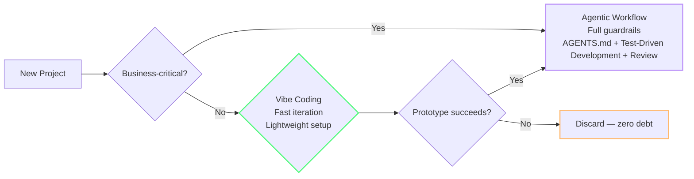
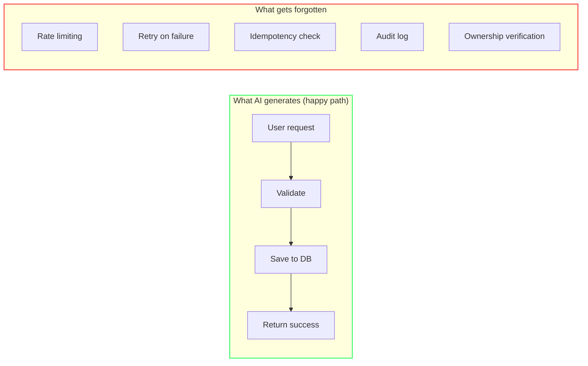
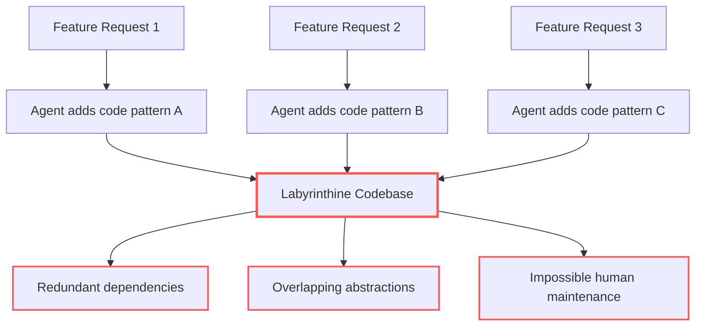
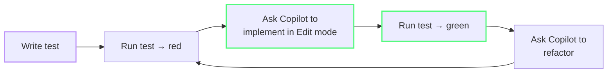
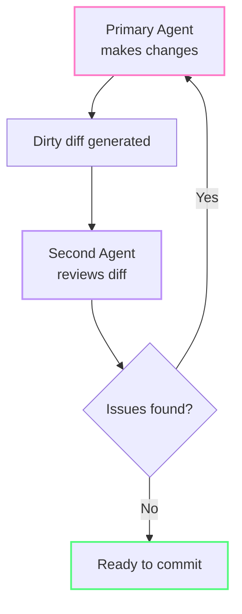

import { Steps, Tabs, TabItem } from "@astrojs/starlight/components";

# Vibe Coding Without the Debt

Vibe coding — letting AI write your code while you focus on intent — was named Collins Dictionary's 2025 Word of the Year [^m8-7], after Andrej Karpathy used the term in a February 2025 post [^m8-5]. But there's a catch: **Cursor adoption was associated with persistent increases in static-analysis warnings and code complexity** in a Carnegie Mellon study [^m8-1]. GitClear reported that duplicated blocks rose 81% from 2023 to 2026 [^m8-2], while its 2025 report found refactoring-related lines fell from 25% in 2021 to under 10% in 2024 [^m8-3]. Bad code creates rework, which creates more prompts, agent loops, and tokens.

The fastest way to burn credits isn't a bad prompt — it's fixing bugs that shouldn't exist. The solution isn't to stop vibe coding; it's to build guardrails that prevent small quality shortcuts from becoming recurring token costs.

*(See [Glossary](/vibe-on-budget/en/glossary) for vibe coding, agentic workflow, technical debt, and guardrail definitions.)*

---

:::
## 🟢 Vibe Coding or Agentic Workflow? A Decision Framework

Not all projects need the same level of rigor. The key question is where your project falls on the **verification vs discovery** axis:

| If your answer is YES... | Then use... |
|---|---|
| Will the business rely on this software's output for decisions? | **Agentic Workflow** |
| Does it handle financial transactions, customer data, or authentication? | **Agentic Workflow** |
| Is the application explicitly disposable or single-use? | **Vibe Coding** |
| Is the primary goal to test an idea or hypothesis? | **Vibe Coding** |



**Vibe coding is discovery.** It's optimal when the cost of failure is low and the software's lifecycle is meant to be short. **Agentic workflows are verification.** They embed the same AI tools in strict engineering disciplines: formal specs, acceptance criteria, security reviews, and continuous test cycles (test-first loops).

The danger isn't vibe coding — it's vibe coding something that ends up in production. The framework above helps you decide *before* writing code, not after.

:::tip[If you answered YES to either business-critical question]
Go to [Module 6 — Project Setup](/vibe-on-budget/en/06-project-setup) and configure AGENTS.md (behavioral contract) + `.prompt.md` files (architecture specs) before writing code. The upfront cost of guardrails is a fraction of the cost of fixing production incidents.
:::

---

## 🟡 The Four Failure Modes of AI-Generated Code

Understanding where debt accumulates helps you catch it early:

### 1. Duplicated Logic

An AI solving one prompt generates code for that prompt. It doesn't search the codebase for existing utilities. The result: five files each have their own `formatDate()` with slight variations.

**Token Cost:** Every duplicate function means the agent reads, generates, and tests redundant code across multiple files.

**Tell the agent about existing utilities:**

```
Use the existing utils/formatDate() function instead of writing a new one.
Check src/utils/ for existing helpers before creating new ones.
```

### 2. Accidental Architecture

AI excels at continuing patterns but struggles when no pattern exists yet. A vibe-coded app often has five partial patterns instead of one consistent one — different error handling in every route, ad-hoc logging, and auth checks in random places.

**Token Cost:** Inconsistent patterns force the agent to re-discover the codebase structure on every session.

### 3. Bloated Functions

A single AI response that handles "add user flow" may produce a 300-line function doing form validation, database writes, email notifications, and business logic — all in one place. The AI has no concept of [SRP (Single Responsibility Principle)](https://en.wikipedia.org/wiki/Single-responsibility_principle).

**Token Cost:** 300-line functions mean the agent reads the entire file as context for every related request.

### 4. Missing Edge Cases

AI generates the happy path well. It forgets rate limits, retries, [idempotency](https://en.wikipedia.org/wiki/Idempotence), background jobs, and what happens when the database is unreachable.

**Token Cost:** Happy-path code that breaks in production triggers expensive debugging sessions.



---

### Why Unsupervised Agents Burn Credits

## 🟡 The Winchester Mystery House Problem

There's a specific architectural anti-pattern that emerges when agents iterate without supervision. It's named after the famous mansion built without a coherent blueprint — and it's one of the most expensive forms of AI-generated technical debt.



When agents are allowed to iterate blindly, patching the codebase feature by feature without architectural oversight, the result is labyrinthine code: redundant dependencies, overlapping abstractions, and five competing patterns where one would suffice.

Every redundant abstraction the agent invents is code that must be read, debugged, and eventually refactored — each step consuming tokens.

### 🟡 The 4-Step Prevention Methodology

**1. One-Sentence Outcome**
Before any code, write a single sentence that defines the desired input and output. Freeze it. This prevents requirements from swelling mid-stream — a primary cause of Winchester architecture.

```
GOOD: "POST /api/upload returns { url: string, size: number } for valid images under 5MB."
BAD:  "Add file upload." (agent invents authentication, thumbnails, CDN integration...)
```

**2. Minimal Sandbox**
The smaller the project directory the agent operates in, the less room it has to "invent architecture" for trivial problems. Keep the agent scoped to the relevant directory.

**3. Reality Check Every 3 Iterations**
After every third agent turn, measure objectively with real data:

| Check | Tool |
|-------|------|
| Response time | Browser dev tools or `time` command |
| Memory usage | OS task manager or `ps` |
| Bundle size | Build tool output |
| Test coverage | Coverage reporter |

If metrics are trending wrong after 3 iterations, stop the agent and re-evaluate the approach.

**4. Hard Boundary at System-Critical Territory**
These areas are **never** vibe-coded. When the task crosses into any of these, escalate to managed infrastructure or hand-written, reviewed code:

- Authentication and session management
- File uploads (especially user-controlled)
- Push notifications
- Asynchronous background jobs
- Real-time state synchronization
- Payment processing

Treat these as security-sensitive boundaries requiring human review and established controls, consistent with OWASP guidance for AI-assisted coding [^m8-6].

:::caution[These aren't suggestions]
A 2026 [WIRED](https://www.wired.com/story/thousands-of-vibe-coded-apps-expose-corporate-and-personal-data-on-the-open-web/) investigation reported that RedAccess researchers found more than 5,000 vibe-coded applications with virtually no security or authentication; around 40% exposed sensitive data [^m8-4]. Security-compromised code in critical territory becomes a security incident, not a technical debt item.
:::

Agentic coding works best for **integrating glue code, analysis tools, and bounded scripts** — not for inventing database layers or auth systems from scratch. When in doubt, use what's already proven.

---

## 🟢 Guardrail 1: Write a Spec First

Before telling an agent to "build the feature," write a lightweight spec:

```
Feature: User profile page

Data model:
- User has name, email, avatar URL, role
- role is server-owned — never accept from client

API behavior:
- GET /api/users/:id — returns user profile
- 404 if user doesn't exist
- 403 if requesting user is not the profile owner or admin

Edge cases:
- Email change requires verification
- Avatar URL must be sanitized
- Rate limit: 10 requests/min per user

Exclusions:
- Do not modify the auth middleware
- Do not add new dependencies
```

A spec doesn't need to be long — 10–15 lines is enough to prevent the most expensive mistakes. The key sections: data model, API behavior, edge cases, and what *not* to change.

:::tip[Store specs as `.prompt.md` files]
Store specs for recurring features in `.prompt.md` files (e.g., `docs/user-profile-spec.prompt.md`). Reference them with `#file:` when starting work on that feature — the agent reads the file and follows the patterns you've defined.
:::

---

## 🟢 Guardrail 2: [TDD (Test-Driven Development)](https://en.wikipedia.org/wiki/Test-driven_development) with Copilot

Test-Driven Development pairs naturally with AI coding. The test defines the expected behavior — the AI just implements it. This catches the most common failure mode: **code that looks plausible but doesn't handle edge cases**.

Use your provider's token accounting to compare the cost of writing tests first with the cost of later debugging and fixes. The useful comparison is project-specific; the guardrail is to make the expected behavior executable before implementation.

**Practical workflow:**



---

## 🟢 Guardrail 3: Review Automation

Manual code review is the bottleneck. Automate it with a second AI pass.

### Same-Model Review

The simplest approach: after the agent makes changes, ask it to review its own work.

```
Review the dirty changes. Check for:
- Missing error handling
- Hardcoded values that should be config
- Functions longer than 50 lines
- Duplicate logic that exists elsewhere
- Security: any user-controlled input used without validation
```

### Cross-Model Review (Advanced)

Different models have different blind spots. The most effective pattern is having a second model review the first model's work:



Use as many review/fix cycles as the evidence requires. Different models can expose different blind spots, so keep the loop open until the findings are resolved and the tests pass.

---

## 🟢 Guardrail 4: Project Memory with `.prompt.md` Files

`AGENTS.md` defines *how* the agent should behave — mode, scope, output format. Keep it lean (see [Module 6](/vibe-on-budget/en/06-project-setup)). But *what* the agent should know about your project — architecture, conventions, historical mistakes — belongs in separate `.prompt.md` files loaded on demand.

### Architecture Prompt File

Create `docs/architecture.prompt.md`:

```markdown
# Architecture
- API routes: /api/{resource} with Express Router
- Auth middleware in src/middleware/auth.ts
- All DB queries go through src/db/queries/

# Conventions
- No barrel files (index.ts re-exports) — import directly
- Error responses: { error: string, code: number }
- Async handlers must have .catch(next) wrapper
```

Load it when needed:
```
Apply rules from #file:docs/architecture.prompt.md. Add pagination to GET /api/users.
```

### Known Issues Prompt File

Create `docs/known-issues.prompt.md`:

```markdown
# Known Issues (prevents repeats)
- [2026-08-15] Agent created inline SQL instead of using query builder
    → Always use src/db/queries/ functions for DB access
- [2026-08-22] Agent omitted ownership check on DELETE /api/users/:id
    → Every user-facing endpoint needs req.user.id === target.ownerId check
```

Load before relevant tasks:
```
Before implementing, review #file:docs/known-issues.prompt.md. Do not repeat these mistakes.
```

:::tip[Why this split matters]
`AGENTS.md` is sent on **every** agent interaction. `.prompt.md` files are sent only when you explicitly reference them. Keeping project memory separate from behavioral rules saves hundreds of tokens per agent step.
:::


---

## 🟢 Guardrail 5: Security as a Hard Gate

Security vulnerabilities are the most expensive form of AI debt. Make security checks non-optional:

### What to always check

Before committing AI-generated code, verify:

- [ ] **Authentication** — all authenticated endpoints require valid session
- [ ] **Authorization** — ownership checks on all user-specific resources
- [ ] **Server-owned fields** — role, plan, ownerId never accepted from client
- [ ] **Input validation** — all user input is sanitized (not just in the frontend)
- [ ] **Secrets** — no API keys, passwords, or tokens in client-side code
- [ ] **Rate limiting** — public endpoints have rate limits
- [ ] **SQL injection** — all queries use parameterized statements or ORM

### Prompt for security audit

```
Security audit this function. Check for OWASP Top 10.
List only critical and high severity issues. Code only.
```


---

## The 90-Day Audit

About three months after starting to vibe code, do a focused audit:

1. **Can two users access each other's data?** — Check authorization on every endpoint
2. **Does database model match business rules?** — Look for missing constraints, wrong types
3. **Is there one pattern for routes, errors, jobs?** — Or five competing patterns?
4. **Are permissions enforced on the backend?** — Never trust the frontend for security
5. **Can the app deploy from a clean checkout?** — If not, you have dependency rot
6. **Where are secrets stored?** — They should never be in frontend code or public env vars

---

:::tip[Continue Learning]
Guardrails work best with [Project Setup](/vibe-on-budget/en/06-project-setup) and [Agents, Tools & MCP Hygiene](/vibe-on-budget/en/07-agents-mcp).
:::

---

## Practice

1. Write a 10-line spec for your next feature. Include: data model, API behavior, edge cases, and exclusions. Use it as the prompt for your Copilot request.
2. For your next code change, write the test first. Then ask Copilot (in Edit mode) to implement it. Did the test catch anything the AI missed?
3. Run a security audit prompt on your most recent AI-generated function: "Security audit this function. OWASP Top 10. Critical only."

## Key Takeaways

- A Carnegie Mellon study associated Cursor adoption with persistent increases in static-analysis warnings and code complexity [^m8-1] — guardrails are essential
- Code quality is token economics: preventing rework costs fewer tokens than debugging and refactoring it later
- Write a **lightweight spec** before asking the agent to build a feature
- Use **TDD** — tests define behavior, AI implements it
- Automate review: **same-model or cross-model** review catches what the first pass misses
- Use **`.prompt.md` files for project memory** — document architecture, specs, and known issues; load on demand with `#file:`
- **Security checks must be non-optional** — verify auth, authorization, input validation every time
- Do a **90-day audit** to catch systemic issues before they compound

*Estimated reading time: 10 minutes*

[^m8-1]: [Speed at the Cost of Quality](https://arxiv.org/abs/2511.04427) — Carnegie Mellon University, 2025.
[^m8-2]: [The Maintainability Gap: 2026 AI Code Quality Research](https://www.gitclear.com/the_ai_code_quality_maintainability_gap) — GitClear, 2026.
[^m8-3]: [AI Copilot Code Quality: 2025 Data](https://www.gitclear.com/ai_assistant_code_quality_2025_research) — GitClear, 2025.
[^m8-4]: [Thousands of Vibe-Coded Apps Expose Corporate and Personal Data](https://www.wired.com/story/thousands-of-vibe-coded-apps-expose-corporate-and-personal-data-on-the-open-web/) — WIRED, 2026.
[^m8-5]: [Andrej Karpathy's February 2025 post](https://x.com/karpathy/status/1886192184808149383).
[^m8-6]: [Secure Coding with AI Cheat Sheet](https://cheatsheetseries.owasp.org/cheatsheets/Secure_Coding_with_AI_Cheat_Sheet.html) — OWASP.
[^m8-7]: [Collins Word of the Year 2025](https://www.collinsdictionary.com/us/woty) — Collins Dictionary.
