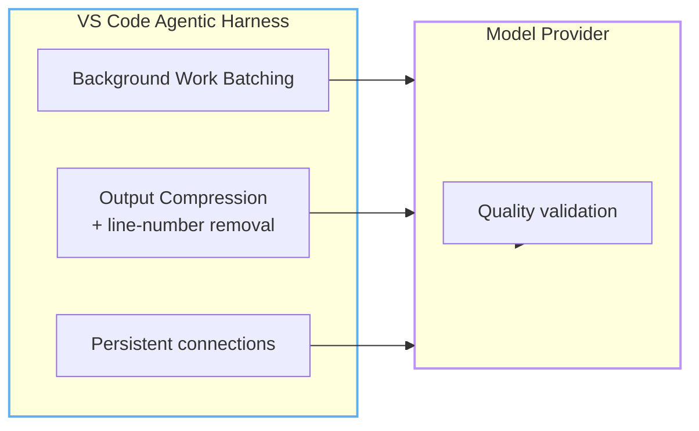
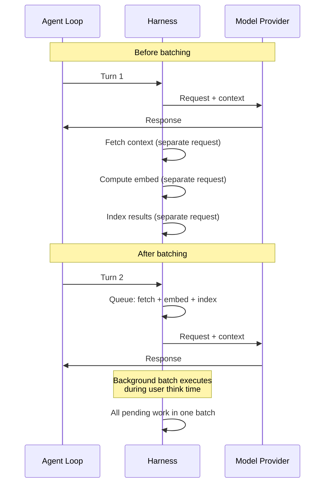
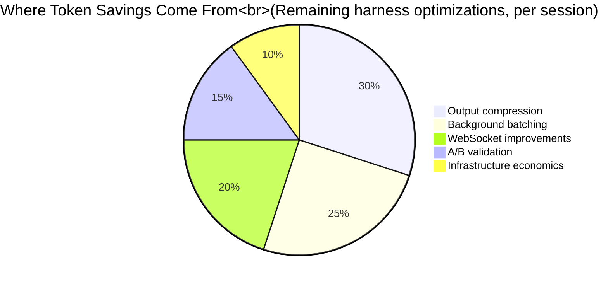

import { Steps } from "@astrojs/starlight/components";

# The Big Picture: How Copilot Saves Tokens For You

Every module so far has been about **what you can do** — write shorter prompts, prune MCP servers, configure instruction files. This module is about **what Copilot does for you automatically**.

In Modules 2 and 7, you learned about prompt caching, Tool Search, and auto model selection — Copilot's three biggest internal optimizations. This module covers the remaining pieces of the stack: output compression, connection improvements, batching, and the engineering culture that makes all of it safe to rely on.

While you're optimizing your side, the VS Code and GitHub engineering teams ship infrastructure-level improvements that cut token consumption and latency without any user action. These optimizations are invisible — but they save more tokens daily than all the prompt tricks combined.

---

:::note[Case Study: Team Alpha]
Team Alpha aligned their workflow with Copilot's internal optimizations: long sessions for complex tasks, fresh sessions at task boundaries, Auto model selection. With caching compounding across turns: 6,300 → 5,900 credits. Final result: 14,200 → 5,900 — a 58% reduction. They're now 3,600 credits UNDER their 9,500 pool allocation.
:::

## The Invisible Optimizations

Every Copilot request passes through the **harness** (the agentic framework in VS Code) before reaching the model provider. The harness's job is to assemble context, manage tools, and route requests. Since mid-2025, the harness has been the focus of a sustained token-efficiency push.

The result is a steady stream of small wins that compound:

The optimizations split into two categories:
- **Harness-level** (VS Code team): how context is prepared, batched, and delivered
- **Provider-level** (OpenAI/Anthropic): how model state is computed

Together, they form a stack that makes every agentic turn cheaper, faster, and safer than it was before — with no change to the code you write.

---

## 1. Output Compression

Model output is where the cost multiplier hurts most (4–8x input cost per token). The harness applies several compression techniques to generated output.

### What Gets Compressed

- **Whitespace normalization**: redundant blank lines and indentation in code blocks are collapsed
- **Line-number removal**: diff views often include line-number decorations that serve no semantic purpose — the harness strips them before counting tokens
- **Explanation compression**: when the model generates verbose explanations alongside code, the harness can truncate or structure the output

### The Numbers

The VS Code team found that output compression alone reduces billable output tokens by **8–12%** on average, with higher savings on tasks involving large diffs. Combined with code-only instructions (Module 4), output tokens can drop by 70%+.

---

## 2. Background Work Batching

Agentic sessions generate a lot of background work: context fetching, embed computation, search indexing, and state maintenance. Each background operation was, until recently, an independent request.

**Before batching**: each background operation triggered its own round-trip. Context was fetched, then embeddings were computed, then tool schemas were resolved — each adding latency and token overhead for intermediate state.

**After batching**: background work is queued and executed in batches during idle periods. The harness collects pending operations and resolves them in a single pass.

The effect is most visible in longer sessions (5+ turns). Without batching, the first few turns carry overhead from setup work. With batching, that overhead is distributed across the session lifecycle.

---

## 3. WebSocket Improvements

Agentic sessions traditionally used short-lived HTTP connections — each turn established a new connection, sent the request, received the response, and closed.

In 2026, GitHub Copilot in VS Code moved to **persistent WebSocket connections** for agentic sessions. This doesn't directly reduce token count, but it reduces **idle latency by 19%** and eliminates the TLS handshake overhead on every turn.

For the token economy, faster turn-around means:
- **Fewer abandoned sessions** — users wait less, so they're less likely to start a new thread
- **Lower retry cost** — when a turn fails, retransmission over WebSocket is faster than re-establishing HTTPS
- **Better credential reuse** — persistent connections maintain auth state, avoiding redundant auth tokens

---

## 4. A/B Experiment Culture

Every optimization mentioned here was validated with the same process: **A/B experiments in production plus offline evaluations against task suites**.

The VS Code team's rule: an optimization ships only if task success rate holds or improves while token usage drops. This prevents the common failure mode of optimizing for token count at the expense of quality.

### Example: Output Compression Experiment (illustrative)

| Metric | Control | Treatment (compression) |
|--------|---------|------------------------|
| Task success rate | 83% | 83% (unchanged) |
| Median output tokens | 4,800 | 4,200 (-12%) |
| Median latency | 3.2s | 3.0s (-6%) |
| Output fidelity | 98% | 98% (unchanged) |

Output compression saved tokens without changing task outcomes or output fidelity.

This culture matters for you because it means these optimizations are **safe**. When Copilot saves tokens behind the scenes, it's not cutting corners. The same task gets done with fewer resources.

---

---

## What These Optimizations Mean for Your Workflow

The biggest insight from these changes: **the harness wants what you want** — fewer tokens per task completed. The optimizations work best when your workflow aligns with them.

### Do

- **Give the agent uninterrupted time** for complex tasks — background work can batch during idle periods
- **Use clear, focused prompts** — compression works best when the intended output is unambiguous
- **Trust the harness** — output compression, batching, and connection improvements are automatic

### Don't

- **Don't keep sessions across unrelated tasks** — stale context pollutes answers and wastes tokens. A new task deserves a new session.
- **Don't optimize one metric in isolation** — lower token counts are not useful if task quality drops

### One Caveat: The Local Metric Trap

It's tempting to measure your own token savings with a local counter and declare victory. But as the GitHub Blog notes, **local metrics can be misleading**. An optimization that reduces input tokens by 15% might increase output tokens by 25% because the model compensates with more verbose code.

The harness-level optimizations are measured *holistically* — total cost per completed task, not per-turn token count. This is the right metric. Your job is to write good code and clear prompts; the harness handles the rest.

---

## 5. Infrastructure Economics (For Self-Hosted Models)

While most Copilot users rely on GitHub's managed infrastructure, teams running their own models face additional cost trade-offs. This section covers the serverless vs dedicated GPU decision.

### Serverless vs Dedicated GPU

For enterprises running their own models, the hosting choice dramatically affects per-token cost. The break-even formula:

$$
\mathrm{Cost\ per\ Million} = \left( \frac{R}{T \times 3600 \times U} \right) \times 1\,000\,000
$$

Where R = hardware cost/hour, T = max throughput (tokens/sec), U = utilization rate.

| Utilization | Effective Tokens/Hour | Cost per Million |
|-------------|----------------------|------------------|
| 10% | 43,200 | $46.30 |
| 25% | 108,000 | $18.52 |
| 50% | 216,000 | $9.26 |
| 80% | 345,600 | $5.79 |

*Based on a standardized GPU at $2.00/hour and 120 tokens/sec mid-range throughput.*

:::caution[The utilization trap]
For a modern H200 GPU instance at $3.44/hour vs serverless at $0.65/M tokens: you need **72.2% sustained utilization** 24/7 just to break even. At a more realistic 40% utilization (common for bursty agentic workflows), the effective cost jumps to **$1.173/M — an 80% premium over serverless**.

Batch size compounds this: single-request inference (batch-1) can cost up to $20.32/M tokens due to low core parallelization. Continuous batching at 64–128 requests drops costs dramatically.
:::

**The takeaway for agentic workflows:** Serverless wins for bursty, asynchronous agent sessions. Dedicated hardware only pays off for continuous, high-throughput inference pipelines. Most development teams should stay on serverless and focus on prompt optimization instead.

---

## Putting It Together: The Full Stack

The full optimization stack combines automatic harness improvements, provider capabilities, and the techniques you control directly. This module focused on the remaining harness pieces; the earlier modules cover the other layers. The stack works best when combined with the user-side techniques from Modules 4–8: focused prompts, lean project context, disciplined tool use, and guardrails that keep tasks on track.

---

## Team Alpha: The Full Journey

| Milestone | Credits/Month | What Changed |
|-----------|--------------|--------------|
| Starting point | 14,200 | First UBB month, no optimization |
| After Module 2 | 12,500 | Understood context model, closed tabs |
| After Module 3 | 11,800 | Enabled debug logging, found worst pattern |
| After Module 4 | 8,900 | Quick Wins #1, #4, #6 applied |
| After Module 5 | 8,200 | English prompts, bullet format |
| After Module 6 | 7,500 | Lean instructions, .copilotignore |
| After Module 7 | 6,800 | MCP pruning, Auto model selection |
| After Module 8 | 6,300 | Spec template, TDD, security audit |
| Final (Module 9) | 5,900 | Workflow aligned with caching/optimizations |

**Total savings: 8,300 credits/month ($83/month). Pool allocation: 9,500 credits. Now under budget.**

---

:::tip[Continue Learning]
Revisit the [context model](/vibe-on-budget/en/02-context-model) and [Agents, Tools & MCP Hygiene](/vibe-on-budget/en/07-agents-mcp) to apply the techniques that complement Copilot's automatic optimizations.
:::

---

:::note[On the horizon: Token efficiency at the model level]

Click to expand — research-stage technologies

Research is pushing token efficiency deeper into the stack:

- **Context Pruning** — algorithms that strip non-informative tokens from training data, forcing models to focus on what matters.
- **Sparse Mixture-of-Experts (MoE)** — models with 48B+ total parameters but only 2–3B active during inference, dramatically reducing per-token compute cost.
- **Multi-Token Prediction** — generating several tokens per forward pass instead of one, improving throughput without larger models.

These are research-stage technologies — not yet in Copilot. But they signal where the industry is heading: efficiency moving from your prompts all the way down to the silicon.

:::

---

## Practice

1. Open Cache Explorer in Agent Debug Logs for your last long session. What was your cache hit rate? How many input tokens were reused?
2. For your next complex task, stay in one long session instead of starting multiple short ones. Compare the session total credits vs. your Module 3 baseline.
3. Review this course's Key Takeaways from all 9 modules. Pick the 3 techniques that would save YOU the most tokens. Apply them this week.

## Key Takeaways

- Copilot's harness ships **continuous token-efficiency improvements** — no action needed on your part
- **Output compression** reduces billable output tokens while preserving the meaning and fidelity of responses
- **Background batching** combines setup work during idle time, reducing overhead in longer sessions
- **WebSocket connections** reduce idle latency by 19%, making sessions faster and less likely to be abandoned
- All optimizations are validated with **A/B experiments** — savings never come at the cost of task quality
- For self-hosted models, **serverless usually beats dedicated GPUs** unless utilization stays consistently high
- Combine Copilot's automatic stack with the user-side techniques from **Modules 4–8** for the best results

*Estimated reading time: 7 minutes*
