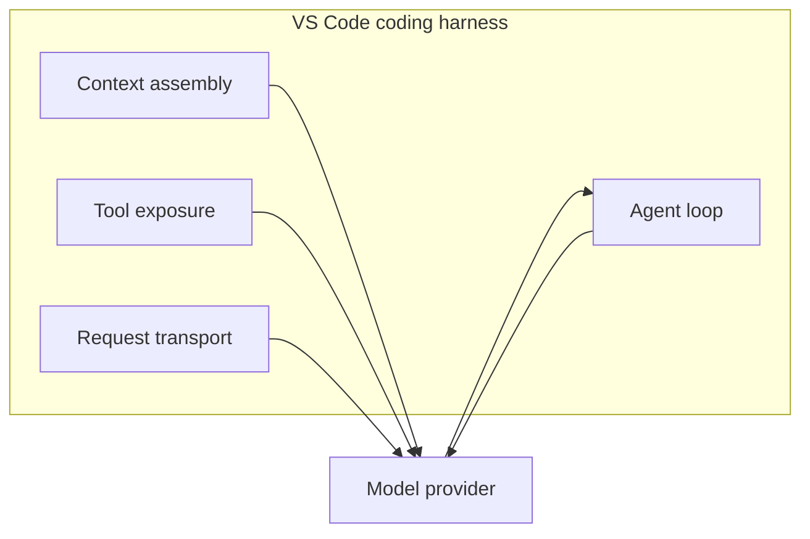
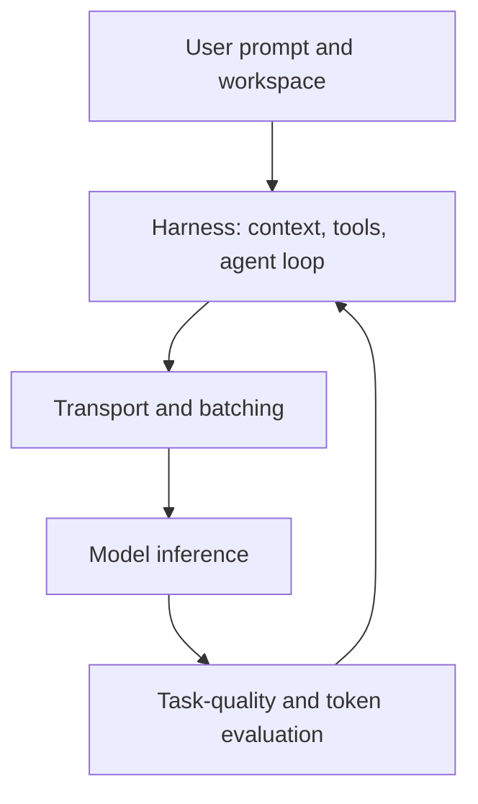

import { Steps } from "@astrojs/starlight/components";

# The Big Picture: How Copilot Saves Tokens For You

Earlier modules focused on user-controlled choices such as prompt structure, context selection, and tool configuration. This module focuses on the coding harness: the layer that assembles context, exposes tools, runs the agent loop, interprets tool calls, and turns model output into editor actions. [^m9-1]

The VS Code team describes token-efficiency work as an ongoing sequence of measured improvements rather than one single optimization. For changes to the harness, the team reports using production A/B experiments and offline task-suite evaluations, checking that task success holds or improves while token use falls. [^m9-2]

## 🟡 The Invisible Optimizations

The harness sits between the editor and the model. It assembles the prompt, manages the tools available to the model, runs the agent loop, and feeds tool results back into later turns. [^m9-1]

*(See [Glossary](/vibe-on-budget/en/glossary) for output compression, background batching, serverless, and continuous batching definitions.)*

The diagram shows responsibilities documented by VS Code; it does not claim that every request uses the same internal implementation. [^m9-1]

## 🟡 1. Output Compression

[VS Code](https://code.visualstudio.com/blogs) reports that its harness work includes output compression, including removing line numbers from generated code where those decorations do not carry useful meaning. The published measurement for output compression is a **5.5% reduction in output tokens**. [^m9-2]

The same article reports that **tool search reduces token use by 9–11%** by avoiding the inclusion of every tool definition in every request and loading definitions when they are needed. [^m9-2]

These figures describe measurements reported by the VS Code team for its Copilot harness; they are not a universal compression rate for every model or coding agent. [^m9-2]

## 🟡 2. Background Work and Batching

The harness article describes agentic coding as an iterative loop in which the harness manages context and tool results between model calls. That architecture makes background work, such as context and tool handling, part of the system surrounding a model request rather than part of the model alone. [^m9-1]

The token-efficiency article reports batching background work during idle time as one of the optimizations evaluated by the team. The source supports the batching behavior; it does not publish the before-and-after request counts that appeared in an earlier version of this lesson, so those counts are not reproduced here. [^m9-2]

## 🟡 3. [WebSocket](https://developer.mozilla.org/en-US/docs/Web/API/WebSocket) Improvements

VS Code reports that persistent WebSocket connections reduce median **TTFT (Time-To-First-Token)** by **19%**. This is a latency measurement, not a reduction in the number of tokens generated. The connections also use [TLS (Transport Layer Security)](https://en.wikipedia.org/wiki/Transport_Layer_Security) for transport security. [^m9-2]

Faster transport can change the elapsed time of an agentic turn, but the cited source does not establish that WebSockets reduce abandoned sessions, retry volume, or authentication-token consumption. Those causal claims are therefore not made here. [^m9-2]

## 🟡 4. Evidence-Based Optimization

The VS Code team says it evaluates harness changes with production A/B experiments and offline evaluations against task suites, requiring task success to hold or improve while token use decreases. [^m9-2]

That process supports comparing treatment and control groups, but the cited article does not publish the task-success, latency, or fidelity values from the example table previously included in this lesson. The table has been removed rather than presenting unsourced numbers as measurements. [^m9-2]

The GitHub cost-efficiency article likewise frames efficiency as a whole-task problem: reducing one part of a request is not sufficient if the change causes more work elsewhere in the task. [^m9-3]

## What These Optimizations Mean for Your Workflow

- Give complex tasks enough uninterrupted time for the harness to manage the agent loop and its surrounding work; the harness is responsible for context assembly, tool exposure, and tool-result feedback. [^m9-1]
- Keep prompts focused and context relevant. GitHub's guidance recommends choosing an appropriate model, structuring prompts, and adding guardrails to complete tasks more efficiently and use fewer AI credits. [^m9-4]
- Judge an optimization by completed-task quality and resource use together, because the VS Code evaluation process explicitly checks task success alongside token use. [^m9-2]

### One Caveat: The Local Metric Trap

Token count alone is not a complete measure of coding-task efficiency. GitHub's cost-efficiency discussion emphasizes evaluating the complete task rather than optimizing a single local quantity, because work saved in one stage can be offset by extra work in another. [^m9-3]

## 🔴 5. Infrastructure Economics (For Self-Hosted Models)

Teams serving their own models must compare per-token pricing with the cost of keeping dedicated hardware available. Serverless inference charges for consumed usage, while dedicated infrastructure charges for provisioned compute; the trade-off depends on throughput and utilization. [^m9-5]

### Serverless vs. Dedicated GPU

For a dedicated GPU, the effective cost per million tokens can be calculated from the hourly GPU rate, throughput, and sustained utilization:

$$
\mathrm{Cost\ per\ Million} = \frac{R}{T \times 3600 \times U} \times 1{,}000{,}000
$$

Here, $R$ is the hourly GPU rate, $T$ is throughput in tokens per second, and $U$ is the utilization fraction. This is the cost model published for the measured H200 comparison. [^m9-6]

The DigitalOcean benchmark reports an NVIDIA [H200 GPU](https://www.nvidia.com/en-us/data-center/h200/) at **$3.44 per GPU-hour**, serving Llama 3.3 70B with FP8 quantization and vLLM. Its measured cost ranged from **$20.32 per million output tokens at batch 1** to **$0.45 per million output tokens at batch 128**, demonstrating why traffic shape and batching matter. [^m9-6]

The same benchmark summary reports **$0.65 per million tokens** for the compared serverless service and a **72.2% sustained-utilization break-even threshold** for the dedicated H200 scenario. At 40% utilization, it reports **$1.173 per million tokens** for the dedicated configuration. [^m9-7]

| Measured configuration | Reported result |
|---|---:|
| H200, batch 1 | $20.32 / 1M output tokens |
| H200, batch 128 | $0.45 / 1M output tokens |
| Dedicated/serverless crossover | 72.2% sustained utilization |

These are results for the named hardware, model, framework, workload, and date in the DigitalOcean benchmark; they are not universal prices for all GPUs or providers. [^m9-6]

**Takeaway:** bursty traffic can favor usage-priced inference, while continuously utilized dedicated hardware can improve unit economics. The correct choice requires the workload's measured throughput and utilization, not a hardware price alone. [^m9-5] [^m9-6]

## 🟡 Putting It Together: The Full Stack

The sourced stack is layered: the harness assembles context and tools, transport affects latency, model-serving infrastructure determines compute cost, and evaluation checks whether quality is preserved. [^m9-1] [^m9-2] [^m9-5]

The chart is a synthesis of the responsibilities and evaluation process described in the cited VS Code and GitHub articles; it is not a percentage breakdown of token savings. [^m9-1] [^m9-2] [^m9-3]

:::tip[Continue Learning]
Revisit the [context model](/vibe-on-budget/en/02-context-model) and [Agents, Tools & MCP Hygiene](/vibe-on-budget/en/07-agents-mcp) to apply techniques that complement the harness. [^m9-1] [^m9-4]
:::

:::note[On the horizon: Token efficiency at the model level]

Click to expand — research-stage technologies

Research-stage work is also targeting the model and inference layers:

- **Context pruning** selects a changing subset of prompt tokens for computation. LazyLLM describes dynamic token selection during prefilling and decoding and reports a 2.34× prefilling speedup for Llama 2 7B on a multi-document question-answering task while maintaining accuracy. [^m9-8]
- **Sparse Mixture-of-Experts (MoE)** routes tokens through selected experts. The SHAPE paper describes low per-token compute in sparse MoE models, the memory cost of keeping the expert pool resident, and competitive accuracy under 20% and 40% expert pruning in its evaluated backbones. [^m9-9]
- **Multi-Token Prediction** supplies multiple future-token predictions for speculative decoding. The cited research describes using multi-token prediction to generate several tokens per step while remaining compatible with autoregressive generation. [^m9-10]

These papers demonstrate research methods and measured results in their stated experimental settings; they do not establish that the techniques are deployed in GitHub Copilot. [^m9-8] [^m9-9] [^m9-10]

:::

## Practice

1. Open Cache Explorer in Agent Debug Logs for your last long session. What was your cache hit rate? How many input tokens were reused?
2. For your next complex task, stay in one long session instead of starting multiple short ones. Compare the session total credits with your Module 3 baseline.
3. Review this course's Key Takeaways from all 9 modules. Pick the 3 techniques that would save you the most tokens and apply them this week.

## Key Takeaways

- The Copilot harness assembles context, exposes tools, runs the agent loop, and feeds results back to the model. [^m9-1]
- VS Code reports 5.5% lower output-token use from output compression, 9–11% lower token use from tool search, and 19% lower median TTFT from persistent WebSocket connections in the cited measurements. [^m9-2]
- VS Code validates changes with production A/B experiments and offline task-suite evaluations. [^m9-2]
- Dedicated-GPU cost depends on throughput, batching, and utilization; the cited H200 benchmark reports a 72.2% break-even point against its compared serverless price. [^m9-6] [^m9-7]
- Context pruning, sparse MoE pruning, and multi-token prediction are supported here by research papers, not by a claim of Copilot deployment. [^m9-8] [^m9-9] [^m9-10]

*Estimated reading time: 7 minutes*

[^m9-1]: [The Coding Harness Behind GitHub Copilot in VS Code](https://code.visualstudio.com/blogs/2026/05/15/agent-harnesses-github-copilot-vscode) — Julia Kasper, Megan Rogge, and Aaron Munger, Visual Studio Code, May 15, 2026.
[^m9-2]: [Improving token efficiency for GitHub Copilot in VS Code](https://code.visualstudio.com/blogs/2026/06/17/improving-token-efficiency-in-github-copilot) — Ryan Caldwell and Bhavya U, Visual Studio Code, June 17, 2026.
[^m9-3]: [How we make AI coding more cost efficient without sacrificing task quality](https://github.blog/ai-and-ml/github-copilot/how-we-make-ai-coding-more-cost-efficient-without-sacrificing-task-quality/) — GitHub, 2026.
[^m9-4]: [Optimize your AI usage to maximize efficiency and reduce cost](https://docs.github.com/en/copilot/tutorials/optimize-ai-usage) — GitHub Docs, 2026.
[^m9-5]: [LLM Inference Cost Per Token: Serverless vs. Dedicated Comparison](https://lyceum.technology/magazine/inference-cost-per-token-provider-comparison/) — Maximilian Niroomand, Lyceum Technology, 2026.
[^m9-6]: [Token Economics Across Traffic Profiles on Dedicated GPUs](https://www.digitalocean.com/community/tutorials/llm-inference-cost) — DigitalOcean Community, July 8, 2026.
[^m9-7]: [The Inference Cost Model Nobody Has Published: Token Economics Across Traffic Profiles on Dedicated GPUs](https://daily.dev/posts/the-inference-cost-model-nobody-has-published-token-economics-across-traffic-profiles-on-dedicated--ddrg6yxfh) — DigitalOcean Community, July 8, 2026.
[^m9-8]: [LazyLLM: Dynamic Token Pruning for Efficient Long Context LLM Inference](https://arxiv.org/abs/2407.14057) — Minsik Cho, Thomas Merth, Sachin Mehta, Mohammad Rastegari, and Mahyar Najibi, arXiv, 2024.
[^m9-9]: [SHAPE: Coalition-Aware Expert Pruning for Sparse Mixture-of-Experts LLMs](https://arxiv.org/abs/2606.09886) — Alizen et al., arXiv, submitted June 3, 2026.
[^m9-10]: [Faster Language Models with Better Multi-Token Prediction](https://arxiv.org/abs/2410.17765) — arXiv, 2024.
