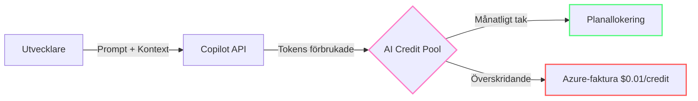
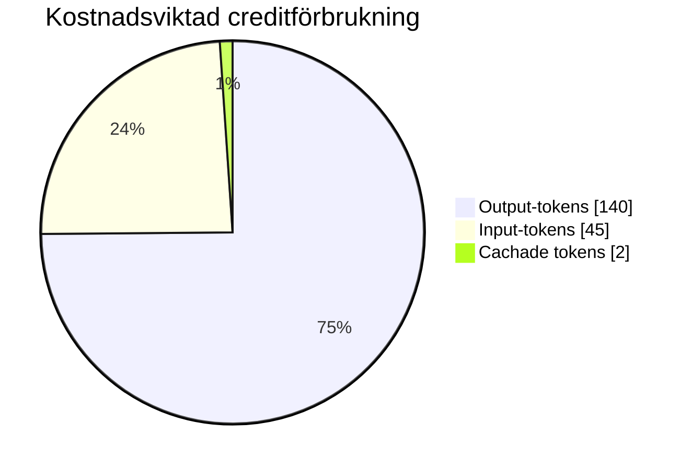
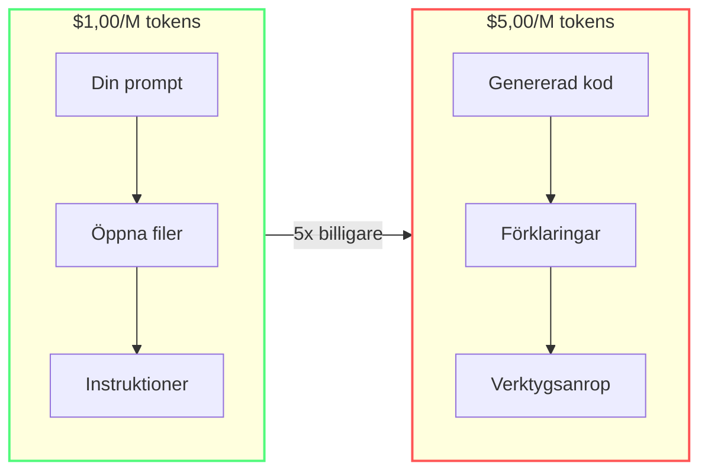
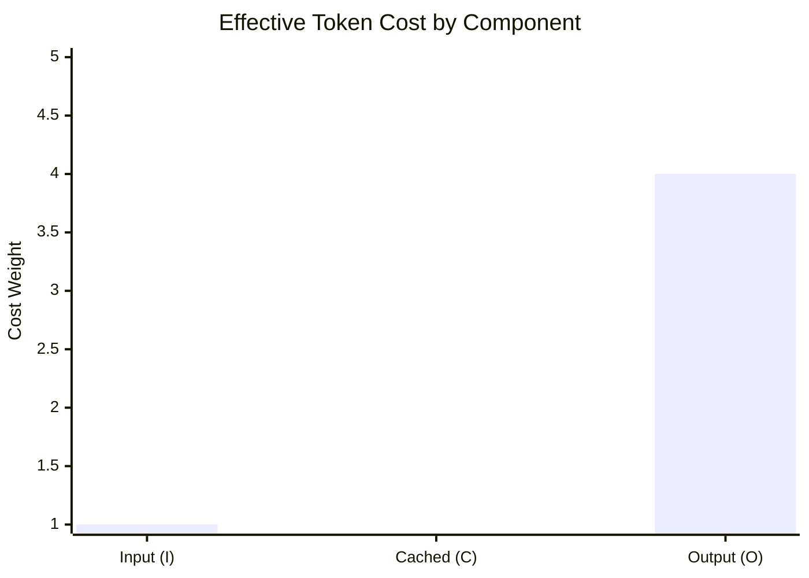

import { Steps, Tabs, TabItem } from "@astrojs/starlight/components";

# Den dolda skatten: Förstå kostnaden för AI Credits

Från och med **1 juni 2026** flyttade GitHub Copilot till en [**Usage-Based Billing (UBB)**](https://docs.github.com/en/copilot/concepts/billing/organizations-and-enterprises/usage-based-billing)-modell. Varje interaktion — chatt, agent, CLI, API-anrop — mäts i tokens (se [Ordlista](/vibe-on-budget/sv/glossary) för nyckeltermer) och dras från en gemensam pool av **[AI Credits](https://docs.github.com/en/copilot/reference/copilot-billing/models-and-pricing)**. [^m1-1]

[^m1-1]: [GitHub Copilot is moving to usage-based billing](https://github.blog/news-insights/company-news/github-copilot-is-moving-to-usage-based-billing/) — GitHub Blog. Se även [Usage-based billing for organizations and enterprises](https://docs.github.com/en/copilot/concepts/billing/organizations-and-enterprises/usage-based-billing) — GitHub Docs.

Denna modul förklarar vad det innebär för din plånbok.

---

## Vad är UBB och varför du borde bry dig 🟢

Under den gamla modellen betalade du en fast avgift per plats. Din tyngsta användare kostade lika mycket som någon som aldrig öppnade chatten. Med UBB **betalar du för vad du använder**.

Huvudinsikten: **all användning kostar inte lika mycket**. Uppdelningen mellan input-tokens (vad du skickar) och output-tokens (vad modellen genererar) påverkar dramatiskt din förbrukningstakt.

---

## Var dina tokens tar vägen 🟢

Varje Copilot-förfrågan har tre token-kategorier. Men alla tokens kostar inte lika mycket. För att förstå vart dina credits faktiskt tar vägen behöver du tillämpa kostnadsvikterna från GitHubs Effective Tokens-formel.[^m1-5]

:::note[Hur du läser diagrammet]
Diagrammet tillämpar GitHubs Effective Tokens kostnadsvikter på exempelvolymer (45 input, 35 output, 20 cachade): output ×4,0, input ×1,0, cachade ×0,1. Den faktiska fördelningen beror på modell, projekt och arbetsflöde — men output dominerar i nästan varje verklig session.
:::

- **Input-tokens** — din prompt, öppna filer, konversationshistorik, systeminstruktioner
- **Output-tokens** — modellens svar (kod, förklaringar, verktygsanrop)
- **Cachade tokens** — återanvänds från tidigare förfrågningar när prefix matchar

Kostnadsvikterna kommer från GitHubs **Effective Tokens (ET)**-formel, som normaliserar förbrukning över tokentyper:[^m1-5]

$$
ET = m \times (1.0 \times I + 0.1 \times C + 4.0 \times O)
$$

Där:
- **m** — modellmultiplikator (normaliserar prisskillnader när du byter modell under arbetsflödet; använd 1,0 för en enkelmodellsbaslinje)
- **I** — nya input-tokens (vikt 1,0×)
- **C** — cachade input-tokens (vikt 0,1× — upp till 90 % billigare)
- **O** — output-tokens (vikt 4,0× — den verkliga kostnadsdrivaren)

[^m1-5]: GitHub, [Improving token efficiency in GitHub Agentic Workflows](https://github.blog/news-insights/product-news/improving-token-efficiency-in-github-agentic-workflows/) — publicerad 7 maj 2026 och uppdaterad 13 maj 2026.

:::note[Varför output är den verkliga kostnadsdrivaren]
Output-tokens kostar ungefär **4–8× mer** än input-tokens per miljon, beroende på modell. I kombination med 4,0× ET-vikten bränner ett utförligt modellsvar credits långt snabbare än en lång prompt.
:::

---

## AI Credits per plan 🟢

Varje betald plan inkluderar en månatlig credittilldelning, och Free har en mindre begränsad tilldelning. När tilldelningen tar slut faktureras ytterligare användning till **$0,01 per credit**. [^m1-2]

| Plan | Månatliga Credits | Värde | Poolning |
|------|------------------|-------|---------|
| Copilot Free | Begränsat | $0 | Ingen chattpool |
| Copilot Pro | 1 500[^m1-3] | $15 | Endast individuell |
| Copilot Pro+ | 7 000[^m1-3] | $70 | Endast individuell |
| Copilot Business | 1 900/licens | $19 | **Företagspool** |
| Copilot Max | 20 000[^m1-3] | $200 | Endast individuell |
| Copilot Enterprise | 3 900/licens | $39 | **Företagspool** |

[^m1-2]: [Models and pricing for GitHub Copilot](https://docs.github.com/en/copilot/reference/copilot-billing/models-and-pricing) — GitHub Docs. Det anger att 1 AI credit = 0,01 USD och att ytterligare användning faktureras enligt publicerade tokenpriser.
[^m1-3]: Individuella plantilldelningar uppdaterade enligt [Usage-based billing for individuals](https://docs.github.com/en/copilot/concepts/billing/usage-based-billing-for-individuals) — GitHub Docs.

:::note[Plantilldelningar kan ändras]
För individuella planer delar GitHub nu upp inkluderad användning i **baskrediter** plus en variabel **flex-tilldelning**, så totaler som **1 500**, **7 000** och **20 000** är aktuella tilldelningar snarare än permanenta löften. Kontrollera den aktuella plansidan innan du kopierar dessa siffror till en budget eller presentation.[^m1-3]
:::

:::caution[Företagspoolning är ett tveeggat svärd]
En utvecklare som slösar tokens dränerar den delade budgeten för hela organisationen. En enda ooptimerad agentloop kan kosta teamet hundratals credits.
:::

---

## Problemet med asymmetrisk prissättning 🟢

Här blir de flesta team överraskade. Output-tokens är dramatiskt dyrare än input-tokens.

För Claude Haiku 4.5: **$1,00/M input → $5,00/M output** (5x multiplikator). [^m1-4]
För kraftfulla modeller som Claude Opus 4.8: **$5,00/M input → $25,00/M output**.

Slutsatsen: **vad modellen säger tillbaka kostar 5x vad du skickar**. Långa, pratiga svar är det snabbaste sättet att bränna credits.

---

## Effektiva tokens i praktiken 🟡

Som introducerat [ovan](#var-dina-tokens-tar-vagen-) normaliserar Effective Tokens-formeln tokenförbrukning efter kostnadsvikt. Så här ser det ut i verkliga arbetsflöden:

:::tip[ET i praktiken]
GitHub rapporterade en **62 % minskning** av effektiva tokens över 109 körningscykler i sitt arbetsflöde för automatisk ärendetria­ge — bara genom att strukturera om hur kontexten sattes samman. I alla analyserade arbetsflöden rapporterade GitHub ET-besparingar på mellan **19 % och 62 %**.
:::

Insikten: **optimering för rått tokenantal missar poängen**. En förfrågan med hög cacheåteranvändning kostar en bråkdel av en "mindre" förfrågan utan cacheträffar. Därför är det viktigare att hålla ditt promptprefix stabilt (Modul 2) än att skriva kortare prompter.

---

## Vad är gratis vs vad kostar [^m1-6]

Allt i Copilot kostar inte credits. Uppdelningen är avgörande:

| Gratis (inga credits) | Kostar Credits |
|---|---|
| Inline-kodkomplettering ([Ghost Text](https://code.visualstudio.com/docs/editor/github-copilot#_inline-suggestions)) | Copilot Chat-meddelanden |
| [Next Edit Suggestions](https://code.visualstudio.com/docs/editor/github-copilot#_next-edit-suggestions-preview) | [Agentläge](https://code.visualstudio.com/docs/agents/overview)-sessioner |
| | CLI copilot-kommandon |
| | [PR-sammanfattningar](https://docs.github.com/en/copilot/using-github-copilot/reviewing-pull-requests-with-copilot) |
| | Finjustering av anpassade modeller |

:::tip[Maximal ROI]
Använd **inline-komplettering** för rutinkodning. De är obegränsade och gratis. Spara chatt och agenter för uppgifter som verkligen behöver resonemang.
:::

---

## Modellprisreferens 🟢

Här är aktuella Claude-modellpriser (per 1M tokens) tillgängliga i Copilot: [^m1-4]

:::note[Kontrollera aktuella modellpriser]
Plantilldelningar är relativt stabila, men modellkataloger och tokenpriser ändras snabbare. Se tabellen nedan som en aktuell ögonblicksbild och använd GitHub Docs som källa innan du budgeterar eller utbildar andra om exakta priser.[^m1-4] Observera också att Anthropic-modeller tar ut en avgift för cache-skrivning (vanligtvis 1,25× grundpriset för input) när nya cacheposter skapas.[^m1-9]
:::

| Modell | Input $/M | Output $/M | Bäst för |
|-------|-----------|------------|----------|
| [Claude Haiku 4.5](https://docs.anthropic.com/en/docs/about-claude/models) | $1,00 | $5,00 | Snabba ändringar, regex, tester |
| [Claude Sonnet 4.6](https://docs.anthropic.com/en/docs/about-claude/models) | $3,00 | $15,00 | Allmän utveckling |
| [Claude Opus 4.8](https://docs.anthropic.com/en/docs/about-claude/models) | $5,00 | $25,00 | Arkitektur, komplexa buggar |
| [Claude Fable 5](https://docs.anthropic.com/en/docs/about-claude/models) | $10,00 | $50,00 | Strategisk planering |

OpenAI- och Google-modeller följer liknande mönster — lätta modeller är betydligt billigare.

[^m1-4]: [Models and pricing for GitHub Copilot](https://docs.github.com/en/copilot/reference/copilot-billing/models-and-pricing) — GitHub Docs. Referenspriser per 1M tokens för ytterligare användning och källan till asymmetrin mellan input- och outputpriser.

:::note[Auto-läge sparar automatiskt]
Håll modellväljaren på "Auto" när möjligt. Copilot skickar enkla frågor till billigare modeller, vilket ger ditt team en rörlig rabatt. Betalda planer får 10 % rabatt på modellkostnader vid automatiskt modellval.[^m1-7]
:::

---

## Företagsöverväganden 🟡

Om du har Business eller Enterprise:

- **Poolad budget** — alla credits delas på faktureringsenhetsnivå[^m1-1]
- **Inga tak per användare** — en tung användare påverkar alla[^m1-1]
- **Överskridandefakturering** — när poolen är tom, $0,01/credit på din Azure-faktura[^m1-1]
- **Innehållsexkludering** — admin kan blockera vissa filtyper från att skickas som kontext[^m1-8]

### Vad detta innebär för teamledare

Det finansiella incitamentet sammanfaller med god ingenjörspraxis:
1. Skapa `.github/copilot-instructions.md` med regler som minimerar output
2. Utbilda teamet om modellval (använd inte Opus för en strängdelning)
3. Övervaka credithförbrukning via GitHub admin-dashboard
4. Skapa `.copilotignore` för byggartefakter och testfixturer

---

:::tip[Fortsätt lära dig]
Nu när du förstår kostnadsmodellen kan du läsa om [hur Copilot bygger kontext](/vibe-on-budget/sv/02-context-model) — den förklarar varför varje förfrågan kostar som den gör. Hoppa sedan till [Snabba vinster](/vibe-on-budget/sv/04-quick-wins) för omedelbara besparingar.
:::

---

## Övning

1. Öppna Copilot-statuspanelen (klicka på Copilot-ikonen i statusfältet). Notera din aktuella månatliga creditförbrukning. Hur ligger du till i förhållande till din plantilldelning?
2. Hovra över dina tre senaste chatsvar och notera creditkostnaden för varje. Vilket var dyrast?
3. Räkna ut: om output-tokens kostar 5x mer än input-tokens och din senaste förfrågan bestod av ungefär 60 % output-tokens, ungefär hur stor andel av creditkostnaden kom då från output?

## Viktiga slutsatser

- **1 AI Credit = $0,01 USD**
- Output-tokens kostar **5x mer** än input-tokens
- Inline-komplettering är **gratis** — använd dem aggressivt
- Företagscredits är **poolade** — en persons slöseri skadar hela teamet
- Auto-läge ger dig **automatiska rabatter** på enkla frågor

*Beräknad lästid: 10 minuter*

[^m1-6]: [Usage-based billing for organizations and enterprises](https://docs.github.com/en/copilot/concepts/billing/organizations-and-enterprises/usage-based-billing) — GitHub Docs. Den anger att Copilots kodkompletteringar och förslag på nästa redigering inte faktureras i AI credits och förblir obegränsade för betalda planer.
[^m1-7]: [About Copilot auto model selection](https://docs.github.com/en/copilot/concepts/models/auto-model-selection) — GitHub Docs. Betalda Copilot-planer får 10 % rabatt på modellkostnader vid användning av automatiskt modellval.
[^m1-8]: [Content exclusion for GitHub Copilot](https://docs.github.com/en/copilot/concepts/context/content-exclusion) — GitHub Docs. Repository-administratörer, organisationsägare och enterpriseägare kan konfigurera Copilot att ignorera valda filer.
[^m1-9]: [Anthropic pricing](https://docs.anthropic.com/en/docs/about-claude/pricing) — Anthropic Docs. Pristabellen listar separata priser för cache-skrivning, inklusive multiplikatorn för fem minuters cache-skrivning.