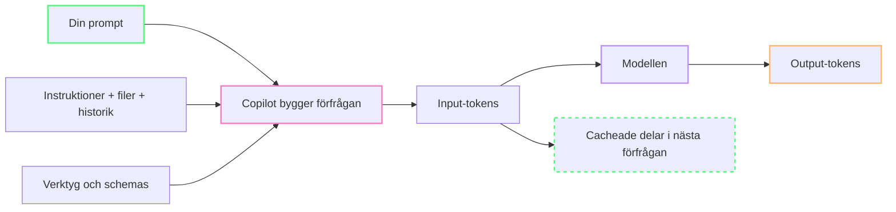
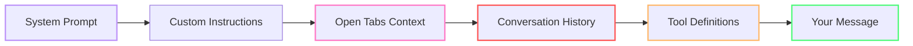
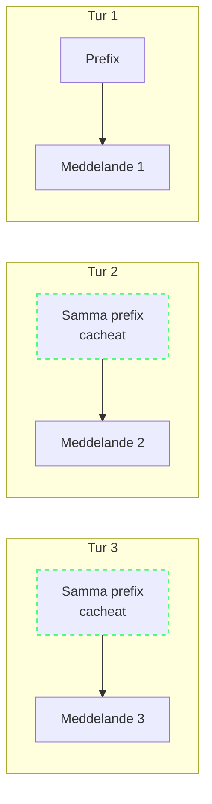
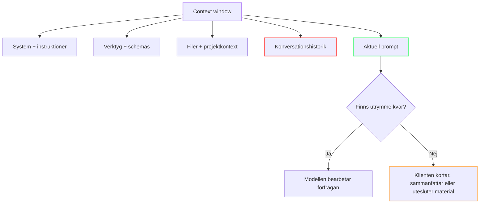
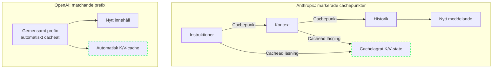

import { Steps, Tabs, TabItem } from "@astrojs/starlight/components";

# Vad händer när du trycker Enter?

Varje gång du trycker **Enter** i Copilot Chat lämnar inte bara den sista meningen din dator. Copilot samlar ihop din prompt, instruktioner, relevanta filer, tidigare meddelanden och verktyg som modellen får använda. Texten delas sedan upp i tokens och skickas som en samlad förfrågan till modellen.

Det här är den mentala modellen för resten av kursen: **du skriver en prompt, men modellen tar emot ett helt sammanhang**.

---

## Vad är en token? 🟢

En **token** är en liten textenhet som en språkmodell kan läsa. En token kan vara ett helt kort ord, en del av ett längre ord, skiljetecken, blanksteg eller kodsyntax.

Modeller använder tokenisering för att omvandla text till de enheter som modellen bearbetar. En vanlig metod är **BPE (Byte-Pair Encoding)**, som delar ord i återkommande delsträngar. Därför kan samma ord delas på olika sätt av olika modeller.

Som grov tumregel motsvarar en token ungefär **fyra tecken eller 0,75 engelska ord**. Det är bara en uppskattning: kod, svenska, specialtecken och ovanliga ord kan ge ett annat resultat. Den exakta mängden beror på modellens tokenizer.[^m1-1]

```text
"Create login validation."
→ text
→ tokens
→ modellens numeriska representation
```

### Varför spelar tokens roll?

Tokens är det gemensamma måttet för allt textinnehåll som går in i och ut ur modellen. En kort prompt kan därför bli stor när Copilot också tar med filer, instruktioner och historik. En lång modellrespons består på samma sätt av output-tokens.

---

## Vart tar tokens vägen? 🟢

Varje Copilot-förfrågan kan beskrivas med tre praktiska kategorier:

- **Input-tokens** — texten som skickas till modellen: din prompt, öppna filer, instruktioner, verktygsdefinitioner och konversationshistorik.
- **Output-tokens** — texten som modellen skapar: förklaringar, kod, ändringar och meddelanden från verktyg.
- **Cacheade tokens** — delar av input som redan har bearbetats och kan återanvändas när samma prompt-prefix finns kvar.[^m1-2]

Det betyder att din skrivna prompt ofta bara är en del av inputen. Föreställ dig tre lager:



Cacheade tokens är alltså inte en fjärde sorts text. Det är input som matchar tidigare kontext och kan återanvändas av leverantörens system.

---

## Anatomins delar: en Copilot-förfrågan 🟢

Det här är en praktisk modell av materialet som kan bidra till en chattförfrågan eller ett steg i Agent mode. Den slutliga förfrågan beror på klienten, modellen, inställningarna och vad du gör i sessionen.[^m1-3]



| Del | Vad det är | Typisk variation |
|-----|------------|------------------|
| **System prompt** | Modellens instruktioner om roll, förmågor och beteende | Beror på modell och klient |
| **Custom instructions** | Exempelvis `.github/copilot-instructions.md` och `AGENTS.md` | Beror på arbetsytan |
| **Open tabs** | Filer i editorn som klienten kan inkludera som kontext | Beror på filer och inställningar |
| **Conversation history** | Tidigare meddelanden i den aktuella tråden | Växer under sessionen |
| **Tool definitions** | Scheman och beskrivningar för verktyg och MCP-servrar | Beror på aktiverade verktyg |
| **Your message** | Prompten du faktiskt skriver | Beror på uppgiften |

:::note[Ingen del har en fast storlek]
Se tabellen som en mental modell, inte som en universell tokenbudget. Klienten och leverantören bestämmer hur den slutliga förfrågan renderas.[^m1-3]
:::

Se [Glossary](/vibe-on-budget/sv/glossary) för definitioner av bland annat context window, prompt prefix, tokenizer och verktygsregister.

---

## Prompt-prefixet 🟡

I en agentsession upprepas ofta en stor del av förfrågan mellan turerna: systeminstruktioner, verktyg, projektkontext och tidigare konversation. Den återkommande början kallas **prompt-prefixet**.



Ett stabilt prompt-prefix gör att leverantören kan återanvända tidigare beräknat modellstate. Om prefixet ändras kan den matchningen försvinna. Därför kan en liten ändring i tidiga instruktioner påverka hela den efterföljande förfrågan.[^m1-2][^m1-4]

### Ett enkelt sätt att se prefixet

Tänk på varje förfrågan som två delar:

1. **Det återkommande prefixet:** instruktioner, verktyg, projektkontext och historik.
2. **Det nya tillägget:** meddelandet eller uppgiften du skickar just nu.

Ju mer som är stabilt i den första delen, desto mer kan systemet återanvända mellan närliggande turer.

---

## Så fylls context window upp 🟢

Ett **context window** är den maximala mängd tokens som modellen kan bearbeta i en förfrågan. Gränsen varierar mellan modeller, så använd alltid den valda modellens dokumenterade gräns i stället för att anta en universell storlek.[^m1-5][^m1-6][^m1-7]

Under en längre session konkurrerar flera saker om samma utrymme:

1. System- och arbetsplatsinstruktioner läggs till.
2. Verktygsdefinitioner och relevanta filer kommer in.
3. Din prompt och modellens svar blir en del av historiken.
4. Nya turer lägger till fler filer, verktyg och meddelanden.
5. När gränsen närmar sig kan klienten behöva korta ned, sammanfatta eller utesluta tidigare material.



Det praktiska resultatet är enkelt: en lång session kan göra att tidigare detaljer inte längre får plats på samma sätt. Håll därför koll på vilka filer, verktyg och historik som faktiskt behövs för nästa steg.

---

## Prefix caching och cache breakpoints 🟡

Leverantörer kan återanvända delar av ett stabilt prefix, men de gör det på olika sätt.

### Anthropic: cache breakpoints

Anthropic låter integrationer markera promptblock som cachebara med **cache breakpoints**. Markeringarna visar var ett prefix kan sparas och återanvändas mellan förfrågningar.[^m1-8]

### OpenAI: automatisk prefix caching

OpenAI beskriver **prompt caching** som automatisk återanvändning av matchande prefix på modeller som stöder funktionen. Vissa modeller har dessutom explicita kontroller för cachegränser.[^m1-2]



### Vad kan bryta en matchning?

En ändring i den gemensamma början kan göra att prefixet inte längre matchar exakt. Var särskilt uppmärksam på:

- byte av modell mitt i sessionen,
- ändrade system- eller arbetsplatsinstruktioner,
- tillagda eller borttagna verktyg,
- ändrad ordning på verktygsdefinitioner,
- en tidig del av historiken som skrivs om.

Det betyder inte att varje ändring alltid ger en cachemiss i varje integration. Det betyder att ändringen är en risk för matchningen och kan kräva att kontexten byggs om.[^m1-2][^m1-4]

:::tip[Praktisk tumregel]
Håll verktyg, instruktioner och tidig konversationshistorik stabila medan du arbetar med samma uppgift. Börja en ny session när uppgiften byter riktning eller den gamla historiken mest blivit brus.
:::

---

## Engelska och svenska: samma mening, olika tokens 🟢

Tokenizer-effektivitet varierar mellan språk. Svenska kan tokeniseras ungefär **1,4–1,7 gånger mindre effektivt** än engelska, beroende på tokenizer och text. Måttet *fertility* beskriver genomsnittligt antal tokens per ord och visar varför jämförelsen måste göras med samma tokenizer och ett jämförbart textunderlag.[^m1-9][^m1-10]

```text
Engelska: "Create login validation. Handle empty fields."
→ cirka 7 tokens

Svenska: "Skapa inloggningsvalidering. Hantera tomma fält."
→ cirka 12 tokens (ungefär 1,5× fler)
```

Det här är en illustrativ jämförelse, inte en konstant för språket. Kontrollera den faktiska texten i en tokenizer-visualiserare, till exempel [OpenAI Tokenizer](https://platform.openai.com/tokenizer) eller [Tiktokenizer](https://tiktokenizer.vercel.app/), eftersom olika modeller kan dela upp texten olika.[^m1-11]

:::note[Språk är ett verktygsval]
Du kan skriva på svenska när det ger bäst precision och trygghet. För korta, återkommande prompts kan engelska ibland ge färre tokens. Mät med den tokenizer som motsvarar modellen i stället för att förlita dig på en generell språkratio.
:::

---

## Practice

Öppna en tokenizer visualizer (t.ex. OpenAI Tokenizer) och klistra in din senaste prompt. Räkna tokens. Jämför med engelsk översättning av samma prompt.

För en mer rättvis jämförelse:

1. Behåll samma betydelse och ungefär samma detaljnivå.
2. Använd samma tokenizer för båda versionerna.
3. Notera skillnaden i tokens, men också om någon version blir mindre tydlig.
4. Upprepa med en kodprompt och en vanlig fråga.

---

## Key Takeaways

- En **token** är en textenhet; BPE delar ord i återkommande delsträngar.
- En grov tumregel är cirka fyra tecken eller 0,75 engelska ord per token, men den exakta mängden beror på tokenizer.
- En Copilot-förfrågan innehåller mer än din prompt: instruktioner, filer, historik och verktyg kan också bidra.
- **Input-tokens**, **output-tokens** och **cacheade tokens** beskriver olika delar av förfrågan och svaret.
- Ett stabilt **prompt-prefix** kan återanvändas; ändrade instruktioner eller verktyg kan bryta matchningen.
- Context window fylls av systemmaterial, filer, verktyg, historik och den aktuella prompten.
- Svenska och engelska kan ge olika tokenmängd. Mät med en tokenizer visualizer när skillnaden spelar roll.

---

## Summering

När du trycker Enter skickar Copilot en sammansatt förfrågan, inte bara raden du skrev. Modellen läser tokens från flera källor, bygger ett prompt-prefix, återanvänder matchande kontext när det går och måste ibland korta ned material när context window fylls.

## Nästa

Nu vet du *vad* som skickas. Nästa fråga: *vad kostar det?* Gå vidare till [Module 2: Den dolda kostnaden](/vibe-on-budget/sv/02-price-and-measurement) för att förstå hur tokenmängd, input, output och cache hänger ihop med användning.

[^m1-1]: [Glossary: Token och BPE](/vibe-on-budget/sv/glossary) — kursens definitioner.
[^m1-2]: [Prompt caching](https://developers.openai.com/api/docs/guides/prompt-caching) — OpenAI, accessed 2026-09-07.
[^m1-3]: [AI settings reference](https://code.visualstudio.com/docs/agents/reference/ai-settings) — Visual Studio Code, accessed 2026-09-07.
[^m1-4]: [How Claude Code uses prompt caching](https://code.claude.com/docs/en/prompt-caching) — Anthropic, accessed 2026-09-07.
[^m1-5]: [Claude models overview](https://docs.anthropic.com/en/docs/about-claude/models/overview) — Anthropic, accessed 2026-09-07.
[^m1-6]: [GPT-5 model documentation](https://developers.openai.com/api/docs/models/gpt-5) — OpenAI, accessed 2026-09-07.
[^m1-7]: [Gemini models](https://ai.google.dev/gemini-api/docs/models) — Google, accessed 2026-09-07.
[^m1-8]: [Prompt caching](https://docs.anthropic.com/en/docs/build-with-claude/prompt-caching) — Anthropic, accessed 2026-09-07.
[^m1-9]: [Tokenizer Evaluation on European Languages](https://occiglot.eu/posts/eu_tokenizer_perfomance/) — Occiglot.
[^m1-10]: [The Hidden Cost of Tokenization: Why (most) Non-English Speakers Pay More](https://zenodo.org/records/20028344) — Zenodo.
[^m1-11]: [Tiktokenizer](https://tiktokenizer.vercel.app/) — interactive tokenizer visualizer; results vary by model tokenizer.
