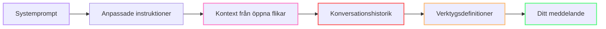
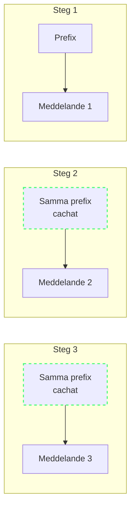
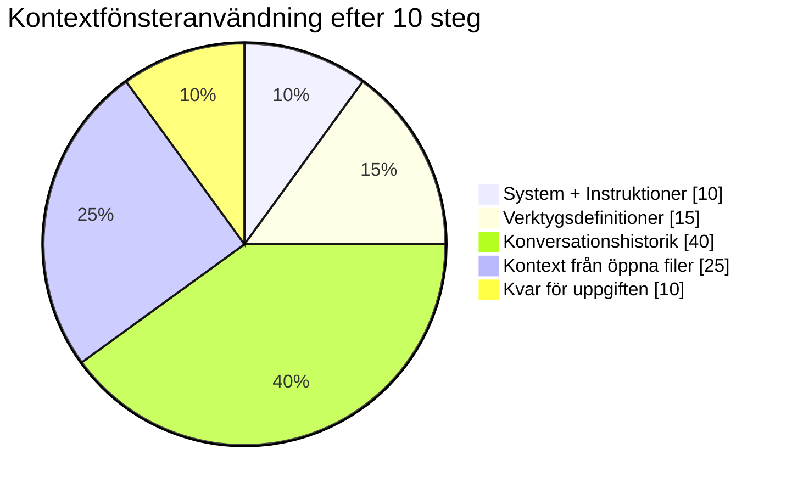
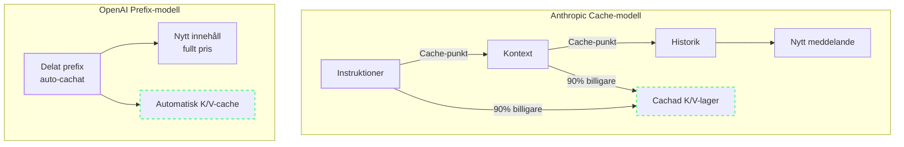

import { Steps, Tabs, TabItem } from "@astrojs/starlight/components";

# Hur Copilot bygger kontext

Varje gång du trycker på Enter i Copilot Chat lämnar en förvånansvärt stor datamängd din maskin. Att förstå vad som finns i den datamängden — och hur Copilot bestämmer vad som ska inkluderas — är nyckeln till att kontrollera din tokenförbrukning.

---

## Anatomi av en Copilot-förfrågan

Här är vad som paketeras och skickas med varje chattmeddelande eller agentsteg:



| Komponent | Vad det är | Typisk storlek |
|-----------|-----------|---------------|
| **Systemprompt** | Instruktioner på modellnivå (roll, förmågor) | ~500 tokens |
| **Anpassade instruktioner** | `.github/copilot-instructions.md`, `AGENTS.md` | 50–1000+ tokens |
| **Öppna flikar** | Synliga editorfiler, inkluderas automatiskt som kontext | 500–10 000+ tokens |
| **Konversationshistorik** | Alla tidigare meddelanden i aktuell tråd | 0–20 000+ tokens |
| **Verktygsdefinitioner** | MCP-server-scheman, verktygsbeskrivningar | 500–5000+ tokens |
| **Ditt meddelande** | Själva prompten du skrev | 10–500 tokens |

:::tip[Den fasta skatten]
Systemprompt + anpassade instruktioner skickas **varje gång**, oavsett fråga. Detta är din baskostnad per förfrågan.
:::

---

## Promptprefixet

I en agentsession återupprepas en stor del av varje förfrågan mellan stegen: systeminstruktioner, verktygsdefinitioner, repositories-kontext och konversationshistorik. Denna upprepade början är **promptprefixet**.



Promptprefixet är den **ensamt största hävstången** för tokenoptimering. När prefixet förblir stabilt kan leverantören cacha det. När du ändrar kontext — öppnar en ny fil, byter branch, lägger till instruktioner — ogiltigförklarar du cachen och betalar fullt pris.

---

## Hur kontextfönstret fylls

Copilot-modeller har ett maximalt kontextfönster (128K–200K tokens beroende på modell). Så här ser en typisk lång session ut:



När fönstret fylls börjar modellen **glömma** tidigare kontext. Den kan inte se filen du refererade till för 5 steg sedan. Lösningen är inte ett större fönster — det är att använda mindre per steg.

---

## Prefix-cachning vs Cache Breakpoints

Här spelar leverantörens implementation roll. De två huvudsakliga tillvägagångssätten:

### Anthropic: Cache Breakpoints

Anthropic låter dig **explicit markera** sektioner av prompten som cachebara. De första N tokens blir en cache-post som består över flera förfrågningar. Cache-träffar är ~90% billigare än färsk beräkning.[^1]

[^1]: [Prompt caching](https://docs.anthropic.com/en/docs/build-with-claude/prompt-caching) — Anthropic Docs. Besparingarna beror på modell och cachebeteende.

### OpenAI: Automatiskt Promptprefix

OpenAI cachar det **delade prefixet** automatiskt. När identiska tokens visas i början av på varandra följande förfrågningar återanvänder slutledningsmotorn det beräknade tillståndet. Det finns ingen manuell kontroll — antingen matchar det eller inte.



:::note[Cacheekonomi]
Cachade tokens är dramatiskt billigare än nya tokens. En användbar tumregel är **~10 % av kostnaden för nya tokens hos Anthropic** (ungefär 90 % rabatt) och **~50 % hos OpenAI**, även om exakt prissättning beror på modell och nivå. Det innebär att en **session på 10 000 tokens med 60 % cacheträffar kan vara billigare än en session på 5 000 tokens utan träffar**.
:::

:::caution[Vad bryter cachen]
Varje ändring av promptprefixet ogiltigförklarar cachen: byte av modell, ändring av anpassade instruktioner, öppning/stängning av en fil, eller till och med att konversationshistoriken växer förbi cachegränsen.
:::

:::tip[När ska du rensa chatten och när ska du stanna kvar?]

| Situation | Åtgärd | Varför |
|-----------|--------|--------|
| Samma uppgift, flera steg | Stanna i sessionen | Cachningen byggs på mellan stegen |
| Uppgiften klar, ny orelaterad uppgift | Börja om | Gammal kontext förorenar svaren |
| Lång session (10+ steg), samma uppgift | Komprimera och fortsätt | Sammanfatta och klistra in i en ny tråd |
| Modellbyte behövs | Använd en subagent, byt inte huvudmodell | Ett byte bryter cachen helt |

:::

---

## Fällan med "lokala mätvärden"

Här är en farlig missuppfattning: **du kan inte se den verkliga kostnaden från din lokala miljö**.

Vad du observerar lokalt:
- Svarstid
- Antal skickade meddelanden
- Ungefärlig kodkvalitet

Vad du **inte** kan se:
- Faktiskt tokenantal per förfrågan (utan felsökningsloggning)
- Uppdelning mellan input, output och cachade tokens
- Poolad credithförbrukning för ditt team
- Hur din användning jämförs med andra i organisationen

Detta leder till blindfläckar. En utvecklare som "bara ställde 20 frågor" kan ha förbrukat tusentals tokens per fråga eftersom kontextfönstret var svällt.

:::tip[Aktivera felsökningsloggning för att se faktiska antal]
```json
// VS Code settings.json
"github.copilot.chat.agentDebugLog.fileLogging.enabled": true
```
Öppna sedan Chatt-vyn → **...** → **Show Agent Debug Logs** → fliken **Summary** för att se tokenantal per förfrågan.
:::

---

## Vanliga misstag som bryter cachen

Det smärtsamma med prefix-cachning är att små, oskyldiga ändringar kan tvinga fram en fullständig ombyggnad. Här är de vanligaste bovarna:

| Misstag | Vad händer | Varför det spelar roll | Så åtgärdar du det |
|---------|------------|-----------------------|--------------------|
| **Tidsstämplar i systemprompter** | Varje förfrågan får en annan prefixhash, så cachen missar vid varje anrop. | Du betalar fullt pris upprepade gånger för instruktioner som skulle återanvändas. | Flytta den ändrade detaljen till ett senare meddelande — till exempel ett `<system-reminder>`-block — i stället för att skriva om systempromptens översta nivå. |
| **Byta modell under sessionen** | Den nya modellen kan inte återanvända den gamla modellens cachade KV-tillstånd. | Modellbyten tvingar fram en full ombyggnad när konversationen är som störst. | Håll huvudtråden på en modell; använd en subagent för enstaka billigare uppgifter i stället för att byta huvudmodell. |
| **Ändra verktyg under sessionen** | Att lägga till eller ta bort MCP-servrar ändrar verktygsprefixet och ogiltigförklarar efterföljande cachesegment. | Verktygsscheman är ofta stora, så en verktygsändring kan bli en dyr cacheåterställning. | Konfigurera verktygen innan sessionen börjar och håll dem stabila medan du arbetar. |
| **Icke-deterministisk verktygsordning** | Samma verktyg i en annan ordning ger ett annat serialiserat prefix. | Leverantören ser bara byte och hash, inte din avsikt. Samma betydelse, annan ordning, samma miss. | Använd en stabil, deterministisk ordning för verktygsdefinitioner varje gång. |
| **Randomisering av JSON-nycklar** | Språk som Go och Swift kan skriva objektets nycklar i en annan ordning, vilket ändrar det cachade prefixet. | Semantiskt identiska nyttolaster kan ändå missa cachen om deras serialiserade form ändras. | Använd ordnad serialisering eller normalisera nyckelordningen innan verktygsnyttolaster skickas. |
| **Ändra instruktioner under sessionen** | Redigering av `copilot-instructions.md` eller `AGENTS.md` ändrar det alltid aktiva instruktionslagret för nästa steg. | Det bryter cachen för system/anpassade instruktioner och tvingar fram en full ombyggnad av prefixet. | Uppdatera instruktioner mellan uppgifter och starta sedan medvetet en ny session så att ombyggnaden sker en gång, avsiktligt. |

:::note[Tumregel]
Om en ändring påverkar **verktyg**, **instruktioner på översta nivån** eller den **tidiga gemensamma historiken**, bör du anta att cachen just exploderade och budgetera därefter.
:::

---

## Vad det innebär för ditt arbetsflöde

Att förstå kontextmodellen leder till tre praktiska regler:

1. **Håll prefixet stabilt** — undvik onödigt filbyte under en session
2. **Återställ vid uppgiftsgränser** — rensa chatten när du byter uppgift. Inom en och samma uppgift, håll sessionen vid liv för att dra nytta av prefix-cachning.
3. **Minimera alltid-på-instruktioner** — håll `copilot-instructions.md` smal, använd `.prompt.md`-filer för specialiserade regler

De här mönstren kan minska din kontext per förfrågan med 40–60 %, beroende på projekt och arbetsflöde.

---

## Viktiga slutsatser

- Varje förfrågan inkluderar ett **fast prefix** (systeminstruktioner, verktyg, historik) plus ditt meddelande
- **Promptprefixet** är cachebart — men lätt ogiltigförklarat
- Anthropic använder **cache breakpoints** (manuellt), OpenAI använder **automatisk prefixmatchning**
- **Konversationshistorik** är den snabbast växande delen av kontextfönstret
- Du kan inte mäta vad du inte kan se — **aktivera felsökningsloggning** för att förstå din verkliga kostnad

*Beräknad lästid: 10 minuter*