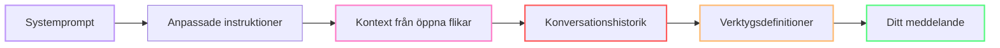
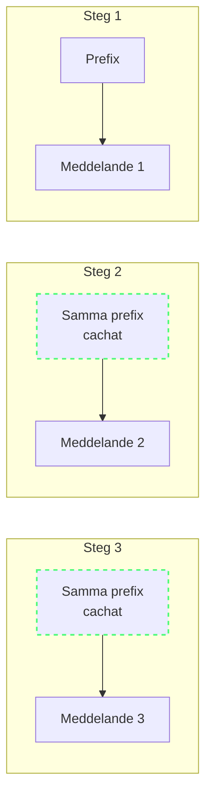
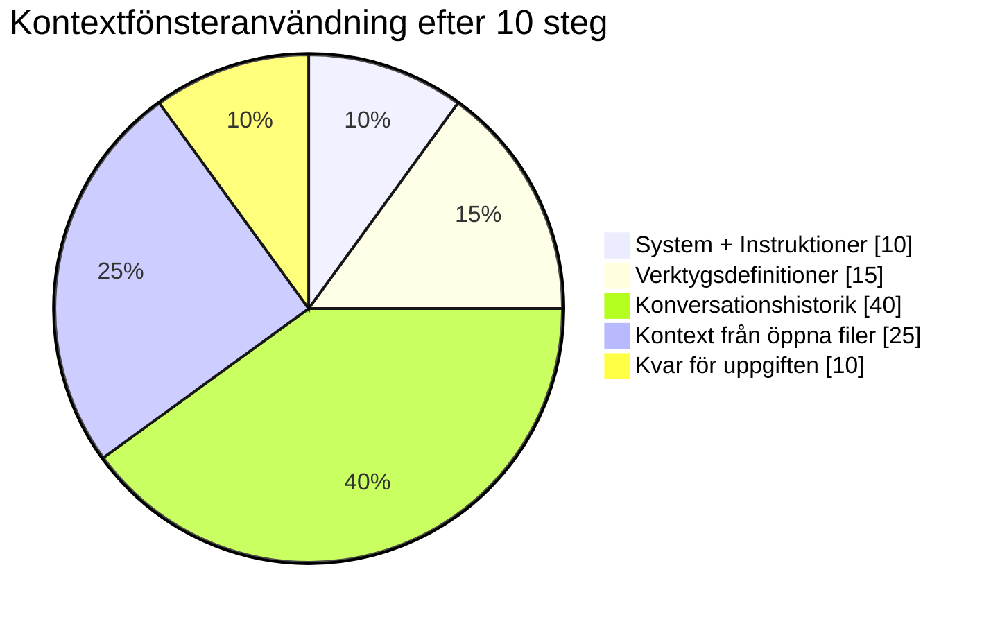
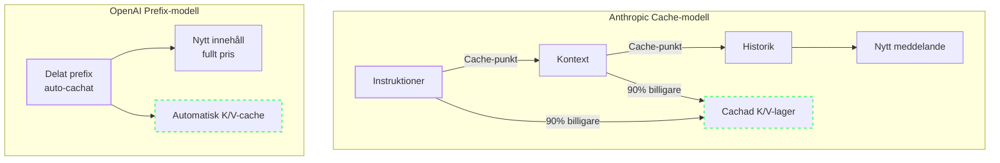

import { Steps, Tabs, TabItem } from "@astrojs/starlight/components";

# Hur Copilot bygger kontext

Varje gång du trycker på Enter i Copilot Chat lämnar en förvånansvärt stor datamängd din maskin. Att förstå vad som finns i den datamängden — och hur Copilot bestämmer vad som ska inkluderas — är nyckeln till att kontrollera din tokenförbrukning.

I Modul 1 såg du att cacheade tokens väger 0,1× i GitHubs Effective Tokens-formel — 90% billigare än nya input-tokens. Den här modulen lär dig vad som faktiskt skickas i varje förfrågan och hur du maximerar cache-träffar.

---

## Anatomi av en Copilot-förfrågan 🟢

Här är en praktisk modell av det material som kan bidra till en chattförfrågan eller ett agentsteg. OpenAI:s dokumentation om promptcachning beskriver uttryckligen renderade instruktioner, utvecklarmeddelanden, verktyg och konversationshistorik som delar av den cachade kontexten.[^m2-1]



| Komponent | Vad det är | Typisk storlek |
|-----------|-----------|---------------|
| **Systemprompt** | Instruktioner på modellnivå (roll, förmågor) | ~500 tokens |
| **Anpassade instruktioner** | `.github/copilot-instructions.md`, `AGENTS.md` | 50–1000+ tokens |
| **Öppna flikar** | Synliga editorfiler, inkluderas automatiskt som kontext | 500–10 000+ tokens |
| **Konversationshistorik** | Alla tidigare meddelanden i aktuell tråd | 0–20 000+ tokens |
| **Verktygsdefinitioner** | [MCP (Model Context Protocol — ett öppet protokoll för AI-verktygskommunikation)](https://modelcontextprotocol.io/)-server-scheman, verktygsbeskrivningar | 500–5000+ tokens |
| **Ditt meddelande** | Själva prompten du skrev | 10–500 tokens |

:::note[Ingen fast storlek per komponent]
Klienten och leverantören bestämmer den slutliga renderade förfrågan; behandla därför inte raderna som universella tokenbudgetar.[^m2-2]
:::

:::note[Typexempel: En vanlig Copilot-fråga]
En typisk session med 3 öppna filer (~2 000 tokens),
5 MCP-verktyg i registret (~1 000 tokens i beskrivningar),
och 5 tidigare meddelanden i historiken (~3 000 tokens)
skickar ~6 500 tokens input overhead innan din prompt ens räknas.
:::

:::tip[Det återkommande prefixet]
Systeminstruktioner, verktyg och återanvändbar kontext kan återkomma i senare förfrågningar. Det är den del som leverantörer ofta kan cacha när prefixet matchar.[^m2-1]
:::

:::tip[Den fasta skatten]
Systemprompt + anpassade instruktioner skickas **varje gång**, oavsett fråga. Detta är din baskostnad per förfrågan.
:::

*(Se [Ordlista](/vibe-on-budget/sv/glossary) för definitioner av kontextfönster, promptprefix och andra nyckeltermer.)*

---

## Promptprefixet 🟡

I en agentsession återupprepas en stor del av varje förfrågan mellan stegen: systeminstruktioner, verktygsdefinitioner, repositories-kontext och konversationshistorik. Denna upprepade början är **promptprefixet**.



Promptprefixet är en viktig hävstång för tokenoptimering. När prefixet förblir stabilt kan leverantören återanvända det; när det renderade prefixet ändras kanske den relevanta cacheposten inte längre matchar.[^m2-1][^m2-3]

---

## Hur kontextfönstret fylls 🟢

Copilot-modeller har modellspecifika kontextgränser som kan variera kraftigt. Se den valda modellens publicerade gräns som auktoritativ i stället för att anta ett universellt intervall.[^m2-4][^m2-5][^m2-6]



Systeminstruktioner, verktyg, konversationshistorik och filkontext konkurrerar om den valda modellens tillgängliga kontext; proportionerna beror på arbetsbelastningen.[^m2-1][^m2-4][^m2-5][^m2-6]

När den tillgängliga kontextgränsen nås kan tidigare material behöva trunkeras, sammanfattas eller på annat sätt exkluderas av klienten eller leverantören. Hantera därför materialet som skickas per steg och kontrollera den valda modellens gräns.[^m2-4][^m2-5][^m2-6]

---

## Prefix-cachning vs Cache Breakpoints 🟡

Här spelar leverantörens implementation roll. De två huvudsakliga tillvägagångssätten:

### Anthropic: [Cache Breakpoints](https://docs.anthropic.com/en/docs/build-with-claude/prompt-caching)

Anthropic låter dig **explicit markera** promptblock som cachebara. Cacheläsningar prissätts till 10 % av standardpriset för indata enligt Anthropics aktuella prisdokumentation; det exakta resultatet beror på modell, cache-nivå och förfrågningens form.[^m2-7][^m2-9]

### OpenAI: [Automatiskt Promptprefix](https://platform.openai.com/docs/guides/prompt-caching)

OpenAI:s promptcachning återanvänder automatiskt matchande delade prefix på modeller som stöder det. Den aktuella dokumentationen beskriver även uttryckliga cachebrytarkontroller för modeller som stöder dem.[^m2-1]



:::note[Cacheekonomi]
Cachade tokens är dramatiskt billigare än nya tokens. En användbar tumregel är **~10 % av kostnaden för nya tokens hos Anthropic** (ungefär 90 % rabatt). OpenAI erbjuder också automatisk prefix-cachning men publicerar ingen specifik rabattprocent — besparingarna varierar beroende på arbetsbelastning och prefixets stabilitet. Det innebär att en **session på 10 000 tokens med 60 % cacheträffar kan vara billigare än en session på 5 000 tokens utan träffar**.[^m2-7]
:::

:::caution[Vad bryter cachen]
Varje ändring av promptprefixet ogiltigförklarar cachen: byte av modell, ändring av anpassade instruktioner, öppning/stängning av en fil, eller till och med att konversationshistoriken växer förbi cachegränsen.[^m2-1][^m2-3]
:::

:::note[Fördjupning: Cache-mekanik hos olika leverantörer]

| Leverantör | Cachningstyp | Explicit kontroll? | Skrivkostnad | Träffkostnad | Standard-TTL |
|----------|-------------|--------------------|--------------|--------------|--------------|
| OpenAI (GPT-5.x) | Automatisk + manuell | Ja — `prompt_cache_breakpoint` | 1,25x | Ej offentligt specificerad | Konfigurerbar[^m2-1] |
| Anthropic (Claude) | Manuell | Ja — `cache_control` | 1,25x–2,0x | 0,1x (90 % rabatt) | 5 min[^m2-9] |
| DeepSeek (V4 Pro) | Diskbaserad | Nej (implicit) | Ingen | 0,5x (50 % rabatt) | Ej tillämpligt[^m2-10] |
| Google (Gemini 3.5) | Kontextbaserad | Nej (implicit) | Ingen | Varierar | Session[^m2-11] |

:::caution[Kontroversen kring Anthropic TTL]
Anthropics postmortem från 23 april 2026 beskriver en cache-relaterad regression i Claude Code.[^m2-13] Particula Tech rapporterar separat om en ändring i mars 2026 som minskade en implicit promptcache-TTL från **1 timme till 5 minuter** för vissa förfrågningar; det är tredjepartsrapportering och ingen garanti för Anthropics prissättning.[^m2-14]

Om du använder Anthropic-baserade modeller, ange dokumenterad TTL uttryckligen där integrationen tillåter det och följ cacheläsningarna. Långa pauser kan överstiga en kort TTL; leverantörernas retentionkontroller skiljer sig åt.[^m2-9][^m2-12]
:::

:::

---

## Vanliga misstag som bryter cachen 🟡

Det smärtsamma med prefix-cachning är att ändringar i det gemensamma serialiserade prefixet kan hindra en cachematchning. Här är vanliga riskmönster från leverantörernas vägledning:[^m2-1][^m2-3]

| Misstag | Vad händer | Varför det spelar roll | Så åtgärdar du det |
|---------|------------|-----------------------|--------------------|
| **Tidsstämplar i systemprompter** | Varje förfrågan får en annan prefixhash, så cachen missar vid varje anrop. | Du betalar fullt pris upprepade gånger för instruktioner som skulle återanvändas. | Flytta den ändrade detaljen till ett senare meddelande — till exempel ett `<system-reminder>`-block — i stället för att skriva om systempromptens översta nivå. |
| **Byta modell under sessionen** | Den nya modellen kan inte återanvända den gamla modellens cachade KV-tillstånd. | Modellbyten tvingar fram en full ombyggnad när konversationen är som störst. | Håll huvudtråden på en modell; använd en subagent för enstaka billigare uppgifter i stället för att byta huvudmodell. |
| **Ändra verktyg under sessionen** | Att lägga till eller ta bort MCP-servrar ändrar verktygsprefixet och ogiltigförklarar efterföljande cachesegment. | Verktygsscheman är ofta stora, så en verktygsändring kan bli en dyr cacheåterställning. | Konfigurera verktygen innan sessionen börjar och håll dem stabila medan du arbetar. |
| **Icke-deterministisk verktygsordning** | Samma verktyg i en annan ordning ger ett annat serialiserat prefix. | Leverantören ser bara byte och hash, inte din avsikt. Samma betydelse, annan ordning, samma miss. | Använd en stabil, deterministisk ordning för verktygsdefinitioner varje gång. |
| **Randomisering av JSON-nycklar** | Språk som Go och Swift kan skriva objektets nycklar i en annan ordning, vilket ändrar det cachade prefixet. | Semantiskt identiska nyttolaster kan ändå missa cachen om deras serialiserade form ändras. | Använd ordnad serialisering eller normalisera nyckelordningen innan verktygsnyttolaster skickas. |
| **Ändra instruktioner under sessionen** | Redigering av `copilot-instructions.md` eller `AGENTS.md` ändrar det alltid aktiva instruktionslagret för nästa steg. | Det bryter cachen för system/anpassade instruktioner och tvingar fram en full ombyggnad av prefixet. | Uppdatera instruktioner mellan uppgifter och starta sedan medvetet en ny session så att ombyggnaden sker en gång, avsiktligt. |

:::note[Tumregel]
Om en ändring påverkar **verktyg**, **instruktioner på översta nivån** eller den **tidiga gemensamma historiken**, bör du anta att cachen just exploderade och budgetera därefter.
:::

---

## Fällan med "lokala mätvärden" 🟢

Här är en farlig missuppfattning: **du kan inte se den verkliga kostnaden från din lokala miljö**.[^m2-8]

Vad du observerar lokalt:
- Svarstid
- Antal skickade meddelanden
- Ungefärlig kodkvalitet

Vad du **inte** kan se:
- Faktiskt tokenantal per förfrågan (utan felsökningsloggning)
- Uppdelning mellan input, output och cachade tokens
- Poolad credithförbrukning för ditt team
- Hur din användning jämförs med andra i organisationen

Använd felsökningsvyn och leverantörens användningsdata i stället för att dra slutsatser om kostnad från enbart antalet meddelanden.[^m2-7][^m2-8]

:::tip[Aktivera felsökningsloggning för att se faktiska antal]
```json
// VS Code settings.json
"github.copilot.chat.agentDebugLog.fileLogging.enabled": true
```
Öppna sedan Chatt-vyn → **...** → **[Show Agent Debug Logs](https://code.visualstudio.com/docs/agents/agent-troubleshooting)** → fliken **Summary** för att se tokenantal per förfrågan.[^m2-8]
:::

---

### När ska du rensa chatten? 🟡

| Situation | Åtgärd | Varför |
|-----------|--------|--------|
| Samma uppgift, flera steg | Stanna i sessionen | Cachningen byggs på mellan stegen |
| Uppgiften klar, ny orelaterad uppgift | Börja om | Gammal kontext förorenar svaren |
| Lång session (10+ steg), samma uppgift | Komprimera och fortsätt | Använd `/compact` för att sammanfatta och återta kontextfönsterutrymme |
| Modellbyte behövs | Använd en subagent, byt inte huvudmodell | Ett byte bryter cachen helt |

:::tip[Förgrena för att utforska alternativ]
Skriv `/fork` för att skapa en ny session som ärver hela konversationshistoriken.
Användbart när du vill testa en alternativ lösning utan att betala prefixkostnaden igen.
Till skillnad från `/clear` och `/compact` är förgrening för parallella spår, inte för
att fortsätta samma uppgift.
:::

---

## Vad det innebär för ditt arbetsflöde

Att förstå kontextmodellen leder till fyra praktiska regler:

1. **Håll prefixet stabilt** — undvik onödigt filbyte under en session
2. **Återställ vid uppgiftsgränser** — rensa chatten när du byter uppgift. Inom en och samma uppgift, håll sessionen vid liv för att dra nytta av prefix-cachning.
3. **Minimera alltid-på-instruktioner** — håll `copilot-instructions.md` smal, använd `.prompt.md`-filer för specialiserade regler
4. **Grunda innan du utforskar** — se till att arbetsytans semantiska index är tillgängligt, använd `#codebase` för att uttryckligen grunda en förfrågan i den indexerade kodbasen och ta med relevanta filer, fel, begränsningar och kriterier för ett lyckat resultat i prompten. Använd symbolmedveten sökning och fokuserade MCP/CLI-verktyg för auktoritativa data, och lägg stabila projektkonventioner i anpassade instruktioner så att agenten slipper upptäcka dem på nytt i varje session. Se [Semantisk sökning](https://code.visualstudio.com/docs/agents/reference/workspace-context#_semantic-search).[^m2-16]

Mät effekten i den egna arbetsytan: den användbara baslinjen är den förfrågnings- och cacheinformation som klienten och leverantören visar.[^m2-2][^m2-7]

---

:::tip[Fortsätt lära dig]
Nu när du förstår vad som skickas i varje förfrågan är det dags att [mäta din faktiska förbrukning](/vibe-on-budget/sv/03-measure-before-you-cut). Utan mätning är optimering gissningar.
:::

---

## Övning

1. Starta en ny chatsession. Räkna hur många editorflikar du har öppna innan du skickar något meddelande. Stäng alla utom de tre mest relevanta. Detta är din baslinje.
2. Aktivera felsökningsloggning: sätt `github.copilot.chat.agentDebugLog.fileLogging.enabled` till `true` i inställningarna. Öppna Agent Debug Logs → Summary efter nästa chatsession och notera uppdelningen mellan input- och output-tokens.
3. Ställ tre relaterade frågor om samma fil i en och samma session. Använd Cache Explorer för att kontrollera: förbättrades cacheträfffrekvensen efter det första steget?

## Viktiga slutsatser

- Varje förfrågan inkluderar ett **fast prefix** (systeminstruktioner, verktyg, historik) plus ditt meddelande[^m2-1]
- **Promptprefixet** är cachebart — men lätt ogiltigförklarat[^m2-1][^m2-9]
- Anthropic använder **cache breakpoints** (manuellt), OpenAI använder **automatisk prefixmatchning**[^m2-1][^m2-9]
- **Konversationshistorik** är den snabbast växande delen av kontextfönstret[^m2-1][^m2-4][^m2-5][^m2-6]
- Du kan inte mäta vad du inte kan se — **aktivera felsökningsloggning** för att förstå din verkliga kostnad[^m2-8]

*Beräknad lästid: 10 minuter*

[^m2-1]: [Promptcachning](https://developers.openai.com/api/docs/guides/prompt-caching) — OpenAI, hämtad 2026-09-07.
[^m2-2]: [AI-inställningsreferens](https://code.visualstudio.com/docs/agents/reference/ai-settings) — Visual Studio Code, hämtad 2026-09-07.
[^m2-3]: [Så använder Claude Code promptcachning](https://code.claude.com/docs/en/prompt-caching) — Anthropic, hämtad 2026-09-07.
[^m2-4]: [Översikt över Claude-modeller](https://docs.anthropic.com/en/docs/about-claude/models/overview) — Anthropic, hämtad 2026-09-07.
[^m2-5]: [GPT-5-modelldokumentation](https://developers.openai.com/api/docs/models/gpt-5) — OpenAI, hämtad 2026-09-07.
[^m2-6]: [Gemini-modeller](https://ai.google.dev/gemini-api/docs/models) — Google, hämtad 2026-09-07.
[^m2-7]: [Priser](https://platform.claude.com/docs/en/about-claude/pricing) — Anthropic, hämtad 2026-09-07.
[^m2-8]: [Chattens felsökningsvy](https://code.visualstudio.com/docs/agents/agent-troubleshooting/chat-debug-view) — Visual Studio Code, hämtad 2026-09-07.
[^m2-9]: [Promptcachning](https://docs.anthropic.com/en/docs/build-with-claude/prompt-caching) — Anthropic, hämtad 2026-09-07.
[^m2-10]: [Kontextcachning](https://api-docs.deepseek.com/guides/kv_cache/) — DeepSeek, hämtad 2026-09-07.
[^m2-11]: [Kontextcachning](https://ai.google.dev/gemini-api/docs/caching) — Google, hämtad 2026-09-07.
[^m2-12]: [Promptcachning med Azure OpenAI](https://learn.microsoft.com/en-us/azure/foundry/openai/how-to/prompt-caching) — Microsoft, hämtad 2026-09-07.
[^m2-13]: [En uppdatering om de senaste kvalitetsrapporterna för Claude Code](https://www.anthropic.com/engineering/april-23-postmortem) — Anthropic, 23 april 2026.
[^m2-14]: [Anthropic Prompt Cache TTL sänkt till 5 minuter: så åtgärdar du det](https://particula.tech/blog/anthropic-prompt-cache-ttl-5-minute-regression-debugging) — Particula Tech, hämtad 2026-09-07.
[^m2-15]: [Förgrena en chatsession](https://code.visualstudio.com/docs/agents/run/sessions/manage-sessions#_fork-a-chat-session) — Visual Studio Code, hämtad 2026-09-07.
[^m2-16]: [Semantisk sökning](https://code.visualstudio.com/docs/agents/reference/workspace-context#_semantic-search) — Visual Studio Code, hämtad 2026-09-07.