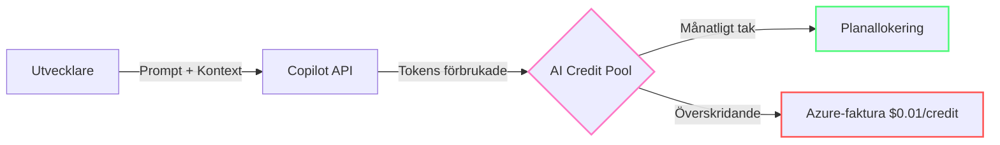
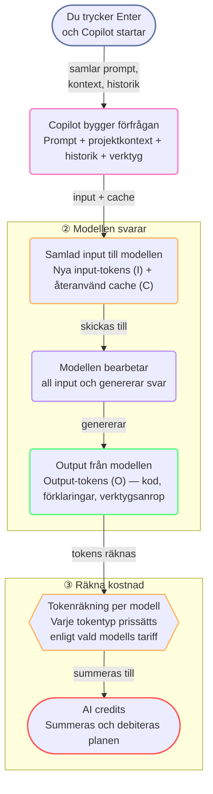

import { Steps, Tabs, TabItem } from "@astrojs/starlight/components";

# Vad kostar ett Enter-tryck?

Du vet nu att varje Enter-tryck skickar tokens. Frågan är: vad kostar de? GitHub har ett svar — och du har verktygen för att se det själv.

Den här modulen kopplar ihop två saker: hur tokens blir pengar och hur du mäter din egen förbrukning i VS Code. När du kan se kostnaden blir optimering konkret i stället för gissningar.

---

## Vad är UBB och varför borde du bry dig? 🟢

Från och med **1 juni 2026** använder GitHub Copilot en [**Usage-Based Billing (UBB)**](https://docs.github.com/en/copilot/concepts/billing/organizations-and-enterprises/usage-based-billing)-modell. Varje interaktion — chatt, agent, CLI och API-anrop — mäts i tokens och dras från en gemensam pool av **[AI Credits](https://docs.github.com/en/copilot/reference/copilot-billing/models-and-pricing)**. [^m1-1]

Under den gamla modellen betalade du en fast avgift per plats. Din tyngsta användare kostade lika mycket som någon som aldrig öppnade chatten. Med UBB **betalar du för vad du använder**.

[^m1-1]: [GitHub Copilot is moving to usage-based billing](https://github.blog/news-insights/company-news/github-copilot-is-moving-to-usage-based-billing/) — GitHub Blog. See also [Usage-based billing for organizations and enterprises](https://docs.github.com/en/copilot/concepts/billing/organizations-and-enterprises/usage-based-billing) — GitHub Docs.

Så långt mekaniken. Men varför ska du som utvecklare bry dig? Därför att UBB vänder upp och ner på den gamla kalkylen. Förut spelade det ingen roll om du skickade en kort fråga eller en lång agent-session — kostnaden var densamma. Nu är varje token ett mikrobeslut med en prislapp. Det betyder att du inte längre bara är utvecklare — du är också budgetansvarig för din egen AI-användning. Och den goda nyheten: när du väl förstår vad som driver kostnaden kan du börja ta kontroll över den.

---

## Var dina tokens tar vägen 🟢

När du trycker Enter skickas inte bara meningen du skrev. Copilot bygger en förfrågan av din prompt, relevant projektkontext, instruktioner, historik och verktyg. Den förfrågan innehåller tokens som kan påverka kostnaden.

Det är bra att skilja på två saker:

1. **Vad som händer i förfrågan:** nytt innehåll skickas in, tidigare innehåll kan läsas från cache och modellen skapar ett svar.
2. **Hur användningen räknas:** olika tokenkategorier får olika priser och vikter beroende på modell och mätmetod.[^m1-2][^m1-5]

Det som skickas in är **input-tokens**: din prompt och den kontext som behöver bearbetas. Det som kommer tillbaka är **output-tokens**: till exempel kod, förklaringar och verktygsanrop. Om delar av inputen kan återanvändas från en tidigare beräkning räknas de som **cache-read tokens**.

GitHub skiljer också på **cache-write**: input som lagras för möjlig återanvändning senare. Cache-read och cache-write beskriver alltså olika händelser: läsning nu respektive lagring för senare.[^m1-2][^m1-5]

### 1. Från Enter till AI credits

:::note[Läs flödet uppifrån och ner]
Diagrammet har tre faser: **① Din prompt** → **② Modellen svarar** → **③ Räkna kostnad**. All input — både ny och cachad — går till modellen som en helhet. Först när modellen har svarat räknas tokenförbrukningen mot den valda modellens priser och blir AI credits. **Cache-write** (input som lagras för senare återanvändning) visas inte i flödet; det kan ha separat prissättning för vissa modeller.[^m1-2][^m1-5]
:::

### Fyra begrepp att hålla isär

- **Input-tokens** — nytt innehåll som skickas till modellen: din prompt och den kontext som behöver bearbetas.
- **Cache-read tokens** — input som återanvänds från en tidigare beräkning och läses från cache istället för att processas på nytt.
- **Output-tokens** — det modellen skapar: kod, förklaringar och verktygsanrop. **Output-tokens är dyrast att generera** — därför driver de också din creditkostnad mest.[^m1-2][^m1-5]
- **Cache-write** — input som lagras för möjlig återanvändning i en senare förfrågan. Kan ha separat prissättning för vissa modeller.[^m1-2][^m1-5]

[^m1-5]: GitHub, [Improving token efficiency in GitHub Agentic Workflows](https://github.blog/ai-and-ml/github-copilot/improving-token-efficiency-in-github-agentic-workflows/) — beskriver ET som ett mått för att jämföra tokenförbrukning i agentiska arbetsflöden och redovisar preliminära resultat.

---

## AI Credits per plan 🟢

Varje betald plan innehåller en månatlig credit-tilldelning, och Free har en mindre begränsad tilldelning. När tilldelningen tar slut faktureras ytterligare användning till **$0,01 per credit**. [^m1-2]

| Plan | Månatliga Credits | Värde | Poolning |
|------|------------------|-------|---------|
| Copilot Free | Begränsat | $0 | Ingen chattpool |
| Copilot Pro | 1 500[^m1-3] | $15 | Endast individuell |
| Copilot Pro+ | 7 000[^m1-3] | $70 | Endast individuell |
| Copilot Max | 20 000[^m1-3] | $200 | Endast individuell |
| Copilot Business | 1 900/licens | $19 | **Företagspool** |
| Copilot Enterprise | 3 900/licens | $39 | **Företagspool** |

[^m1-2]: [Models and pricing for GitHub Copilot](https://docs.github.com/en/copilot/reference/copilot-billing/models-and-pricing) — GitHub Docs. It states that 1 AI credit = $0.01 USD and that additional usage is billed at the published per-token rates.
[^m1-3]: Individual plan credit allowances updated per [Usage-based billing for individuals](https://docs.github.com/en/copilot/concepts/billing/usage-based-billing-for-individuals) — GitHub Docs.

:::note[Plantilldelningar kan ändras]
För individuella planer delar GitHub nu upp inkluderad användning i **baskrediter** plus en variabel **flex-tilldelning**, så totaler som **1 500**, **7 000** och **20 000** är aktuella tilldelningar snarare än permanenta löften. Kontrollera den aktuella plansidan innan du kopierar dessa siffror till en budget eller presentation.[^m1-3]
:::

:::caution[Företagspoolning är ett tveeggat svärd]
En utvecklare som slösar tokens dränerar den delade budgeten för hela organisationen. En enda ooptimerad agentloop kan kosta teamet hundratals credits.
:::

---

## Nu ser du kostnaden själv 🟢

Prismodellen berättar vad som kostar. VS Code visar vad dina egna förfrågningar faktiskt förbrukar. Börja med den minsta mätningen och bygg upp en bild av hela arbetsflödet.

### Creditförbrukning per förfrågan

Det snabbaste sättet att granska en förfrågan är att hovra över Copilot-svaret i Chat. VS Code visar **creditförbrukningen** för just det steget.[^m2-2] Det är kostnaden för en förfrågan, inte den totala kostnaden för konversationen.

Använd den här vyn när du jämför liknande prompts. En kort fråga kan ändå vara dyr om den innehåller mycket kontext, många verktygsdefinitioner eller en lång agentloop. Omvänt kan en längre prompt vara billig om den omgivande kontexten är liten och stabil.

1. Be Copilot utföra en representativ uppgift.
2. Hovra över svaret och notera creditförbrukningen.
3. Upprepa samma uppgift efter att du ändrat en variabel.
4. Jämför kostnaden och kvaliteten på svaret.

:::note[Vad du ska notera]
Notera uppgiften, modellen, promptvarianten, credits, tidsåtgång och om resultatet krävde en omkörning. Ett billigare första svar är inte en besparing om det skapar två dyra följdfrågor.
:::

### Ackumulerad sessionskostnad

Kostnaden per förfrågan är användbar, men visar inte hela notan för en lång agentsession. **[Context window control](https://code.visualstudio.com/docs/chat/copilot-chat)** i chattens inmatningsfält ger dig helhetsbilden.[^m2-3] Hovra över eller klicka på den för att se totala credits och tokenuppdelning för den aktuella sessionen.

Den här vyn kompletterar hoverinformationen per steg:

| Vy | Besvarar | Bäst för |
|---|---|---|
| Hover över svar | Hur mycket kostade detta steg? | Jämföra prompts och enskilda steg |
| Context window control | Hur mycket har sessionen kostat? | Hitta dyra sessioner och växande kontext |

En session kan bli dyr även när ingen enskild förfrågan ser alarmerande ut. Konversationshistorik, verktygsanrop och upprepad kontext byggs på. Kontrollera sessionssumman innan du bestämmer dig för att ett arbetsflöde är effektivt.

:::tip[Mät hela uppgifter]
En bra mätenhet är hela uppgiften: första prompten, verktygsanrop, korrigeringar, omkörningar och slutligt svar. Notera den totala sessionskostnaden tillsammans med resultatets kvalitet.
:::

### Månadsdashboarden

**[Copilot-statusfältet](https://code.visualstudio.com/docs/agents/optimize-usage-guide#_copilot-status-dashboard)** i VS Code ger dig ett månadsperspektiv. Välj det för att öppna statusdashboarden, där du ser hur stor del av din månatliga tilldelning (allowance) du har använt.[^m2-4] Dashboarden visar AI credits och, för Copilot Free, även inline suggestions.

Månadsdashboarden ersätter inte informationen per förfrågan. Den är en budgetsignal. Om användningen ökar snabbt använder du detaljvyerna för att hitta orsaken i stället för att bara försöka skicka färre meddelanden.

Leta efter mönster som:

- Ett projekt där agentsessioner konsekvent förbrukar fler credits
- En modell som ger många omkörningar för en viss typ av uppgift
- Ett verktygstungt arbetsflöde som lägger mer tid på utforskning än implementation
- En förändring i veckoanvändningen efter att du lagt till instruktioner eller verktyg

:::caution[Tilldelningen är inget kvalitetsmått]
Färre credits är inte automatiskt bättre. Ett billigt arbetsflöde som ger felaktig kod, missar tester eller kräver manuell reparation kan kosta mer totalt.
:::

### Personliga rekommendationer med `/chronicle:cost-tips`

Kör `/chronicle:cost-tips` i valfri chatt. Chronicle analyserar din sessionshistorik och föreslår besparingar baserat på dina faktiska mönster. Rekommendationerna kan peka på dyra mönster som upprepade omkörningar, överdimensionerad kontext eller ineffektiva sessionsgränser.[^m2-1]

:::note[Använd rekommendationerna som hypoteser]
Kontrollera rekommendationerna mot kvaliteten på dina uppgifter och creditdata i VS Code innan du ändrar arbetsflödet. Testa en rekommendation i taget.
:::

Läs mer om [att fråga sessionshistoriken med Chronicle](https://code.visualstudio.com/docs/agents/run/sessions/session-history#_query-session-history-with-chronicle) i VS Code-dokumentationen.

---

## Övning

Öppna din Copilot-statusdashboard. Notera hur många procent av din månadsbudget du använt. Hovra över dina 3 senaste chat-svar och jämför kreditkostnaden. Kör `/chronicle:cost-tips` och läs rekommendationerna.

## Viktiga slutsatser

- **1 AI Credit = $0,01 USD** — det är den konkreta kopplingen mellan användning och pengar.
- **Output-tokens är dyrast att generera** — därför driver de din creditkostnad mest.
- **Hover över svaret** visar creditförbrukningen för en enskild förfrågan.
- **Context window control** visar den ackumulerade kostnaden och tokenfördelningen för sessionen.
- **Månadsdashboarden** visar hur mycket av din tilldelning du har använt.
- **`/chronicle:cost-tips`** ger personliga rekommendationer baserade på din historik.
- **Tilldelningen är inte ett kvalitetsmått** — en billig lösning som kräver omarbete kan bli dyrare totalt.

## Summering

Du ser nu vad som påverkar kostnaden: tokenmängd, tokentyp och vald modell. Output-tokens är dyrast att generera — minska din output, sänk din kostnad. Nästa steg: hur du skriver prompts som genererar mindre output.

## Nästa

Fortsätt till [Modul 3: billigare prompts](/vibe-on-budget/sv/03-cheaper-prompts). Där använder du det du just mätt för att skriva prompts som ger mindre output utan att sänka kvaliteten. Du kan också gå tillbaka till [Modul 1: vad som händer bakom Enter-trycket](/vibe-on-budget/sv/01-what-happens) när du vill repetera hur Copilot bygger varje förfrågan.

*Beräknad lästid: 8 minuter*

[^m2-1]: [Query session history with Chronicle](https://code.visualstudio.com/docs/agents/run/sessions/session-history#_query-session-history-with-chronicle) — VS Code Documentation.
[^m2-2]: [Optimize AI credit usage in VS Code](https://code.visualstudio.com/docs/agents/guides/optimize-usage) — VS Code Documentation. Describes the per-turn credit consumption shown for individual requests.
[^m2-3]: [Manage agent sessions in VS Code](https://code.visualstudio.com/docs/agents/run/sessions/manage-sessions) — VS Code Documentation. Describes the context window control and its session credit and token breakdown.
[^m2-4]: [Optimize AI credit usage in VS Code](https://code.visualstudio.com/docs/agents/guides/optimize-usage) — VS Code Documentation. Describes the Copilot status bar and monthly usage view.
