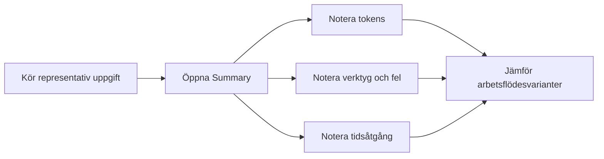
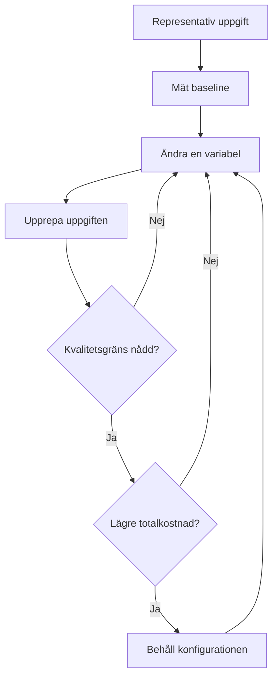

import { Steps, Tabs, TabItem } from "@astrojs/starlight/components";

# Mät innan du kapar

Optimering utan mätning är gissningar. Du kan råka ta bort ett verktyg som sparade tid, korta en prompt som förhindrade omkörningar eller byta modell utan att veta om ändringen hjälpte.

Det här kapitlet ger dig en liten verktygslåda för mätning i VS Code. Använd den för att besvara fyra frågor:

- Vilka enskilda förfrågningar är dyra?
- Hur mycket har hela sessionen förbrukat?
- Hur nära är du din månatliga allowance?
- Vilka arbetsflödesändringar minskar kostnaden utan att sänka kvaliteten?

*(Se [Ordlista](/vibe-on-budget/sv/glossary) för definitioner av optimeringsloop och kvalitetsgräns.)*

---

## Credit hover per förfrågan 🟢

Det snabbaste sättet att granska en förfrågan är att hovra över Copilot-svaret i Chat. VS Code visar **credit consumption** för just det steget.[^m3-2] Det är kostnaden för en förfrågan, inte den totala kostnaden för konversationen.

Använd den här vyn när du jämför liknande prompts. En kort fråga kan ändå vara dyr om den innehåller mycket kontext, många verktygsdefinitioner eller en lång agentloop. Omvänt kan en längre prompt vara billig om den omgivande kontexten är liten och stabil.

### En snabb jämförelse

1. Be Copilot utföra en representativ uppgift.
2. Hovra över svaret och notera credit consumption.
3. Upprepa samma uppgift efter att du ändrat en variabel.
4. Jämför resultatet och kvaliteten på svaret.

:::note[Vad du ska notera]
Notera uppgiften, modellen, promptvarianten, credits, tidsåtgång och om resultatet krävde en omkörning. Ett billigare första svar är inte en besparing om det skapar två dyra följdfrågor.
:::

**Action:** Välj en uppgift du gör regelbundet och notera credit consumption för tre jämförbara förfrågningar.

---

## Ackumulerad sessionskostnad 🟢

Kostnaden per förfrågan är användbar, men visar inte hela notan för en lång agentsession. **[Context window control](https://code.visualstudio.com/docs/chat/copilot-chat)** i chattens inmatningsfält ger dig helhetsbilden.[^m3-3] Hovra över eller klicka på den för att se totala credits och tokenuppdelning för den aktuella sessionen.


Den här vyn kompletterar hoverinformationen per steg:

| Vy | Besvarar | Bäst för |
|---|---|---|
| Hover över svar | Hur mycket kostade detta steg? | Jämföra prompts och enskilda steg |
| Context window control | Hur mycket har sessionen kostat? | Hitta dyra sessioner och växande kontext |

En session kan bli dyr även när ingen enskild förfrågan ser alarmerande ut. Konversationshistorik, verktygsanrop och upprepad kontext byggs på. Kontrollera sessionssumman innan du bestämmer dig för att ett arbetsflöde är effektivt.

:::tip[Mät hela uppgifter]
En bra mätenhet är hela uppgiften: första prompten, verktygsanrop, korrigeringar, omkörningar och slutligt svar. Notera den totala sessionskostnaden tillsammans med resultatets kvalitet.
:::

**Takeaway:** Använd hover för lokala beslut och context window control för totalkostnaden för att slutföra en uppgift.

---

## Månadsdashboard 🟢

**[Copilot-statusfältet](https://code.visualstudio.com/docs/agents/optimize-usage-guide)** i VS Code ger dig ett månadsperspektiv. Välj det för att öppna statusdashboarden, där du ser hur stor del av din månatliga allowance du har använt.[^m3-4] Dashboarden visar AI credits och, för Copilot Free, även inline suggestions.


Månadsdashboarden ersätter inte informationen per förfrågan. Den är en budgetsignal. Om användningen ökar snabbt använder du detaljvyerna för att hitta orsaken i stället för att bara försöka skicka färre meddelanden.

Leta efter mönster som:

- Ett projekt där agentsessioner konsekvent förbrukar fler credits
- En modell som ger många omkörningar för en viss typ av uppgift
- Ett verktygstungt arbetsflöde som lägger mer tid på utforskning än implementation
- En förändring i veckoanvändningen efter att du lagt till instruktioner eller MCP-servrar

:::caution[Allowance är inget kvalitetsmått]
Färre credits är inte automatiskt bättre. Ett billigt arbetsflöde som ger felaktig kod, missar tester eller kräver manuell reparation kan kosta mer totalt.
:::

**Action:** Kontrollera statusdashboarden en gång i veckan och notera procenten som använts, dina vanligaste uppgiftstyper och tydliga förändringar från föregående vecka.

---

## [`/chronicle:cost-tips`](https://code.visualstudio.com/docs/agents/run/sessions/session-history#_query-session-history-with-chronicle) 🟢

Du kan be VS Code om personliga rekommendationer baserade på din senaste aktivitet. Kör `/chronicle:cost-tips` i valfri chatt. Den analyserar aktuell sessionshistorik och ger praktiska förslag på hur du kan minska användningen.

Det är användbart när du vet att förbrukningen har ökat men inte direkt ser varför. Rekommendationerna kan peka på dyra mönster som upprepade omkörningar, överdimensionerad kontext eller ineffektiva sessionsgränser.

:::note[Integritet och tolkning]
Se rekommendationerna som hypoteser att testa. Kontrollera dem mot uppgiftskvaliteten och creditinformationen i VS Code innan du ändrar arbetsflödet.
:::

Läs mer om att fråga sessionshistoriken med Chronicle i [VS Code-dokumentationen](https://code.visualstudio.com/docs/agents/run/sessions/session-history#_query-session-history-with-chronicle).[^m3-1]

**Action:** Kör `/chronicle:cost-tips` efter en vecka av normalt arbete och välj en rekommendation att testa — inte alla på en gång.

---

## [Agent Debug Logs — Summary view](https://code.visualstudio.com/docs/agents/agent-troubleshooting) 🟢

För mer detaljerad evidens aktiverar du filloggning i VS Code-inställningarna:[^m3-5]

```json
"github.copilot.chat.agentDebugLog.fileLogging.enabled": true
```

Öppna sedan **Chat view → ... → Show Agent Debug Logs → Summary**. Summary-vyn ger en sessionsöversikt med bland annat:

- Antal input-, output- och totala tokens
- Verktygsanrop
- Fel
- Tidsåtgång
- Sessions- och förfrågningsdetaljer

Det här är vyn du använder när credit hover visar att något är dyrt men inte varför. Lång tidsåtgång, upprepade verktygsanrop eller fel följda av omkörningar förklarar ofta skillnaden.



:::tip[Skapa en liten baseline]
För en representativ uppgift skriver du ner kvalitet, credits, input tokens, output tokens, tidsåtgång, verktygsanrop och fel. Nu har du en baseline att jämföra med efter varje kontrollerad ändring.
:::

**Takeaway:** Använd Summary när du behöver diagnostiska detaljer, inte bara en kostnadssiffra.

---

## [Cache Explorer-vyn](https://code.visualstudio.com/docs/agents/agent-troubleshooting/cache-explorer) 🟢

I Agent Debug Logs finns också **Cache Explorer**. Den visar prompt cache hit rates och hur många input tokens som återanvändes.[^m3-6] Det är viktigt eftersom två sessioner med ungefär lika många tokens kan ha olika kostnad när den ena återanvänder mer cachad input.

Använd Cache Explorer för att undersöka frågor som:

- Återanvände upprepade steg det stabila promptprefixet?
- Minskar ändringar av verktyg, instruktioner eller modeller cacheträffarna?
- Beräknas input tokens om när de borde kunna återanvändas?

Läs mer i [dokumentationen om Cache Explorer](https://code.visualstudio.com/docs/agents/agent-troubleshooting/cache-explorer).

:::caution[Optimera inte cacheträffar isolerat]
En högre cacheträffsfrekvens är bara bra när den cachade kontexten fortfarande är relevant. En gammal och överdimensionerad session kan ge bättre återanvändning men göra uppgiften långsammare och mindre träffsäker.
:::

**Action:** Inspektera Cache Explorer för en lång session och notera träfffrekvens, återanvända input tokens och när cachen ändrades.

---

## Optimeringsloopen 🟢

Målet är inte att minimera credits till varje pris. Målet är att nå en kvalitetsgräns med lägsta tillförlitliga kostnad.

Använd den här loopen genom hela kursen:

<Steps>
1. **Kör en representativ uppgift och mät baslinjen.** Notera kvalitet, credits, tokens, tidsåtgång, verktygsanrop och fel.
2. **Ändra en variabel.** Välj modell, tillgängliga verktyg, delegeringsstrategi eller grounding-källa — men inte flera samtidigt.
3. **Upprepa samma uppgift.** Håll uppgiften, acceptanskriterierna och utvärderingen så lika som möjligt.
4. **Jämför och behåll den bättre konfigurationen.** Behåll konfigurationen som når din kvalitetsgräns till lägst kostnad.
</Steps>



Ändra till exempel inte modell, ta bort hälften av verktygen och skriv om instruktionerna i samma experiment. Om resultatet blir bättre vet du inte vilken ändring som hjälpte. Om det blir sämre vet du inte vad du ska återställa.

Den här loopen återkommer genom resten av kursen. Varje teknik kan valideras med samma evidens: resultatet är tillräckligt bra och arbetet kostar mindre eller tar kortare tid.

:::tip[Definiera kvalitetsgränsen]
Bestäm vad “tillräckligt bra” betyder innan du jämför kostnader: testerna går igenom, rätt filer ändras, inga kritiska fel uppstår och resultatet kräver högst en mindre korrigering. Utan en gräns kan kostnadsoptimering i smyg bli kvalitetsminskning.
:::

**Action:** Skapa en experimentlogg med fyra rader för nästa uppgift: baseline, en ändring, upprepning och beslut.

---

## Övning

1. Välj en uppgift du gör regelbundet (till exempel "lägg till en valideringsfunktion"). Notera prompten du använde, modellen, förbrukade credits (hovra) och om resultatet krävde en omkörning. Detta är din baslinje.
2. Öppna Agent Debug Logs → Summary för din senaste session. Skriv ner totala tokens, verktygsanrop, fel och tidsåtgång. Vilken siffra överraskade dig mest?
3. Kör `/chronicle:cost-tips` i valfri chatt. Välj EN rekommendation och testa den på din nästa uppgift.

## Viktiga slutsatser

- Hovra över ett svar för att se credit consumption för en enskild förfrågan.
- Använd context window control för totala credits och tokenuppdelning för sessionen.
- Använd Copilot status dashboard för att följa din månatliga allowance.
- Kör `/chronicle:cost-tips` för personliga råd baserade på senaste aktiviteten.
- Använd Agent Debug Logs Summary för tokens, verktygsanrop, fel och tidsåtgång.
- Använd Cache Explorer för att förstå cacheträffar och återanvända input tokens.
- Ändra en variabel i taget och behåll den billigaste konfigurationen som når kvalitetsgränsen.

:::tip[Fortsätt lära dig]
Omsätt din baslinje i handling med [Snabba vinster](/vibe-on-budget/sv/04-quick-wins), och förbättra sedan dina prompter med [Skriva promptar som kostar mindre](/vibe-on-budget/sv/05-cheaper-prompts).
:::

*Beräknad lästid: 8 minuter*

[^m3-1]: [Query session history with Chronicle](https://code.visualstudio.com/docs/agents/run/sessions/session-history#_query-session-history-with-chronicle) — VS Code Documentation.
[^m3-2]: [Optimize AI credit usage in VS Code](https://code.visualstudio.com/docs/agents/guides/optimize-usage) — VS Code Documentation. Beskriver creditförbrukningen per steg för enskilda förfrågningar.
[^m3-3]: [Manage agent sessions in VS Code](https://code.visualstudio.com/docs/agents/run/sessions/manage-sessions) — VS Code Documentation. Beskriver context window control och dess uppdelning av sessionens credits och tokens.
[^m3-4]: [Optimize AI credit usage in VS Code](https://code.visualstudio.com/docs/agents/guides/optimize-usage) — VS Code Documentation. Beskriver Copilot-statusfältet och månadsöversikten.
[^m3-5]: [Debug chat interactions](https://code.visualstudio.com/docs/agents/agent-troubleshooting/chat-debug-view) — VS Code Documentation. Dokumenterar Agent Logs och Chat Debug-vyn för att granska förfrågningar och verktygsanrop.
[^m3-6]: [Diagnose prompt caching with the Cache Explorer](https://code.visualstudio.com/docs/agents/agent-troubleshooting/cache-explorer) — VS Code Documentation. Dokumenterar cacheträffar, cachemissar och återanvända input-tokens.
