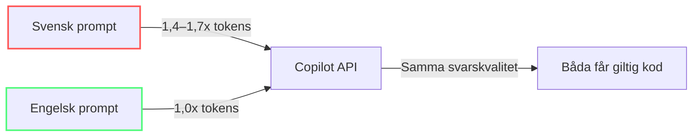

import { Steps, Tabs, TabItem } from "@astrojs/starlight/components";

# Skriva promptar som kostar mindre

Modul 4 gav dig engångskonfiguration — instruktioner och inställningar som du sätter en gång och sedan glömmer. Den här modulen lär dig den löpande färdigheten att skriva varje prompt effektivt. Samma mål (färre tokens), en annan tidsram (varje gång du skriver).

*(Se [Ordlista](/vibe-on-budget/sv/glossary) för definitioner av tokenizer, metaprompt och grottmännisko-språk.)*

Promptengineering undervisas vanligtvis för *kvalitet*. Den här modulen lär ut det för *kostnad*: behåll avsikten och begränsningarna som förbättrar resultatet, men ta bort ord som inte gör det.

---


## Tokenkostnaden för vaghet 🟢

Varje tvetydigt ord i din prompt tvingar modellen att generera fler output-tokens — resonemangskedjor, svävande språk, förtydliganden, alternativ. Output-tokens kostar 5x input, så vaghet är bokstavligen 5x dyrare än att vara specifik.[^m5-7]

**Före (vagt, dyrt):**
> "Kan du titta på den här funktionen och göra den bättre? Jag tror den kanske är lite långsam."

**Efter (specifikt, billigt):**
> "Refaktorera #file:calc.ts till Map istället för nästlade for-loopar. O(1)-slagning. Kod endast."

Den andra versionen är 70% färre input-tokens (8 ord vs 24) och producerar ~90% färre output-tokens eftersom modellen inte genererar förklaringar.

---

## Strukturera din prompt: Punkter > Prosa 🟢

Prosaprompts med fullständiga meningar och artiga hälsningar slösar tokens på grammatik. Punktlistor gör uppgiften, begränsningarna och outputformatet skanningsbara utan att ta bort användbar avsikt.

**Prosa (dyrt):**
```
Hej! Skulle du kunna hjälpa mig att skriva en funktion som validerar
en e-postadress? Jag skulle vilja att den kontrollerar @-symbolen och
ser till att det finns ett domännamn. Tack!
```

**Punktlista (billigt):**
```
- Skriv e-postvalideringsfunktion
- Kontrollera: @-symbol närvarande, domän efter @
- Returnera boolean
- Kod endast, ingen förklaring
```

**Skillnaden:** 38 tokens → 18 tokens. Över 100 promptar är det 2 000 tokens sparade på input enbart, plus output-tokens från kortare svar.

---

## Bifoga avsikt till kod istället för att förklara 🟢

Istället för att beskriva vad din kod gör i naturligt språk (slösar tokens på både beskrivningar och att modellen läser om din kod), referera till filen och lägg till en kommentar som fångar din avsikt.

**Före:**
> "Jag har en funktion som bearbetar användardata. Den tar en lista med användare och filtrerar bort inaktiva, sorterar sedan efter registreringsdatum..."

**Efter:**
```
#file:processUsers.ts
// TODO: Lägg till paginering, begränsa 100 per sida, sortera efter registrationDate desc
```

Modellen läser koden direkt och använder din kommentar som avsiktssignal. Ingen redundant beskrivning, inga hallucinationer om vad koden gör.

:::tip[Avsiktskommentarer]
Lägg till `// AI:`-kommentarer i din kod som krokar:
```typescript
// AI: Denna funktion anropas 10k gånger/sek. Prioritera hastighet över läsbarhet.
```
Modellen läser kommentaren tillsammans med koden, vilket sparar en full förklaring i chatten.
:::

---

## Grottmännisko-språk: Praktisk tokenkomprimering 🟢[^m5-4]

Grottmännisko-språk tar bort artiklar, prepositioner, artighet och grammatik — och behåller bara semantiska nyckelord. Det är en säker och måttlig teknik för tokenreduktion.

| Normal engelska | Grottmännisko-språk | Tokenbesparing |
|---|---|---|
| "Can you please help me write a function that parses a CSV file?" | "Write CSV parser. Code only." | ~12% |
| "What's the best way to handle errors in this async function?" | "Best error handling pattern for #file:fetch.ts async." | ~10% |
| "Could you review my code and tell me if there are any security issues?" | "Security audit #file:auth.ts. OWASP Top 10. Critical only." | ~14% |

:::note[Oberoende benchmark]
Oberoende tester av [JetBrains (juli 2026)](https://blog.jetbrains.com/ai/2026/07/speak-to-ai-agents-like-cavemen-tosave-tokens/) mätte ~8,5% besparing av output-tokens över 82 parade uppgifter.[^m5-1] Det är mindre än marknadsförda påståenden men genuint och säkert — avrunda till ~10% som en praktisk tumregel.
:::

## Metapromptar för outputkontroll 🟡

Styr output-utförlighet med explicita begränsningar:

| Användningsfall | Metaprompt |
|---|---|
| Bugförklaring | "Svara max 3 punkter, 10 ord var. Skippa grammatik." |
| Kodgranskning | "Endast kritiska brister. Ingen positiv feedback, inga förslag." |
| Tillståndssynk | "Sammanfatta i tät 3-rads tillståndssynk för ny tråd." |
| Boilerplate | "Exkludera imports, setup, config. Endast kärnalgoritm." |
| Lat läge | "Ställ 2 riktade frågor innan du genererar någon kod." |
| Testgenerering | "Generate Vitest test. Include happy path + 2 edge cases. AAA pattern." |

---

## Verktyg som inte levererar: [RTK (Rust Token Killer)](https://github.com/rtk-ai/rtk)-fallstudien 🟡

[RTK (Rust Token Killer)](https://github.com/rtk-ai/rtk) är en CLI-proxy som komprimerar skalutdata innan modellen läser den. Leverantören marknadsför 60–90% tokenreduktion.[^m5-3]

- **Marknadsförs:** 60–90% tokenreduktion
- **[JetBrains mätte](https://blog.jetbrains.com/ai/2026/07/rtk-claude-code-token-savings/):** **+7,6% dyrare** i juli 2026 över 80 parade uppgifter[^m5-2]

Varför kostade ett komprimeringsverktyg mer?

- Komprimerad utdata dolde ibland precis tillräckligt med detaljer för att utlösa extra utforskningssteg
- Cacheprissättning innebär att många "sparade" input-tokens redan var nästan gratis
- När agenten behöver köra om något raderar den extra rundresan den ursprungliga vinsten

**Lärdom:** Ett verktygs egna besparingsmått mäter dess kontrafaktiska scenario, inte din faktura. Leta alltid efter oberoende benchmarkresultat.

:::tip[Billigt slår smart]
Det billigaste LLM-anropet är det du inte gör.[^m5-9] Förbered deterministiska data utanför agentloopen.
:::

## Engelska vs svenska: 1,4–1,7× tokenskillnad 🟢

Svenska tokeniseras **~1,4–1,7× mindre effektivt** än engelska, beroende på tokenizer.[^m5-5][^m5-6] Äldre tokenizers (GPT-4, Mistral) visar en större skillnad (~1,7×); nyare tokenizers (GPT-5 o200k) minskar den till ~1,4–1,5×. Detta beror på att engelska har kortare genomsnittlig ordlängd och vanligare delordsmönster.

```
Engelska: "Create login validation. Handle empty fields."
→ ~7 tokens

Svenska: "Skapa inloggningsvalidering. Hantera tomma fält."
→ ~12 tokens (~1.5x more)
```

Den praktiska effekten: **skriv promptar på engelska även om du chattar på svenska**. Svaret kommer korrekt tillbaka, och du sparar ~30–40% tokenkostnad, beroende på tokenizer.[^m5-8]



:::note[Det ackumuleras]
För ett team som skickar 10 000 promptar/månad kan skillnaden engelska-vs-svenska ensam spara ~30 000 tokens. Vid $5/M output-tokens motsvarar 30 000 tokens $0,15. De verkliga besparingarna från språkval kommer av att effekten ackumuleras över tusentals förfrågningar.
:::

---

## När komprimering slår tillbaka 🟡

Alla promptar bör inte komprimeras. Här är när utförlighet är värt kostnaden:

| Situation | Varför vara utförlig | Rekommendation |
|---|---|---|
| Komplex arkitektur | Full kontext behövs för korrekt design | Komprimera inte |
| Säkerhetsgranskning | Missad nyans = missad sårbarhet | Skriv kompletta promptar |
| Första interaktion med ny kodbas | Modellen behöver grundlig orientering | Inkludera alla relevanta filer |
| Refaktorering över flera filer | Glesa instruktioner → fel implementation | Var tydlig med omfattning |

Regeln: **komprimera output, inte avsikt**. Behåll namn, begränsningar, edge cases och framgångskriterier. Ta bort hälsningar, upprepad kontext och förklaringar av kod som modellen kan inspektera direkt.

Jämför avvägningen:

**För komprimerat:**
```
- Fixa auth
- Gör säkert
- Kod endast
```

**Komprimerat utan att förlora avsikten:**
```
- Inspektera #file:auth.ts och #file:auth.test.ts
- Åtgärda session fixation efter inloggning
- Behåll rotation av refresh-token
- Lägg till regressionstest för återanvänt sessions-ID
- Returnera endast ändrade rader
```

Den första prompten är kort men tvingar fram upptäckt, förtydliganden eller en riskfylld gissning. Den andra tar bort utfyllnad men behåller säkerhetsgränsen och verifieringsmålet. Några extra input-tokens är billigare än en misslyckad implementation och dess uppföljning.

---

:::tip[Fortsätt lära]
Kombinera prompttekniker med [Projektinställningar](/vibe-on-budget/sv/06-project-setup) för tokeneffektivitet i hela stacken. För avancerade mönster, se [Agenter, verktyg och MCP-hygien](/vibe-on-budget/sv/07-agents-mcp).
:::

---

## Övning

1. Ta dina tre senaste Copilot-promptar. Skriv om var och en i punktformat. Räkna den ungefärliga tokenskillnaden (1 token ≈ 4 tecken på engelska).
2. Lägg till en `// AI:`-kommentar i en funktion som du ofta frågar Copilot om. Nästa gång, referera till filen med `#file:` i stället för att beskriva den.
3. Om du vanligtvis skriver promptar på svenska, skriv dina nästa fem promptar på engelska. Kontrollera om svarskvaliteten är densamma.

---

## Viktiga slutsatser

- **Punktlistor** använder hälften av tokens jämfört med prosa för samma avsikt
- **Referera filer direkt** (#file:) — beskriv inte vad som redan finns i kod
- **Grottmännisko-språk** ger en liten men verklig vinst — ungefär ~10% besparing av output-tokens i oberoende tester
- **Metapromptar** kontrollerar output-utförlighet (där den verkliga kostnaden är)
- **Benchmarka verktyg oberoende** — en proxy kan minska tokens och ändå höja din faktura
- **Skriv på engelska** även om du tänker på svenska — ~30–40% tokenbesparing, beroende på tokenizer
- **Överkomprimera inte** — att spara 20 tokens som orsakar ett felaktigt svar kostar mer

*Beräknad lästid: 10 minuter*

[^m5-1]: [Speaking to AI Agents like Cavemen Saves 65% of Tokens. We Test](https://blog.jetbrains.com/ai/2026/07/speak-to-ai-agents-like-cavemen-tosave-tokens/) — JetBrains, juli 2026. Rapporterar SkillsBench-benchmarken med parade uppgifter och en uppmätt besparing på 8,5 % av output-tokens.
[^m5-2]: [rtk Claude Code Token Savings: A Skill Trial Benchmark](https://blog.jetbrains.com/ai/2026/07/rtk-claude-code-token-savings/) — JetBrains, juli 2026. Rapporterar 7,6 % högre kostnad vid låg resonemangsnivå över 80 parade uppgifter och ingen förändring vid hög nivå.
[^m5-3]: [rtk-ai/rtk](https://github.com/rtk-ai/rtk) — projektets källkod och annonserade intervall för komprimering av kommandoutdata.
[^m5-4]: [JuliusBrussee/caveman](https://github.com/JuliusBrussee/caveman) — Caveman-verktygets kodarkiv, som testades av JetBrains.
[^m5-5]: [Tokenizer Evaluation on European Languages](https://occiglot.eu/posts/eu_tokenizer_perfomance/) — Occiglot. Definierar subword-fertilitet och jämför flera tokenizers och europeiska språk-korpusar.
[^m5-6]: [The Hidden Cost of Tokenization: Why (most) Non-English Speakers Pay More](https://zenodo.org/records/20028344) — Zenodo-post för artikeln om tokeniseringens flerspråkiga kostnader och åtkomsteffekter.
[^m5-7]: [Module 1: The Hidden Tax — The Asymmetric Pricing Problem](/vibe-on-budget/en/01-hidden-tax#the-asymmetric-pricing-problem) — kursens pristabell dokumenterar det illustrativa exemplet med 1 dollar/M input mot 5 dollar/M output.
[^m5-8]: [Tiktokenizer](https://tiktokenizer.vercel.app/) — interaktiv tokenizer-visualisering för att återskapa textspecificerade tokenräkningar; resultaten varierar mellan modelltokenizers.
[^m5-9]: [The cheapest LLM call is the one you don't make](https://dev.to/xuanyi/the-cheapest-llm-call-is-the-one-you-dont-make-a-caching-layer-that-actually-pays-off-59e) — praktisk diskussion om cacheeffektivitet; används här som effektivitetsprincip, inte som ett påstående om ursprungligt författarskap.