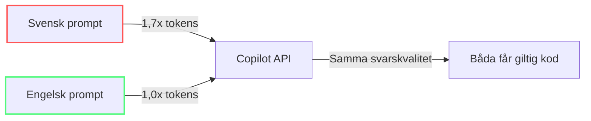

import { Steps, Tabs, TabItem } from "@astrojs/starlight/components";

# Skriva promptar som kostar mindre

Promptengineering undervisas vanligtvis för *kvalitet*. Denna modul lär ut det för *kostnad*. Samma koncept, annan prioritet — resultat behöver vara *tillräckligt bra* medan de spenderar så få tokens som möjligt.

---

## Tokenkostnaden för vaghet

Varje tvetydigt ord i din prompt tvingar modellen att generera fler output-tokens — resonemangskedjor, svävande språk, förtydliganden, alternativ. Output-tokens kostar 5x input, så vaghet är bokstavligen 5x dyrare än att vara specifik.

**Före (vagt, dyrt):**
> "Kan du titta på den här funktionen och göra den bättre? Jag tror den kanske är lite långsam."

**Efter (specifikt, billigt):**
> "Refaktorera #file:calc.ts till Map istället för nästlade for-loopar. O(1)-slagning. Kod endast."

Den andra versionen är 70% färre input-tokens (8 ord vs 24) och producerar ~90% färre output-tokens eftersom modellen inte genererar förklaringar.

---

## Strukturera din prompt: Punkter > Prosa

Prosaprompts med fullständiga meningar och artiga hälsningar slösar tokens på grammatik. Punktlistor förmedlar samma avsikt till halva storleken.

**Prosa (dyrt):**
```
Hej! Skulle du kunna hjälpa mig att skriva en funktion som validerar
en e-postadress? Jag skulle vilja att den kontrollerar @-symbolen och
ser till att det finns ett domännamn. Tack!
```

**Punktlista (billigt):**
```
- Skriv e-postvalideringsfunktion
- Kontrollera: @-symbol närvarande, domän efter @
- Returnera boolean
- Kod endast, ingen förklaring
```

**Skillnaden:** 38 tokens → 18 tokens. Över 100 promptar är det 2 000 tokens sparade på input enbart, plus output-tokens från kortare svar.

---

## Bifoga avsikt till kod istället för att förklara

Istället för att beskriva vad din kod gör i naturligt språk (slösar tokens på både beskrivningar och att modellen läser om din kod), referera till filen och lägg till en kommentar som fångar din avsikt.

**Före:**
> "Jag har en funktion som bearbetar användardata. Den tar en lista med användare och filtrerar bort inaktiva, sorterar sedan efter registreringsdatum..."

**Efter:**
```
#file:processUsers.ts
// TODO: Lägg till paginering, begränsa 100 per sida, sortera efter registrationDate desc
```

Modellen läser koden direkt och använder din kommentar som avsiktssignal. Ingen redundant beskrivning, inga hallucinationer om vad koden gör.

:::tip[Avsiktskommentarer]
Lägg till `// AI:`-kommentarer i din kod som krokar:
```typescript
// AI: Denna funktion anropas 10k gånger/sek. Prioritera hastighet över läsbarhet.
```
Modellen läser kommentaren tillsammans med koden, vilket sparar en full förklaring i chatten.
:::

---

## Grottmännisko-språk: Praktisk tokenkomprimering

Grottmännisko-språk tar bort artiklar, prepositioner, artighet och grammatik — och behåller bara semantiska nyckelord. Det är en säker och måttlig teknik för tokenreduktion.

| Normal engelska | Grottmännisko-språk | Tokenbesparing |
|---|---|---|
| "Can you please help me write a function that parses a CSV file?" | "Write CSV parser. Code only." | ~12% |
| "What's the best way to handle errors in this async function?" | "Best error handling pattern for #file:fetch.ts async." | ~10% |
| "Could you review my code and tell me if there are any security issues?" | "Security audit #file:auth.ts. OWASP Top 10. Critical only." | ~14% |

:::note[Oberoende benchmark]
Oberoende tester av JetBrains (juli 2026) mätte ~8,5% besparing av output-tokens över 82 parade uppgifter. Det är mindre än marknadsförda påståenden men genuint och säkert — avrunda till ~10% som en praktisk tumregel.
:::

### Grottmännisko-exekveringsprompten

Använd detta som en metaprompt i början av en session eller i din `copilot-instructions.md`:

```
# Output-format
- Endast kodblock. Ta bort all text, hälsningar, förklaringar.
- Ingen markdown utanför kodblocket.
- Oförändrad kod → // ... existing code ...
```

Denna enda instruktion kan minska **~10% av output-tokens (oberoende benchmark)** per svar.

---

## Metapromptar för outputkontroll

Styr output-utförlighet med explicita begränsningar:

| Användningsfall | Metaprompt |
|---|---|
| Bugförklaring | "Svara max 3 punkter, 10 ord var. Skippa grammatik." |
| Kodgranskning | "Endast kritiska brister. Ingen positiv feedback, inga förslag." |
| Tillståndssynk | "Sammanfatta i tät 3-rads tillståndssynk för ny tråd." |
| Boilerplate | "Exkludera imports, setup, config. Endast kärnalgoritm." |
| Lat läge | "Ställ 2 riktade frågor innan du genererar någon kod." |
| Diff-utdata | "Use unified diff. Only changed lines +/- with 3 context lines. No full file output." |

---

## Verktyg som inte levererar: RTK-fallstudien

RTK (Rust Token Killer) är en CLI-proxy som komprimerar skalutdata innan modellen läser den. Leverantören marknadsför 60–90% tokenreduktion.

- **Marknadsförs:** 60–90% tokenreduktion
- **JetBrains mätte:** **+7,6% dyrare** i juli 2026 över 80 parade uppgifter

Varför kostade ett komprimeringsverktyg mer?

- Komprimerad utdata dolde ibland precis tillräckligt med detaljer för att utlösa extra utforskningssteg
- Cacheprissättning innebär att många "sparade" input-tokens redan var nästan gratis
- När agenten behöver köra om något raderar den extra rundresan den ursprungliga vinsten

**Lärdom:** Ett verktygs egna besparingsmått mäter dess kontrafaktiska scenario, inte din faktura. Leta alltid efter oberoende benchmarkresultat.

:::tip[Billigt slår smart]
Det billigaste LLM-anropet är det du inte gör. Förbered deterministiska data utanför agentloopen.
:::

---

Se [Modul 4 — Quick Win #6](/token-economy-course/sv/04-quick-wins) för hur unified diffs eliminerar LLM-lathet och minskar output-tokens med 70–80%.

---

## Engelska vs svenska: 1,7x tokenskillnad

Svenska tokeniseras **~1,7x mindre effektivt** än engelska med de flesta tokenizer. Detta beror på att engelska har kortare genomsnittlig ordlängd och vanligare delordsmönster.

```
Engelska: "Create login validation. Handle empty fields."
→ ~7 tokens

Svenska: "Skapa inloggningsvalidering. Hantera tomma fält."
→ ~12 tokens (1,7x fler)
```

Den praktiska effekten: **skriv promptar på engelska även om du chattar på svenska**. Svaret kommer korrekt tillbaka, och du sparar ~40% tokenkostnad.



:::note[Det ackumuleras]
För ett team som skickar 10 000 promptar/månad kan skillnaden engelska-vs-svenska ensam spara ~30 000 tokens. Vid $5/M output-tokens motsvarar 30 000 tokens $0,15. De verkliga besparingarna från språkval kommer av att effekten ackumuleras över tusentals förfrågningar.
:::

---

## När komprimering slår tillbaka

Alla promptar bör inte komprimeras. Här är när utförlighet är värt kostnaden:

| Situation | Varför vara utförlig | Rekommendation |
|---|---|---|
| Komplex arkitektur | Full kontext behövs för korrekt design | Komprimera inte |
| Säkerhetsgranskning | Missad nyans = missad sårbarhet | Skriv kompletta promptar |
| Första interaktion med ny kodbas | Modellen behöver grundlig orientering | Inkludera alla relevanta filer |
| Refaktorering över flera filer | Glesa instruktioner → fel implementation | Var tydlig med omfattning |

Regeln: **komprimera output, inte avsikt**. Spara inte 20 tokens om det kostar dig 500 tokens av felaktig output och en omstart.

---

## Viktiga slutsatser

- **Punktlistor** använder hälften av tokens jämfört med prosa för samma avsikt
- **Referera filer direkt** (#file:) — beskriv inte vad som redan finns i kod
- **Grottmännisko-språk** ger en liten men verklig vinst — ungefär ~10% besparing av output-tokens i oberoende tester
- **Metapromptar** kontrollerar output-utförlighet (där den verkliga kostnaden är)
- **Benchmarka verktyg oberoende** — en proxy kan minska tokens och ändå höja din faktura
- **Skriv på engelska** även om du tänker på svenska — 1,7x tokenbesparing
- **Överkomprimera inte** — att spara 20 tokens som orsakar ett felaktigt svar kostar mer

*Beräknad lästid: 10 minuter*