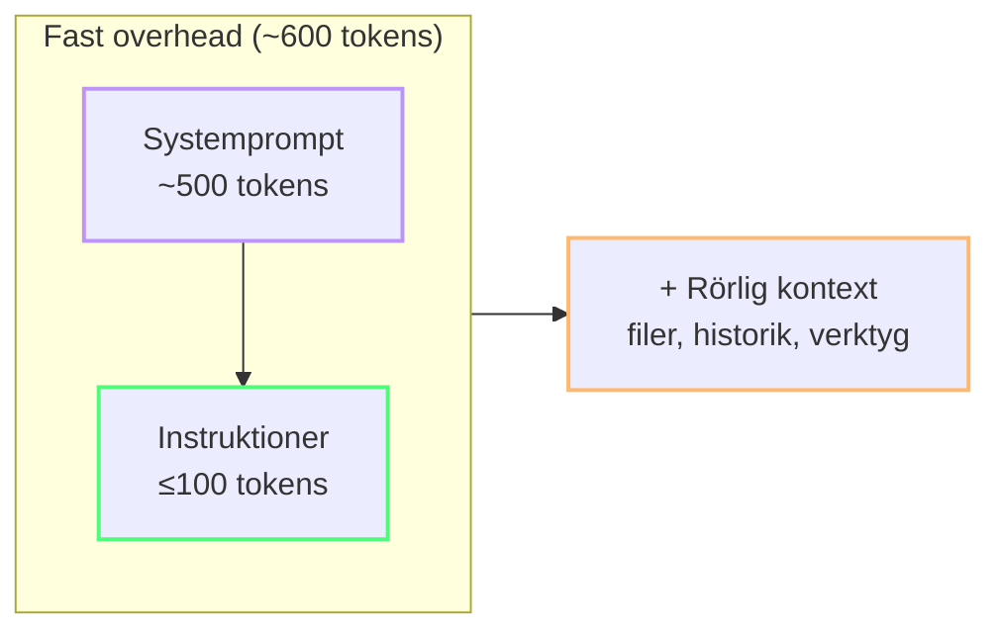

import { Steps, Tabs, TabItem } from "@astrojs/starlight/components";

# Projektinställningar för tokeneffektivitet

Filerna du skapar (eller inte skapar) i ditt projekt bestämmer hur många tokens Copilot spenderar på **varje** förfrågan. Denna modul går igenom exakta filer och konfigurationer som minskar tokenförbrukningen i hela projektet.

---

## Alltid-på-skatten

Dessa filer laddas vid **varje chattinteraktion**:

| Fil | Laddas när | Tokenkostnad (typisk) |
|---|---|---|
| `.github/copilot-instructions.md` | Alltid | 50–2000+ tokens |
| `AGENTS.md` | Agentläge | 200–5000+ tokens |
| Öppna editorflikar | Alltid | 500–10 000+ tokens |
| VS Code-inställningar (Copilot-sektionen) | Alltid | ~50 tokens |

Huvudinsikten: **varje alltid-på-instruktion som är "bra-att-ha" men inte "kritisk just nu" är bortkastade tokens**.

---

## 1. Den minimala `copilot-instructions.md`

De flesta team överfyller denna fil med arkitekturdokument, stilguider och teamnormer. Allt skickas som systemkontext vid varje förfrågan — även den om att byta namn på en variabel.

### Mall: Minimal (tokenoptimerad)

```markdown
# Output-format
- Endast kodblock. Ta bort text, hälsningar, förklaringar.
- Ersätt oförändrad kod med: // ... existing code ...
- Ingen markdown-text utanför kodblocket.

# Språk
- Engelska för alla promptar och svar (1,7x tokenbesparing vs svenska)
```

**Det är allt.** 18 rader, ~50 tokens. Täcker output-komprimering (den enskilt största besparingen) och språkval.

### Mall: Medium (balanserad)

```markdown
# Output-format
- Endast kodblock. Ta bort text, hälsningar, förklaringar.
- Ersätt oförändrad kod med: // ... existing code ...

# Språk
- Engelska för alla promptar och svar

# Projektkontext
- Ramverk: Astro 5 + Starlight
- Pakethanterare: npm
- Tester: Vitest med @testing-library/dom
- Ingen TypeScript — använd JSDoc för typer
```

~80 tokens. Lägger till tillräckligt med kontext för att modellen ska generera relevant kod utan att måla upp en full arkitekturbild.

### Vad du INTE ska ha här

- ❌ API-nycklar eller hemligheter (dessa skickas till modellen!)
- ❌ Arkitekturdokumentation på flera sidor
- ❌ Full komponentbiblioteksdokumentation
- ❌ Teamkodningskonventioner ("vi skriver ren kod")
- ❌ Föråldrade beslut som inte längre gäller

:::caution[Instruktionssvällning är evig skuld]
Varje rad du lägger till i `copilot-instructions.md` betalas på **varje enskild förfrågan** av **varje teammedlem**. En 1000-rads instruktionsfil kostar 500+ tokens × tusentals förfrågningar per dag.
:::

### Tak på 200 rader

Forskning visar att instruktionsfiler inte förblir små särskilt länge. Chakrabarti med flera (arXiv:2608.11095, augusti 2026) fann att instruktioner växte med **+226 %** under sin livstid när team fortsatte lägga till ytterligare ett undantag, en brasklapp eller en "tillfällig" regel.

- **200 rader ≈ 1 500–2 000 tokens** — tillräckligt litet för att förbli synligt i förgrunden, men stort nog för identitet, 2–3 hårda regler och hänvisningar till djupare dokumentation.
- **Över 200 rader** börjar modellen ägna mindre uppmärksamhet åt det tidiga innehållet. Filen blir osynlig ansamling: dyr, bekant och sällan omläst från början till slut.
- **Tokenmatematik:** En fil på 1 247 rader (~9 400 tokens) över 1 000 turer förbrukar **9,4 miljoner alltid-på-tokens**. Flytta samma vägledning till filsökvägsstyrda filer + skills, sänk alltid-på-lagret till 250 tokens och kostnaden sjunker till **250 000 tokens** — en **37× minskning** med identiska funktioner.

<Steps>
1. Granska dina instruktionsfiler med en tokenräknare.
2. Flytta ämnesspecifik vägledning till skills eller `.prompt.md`-filer.
3. Håll alltid-på-lagret så kort att en människa fortfarande kan läsa om och rensa det i ett enda sittningstillfälle.
</Steps>

### Promptkommentarer: bekämpa instruktionssvällning

Forskning tyder också på att instruktioner ansamlas eftersom **latent resonemang** — anledningen till att en regel finns — försvagas med tiden. När "varför" försvinner känns det riskabelt att radera gamla instruktioner, så de blir kvar för alltid.

Lösningen är enkel: kommentera viktiga regler med en HTML-kommentar som dokumenterar felet, hypotesen och resultatet.

```markdown
# Output-format
- Endast kodblock. Ta bort text, hälsningar, förklaringar.
<!-- FAILURE: 2026-06, utförliga svar förbrukade 3x budgeten för output-tokens.
  HYPOTHESIS: kodutdata utan text minskar output med 50–70 %.
  OUTCOME: 62 % färre output-tokens, ingen kvalitetsförlust. Behåll. -->
```

I verktyg som Claude Code och Codex CLI tas HTML-kommentarer bort före injicering, så du bevarar resonemanget till **noll tokenkostnad**. I Chakrabartis fältdata från 2026 minskade promptkommentarer överdriven instruktionstillväxt med **99,3 %**.

---

## 2. Lazy-loading med `.prompt.md`-filer

Istället för att svälla din alltid-på-fil, skapa specialiserade promptfiler som laddas endast när det behövs:

| Fil | Innehåll | När ska användas |
|---|---|---|
| `frontend-style.prompt.md` | CSS-konventioner, komponentmönster | Bygger UI |
| `db-schema.prompt.md` | Tabelldefinitioner, relationer | Skriver frågor |
| `testing.prompt.md` | Testkonventioner, mock-mönster | Skriver tester |

**Användning i chatten:**
```
Applicera regler från #file:frontend-style.prompt.md på denna komponent.
```

Modellen läser filen och tillämpar reglerna för denna förfrågan endast. Ingen alltid-på-skatt.

---

## 3. `AGENTS.md`-kontraktet

`AGENTS.md` definierar hur Copilot ska bete sig i **agentläge**. När den finns, laddas den som systemkontext för varje agentsteg.

`AGENTS.md` = **beteendekontrakt** (läge, omfattning, outputformat) — laddas alltid  
`.prompt.md`-filer = **domänkunskap** (arkitektur, konventioner, kända problem) — laddas vid behov via `#file:`

### Minimal token-effektiv mall

```markdown
# .github/AGENTS.md (eller .copilot/agents.md)

- Läge: Fråga först. Vägra flerstegs rekursiva mappgenomsökningar.
- Språk: Engelska (sparar 1,7x tokenizer-inflation).
- Omfattning: Utför åtgärder lokalt via CLI/terminal istället för agentiska sökslingor.
- Output: Endast ändrade kodblock. Returnera inte orörda omslag/imports/setups.
- Format: Täta punkter endast. Prosaförklaringar max 2 meningar.
```

:::note[Arkitektur och specar hör hemma i `.prompt.md`-filer]
Lägg arkitekturdokumentation, återkommande funktionsspecar och historiska "kända problem" i `.prompt.md`-filer — inte i `AGENTS.md`. Ladda dem vid behov med `#file:`-referenser. Då hålls `AGENTS.md` smal (~80 tokens) och du slipper betala alltid-på-skatten för innehåll du sällan behöver.

Se [Lazy-loading med `.prompt.md`-filer](#2-lazy-loading-med-promptmd-filer) ovan.
:::

~80 tokens. Täcker kritiska skyddsräcken utan arkitekturbrus.

---

## 4. Innehållsexkludering med `.copilotignore`

Copilot läser din arbetsytas filer för kontext. Exkludera filer som aldrig är användbara:

```gitignore
# .copilotignore
dist/
build/
node_modules/
tests/mock-data/
*.svg
*.csv
*.json
package-lock.json
*.lock
```

:::note[Vad ska exkluderas]
- **Byggartefakter** — aldrig användbara, kan vara stora
- **Mock/testdata** — sväller kontext, lägger till brus
- **Stora låsfiler** — package-lock.json ensam kan vara 10K+ tokens
- **Genererad kod** — auto-genererade filer, GraphQL-scheman, OpenAPI-specar
- **Binära/resursfiler** — bilder, ljud, typsnitt (kan inte bearbetas ändå)
:::

**Besparing:** 20–40% minskning av input-tokenförbrukning. Bonus: snabbare svar och färre hallucinationer från irrelevant kontext.

---

## 5. VS Code-inställningar för tokeneffektivitet

```json
{
  // Begränsa öppna filer som skickas som kontext
  "github.copilot.chat.experimental.context.autoOpenTabs.max": 5,

  // Aktivera token-felsökningsloggning
  "github.copilot.chat.agentDebugLog.fileLogging.enabled": true,

  // Standardmodell för nya chattar
  "github.copilot.chat.defaultModel": "claude-haiku-4.5",

  // Agentlägesinställningar
  "github.copilot.chat.agent.experimental.maxRequests": 20,
  "github.copilot.chat.agent.experimental.maxToolCallsPerStep": 10
}
```

| Inställning | Effekt |
|---|---|
| `autoOpenTabs.max: 5` | Skicka endast 5 öppna filer som kontext |
| `defaultModel: haiku` | Börja med billigaste modellen som standard |
| `maxRequests: 20` | Begränsa agentloopdjup |
| `maxToolCallsPerStep: 10` | Förhindra skenande verktygskedjor |

---

## 6. 600-token-budgetmodellen

Använd detta som en tumregel, inte ett hårt tak: **sikta på ≤100 tokens i dina anpassade instruktioner**, så att den alltid påslagna basnivån (systemprompt + instruktioner) hålls nära 600 tokens innan kontext från öppna filer och konversationshistorik. Målet är att hålla det *fasta påslaget* så litet som möjligt, inte att dyrka en godtycklig siffra.

- Anpassade instruktioner: ≤ 100 tokens
- Systemprompt: ~500 tokens (oundvikligt)
- Ytterligare kontext: öppna filer, historik, verktygsdefinitioner — varierar, minimera där det är möjligt

:::note[Heuristik, inte handbojor]
Om en värdefull regel tar dig lite över 100 tokens, behåll regeln och ta bort något mindre viktigt. Det viktiga är att vara kompakt som standard, inte att träffa ett magiskt tal.
:::

Använd ett tokenräkningsskript för att granska dina filer:

```powershell
# count-tokens.ps1 — rough estimation
# 1 token ≈ 4 chars in English
$files = @(".github/copilot-instructions.md", "AGENTS.md")
foreach ($f in $files) {
  if (Test-Path $f) {
    $chars = (Get-Content $f -Raw).Length
    $tokens = [math]::Floor($chars / 4)
    Write-Output "$f : ~$tokens tokens"
  }
}
```

Eller en plattformsoberoende Node.js one-liner:

```bash
node -e "['.github/copilot-instructions.md','AGENTS.md'].forEach(f=>{try{const c=require('fs').readFileSync(f,'utf8').length;console.log(f+': ~'+Math.floor(c/4)+' tokens')}catch(e){}})"
```



:::tip[Granska med verkliga verktyg]
För en mer precis räkning, använd Copilot SDK eller `gh copilot` för att mäta faktisk tokenanvändning per förfrågan. Sätt ett månatligt budgetmål och gå igenom det med ditt team.
:::

---

## 7. LLM-genererade kontextfiler: en varning

Forskning tyder på att LLM-genererade instruktionsfiler ofta försämrar agentens korrekthet samtidigt som de ökar tokenkostnaden. Skriv dina instruktionsfiler manuellt — AI:n känner inte till projektets problem bättre än du gör.

---

:::tip[Fortsätt lära]
En stabil projektuppsättning gör [Snabba vinster](/token-economy-course/sv/03-quick-wins) permanenta. Ta sedan nästa steg med [Agenter, verktyg och MCP-hygien](/token-economy-course/sv/06-agents-mcp) för att hantera kostnader i agentläge.
:::

## Viktiga slutsatser

- **Håll `copilot-instructions.md` under 100 tokens** — endast outputkontroll
- **Håll alltid-på-instruktionsfiler korta nog att läsa om** — omkring 200 rader maximalt innan uppmärksamheten försämras
- **Använd `.prompt.md`-filer** för specialiserade regler som laddas på begäran
- **`AGENTS.md`** bör vara ett smalt kontrakt (~80 tokens), inte ett arkitekturdokument
- **Bevara "varför" med HTML-promptkommentarer** — institutionellt minne till noll tokenkostnad
- **`.copilotignore`** eliminerar irrelevant kontext med en enda fil
- **VS Code-inställningar** sätter tak för den största rörliga kostnaden (kontext från öppna flikar)
- **600 tokens fast overhead** (system + instruktioner) håller den alltid-på-baslinjen minimal; kontext läggs ovanpå
- **Skriv instruktionsfiler manuellt** — automatiskt genererad kontext ökar ofta kostnaden utan att förbättra korrektheten

*Beräknad lästid: 10 minuter*