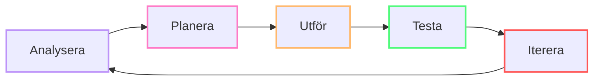
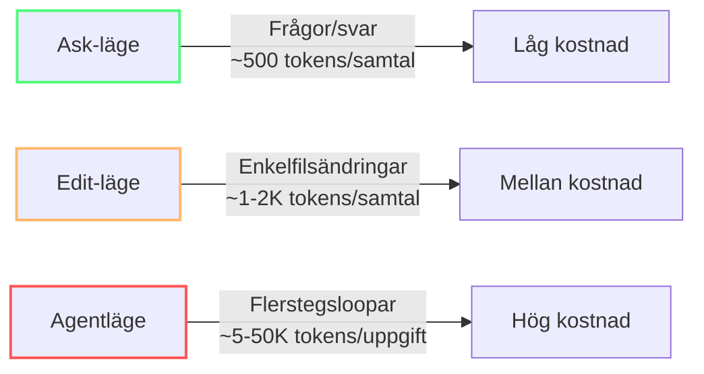
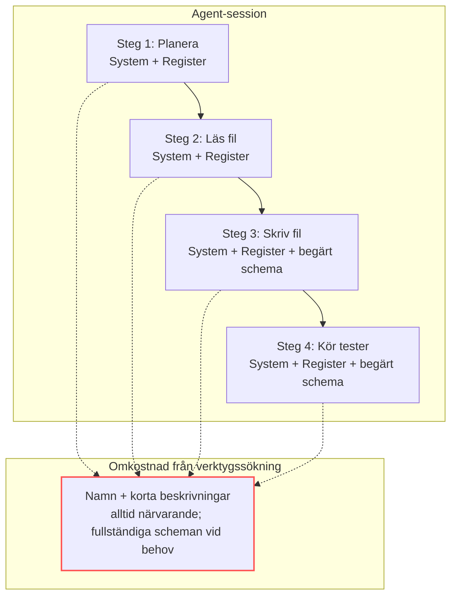
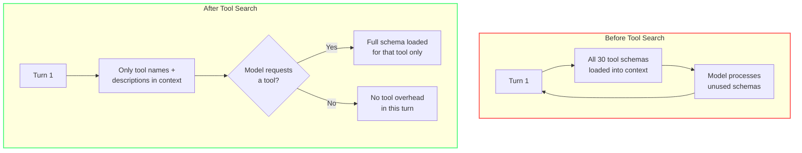
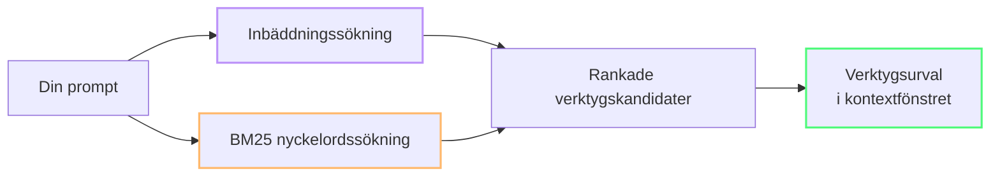

import { Steps, Tabs, TabItem } from "@astrojs/starlight/components";

# Agenter, verktyg och MCP-hygien

Agentläge och MCP-servrar är Copilots mest kraftfulla funktioner — och det snabbaste sättet att bränna AI Credits. En ooptimerad agentloop kan förbruka **10x fler tokens** än samma uppgift i Edit-läge.

Denna modul lär dig när du ska använda agenter, hur du avgränsar dem och hur du hindrar MCP-servrar från att tyst dränera din budget.

---

:::note[Fallstudie: Team Alpha]
Team Alpha hade 12 anslutna MCP-servrar — de flesta installerade "för säkerhets skull". De bantade ner till 3 (filsystem, terminal, GitHub), skapade VS Code-profiler och ställde modellväljaren på Auto. Resultat: 7 500 → 6 800 credits. Deras dagar med "regex i Opus" var över.
:::

## Agentloopen

Varje agentuppgift följer en kontinuerlig återkopplingscykel med fem steg:



| Steg | Vad händer | Drivare av tokenkostnad |
|------|-------------|-------------------------|
| **Analysera** | Agenten läser filer och samlar kontext | Input-tokens från filläsning |
| **Planera** | Agenten väljer angreppssätt och verktyg | Output-tokens för resonemangskedjor |
| **Utför** | Agenten skriver kod och kör kommandon | Output-tokens (kodgenerering) + verktygsanrop |
| **Testa** | Agenten kör tester och kontrollerar resultat | Verktygsanrop (terminal) + input (testutdata) |
| **Iterera** | Agenten åtgärdar fel och förfinar | Hela loopen startar om — sammansatt kostnad |

Att förstå loopen förklarar varför agentläge kostar **5–50K tokens** per uppgift: hela cykeln körs flera gånger. Varje iteration adderar kostnaden för alla tidigare steg.

:::tip[Var du ska bryta loopen]
Det mest tokeneffektiva stället att bryta loopen är efter **Testa**. Om testerna går igenom, stoppa agenten — låt den inte iterera för att "förbättra" fungerande kod. Använd stoppvillkor: "När testerna går igenom, stoppa och vänta på granskning."
:::

---

## De tre lägena och deras kostnader

Copilot Chat har tre interaktionslägen med dramatiskt olika token-profiler:



| Läge | Bäst för | Typisk tokenkostnad | Risk |
|------|----------|-------------------|------|
| **Ask** | Frågor, förklaringar, kodgranskning | ~500 input + ~300 output | Låg — ett samtal, inga verktyg |
| **Edit** | Enkelfilsändringar, refaktorering | ~1-2K input + ~500 output | Låg — inga verktygsslingor |
| **Agent** | Flertalsändringar, komplexa uppgifter | ~5-50K per uppgift | **Hög** — verktygsslingor förstärker kostnaden |

:::caution[Agentläge har högre baslinjeomkostnad]
Även med verktygssökning laddar agentläge systeminstruktioner, verktygsregistret och filkontext före det första svaret. Baslinjen är högre än i Ask- eller Edit-läge — men verktygssökning hindrar oanvända verktygsscheman från att läggas till.
:::

---

## Thinking Effort

Thinking effort styr hur mycket resonemang (thinking tokens) modellen använder för varje förfrågan. Högre effort innebär fler thinking tokens, vilket ökar latensen och förbrukningen av credits.

VS Code sätter standardvärden baserat på utvärderingar och har adaptivt resonemang aktiverat. Modellen avgör dynamiskt hur mycket den ska tänka utifrån uppgiftens komplexitet. För de flesta uppgifter räcker standardvärdena.

:::caution[Öka thinking effort bara när det ger verklig nytta]
Öka thinking effort endast för genuint komplexa problem, till exempel arkitekturplanering eller felsökning i flera steg. Att höja nivån för rutinuppgifter ökar latensen och förbrukar fler credits utan att resultatet nödvändigtvis blir bättre. Se [Konfigurera thinking effort](https://code.visualstudio.com/docs/agent-customization/language-models#_configure-thinking-effort).
:::

---

## Den dolda kostnaden för MCP-servrar

Varje MCP-server du har ansluten registrerar sina verktyg i agentens verktygsregister. Före verktygssökning (mitten av 2025) injicerades det fullständiga schemat för varje verktyg i varje agentstegs kontextfönster. Med verktygssökning är bara registret (namn + korta beskrivningar) alltid närvarande — fullständiga scheman laddas vid behov. Se notisen nedan för detaljer.



:::note[Verktygssökning minskar denna omkostnad]
Verktygssökning behåller endast verktygsnamn + korta beskrivningar i det alltid närvarande registret. Fullständiga scheman laddas först när modellen begär ett verktyg. Varje verktyg modellen använder medför fortfarande kostnaden för dess schema (~200 tokens).

Före mitten av 2025 laddades alla scheman vid varje steg. Med verktygssökning laddas bara nödvändiga verktyg. Det är fortfarande viktigt att rensa bort oanvända MCP-servrar — det gör registret mindre och minskar risken att modellen väljer dyra verktyg för enkla uppgifter.
:::

### MCP-server-matematiken

Varje server lägger till ungefär **verktyg × ~200 tokens per verktygsdefinition** i **baslinjen före verktygssökning**. Med verktygssökning är dagens kostnader cirka **60–75 % lägre**, eftersom bara begärda verktygsscheman laddas (plus det mindre alltid närvarande registret).

| Scenario | MCP-servrar | Verktyg | Baslinje före verktygssökning / steg | Baslinje före verktygssökning, 10 steg | Dagens uppskattning med verktygssökning / steg | Dagens uppskattning, 10 steg |
|----------|-------------|---------|--------------------------------------|------------------------------------------|-----------------------------------------------|-------------------------------|
| Minimalt | 2 (fil + terminal) | ~10 | ~2 000 | ~20 000 | ~500–800 | ~5 000–8 000 |
| Måttligt | 5 (git, db, fil, terminal, browser) | ~25 | ~5 000 | ~50 000 | ~1 250–2 000 | ~12 500–20 000 |
| Tungt | 10+ (allt installerat) | ~50+ | ~10 000+ | ~100 000+ | ~2 500–4 000+ | ~25 000–40 000+ |

Med Claude Sonnet-priser ($3/M input) kostar en enda tung 10-stegs agentuppgift **~$0.30** — bara från verktygsregistrets omkostnad.

:::tip[Kontrollera din baslinje med /context]
Kör `/context` i Copilot CLI mitt i en session för att se din System/Verktyg-förbrukning. I VS Code, uppskatta genom att räkna aktiva MCP-servrar × verktyg × ~200 tokens.
:::

### Så fungerar verktygssökning internt

Harnessen har ett register över tillgängliga verktyg med korta beskrivningar och inbäddningsvektorer. I stället för att placera varje fullständigt schema i kontextfönstret använder den registret för att identifiera sannolika kandidater för den aktuella uppgiften. När modellen behöver ett verktyg hämtar harnessen verktygets fullständiga schema vid behov; verktyg som inte begärs förblir utanför kontexten.



Verktygssökning är särskilt värdefull i MCP-tunga uppsättningar: typiska sessioner skickar bara 5–8 scheman i stället för 20–30, stora uppsättningar skickar omkring 10 i stället för 30, och enkla redigeringsuppgifter kan skicka inga scheman alls. Det minskar verktygsrelaterad kontext med ungefär **60–75 %**, medan varje verktyg modellen faktiskt använder fortfarande medför kostnaden för sitt schema.

Till Claude Sonnet-priset för input ($3/M) kostar en enda tung agentuppgift på 10 steg cirka $0,30 — enbart från verktygsregistrets omkostnad.

:::tip[Kontrollera din baslinje med /context]
I Copilot CLI kan du köra `/context` mitt i sessionen för att se dina System/Tools-tokens. I VS Code kan du uppskatta genom att räkna aktiva MCP-servrar × verktyg × ~200 tokens.
:::

---

## Så avgränsar du agenter för tokeneffektivitet

### 1. Använd Ask- eller Edit-läge först

Börja alltid med det billigaste läget som kan lösa problemet. Agentläge är inte standard — det är eskaleringsvägen.

```
❌ Agentläge för en regex-fråga → $0.15
✅ Ask-läge för samma fråga → $0.01
```

**Tumregel:** Om uppgiften rör en fil, använd Edit-läge. Om det är en fråga, använd Ask-läge. Eskalera bara till Agent när uppgiften verkligen kräver flerfilskännedom eller verktygsexekvering.

### 2. Skapa avgränsade anpassade agenter

Istället för en enda `@workspace`-agent som laddar kontext från hela projektet, skapa domänspecifika agenter:

| Anpassad agent | Kontextomfång | Verktyg | Bäst för |
|--------------|--------------|--------|----------|
| **Frontend** | `src/components/`, `src/styles/` | Läsa/skriva fil, terminal | UI-ändringar |
| **Databas** | `prisma/`, `migrations/` | Läsa/skriva fil, DB MCP | Schemaändringar |
| **Testning** | `tests/`, `src/` | Läsa/skriva fil, terminal | Skriva tester |
| **Säkerhet** | Alla | Läsa fil, säkerhets-MCP | Granskningar |

Varje avgränsad agent laddar **långt färre verktygsdefinitioner** och ett **mycket mindre filträd** — vilket sparar 5 000–10 000+ tokens per uppgift.

### 3. Sätt stoppvillkor

Tala om för agenten när den ska sluta. Utan tydliga gränser itererar agenter tills kontextfönstret eller verktygsbudgeten tar slut.

```
Lägg till paginering på användarendpunkten.
Om du stöter på fel, stoppa och rapportera — försök inte åtgärda.
Max 3 verktygsanrop. Efter ändringar, stanna för granskning.
```

### 4. Rensa bort oanvända MCP-servrar

Gå igenom dina VS Code-inställningar och inaktivera MCP-servrar du inte aktivt använder:

```json
// settings.json — behåll bara det du behöver för aktuell uppgift
{
  "github.copilot.chat.agent.mcpServers": {
    "filesystem": true,
    "terminal": true,
    "github": false,  // behövs inte för frontend-arbete
    "database": false // behövs inte för denna uppgift
  }
}
```

Ännu bättre: skapa **VS Code-profiler** med olika MCP-uppsättningar:
- **Kodningsprofil**: filsystem + terminal endast
- **DevOps-profil**: GitHub CLI + distributionsverktyg
- **Databasprofil**: databas-MCP + schemaverktyg

**Konfigurera verktyg för den aktuella förfrågan:** Använd knappen **Configure Tools** i chattens inmatningsfält för att välja enskilda verktyg eller MCP-servrar. Sök i verktygsväljaren och lägg till ett annat verktyg när uppgiften behöver det. Detta kompletterar anpassade agenter och VS Code-profiler genom att ge dig en snabb justering per förfrågan utan att byta profil eller konfiguration. Se [Verktyg](https://code.visualstudio.com/docs/agents/run/tools).

---

## Batcha upprepade operationer

Upprepade submit-, poll- och retrieve-anrop lägger till mellanresultat i modellens kontextfönster. För deterministiska flöden eller masskörningar: använd ett script eller kommandoradsverktyg för att köra loopen utanför agentkonversationen och returnera bara slutresultatet till agenten.

:::tip[Flytta upprepade operationer utanför konversationen]
I stället för att be agenten köra och inspektera många liknande databasfrågor en i taget, skriv ett granskat script som kör frågebatchen och producerar en koncis sammanfattning. Kör scriptet via terminalverktyget och ge sedan sammanfattningen till modellen för analys. Benchmarka den scriptade och den interaktiva versionen av arbetsflödet först — besparingen beror på verktygen, resultaten och uppgiften.
:::

---

### 5. Bygg en modellrouterstrategi

Alla uppgifter kräver inte samma modell. En systematisk router sparar **73 % av de dagliga API-kostnaderna** — från 15 dollar per dag till 4 dollar — genom att matcha uppgiftens komplexitet mot rätt modellnivå.

| Uppgiftstyp | Primär (smart) | Reserv (billig) | Maxkostnad/uppgift |
|-------------|----------------|-----------------|--------------------|
| Arkitekturbeslut | Claude Opus | GPT-5.4 | $5.00 |
| Kodgenerering | Claude Sonnet | DeepSeek R1 | $0.50 |
| Enkla tester | GPT-5.4-mini | Mistral-Small | $0.10 |
| Kodgranskning | Claude Sonnet | GPT-5.4-mini | $0.25 |
| Regex, formatering | Claude Haiku | GPT-5.4-mini | $0.02 |

**Så tillämpar du detta i Copilot:**

1. **Låt modellväljaren stå på Auto** — Copilot dirigerar enkla förfrågningar till billigare modeller automatiskt och sparar cirka 60–70 % på berättigade turer.
2. **Byt manuellt för kända nivåer:** Haiku för regex, strängmanipulation, docstrings och boilerplate; Sonnet för generell utveckling och ändringar över flera filer; Opus för arkitekturgranskning, säkerhetsrevisioner och komplex felsökning.
3. **Byt inte modell mitt i en session för en enstaka billig fråga** — cache-ombyggnaden kostar mer än besparingen.
4. **Betala inte premium för enkelt arbete** — Opus för en strängdelning kostar 15 gånger mer än Haiku för samma resultat.

:::tip[80/20-regeln för modellval]
Ungefär 80 % av chattförfrågningarna är tillräckligt enkla för en lättviktsmodell. Om du låter väljaren stå på en premiummodell "för säkerhets skull" betalar du för mycket för 4 av 5 förfrågningar.
:::

### Så fungerar automatiskt modellval

Automatiskt modellval klassificerar varje förfrågan med hjälp av uppgiftsinbäddningar innan den når modellen. Copilot använder klassificeringen för att automatiskt dirigera enkla förfrågningar till billigare modeller, medan mer komplexa uppgifter får en starkare modell. Routningen lägger till försumbar omkostnad och gör att du slipper byta modell manuellt inför varje tur.

| Uppgiftstyp | Modellrutt |
|---|---|
| Enkel fråga eller kodförklaring | Snabb/billig modell |
| Redigering i en fil eller liten refaktorering | Mellanklassmodell |
| Redigering i flera filer, komplex planering eller verktygsorkestrering | Mest kapabla modell |

Eftersom ungefär **60–70 % av förfrågningarna** är tillräckligt enkla för en billigare modell kan Auto minska modellrelaterade kostnader med cirka **60–70 %** för berättigade uppgifter, samtidigt som modeller med högre kapacitet används när de behövs.

### 6. Fem subagentmönster som sparar tokens

Forskning från Anthropic identifierar fem organisatoriska mönster för att strukturera agentarbete. Varje mönster har olika tokenkonsekvenser.

| Mönster | Så fungerar det | Tokenpåverkan | Bäst för |
|---------|-----------------|---------------|----------|
| **Promptkedjning** | Utdata från steg 1 blir indata till steg 2 | Sekventiellt — varje steg ökar kostnaden | Uppgifter i flera steg (schema → fråga → test) |
| **Routing** | En lättviktsklassificerare skickar till en specialiserad agent | Sparar tokens genom att undvika full kontextladdning | Triagering: bugg vs funktion vs fråga |
| **Parallellisering** | Oberoende agenter körs i sandlådat tillstånd | Parallell kostnad, undviker störningar mellan agenter | Flera oberoende analyser |
| **Orkestrerare–arbetare** | En smart modell planerar, billiga modeller utför | 80 % av arbetet körs på billiga modeller | Komplexa funktioner över flera filer |
| **Utvärderare–optimerare** | En generator producerar, en utvärderare granskar och generatorn rättar | Vanligen 2–3 cykler, fångar fel tidigt | Kvalitetskritiskt och säkerhetskänsligt arbete |

:::tip[Det mest tokeneffektiva mönstret]
**Utvärderare–optimerare** sparar mest tokens i praktiken. Att fånga ett fel i granskning kostar 2 000 tokens. Att rätta samma fel efter produktion kostar 50 000+ tokens genom felsökning, refaktorering och ny granskning.
:::

**Praktisk slutsats:** Att namnge dessa mönster hjälper dig att välja rätt medvetet. För en komplex funktion över flera filer sparar Orkestrerare–arbetare tokens; för en säkerhetsrevision är Utvärderare–optimerare avgörande.

---

### 7. Fällan med cache vid modellbyte

Att byta modell mitt i sessionen låter smart — använd Opus för arkitektur och byt sedan till Haiku för enkla följdfrågor. Men promptcacher är **modellspecifika**.

**Anthropics officiella vägledning:** "Om du har kommit 100 000 tokens in i en konversation med Opus och vill ställa en enkel fråga blir det faktiskt dyrare att byta till Haiku än att låta Opus svara." (Källa: Anthropic Engineering Blog, *Prompt caching is everything*, april 2026.) Den nya modellen kan inte återanvända den gamla modellens cachade KV-tillstånd. Ett byte tvingar fram en fullständig cache-ombyggnad precis när sessionen är som störst.

**Lösningen — subagenter:** Använd huvudsessionen för huvudmodellen och starta en billigare subagent för den enstaka enkla uppgiften. Subagenten börjar med en ny (kall) cache, men det är billigare än att bygga om hela huvudsessionskontexten.

**När ett byte ÄR värt det:**
- I början av en session (innan mycket historik har samlats)
- När kostnaden för fel modell × återstående turer överstiger kostnaden för cache-ombyggnaden

Se [Modul 2 — Cachebrytande misstag](/vibe-on-budget/sv/02-context-model#vanliga-cachebrytande-misstag) för fler mönster som bryter cachen.

---

## Verktygssökning: Vad som händer internt

VS Code Copilot använder en dubbl sökstrategi för att avgöra vilka verktyg som ska presenteras för modellen:



- **Inbäddningsstyrd sökning** — konverterar din prompt till en semantisk vektor och hittar verktyg med liknande beskrivningar (OpenAI Ada + Anthropic inbäddningsmodeller)
- **BM25 nyckelordssökning** — klassisk textmatchning för exakta verktygsnamn och nyckelord
- Båda resultaten slås samman och de mest relevanta verktygen injiceras i kontextfönstret

Detta betyder: **välbenämnda verktyg med tydliga beskrivningar hittas; vaga gör det inte**. Döp om dina MCP-verktyg med beskrivande namn och nyckelord för att förbättra sökträffarna utan att blåsa upp kontexten.

:::note[Verktygssökning körs varje steg]
Varje agentsteg kör om verktygssökningen mot din prompt. Om uppgiften ändras mitt i sessionen ändras även verktygsuppsättningen — vilket **ogiltigförklarar promptprefixcachen**.
:::

---

## Praktisk MCP-hygien-checklista

1. **Granska månatligen** — lista alla anslutna MCP-servrar. Ta bort de som inte använts på 30 dagar.
2. **Profilera dina sessioner** — skapa separata VS Code-profiler för olika arbetsflöden, var och en med bara de MCP-servrar som behövs.
3. **Namnge verktyg väl** — använd beskrivande namn så att verktygssökning hittar dem utan extra kontext.
4. **Föredra deterministiska verktyg** — för terminaluppgifter, kör kommandot manuellt och klistra in utdata istället för att låta agenten loopa.
5. **Räkna din MCP-skatt** — multiplicera (servrar × verktyg × 200) för att uppskatta baslinjen före verktygssökning; med verktygssökning laddas fullständiga scheman bara när de begärs.

---

:::tip[Fortsätt lära]
Fortsätt med [Vibe coding utan skuld](/vibe-on-budget/sv/08-vibe-coding-guardrails) och utforska sedan [Den stora bilden](/vibe-on-budget/sv/09-under-the-hood) för Copilots interna optimeringar.
:::

---

## Övning

1. Kontrollera dina anslutna MCP-servrar (VS Code-inställningar → `github.copilot.chat.agent.mcpServers`). Räkna dem. Inaktivera alla som du inte har använt den senaste veckan.
2. Nästa gång du behöver ett enkelt svar, använd Ask-läge i stället för Agent-läge. Jämför credit-visningen mellan lägena för en liknande fråga.
3. Skapa en anpassad agent (använd knappen **Configure Tools** i chatten) som är avgränsad till ett specifikt uppgiftsområde. Använd den för nästa uppgift inom området.

## Viktiga slutsatser

- Agentläge kostar **5-50K tokens per uppgift** — använd Ask/Edit-läge för enklare arbete
- MCP-verktygsscheman laddas vid behov med **verktygssökning** — men varje använt verktyg kostar fortfarande ~200 tokens per steg. Färre registrerade servrar = ett mindre verktygsregister
- Baslinjen före verktygssökning var **~200 tokens per verktyg per steg**; verktygssökning gör dagens kostnader cirka 60–75 % lägre
- Skapa **avgränsade anpassade agenter** istället för en monolitisk `@workspace`-agent
- Sätt **stoppvillkor** för att förhindra skenande agentloopar
- VS Code-profiler med olika MCP-uppsättningar sparar **5 000–10 000+ tokens per session**

*Beräknad lästid: 10 minuter*