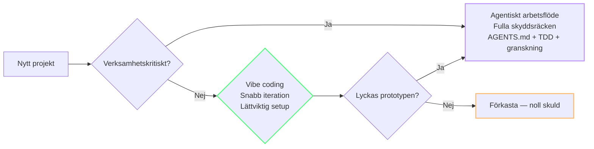
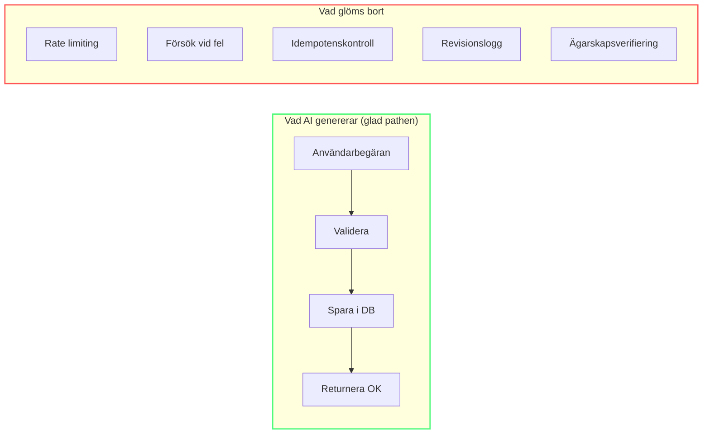
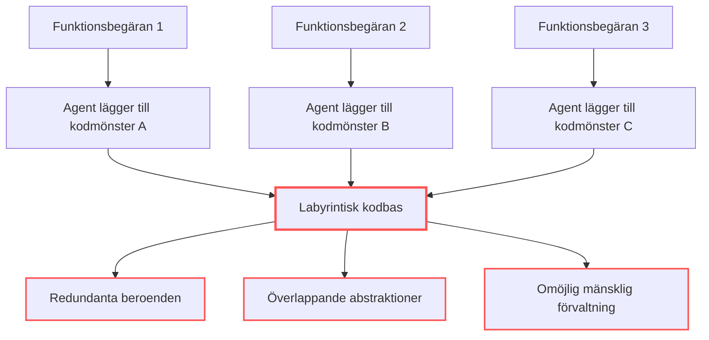
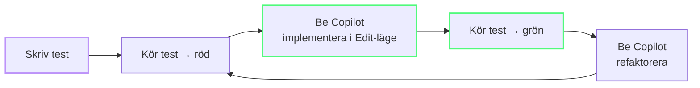
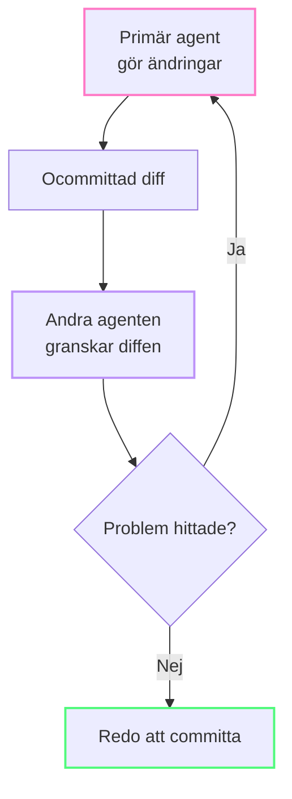

import { Steps, Tabs, TabItem } from "@astrojs/starlight/components";

# Vibe coding utan teknisk skuld

Vibe coding — att låta AI skriva din kod medan du fokuserar på intention — är det snabbaste sättet att bygga mjukvara 2026. Men det finns en hake: **studier antyder att teknisk skuld kan öka 30–41% efter att AI-kodverktyg införts (mätt i flera organisationer)**, kodduplicering kan öka 48% (studier antyder) och refaktorering kan minska 60% (studier antyder).

Lösningen är inte att sluta vibe-coda. Det är att bygga skyddsräcken som håller skulden i schack.

---

## Vibe coding eller agentiskt arbetsflöde? Ett beslutsramverk

Alla projekt behöver inte samma grad av noggrannhet. Nyckelfrågan är var projektet hamnar på axeln **verifiering kontra upptäckt**:

| Om ditt svar är JA... | Använd då... |
|---|---|
| Ska verksamheten förlita sig på den här mjukvarans resultat för beslut? | **Agentiskt arbetsflöde** |
| Hanterar den finansiella transaktioner, kunddata eller autentisering? | **Agentiskt arbetsflöde** |
| Är applikationen uttryckligen tillfällig eller avsedd för engångsbruk? | **Vibe coding** |
| Är huvudmålet att testa en idé eller hypotes? | **Vibe coding** |



**Vibe coding är upptäckt.** Det är optimalt när kostnaden för ett misslyckande är låg och mjukvarans livscykel ska vara kort. **Agentiska arbetsflöden är verifiering.** De bäddar in samma AI-verktyg i strikta ingenjörsdiscipliner: formella specifikationer, acceptanskriterier, säkerhetsgranskningar och kontinuerliga testcykler (test-first-loopar).

Faran är inte vibe coding — det är att vibe-coda något som till slut hamnar i produktion. Ramverket ovan hjälper dig att besluta *innan* du skriver kod, inte efteråt.

:::tip[Om du svarade JA på någon av de verksamhetskritiska frågorna]
Gå till [Modul 5 — Projektsetup](/token-economy-course/sv/05-project-setup) och konfigurera AGENTS.md (beteendekontrakt) + `.prompt.md`-filer (arkitekturspecifikationer) innan du skriver kod. Den initiala kostnaden för skyddsräcken är en bråkdel av kostnaden för att åtgärda produktionsincidenter.
:::

---

## De fyra felfelen med AI-genererad kod

Att förstå var skuld ackumuleras hjälper dig att fånga den tidigt:

### 1. Duplicerad logik

En AI som löser en prompt genererar kod för just den prompten. Den söker inte igenom kodbasen efter befintliga hjälpfunktioner. Resultatet: fem filer har var sin `formatDate()` med små variationer.

**Tala om för agenten om befintliga hjälpfunktioner:**

```
Använd den befintliga utils/formatDate()-funktionen istället för att skriva en ny.
Kolla src/utils/ efter befintliga hjälpare innan du skapar nya.
```

### 2. Oavsiktlig arkitektur

AI är utmärkt på att fortsätta mönster men kämpar när inget mönster finns ännu. En vibe-codad app har ofta fem partiella mönster istället för ett konsekvent — olika felhantering i varje route, ad-hoc-loggnig och auth-kontroller på slumpmässiga ställen.

### 3. Svällande funktioner

Ett enda AI-svar som hanterar "lägg till användarflöde" kan producera en 300-raders funktion som gör formulärvalidering, databasskrivningar, e-postnotifieringar och affärslogik — allt på ett ställe. AI har inget koncept om SRP (Single Responsibility Principle).

### 4. Saknade gränsfall

AI genererar glad pathen väl. Den glömmer rate limits, försök vid fel, idempotens, bakgrundsjobb och vad som händer när databasen inte är tillgänglig.



---

## Problemet med Winchester Mystery House

Det finns ett särskilt arkitektoniskt antimönster som uppstår när agenter itererar utan övervakning. Det har fått sitt namn efter den berömda herrgården som byggdes utan en sammanhängande ritning — och är en av de dyraste formerna av AI-genererad teknisk skuld.



När agenter får iterera blint och patcha kodbasen funktion för funktion utan arkitektonisk tillsyn blir resultatet labyrintisk kod: redundanta beroenden, överlappande abstraktioner och fem konkurrerande mönster där ett hade räckt.

### Metod i fyra steg för att förebygga problemet

**1. Resultat i en mening**
Innan någon kod skrivs, formulera en mening som definierar önskad indata och utdata. Frys den. Det hindrar kraven från att svälla under arbetets gång — en huvudorsak till Winchester-arkitektur.

```
BRA: "POST /api/upload returnerar { url: string, size: number } för giltiga bilder under 5 MB."
DÅLIGT: "Lägg till filuppladdning." (agenten hittar på autentisering, miniatyrbilder, CDN-integration...)
```

**2. Minimal sandlåda**
Ju mindre projektkatalog agenten arbetar i, desto mindre utrymme har den att "uppfinna arkitektur" för triviala problem. Begränsa agenten till den relevanta katalogen.

**3. Verklighetskontroll var tredje iteration**
Efter vart tredje agentsteg, mät objektivt med verkliga data:

| Kontroll | Verktyg |
|-------|------|
| Svarstid | Webbläsarens utvecklarverktyg eller `time` |
| Minnesanvändning | Operativsystemets aktivitetshanterare eller `ps` |
| Paketstorlek | Byggverktygets utdata |
| Testtäckning | Täckningsrapportör |

Om mätvärdena utvecklas åt fel håll efter tre iterationer, stoppa agenten och omvärdera angreppssättet.

**4. Hård gräns vid systemkritiska områden**
Dessa områden ska **aldrig** vibe-codas. När uppgiften går in i något av dem, eskalera till hanterad infrastruktur eller handskriven, granskad kod:

- Autentisering och sessionshantering
- Filuppladdningar (särskilt användarstyrda)
- Pushnotiser
- Asynkrona bakgrundsjobb
- Synkronisering av realtidstillstånd
- Betalningshantering

:::caution[Dessa är inte förslag]
Rapporter tyder på att en WIRED-granskning 2026 identifierade nästan 2 000 vibe-codade applikationer som oavsiktligt exponerade privata kunddata — helt enkelt eftersom de distribuerades till produktion utan arkitektonisk tillsyn. Säkerhetskomprometterad kod i kritiska områden blir en säkerhetsincident, inte en post för teknisk skuld.
:::

Agentiskt kodande fungerar bäst för **integrering av limkod, analysverktyg och avgränsade skript** — inte för att uppfinna databaslager eller auth-system från grunden. Använd det som redan är beprövat när du är osäker.

---

## Skyddsräcke 1: Skriv en spec först

Innan du ber en agent att "bygga funktionen", skriv en lättviktsspec:

```
Funktion: Användarprofilsida

Datamodell:
- User har namn, e-post, avatar URL, roll
- roll är serverägd — acceptera aldrig från klient

API-beteende:
- GET /api/users/:id — returnerar användarprofil
- 404 om användaren inte finns
- 403 om den som begär inte är profilägare eller admin

Gränsfall:
- E-poständring kräver verifiering
- Avatar-URL måste saneras
- Rate limit: 10 anrop/min per användare

Undantag:
- Ändra inte auth-middleware
- Lägg inte till nya beroenden
```

En spec behöver inte vara lång — 10–15 rader räcker för att förhindra de dyraste misstagen. Nyckelsektionerna: datamodell, API-beteende, gränsfall och vad som *inte* ska ändras.

:::tip[Spara specar som `.prompt.md`-filer]
Spara specar för återkommande funktioner i `.prompt.md`-filer (t.ex. `docs/user-profile-spec.prompt.md`). Referera till dem med `#file:` när du börjar arbeta med funktionen — agenten läser filen och följer mönstren du definierat.
:::

---

## Skyddsräcke 2: TDD med Copilot

Testdriven utveckling passar naturligt ihop med AI-kodning. Testet definierar förväntat beteende — AI implementerar bara. Detta fångar det vanligaste felet: **kod som ser korrekt ut men inte hanterar gränsfall**.

**Hur TDD ändrar token-matematiken:**

| Tillvägagångssätt | Tokens | Kvalitetsrisk |
|----------|--------|-------------|
| "Bygg denna funktion" (inga tester) | ~2K prompt, ~10K output | Hög — ingen verifiering |
| "Skriv tester först, implementera sen" | ~3K prompt, ~12K output | Låg — tester verifierar |
| "Lägg till tester efteråt" | ~2K + ~5K output | Mellan — tester påverkas av koden |

Token-omkostnaden för TDD är liten (~3K input-tokens) och betalar sig själv när första testet misslyckas för att agenten glömde ett gränsfall.

**Praktiskt arbetsflöde:**



---

## Skyddsräcke 3: Automatiserad granskning

Manuell kodgranskning är flaskhalsen. Automatisera den med en andra AI-genomgång.

### Granskning med samma modell

Det enklaste tillvägagångssättet: efter att agenten gjort ändringar, be den granska sitt eget arbete.

```
Granska ändringarna. Kontrollera:
- Saknad felhantering
- Hårdkodade värden som borde vara konfigurerbara
- Funktioner längre än 50 rader
- Duplicerad logik som finns någon annanstans
- Säkerhet: användarkontrollerad indata som används utan validering
```

### Granskning med olika modeller (avancerat)

Olika modeller har olika blindfläckar. Det mest effektiva mönstret är att låta en andra modell granska den första modellens arbete:



Granskningsloopen konvergerar vanligtvis på **2–3 cykler**. Olika modeller fångar olika saker — en kan flagga överkonstruerade lösningar, en annan upptäcker saknade gränsfall.

---

## Skyddsräcke 4: Projektminne med `.prompt.md`-filer

`AGENTS.md` definierar *hur* agenten ska bete sig — läge, omfattning och outputformat. Håll den smal (se [Modul 5](/token-economy-course/sv/05-project-setup)). Men *vad* agenten ska veta om ditt projekt — arkitektur, konventioner och historiska misstag — hör hemma i separata `.prompt.md`-filer som laddas vid behov.

### Arkitekturpromptfil

Skapa `docs/architecture.prompt.md`:

```markdown
# Architecture
- API routes: /api/{resource} with Express Router
- Auth middleware in src/middleware/auth.ts
- All DB queries go through src/db/queries/

# Conventions
- No barrel files (index.ts re-exports) — import directly
- Error responses: { error: string, code: number }
- Async handlers must have .catch(next) wrapper
```

Ladda den när det behövs:
```
Apply rules from #file:docs/architecture.prompt.md. Add pagination to GET /api/users.
```

### Promptfil för kända problem

Skapa `docs/known-issues.prompt.md`:

```markdown
# Known Issues (prevents repeats)
- [2026-08-15] Agent created inline SQL instead of using query builder
    → Always use src/db/queries/ functions for DB access
- [2026-08-22] Agent omitted ownership check on DELETE /api/users/:id
    → Every user-facing endpoint needs req.user.id === target.ownerId check
```

Ladda den före relevanta uppgifter:
```
Before implementing, review #file:docs/known-issues.prompt.md. Do not repeat these mistakes.
```

:::tip[Varför denna uppdelning spelar roll]
`AGENTS.md` skickas vid **varje** agentinteraktion. `.prompt.md`-filer skickas endast när du uttryckligen refererar till dem. Att hålla projektminnet separat från beteenderegler sparar hundratals tokens per agentsteg.
:::

---

## Skyddsräcke 5: Säkerhet som hård spärr

Säkerhetsbrister är den dyraste formen av AI-skuld. Gör säkerhetskontroller icke-förhandlingsbara:

### Vad som alltid ska kontrolleras

Innan du commitar AI-genererad kod, verifiera:

- [ ] **Autentisering** — alla autentiserade slutpunkter kräver giltig session
- [ ] **Auktorisering** — ägarskapskontroller på alla användarspecifika resurser
- [ ] **Serverägda fält** — roll, plan, ownerId accepteras aldrig från klient
- [ ] **Indatavalidering** — all användarindata saneras (inte bara i frontend)
- [ ] **Hemligheter** — inga API-nycklar, lösenord eller tokens i klientkod
- [ ] **Rate limiting** — publika slutpunkter har begränsningar
- [ ] **SQL-injektion** — alla frågor använder parameteriserade satser eller ORM

### Prompt för säkerhetsgranskning

```
Säkerhetsgranska denna funktion. Kolla OWASP Top 10.
Lista endast kritiska och allvarliga problem. Kod endast.
```

---

## 90-dagarsgranskningen

Efter cirka tre månaders vibe-coding, gör en fokuserad granskning:

1. **Kan två användare komma åt varandras data?** — Kontrollera auktorisering på varje slutpunkt
2. **Matchar databasmodellen affärsreglerna?** — Leta efter saknade begränsningar, fel typer
3. **Finns det ett mönster för routes, fel, jobb?** — Eller fem konkurrerande mönster?
4. **Är behörigheter kontrollerade på backend?** — Lita aldrig på frontend för säkerhet
5. **Kan appen distribueras från en ren checkout?** — Om inte, har du beroenderöta
6. **Var lagras hemligheter?** — De ska aldrig finnas i frontend-kod eller publika env-variabler

---

---

:::tip[Fortsätt lära dig]
Skyddsräcken fungerar bäst med rätt setup — gå tillbaka till [Projektsetup](/token-economy-course/sv/05-project-setup) och [Agenter, verktyg och MCP-hygien](/token-economy-course/sv/06-agents-mcp). För hela bilden av hur Copilot hanterar kostnader, se [Under huven](/token-economy-course/sv/08-under-the-hood).
:::

---

## Viktiga slutsatser

- Studier antyder att teknisk skuld kan öka **30–41%** med AI-kodningsverktyg (mätt i flera organisationer) — skyddsräcken är nödvändiga
- Skriv en **lättviktsspec** innan du ber agenten bygga en funktion
- Använd **TDD** — tester definierar beteende, AI implementerar
- Automatisera granskning: **samma modell eller olika modeller** fångar vad första passet missar
- Använd **`.prompt.md`-filer för projektminne** — dokumentera arkitektur, specifikationer och kända problem; ladda vid behov med `#file:`
- **Säkerhetskontroller måste vara icke-förhandlingsbara** — verifiera auth, auktorisering, indatavalidering varje gång
- Gör en **90-dagarsgranskning** för att fånga systemiska problem innan de växer

*Beräknad lästid: 10 minuter*