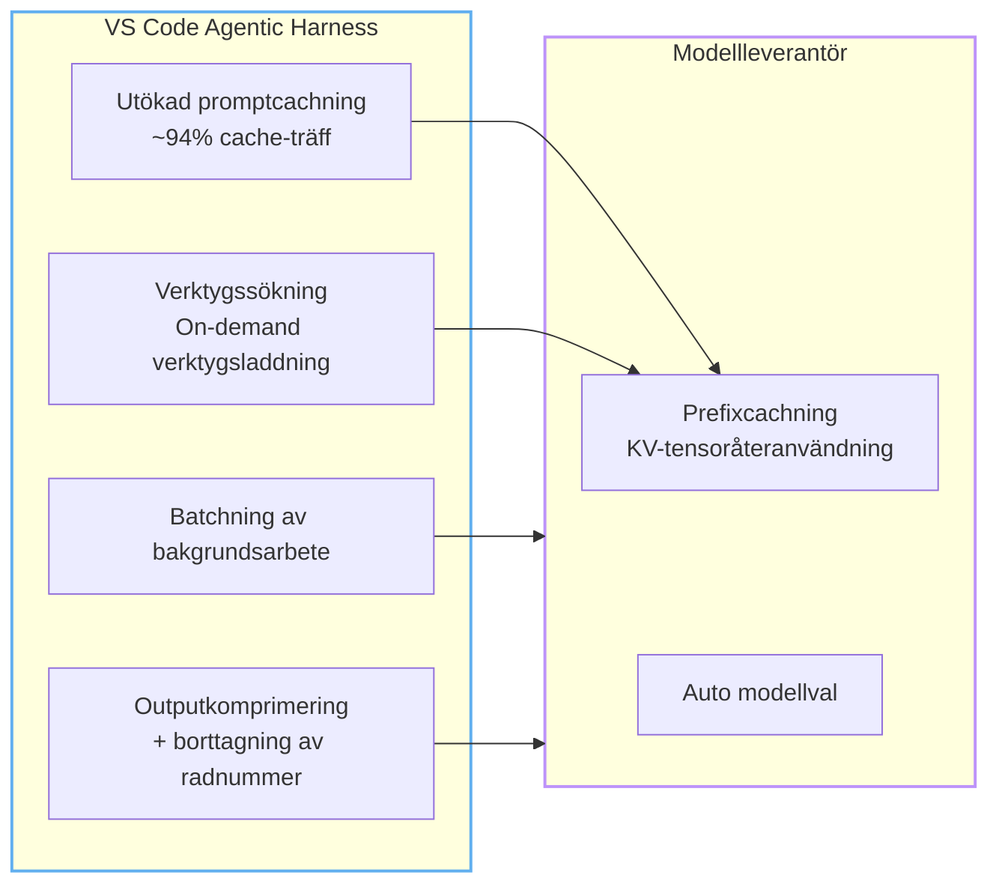
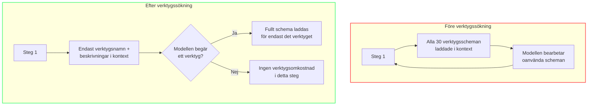
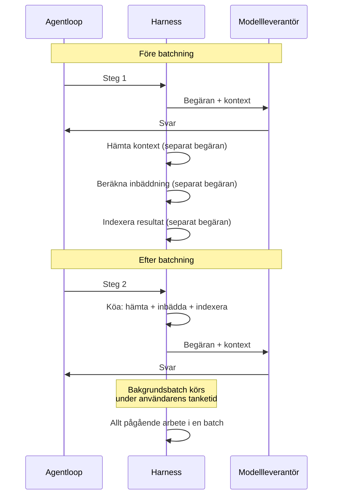
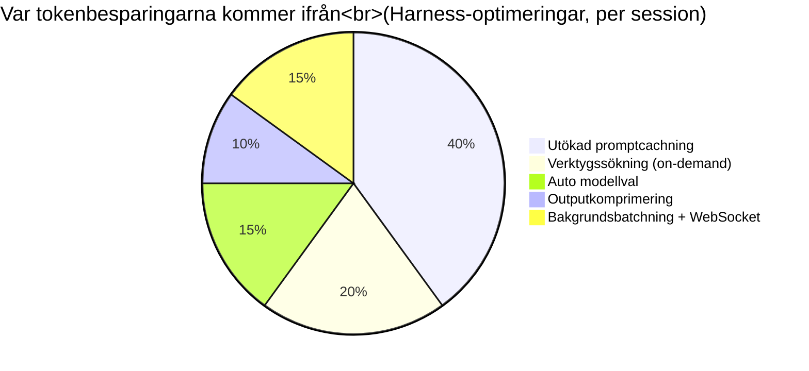

import { Steps } from "@astrojs/starlight/components";

# Under huven

Varje modul hittills har handlat om **vad du kan göra** — skriva kortare promptar, rensa MCP-servrar, konfigurera instruktionsfiler. Denna modul handlar om **vad Copilot gör automatiskt för dig**.

Medan du optimerar din sida, levererar VS Code- och GitHub-utvecklingsteamen infrastruktursförbättringar som minskar tokenförbrukning och latens utan någon användaråtgärd. Dessa optimeringar är osynliga — men de sparar fler tokens dagligen än alla prompt-tricks tillsammans.

---

## De osynliga optimeringarna

Varje Copilot-förfrågan passerar genom **harnesset** (det agentiska ramverket i VS Code) innan den når modellleverantören. Harnessets jobb är att sammanställa kontext, hantera verktyg och dirigera förfrågningar. Sedan mitten av 2025 har harnesset varit fokus för en ihållande satsning på tokeneffektivitet.

Resultatet är en stadig ström av små vinster som ackumuleras:

Optimeringarna delas in i två kategorier:
- **Harness-nivå** (VS Code-teamet): hur kontext förbereds, batchas och levereras
- **Leverantörsnivå** (OpenAI/Anthropic): hur modelltillstånd cachas och beräknas

Tillsammans bildar de en stack som gör varje agentsväng billigare än för tre månader sedan — utan någon ändring i koden du skriver.

---

## 1. Utökad promptcachning

Den enskilt mest effektfulla optimeringen. Varje agentisk förfrågan har ett **promptprefix** — den upprepade början som delas mellan steg: systeminstruktioner, verktygsdefinitioner, repositories-kontext och konversationshistorik.

**Före cachning**: varje förfrågan beräknade hela prefixet från början. Att bearbeta samma instruktioner på steg 2 kostade lika mycket som steg 1.

**Efter cachning**: modellleverantören lagrar nyckel/värde-tensorerna som beräknats vid bearbetning av prefixet. Vid nästa steg återanvänder den det cachade tillståndet istället för att beräkna om.

### Effekten

| Mått | Före | Efter |
|--------|--------|-------|
| Cache-träff (Anthropic, VS Code) | N/A | ~94% |
| Cache-träff (OpenAI) | Delvis | Utökade prefixmatchningar |
| Kostnad för cachade vs ocachade tokens | Samma | Upp till 90% billigare |
| Agentisk sessionstokens | Baslinje | ~28% minskning |

I detta illustrativa scenario med ~94% träfffrekvens drar nästan varje förfrågan efter den första nytta av cachat prefix. Detta är den enskilt största drivkraften bakom tokenbesparingar i hela Copilot-stacken — större än någon promptteknik du kan tillämpa.

:::note[Hur cachning fungerar]
Den cachade artefakten är inte en läsbar kopia av prompten. Det är **internt modelltillstånd** — nyckel/värde-tensorer som beräknats vid bearbetning av prefixet. Olika leverantörer exponerar det olika: Anthropic kallar det "prompt caching", OpenAI använder "prompt prefix matching" under huven. Båda uppnår liknande resultat genom olika mekanismer.
:::

### Varför det spelar roll för ditt arbetsflöde

Cachning belönar **kontinuitet**. En enda lång session med samma agent är dramatiskt mer effektiv än att starta tio korta sessioner för samma uppgift:

| Sessionsmönster | Cache-fördel | Relativ kostnad |
|-----------------|--------------|----------------|
| En lång session, 10 steg | ~94% träfffrekvens efter steg 1 | **Lägst** |
| Tio enfas-sessioner | 0% träfffrekvens — varje startar kallt | ~3x fler tokens |
| Frekventa `/clear`-återställningar | Cache ogiltigförklarad | Bortkastade besparingar |

Detta betyder inte att du ska undvika `/clear` när en uppgift är klar — var bara medveten om att varje nystart betalar full prefixkostnad en gång.

### Cachningsmekanik hos olika leverantörer

Olika modellleverantörer implementerar cachning på olika sätt — och skillnaderna påverkar dina kostnader.

| Leverantör | Cachningstyp | Explicit kontroll? | Skrivkostnad | Träffkostnad | Standard-TTL |
|----------|-----------|-------------------|------------|----------|-------------|
| OpenAI (GPT-5.x) | Automatisk + manuell | Ja — `prompt_cache_breakpoint` | 1,25x | 0,1x (90% rabatt) | Konfigurerbar |
| Anthropic (Claude) | Manuell | Ja — `cache_control` | 1,25x–2,0x | 0,1x (90% rabatt) | 5 min |
| DeepSeek (V4 Pro) | Diskbaserad | Nej (implicit) | Ingen | 0,5x (50% rabatt) | Ej tillämpligt |
| Google (Gemini 3.5) | Kontextbaserad | Nej (implicit) | Ingen | Varierar | Session |

OpenAI GPT-5.x stöder utökad cachning med `prompt_cache_retention: "24h"`. VS Code Copilot uppmätte **+919% förbättring av träfffrekvensen efter pauser på 40–60 minuter** och **+338% efter pauser på 30–40 minuter**. Detta förändrar spelplanen för asynkrona arbetsflöden där stegen ligger flera minuter från varandra. För Anthropics begränsning på fem minuter, se avsnittet om cache-busting nedan. *(Källa: VS Code engineering-bloggen, juni 2026.)*

### Förlängd TTL förändrar ekonomin för asynkront arbete

OpenAIs 24-timmarsfönster för bevarande förändrar ekonomin för asynkront arbete: i stället för att förlora cachen under normala utvecklarpauser kan du hålla det kostsamma prefixet aktivt under längre mellanrum.

### Vad som bryter cachen

Ogiltigförklaring av cache — så kallad **cache-busting** — sker omedelbart när promptprefixet ändras. Ett enda tecken tidigt i prompten ogiltigförklarar hela den cachade historiken, och både beräkning och debitering börjar om från noll.

Vanliga orsaker till cache-busting:
- Byta modell under sessionen
- Ändra `copilot-instructions.md` eller `AGENTS.md`
- Öppna eller stänga redigeringsflikar
- Låta konversationshistoriken växa förbi cachegränsen
- Ändra verktygsdefinitioner (lägga till en ny MCP-server)

:::tip[Se Modul 2 för vardagliga cache-busting-problem]
För vanliga misstag som bryter cachen och hur du undviker dem, se [Modul 2 — Vanliga cache-busting-misstag](/token-economy-course/sv/02-context-model#common-cache-busting-mistakes).
:::

:::caution[Anthropics TTL-kontrovers]
I mars 2026 ändrade Anthropic i tysthet sin standard-TTL för cache från **1 timme till 5 minuter**. Det orsakade stora, tysta kostnadsökningar för asynkrona system — cacherna löpte ut mellan förfrågningarna och varje steg betalade fullt pris.

Om du använder Anthropic-baserade modeller (Claude i Copilot), håll sessionerna aktiva och sammanhängande. Långa pauser mellan steg kan kosta dig cachen. Om arbetsflödet är mycket asynkront ger OpenAIs konfigurerbara bevarandefönster i GPT-5.x dig mer kontroll.
:::

### Vad det betyder för dig

- **Ändra inte systeminstruktioner mitt i sessionen.** Om du måste göra det, acceptera den tillfälliga cache-missen och fortsätt — det är fortfarande billigare än att starta en ny session.
- **Övervaka tysta cache-fel.** Modellen berättar inte när cachen missar. Använd Copilots felsökningsloggning (`github.copilot.chat.agentDebugLog.fileLogging.enabled`) för att kontrollera faktiska tokenantal.
- **Leverantören spelar roll.** Om arbetsflödet är mycket asynkront (förfrågningar med flera minuters mellanrum) ger OpenAIs konfigurerbara TTL dig mer kontroll än Anthropics fasta femminutersfönster.

Använd vyn [Cache Explorer](https://code.visualstudio.com/docs/agents/agent-troubleshooting/cache-explorer) i Agent Debug Logs för att se dina faktiska cacheträffar och hur många input-tokens som återanvändes. Då sluter du optimeringsslingan från kapitel 3: mät med Cache Explorer → ändra en variabel → mät igen.

---

## 2. Verktygssökning — On-Demand Verktygsladdning

En modern Copilot-session kan ha tillgång till 20–50 verktyg: filoperationer, terminalkommandon, MCP-servrar, arbetsytssökning, linters, felsökare och produktspecifika åtgärder.

**Före verktygssökning**: varje fullt verktygsschema laddades in i kontexten vid varje enskilt steg. En SingleFile MCP-server med ett stort schema kunde lägga till 10–15 KB JSON-verktygsdefinitioner per steg — och de flesta verktygen var irrelevanta för den aktuella uppgiften.

**Efter verktygssökning**: modellen laddar verktygsdefinitioner **on demand**. Harnesset upprätthåller ett register över tillgängliga verktyg med korta beskrivningar och inbäddningsvektorer. När modellen bestämmer att den behöver ett verktyg, hämtar harnesset det verktygets fulla schema. Verktyg som inte refereras stannar utanför kontexten.

### Effekten

| Scenario | Verktyg skickade per steg | Verktygstokens sparade |
|----------|--------------------------|----------------------|
| Typisk agentsession, 10 MCP-servrar | 5–8 scheman (var 20–30) | ~60–75% |
| Stor MCP-installation, 30 verktygsdefinitioner | ~10 scheman (var 30) | ~65% |
| Enkel redigeringsuppgift, inget verktyg behövs | 0 scheman (var 20+) | ~100% |

Verktygssökning är särskilt värdefullt för MCP-tunga installationer. Om du har 15 MCP-servrar med 2–3 verktyg var kan du ha 40+ verktygsscheman. Med verktygssökning laddas bara de som modellen faktiskt använder — resten stannar utanför kontexten.

:::note[Modul 7 täcker den praktiska kostnadsmodellen]
Modul 7:s MCP-kostnadsuppskattningar representerar **baslinjen före verktygssökning** — de är fortfarande användbara som ett värsta-fall-scenario och för att förstå *varför* det är viktigt att rensa bort verktyg. Med verktygssökning är de faktiska kostnaderna ofta 60–75% lägre än dessa uppskattningar.

Se [Modul 7 — Agenter, verktyg och MCP-hygien](/token-economy-course/sv/07-agents-mcp) för praktisk MCP-hantering.
:::

---

## 3. Outputkomprimering

Modelloutput är där kostnadsmultiplikatorn gör mest ont (4–8x inputkostnad per token). Harnesset tillämpar flera komprimeringstekniker på genererad output.

### Vad som komprimeras

- **Blankteckennormalisering**: redundanta blankrader och indrag i kodblock komprimeras
- **Borttagning av radnummer**: diff-vyer inkluderar ofta radnummerdekorationer som inte tjänar något semantiskt syfte — harnesset tar bort dem innan tokenräkning
- **Förklaringskomprimering**: när modellen genererar utförliga förklaringar tillsammans med kod kan harnesset trunkera eller strukturera outputen

### Siffrorna

VS Code-teamet fann att outputkomprimering ensam minskar fakturerbara output-tokens med **8–12%** i genomsnitt, med högre besparingar för uppgifter som involverar stora diffar. I kombination med code-only-instruktioner (Modul 4) kan output-tokens minska med 70%+.

---

## 4. Batchning av bakgrundsarbete

Agentiska sessioner genererar mycket bakgrundsarbete: konfthämtning, inbäddningsberäkning, sökindexering och tillståndshantering. Varje bakgrundsoperation var, tills nyligen, en oberoende förfrågan.

**Före batchning**: varje bakgrundsoperation utlöste sin egen tur-och-retur. Kontext hämtades, sedan beräknades inbäddningar, sedan löstes verktygsscheman — varje steg lade till latens och tokenomkostnad för mellanliggande tillstånd.

**Efter batchning**: bakgrundsarbete köas och exekveras i batchar under inaktiva perioder. Harnesset samlar pågående operationer och löser dem i en enda omgång.

Effekten är mest synlig i längre sessioner (5+ steg). Utan batchning bär de första stegen omkostnad från installationsarbete. Med batchning fördelas den omkostnaden över sessionens livscykel.

---

## 5. WebSocket-förbättringar

Agentiska sessioner använde traditionellt kortlivade HTTP-anslutningar — varje steg etablerade en ny anslutning, skickade begäran, tog emot svar och stängde.

Under 2026 flyttade GitHub Copilot i VS Code till **beständiga WebSocket-anslutningar** för agentiska sessioner. Detta minskar inte direkt tokenantalet, men det minskar **inaktiv latens med 19%** och eliminerar TLS-handskakningsomkostnaden vid varje steg.

För tokenekonomin innebär snabbare svar:
- **Färre övergivna sessioner** — användare väntar mindre, så de är mindre benägna att starta en ny tråd
- **Lägre återförsökskostnad** — när ett steg misslyckas är återsändning över WebSocket snabbare än att återetablera HTTPS
- **Bättre återanvändning av autentisering** — beständiga anslutningar bibehåller autentiseringstillstånd, vilket undviker redundanta autentiseringstokens

---

## 6. Auto modellval (Förhandsversion)

Alla förfrågningar behöver inte samma modell. En snabb "vad gör denna funktion?" kan besvaras av en lätt modell. En komplex omfaktorering över flera filer behöver den mest kapabla modellen som finns.

**Auto modellval** låter Copilot välja den modell som passar arbetet:

| Uppgiftstyp | Vald modell | Relativ kostnad |
|-----------|------------|----------------|
| Enkel Q&A, kodförklaring | Snabb/billig modell | ~1x |
| Enkelfilsredigering, liten omfaktorering | Mellanklassmodell | ~2x |
| Flertalsredigering, komplex planering, verktygsorkestrering | Mest kapabel modell | ~4–8x |
| Granskning, enkel lintning | Snabb/billig modell | ~1x |

Dirigeringen baseras på uppgiftsinbäddningar: varje förfrågan klassificeras efter komplexitet innan den når modellen. Klassificeringen sker i harnesset och lägger till försumbar omkostnad.

:::note[När auto modellval spelar roll]
I en typisk utvecklingssession är 60–70% av förfrågningarna enkla nog för en billigare modell. Auto modellval fångar dessa besparingar utan att kräva att användaren manuellt växlar modell.
:::

---

## 7. A/B-experimentkultur

Varje optimering som nämnts här validerades med samma process: **A/B-experiment i produktion plus offline-utvärderingar mot testsviter**.

VS Code-teamets regel: en optimering lanseras endast om uppgiftsframgångsfrekvensen bibehålls eller förbättras medan tokenanvändningen minskar. Detta förhindrar det vanliga feltillståndet att optimera för tokenantal på bekostnad av kvalitet.

### Exempel: Verktygssökningsexperiment

| Mått | Kontroll (ingen verktygssökning) | Behandling (verktygssökning) |
|--------|------------------------|------------------------|
| Uppgiftsframgång | 83% | 84% (+1%) |
| Median tokens per steg | 12 400 | 8 900 (-28%) |
| Median latens | 3,2s | 2,7s (-16%) |
| Verktygsanropsnoggrannhet | 94% | 96% (+2%) |

Verktygssökning sparade inte bara tokens — det *förbättrade* resultaten genom att minska bruset från irrelevanta verktygsscheman.

Denna kultur spelar roll för dig eftersom den innebär att dessa optimeringar är **säkra**. När Copilot sparar tokens bakom kulisserna skär den inte hörn. Samma uppgift utförs med färre resurser.

---

## Vad dessa optimeringar innebär för ditt arbetsflöde

Den största insikten från förändringarna under huven: **harnesset vill samma sak som du** — färre tokens per slutförd uppgift. Optimeringarna fungerar bäst när ditt arbetsflöde är i linje med dem.

### Gör

- **Håll dig i långa sessioner** för komplexa uppgifter — cachning ackumuleras över steg
- **Använd samma agent** för relaterat arbete — det cachade prefixet är agentspecifikt
- **Låt modellen välja** — auto modellval sparar tokens på enkla förfrågningar
- **Lita på harnesset** — outputkomprimering, verktygssökning och batchning är automatiska

### Gör inte

- **Starta inte om sessioner i onödan** — varje ny session betalar full prefixkostnad en gång
- **Byt inte session mellan orelaterade uppgifter** — gammal kontext förorenar svar och slösar tokens. Cachen är per session; en ny uppgift förtjänar en ny session.
- **Slåss inte mot verktygssökning** — MCP-servrar laddas on demand; att ha många registrerade kostar inte tokens om de inte används
- **Oroa dig inte för auto modellval** — den dirigerar till billigare modeller som standard och uppgraderar endast vid behov

### En varning: Fällan med lokala mätvärden

Det är frestande att mäta dina egna tokenbesparingar med en lokal räknare och förklara seger. Men som GitHub-bloggen noterar kan **lokala mätvärden vara missvisande**. En optimering som minskar input-tokens med 15% kan öka output-tokens med 25% eftersom modellen kompenserar med mer utförlig kod.

Harness-nivåns optimeringar mäts *holistiskt* — total kostnad per slutförd uppgift, inte tokenantal per steg. Detta är rätt mätvärde. Ditt jobb är att skriva bra kod och tydliga promptar; harnesset sköter resten.

---

## Sammanfattning

Promptcachning är den dominerande drivkraften, ansvarig för cirka 40% av harness-nivåns besparingar. Verktygssökning och auto modellval lägger till ytterligare 35%. De återstående 25% kommer från komprimering, batchning och transportförbättringar.

---

:::note[På horisonten: Tokeneffektivitet på modellnivå]

Klicka för att expandera — tekniker på forskningsstadiet

Forskning flyttar tokeneffektiviteten djupare ner i stacken:

- **Kontextpruning** — algoritmer som tar bort icke-informativa tokens från träningsdata och tvingar modeller att fokusera på det som spelar roll.
- **Gles Mixture-of-Experts (MoE)** — modeller med 48B+ totala parametrar men endast 2–3B aktiva under inferens, vilket dramatiskt minskar beräkningskostnaden per token.
- **Multi-Token Prediction** — genererar flera tokens per framåtpass i stället för en, vilket förbättrar genomströmningen utan större modeller.

Dessa tekniker befinner sig på forskningsstadiet — de finns ännu inte i Copilot. Men de visar vart branschen är på väg: effektiviteten flyttar från dina promptar hela vägen ner till kislet.

:::

---

## 8. Infrastrukturekonomi (för självhostade modeller)

Medan de flesta Copilot-användare förlitar sig på GitHubs hanterade infrastruktur möter team som kör egna modeller ytterligare kostnadsavvägningar. Det här avsnittet går igenom valet mellan serverless och dedikerade GPU:er.

### Serverless vs dedikerad GPU

För företag som kör egna modeller påverkar valet av driftmodell kostnaden per token kraftigt. Formeln för brytpunkten:

$$
\mathrm{Cost\ per\ Million} = \left( \frac{R}{T \times 3600 \times U} \right) \times 1\,000\,000
$$

Där $R$ = hårdvarukostnad/timme, $T$ = maximal genomströmning (tokens/sekund), $U$ = utnyttjandegrad.

| Utnyttjandegrad | Effektiva tokens/timme | Kostnad per miljon |
|-----------------|------------------------|--------------------|
| 10% | 43 200 | $46,30 |
| 25% | 108 000 | $18,52 |
| 50% | 216 000 | $9,26 |
| 80% | 345 600 | $5,79 |

*Baserat på en standardiserad GPU för $2,00/timme och medelstor genomströmning på 120 tokens/sekund.*

:::caution[Utnyttjandefällan]
För en modern H200-GPU-instans på $3,44/timme jämfört med serverless på $0,65/M tokens behöver du **72,2% konstant utnyttjandegrad** dygnet runt bara för att nå brytpunkten. Vid en mer realistisk utnyttjandegrad på 40% (vanligt för ryckiga agentiska arbetsflöden) stiger den effektiva kostnaden till **$1,173/M — en premie på 80% jämfört med serverless**.

Batchstorleken förstärker detta: inferens med en enda förfrågan (batch-1) kan kosta upp till $20,32/M tokens på grund av låg parallellisering av kärnorna. Kontinuerlig batchning med 64–128 förfrågningar sänker kostnaderna dramatiskt.
:::

**Slutsatsen för agentiska arbetsflöden:** Serverless vinner för ryckiga, asynkrona agentsessioner. Dedikerad hårdvara lönar sig bara för kontinuerliga inferenspipelines med hög genomströmning. De flesta utvecklingsteam bör stanna på serverless och i stället fokusera på promptoptimering.

---

## Viktiga slutsatser

- Copilots harness levererar **kontinuerliga tokeneffektivitetsförbättringar** — ingen åtgärd krävs från din sida
- **Utökad promptcachning** uppnår ~94% cache-träfffrekvens för Anthropic-modeller, vilket minskar sessionstokens med ~28%
- **OpenAIs utökade cache-TTL** förändrar matematiken för asynkrona arbetsflöden — längre pauser behöver inte längre innebära kalla starter
- **Verktygssökning** laddar verktygsscheman on demand — att ha många MCP-servrar registrerade kostar inte tokens om de inte används
- **Auto modellval** dirigerar enkla förfrågningar till billigare modeller automatiskt, vilket sparar in på 60–70% av förfrågningarna
- **WebSocket-anslutningar** minskar inaktiv latens med 19%, vilket gör sessioner snabbare och mindre benägna att överges
- Alla optimeringar valideras med **A/B-experiment** — besparingar sker aldrig på bekostnad av uppgiftskvalitet
- För självhostade modeller är **serverless vanligtvis bättre än dedikerade GPU:er** om inte utnyttjandegraden är konsekvent hög
- Anpassa ditt arbetsflöde: **håll dig i långa sessioner** (cachning ackumuleras), **starta inte om i onödan**, och **lita på harnesset**

*Beräknad lästid: 12 minuter*