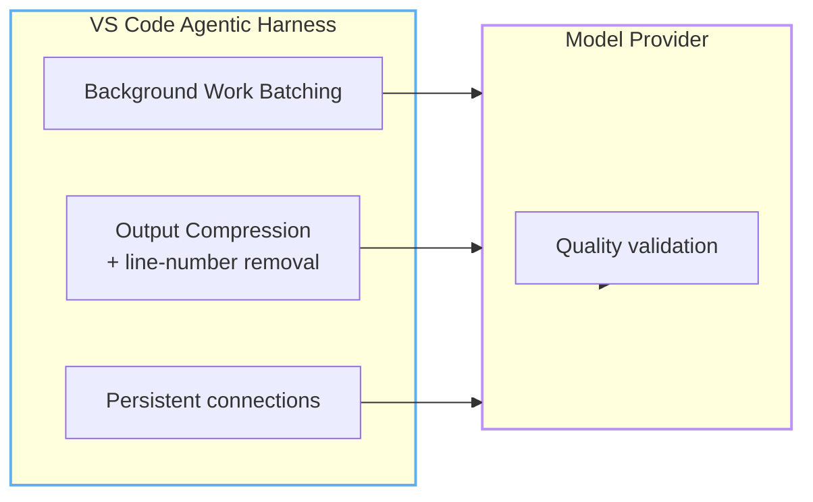
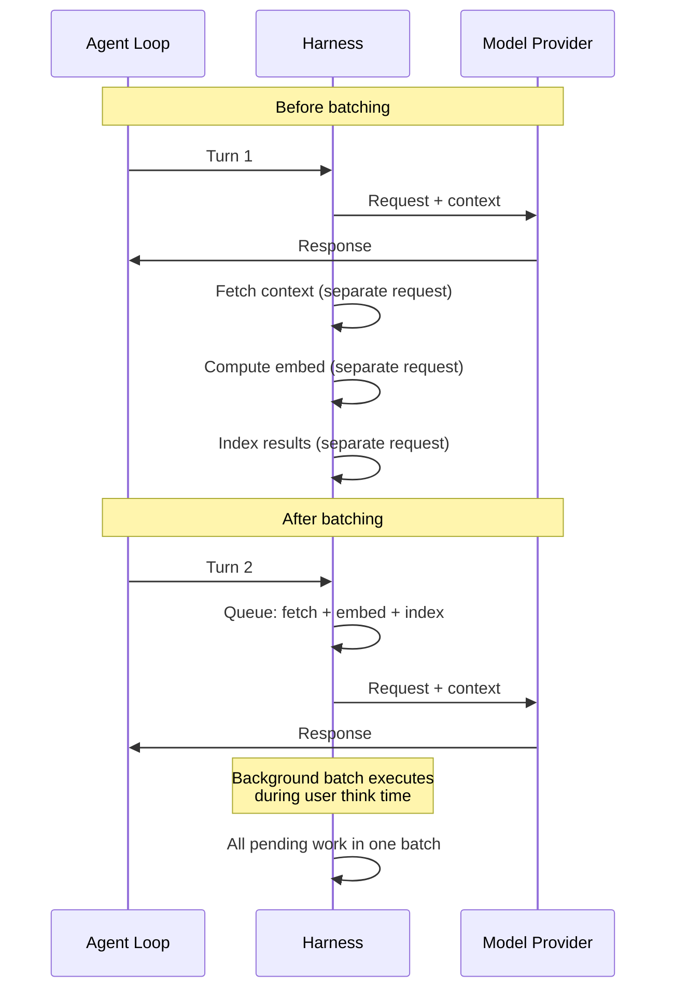
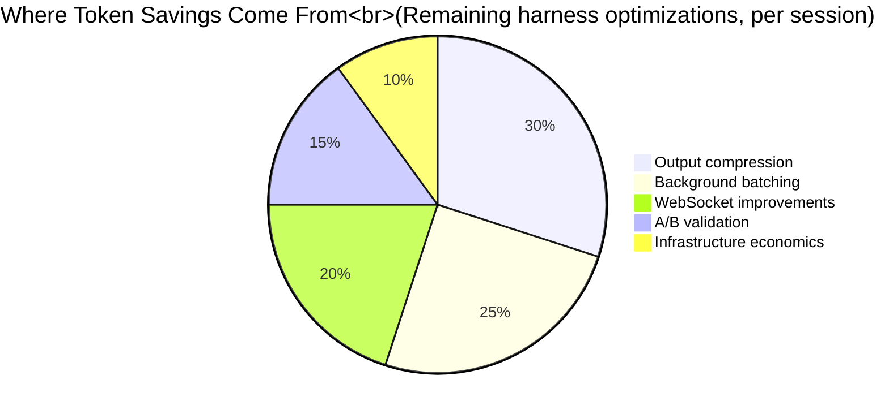

import { Steps } from "@astrojs/starlight/components";

# Helhetsbilden: Hur Copilot sparar tokens åt dig

Varje modul hittills har handlat om **vad du kan göra** — skriva kortare promptar, rensa MCP-servrar, konfigurera instruktionsfiler. Denna modul handlar om **vad Copilot gör automatiskt för dig**.

I modul 2 och 7 lärde du dig om promptcachning, Tool Search och automatiskt modellval — Copilots tre största interna optimeringar. Denna modul täcker de återstående delarna av stacken: outputkomprimering, anslutningsförbättringar, batchning och ingenjörskulturen som gör allt detta säkert att förlita sig på.

Medan du optimerar din sida, levererar VS Code- och GitHub-utvecklingsteamen infrastruktursförbättringar som minskar tokenförbrukning och latens utan någon användaråtgärd. Dessa optimeringar är osynliga — men de sparar fler tokens dagligen än alla prompt-tricks tillsammans.

---

:::note[Fallstudie: Team Alpha]
Team Alpha anpassade sitt arbetsflöde till Copilots interna optimeringar: långa sessioner för komplexa uppgifter, nya sessioner vid uppgiftsgränser och automatiskt modellval. När cachningen byggdes på över flera steg: 6 300 → 5 900 credits. Slutresultat: 14 200 → 5 900 — en minskning med 58%. De ligger nu 3 600 credits UNDER sin pooltilldelning på 9 500.
:::

## De osynliga optimeringarna

Varje Copilot-förfrågan passerar genom **harnesset** (det agentiska ramverket i VS Code) innan den når modellleverantören. Harnessets jobb är att sammanställa kontext, hantera verktyg och dirigera förfrågningar. Sedan mitten av 2025 har harnesset varit fokus för en ihållande satsning på tokeneffektivitet.

Resultatet är en stadig ström av små vinster som ackumuleras:

Optimeringarna delas in i två kategorier:
- **Harness-nivå** (VS Code-teamet): hur kontext förbereds, batchas och levereras
- **Leverantörsnivå** (OpenAI/Anthropic): hur modelltillstånd beräknas

Tillsammans bildar de en stack som gör varje agentsväng billigare, snabbare och säkrare än tidigare — utan någon ändring i koden du skriver.

---

## 1. Outputkomprimering

Modelloutput är där kostnadsmultiplikatorn gör mest ont (4–8x inputkostnad per token). Harnesset tillämpar flera komprimeringstekniker på genererad output.

### Vad som komprimeras

- **Blankteckennormalisering**: redundanta blankrader och indrag i kodblock komprimeras
- **Borttagning av radnummer**: diff-vyer inkluderar ofta radnummerdekorationer som inte tjänar något semantiskt syfte — harnesset tar bort dem innan tokenräkning
- **Förklaringskomprimering**: när modellen genererar utförliga förklaringar tillsammans med kod kan harnesset trunkera eller strukturera outputen

### Siffrorna

VS Code-teamet fann att outputkomprimering ensam minskar fakturerbara output-tokens med **8–12%** i genomsnitt, med högre besparingar för uppgifter som involverar stora diffar. I kombination med code-only-instruktioner (Modul 4) kan output-tokens minska med 70%+.

---

## 2. Batchning av bakgrundsarbete

Agentiska sessioner genererar mycket bakgrundsarbete: kontexthämtning, inbäddningsberäkning, sökindexering och tillståndshantering. Varje bakgrundsoperation var, tills nyligen, en oberoende förfrågan.

**Före batchning**: varje bakgrundsoperation utlöste sin egen tur-och-retur. Kontext hämtades, sedan beräknades inbäddningar, sedan löstes verktygsscheman — varje steg lade till latens och tokenomkostnad för mellanliggande tillstånd.

**Efter batchning**: bakgrundsarbete köas och exekveras i batchar under inaktiva perioder. Harnesset samlar pågående operationer och löser dem i en enda omgång.

Effekten är mest synlig i längre sessioner (5+ steg). Utan batchning bär de första stegen omkostnad från installationsarbete. Med batchning fördelas den omkostnaden över sessionens livscykel.

---

## 3. WebSocket-förbättringar

Agentiska sessioner använde traditionellt kortlivade HTTP-anslutningar — varje steg etablerade en ny anslutning, skickade begäran, tog emot svar och stängde.

Under 2026 flyttade GitHub Copilot i VS Code till **beständiga WebSocket-anslutningar** för agentiska sessioner. Detta minskar inte direkt tokenantalet, men det minskar **inaktiv latens med 19%** och eliminerar TLS-handskakningsomkostnaden vid varje steg.

För tokenekonomin innebär snabbare svar:
- **Färre övergivna sessioner** — användare väntar mindre, så de är mindre benägna att starta en ny tråd
- **Lägre återförsökskostnad** — när ett steg misslyckas är återsändning över WebSocket snabbare än att återetablera HTTPS
- **Bättre återanvändning av autentisering** — beständiga anslutningar bibehåller autentiseringstillstånd, vilket undviker redundanta autentiseringstokens

---

## 4. A/B-experimentkultur

Varje optimering som nämnts här validerades med samma process: **A/B-experiment i produktion plus offline-utvärderingar mot testsviter**.

VS Code-teamets regel: en optimering lanseras endast om uppgiftsframgångsfrekvensen bibehålls eller förbättras medan tokenanvändningen minskar. Detta förhindrar det vanliga feltillståndet att optimera för tokenantal på bekostnad av kvalitet.

### Exempel: Experiment med outputkomprimering (illustrativt)

| Mått | Kontroll | Behandling (komprimering) |
|--------|---------|------------------------|
| Uppgiftsframgång | 83% | 83% (oförändrad) |
| Median output-tokens | 4 800 | 4 200 (-12%) |
| Median latens | 3,2s | 3,0s (-6%) |
| Outputtrohet | 98% | 98% (oförändrad) |

Outputkomprimering sparade tokens utan att ändra uppgiftsresultat eller outputtrohet.

Denna kultur spelar roll för dig eftersom den innebär att dessa optimeringar är **säkra**. När Copilot sparar tokens bakom kulisserna skär den inte hörn. Samma uppgift utförs med färre resurser.

---

## Vad dessa optimeringar innebär för ditt arbetsflöde

Den största insikten från förändringarna under huven: **harnesset vill samma sak som du** — färre tokens per slutförd uppgift. Optimeringarna fungerar bäst när ditt arbetsflöde är i linje med dem.

### Gör

- **Ge agenten ostörd tid** för komplexa uppgifter — bakgrundsarbete kan batchas under pauser
- **Använd tydliga, fokuserade promptar** — komprimering fungerar bäst när den avsedda outputen är entydig
- **Lita på harnesset** — outputkomprimering, batchning och anslutningsförbättringar är automatiska

### Gör inte

- **Behåll inte sessioner över orelaterade uppgifter** — gammal kontext förorenar svar och slösar tokens. En ny uppgift förtjänar en ny session.
- **Optimera inte ett enda mätvärde isolerat** — lägre tokenantal är inte användbart om uppgiftskvaliteten sjunker

### En varning: Fällan med lokala mätvärden

Det är frestande att mäta dina egna tokenbesparingar med en lokal räknare och förklara seger. Men som GitHub-bloggen noterar kan **lokala mätvärden vara missvisande**. En optimering som minskar input-tokens med 15% kan öka output-tokens med 25% eftersom modellen kompenserar med mer utförlig kod.

Harness-nivåns optimeringar mäts *holistiskt* — total kostnad per slutförd uppgift, inte tokenantal per steg. Detta är rätt mätvärde. Ditt jobb är att skriva bra kod och tydliga promptar; harnesset sköter resten.

---

## 5. Infrastrukturekonomi (för självhostade modeller)

Medan de flesta Copilot-användare förlitar sig på GitHubs hanterade infrastruktur möter team som kör egna modeller ytterligare kostnadsavvägningar. Det här avsnittet går igenom valet mellan serverless och dedikerade GPU:er.

### Serverless vs dedikerad GPU

För företag som kör egna modeller påverkar valet av driftmodell kostnaden per token kraftigt. Formeln för brytpunkten:

$$
\mathrm{Cost\ per\ Million} = \left( \frac{R}{T \times 3600 \times U} \right) \times 1\,000\,000
$$

Där $R$ = hårdvarukostnad/timme, $T$ = maximal genomströmning (tokens/sekund), $U$ = utnyttjandegrad.

| Utnyttjandegrad | Effektiva tokens/timme | Kostnad per miljon |
|-------------|----------------------|------------------|
| 10% | 43 200 | $46,30 |
| 25% | 108 000 | $18,52 |
| 50% | 216 000 | $9,26 |
| 80% | 345 600 | $5,79 |

*Baserat på en standardiserad GPU för $2,00/timme och medelstor genomströmning på 120 tokens/sekund.*

:::caution[Utnyttjandefällan]
För en modern H200-GPU-instans på $3,44/timme jämfört med serverless på $0,65/M tokens behöver du **72,2% konstant utnyttjandegrad** dygnet runt bara för att nå brytpunkten. Vid en mer realistisk utnyttjandegrad på 40% (vanligt för ryckiga agentiska arbetsflöden) stiger den effektiva kostnaden till **$1,173/M — en premie på 80% jämfört med serverless**.

Batchstorleken förstärker detta: inferens med en enda förfrågan (batch-1) kan kosta upp till $20,32/M tokens på grund av låg parallellisering av kärnorna. Kontinuerlig batchning med 64–128 förfrågningar sänker kostnaderna dramatiskt.
:::

**Slutsatsen för agentiska arbetsflöden:** Serverless vinner för ryckiga, asynkrona agentsessioner. Dedikerad hårdvara lönar sig bara för kontinuerliga inferenspipelines med hög genomströmning. De flesta utvecklingsteam bör stanna på serverless och i stället fokusera på promptoptimering.

---

## Helhetsbilden: hela stacken

Den fullständiga optimeringsstacken kombinerar automatiska förbättringar i harnesset, leverantörernas funktioner och de tekniker du styr direkt. Denna modul fokuserade på de återstående delarna i harnesset; tidigare moduler täcker de andra lagren. Stacken fungerar bäst tillsammans med användarteknikerna från modul 4–8: fokuserade promptar, mager projektkontext, disciplinerad verktygsanvändning och skyddsräcken som håller uppgifterna på rätt spår.

---

## Team Alpha: Hela resan

| Milstolpe | Credits/månad | Vad ändrades |
|-----------|--------------|--------------|
| Startpunkt | 14 200 | Första UBB-månaden, ingen optimering |
| Efter modul 2 | 12 500 | Förstod kontextmodellen, stängde flikar |
| Efter modul 3 | 11 800 | Aktiverade felsökningsloggning, hittade värsta mönstret |
| Efter modul 4 | 8 900 | Snabba vinster #1, #4, #6 tillämpade |
| Efter modul 5 | 8 200 | Engelska promptar, punktformat |
| Efter modul 6 | 7 500 | Magra instruktioner, .copilotignore |
| Efter modul 7 | 6 800 | MCP-rensning, automatiskt modellval |
| Efter modul 8 | 6 300 | Specmall, TDD, säkerhetsgranskning |
| Slutligt (modul 9) | 5 900 | Arbetsflödet anpassat till cachning/optimeringar |

**Totala besparingar: 8 300 credits/månad (83 USD/månad). Pooltilldelning: 9 500 credits. Nu under budget.**

---

:::tip[Fortsätt lära dig]
Gå tillbaka till [kontextmodellen](/vibe-on-budget/sv/02-context-model) och [Agenter, verktyg och MCP-hygien](/vibe-on-budget/sv/07-agents-mcp) för att tillämpa teknikerna som kompletterar Copilots automatiska optimeringar.
:::

---

:::note[På horisonten: Tokeneffektivitet på modellnivå]

Klicka för att expandera — tekniker på forskningsstadiet

Forskning flyttar tokeneffektiviteten djupare ner i stacken:

- **Kontextpruning** — algoritmer som tar bort icke-informativa tokens från träningsdata och tvingar modeller att fokusera på det som spelar roll.
- **Gles Mixture-of-Experts (MoE)** — modeller med 48B+ totala parametrar men endast 2–3B aktiva under inferens, vilket dramatiskt minskar beräkningskostnaden per token.
- **Multi-Token Prediction** — genererar flera tokens per framåtpass i stället för en, vilket förbättrar genomströmningen utan större modeller.

Dessa tekniker befinner sig på forskningsstadiet — de finns ännu inte i Copilot. Men de visar vart branschen är på väg: effektiviteten flyttar från dina promptar hela vägen ner till kislet.

:::

---

## Övning

1. Öppna Cache Explorer i Agent Debug Logs för din senaste långa session. Hur hög var din cacheträff? Hur många input-tokens återanvändes?
2. Stanna i en lång session i stället för att starta flera korta för din nästa komplexa uppgift. Jämför sessionens totala credits med din baslinje från modul 3.
3. Gå igenom kursens Viktiga slutsatser från alla 9 moduler. Välj de 3 tekniker som skulle spara MEST tokens för dig. Tillämpa dem den här veckan.

## Viktiga slutsatser

- Copilots harness levererar **kontinuerliga tokeneffektivitetsförbättringar** — ingen åtgärd krävs från din sida
