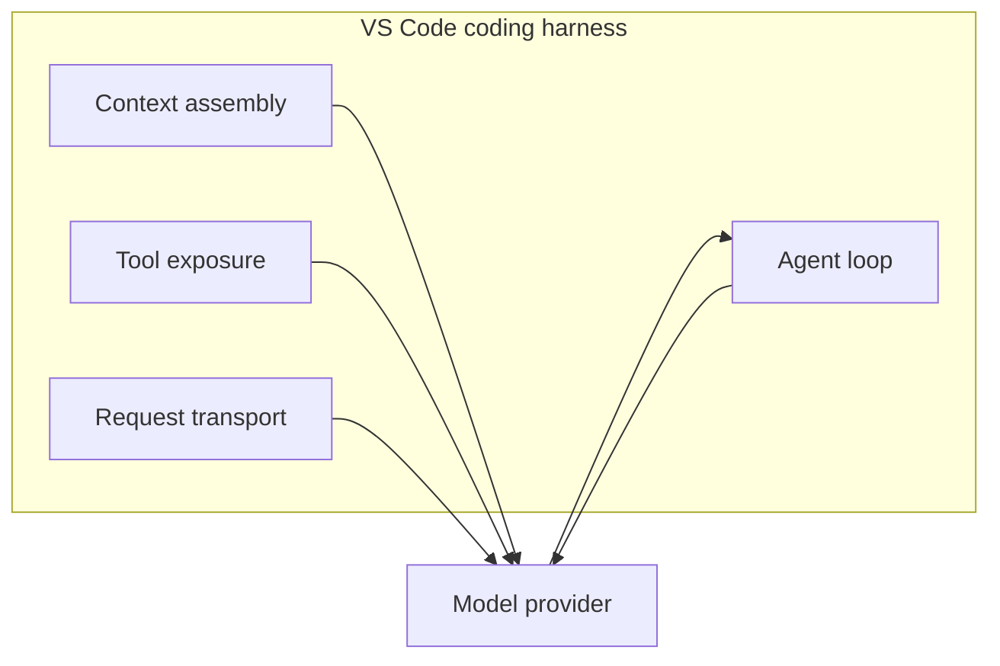
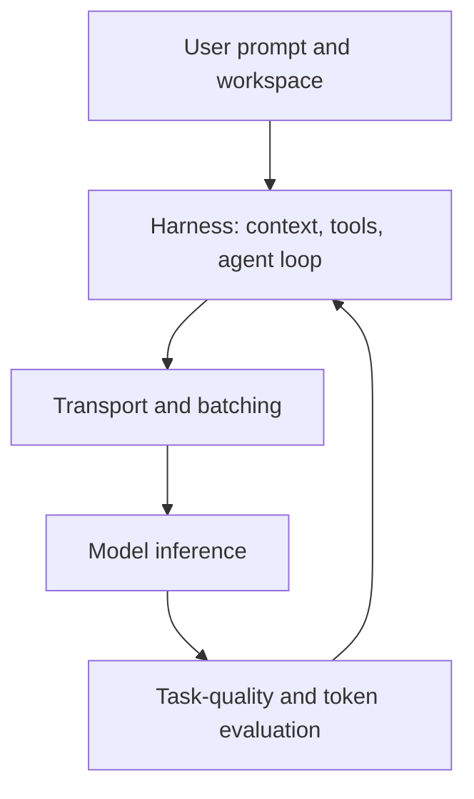

import { Steps } from "@astrojs/starlight/components";

# Helhetsbilden: Hur Copilot sparar tokens åt dig

Tidigare moduler fokuserade på användarstyrda val som promptstruktur, kontexturval och verktygskonfiguration. Den här modulen fokuserar på kodningsharnesset: lagret som sammanställer kontext, exponerar verktyg, kör agentloopen, tolkar verktygsanrop och omvandlar modellens output till åtgärder i editorn. [^m9-1]

VS Code-teamet beskriver arbetet med tokeneffektivitet som en pågående serie uppmätta förbättringar, inte som en enda optimering. För förändringar i harnesset uppger teamet att de använder A/B-experiment i produktion och offline-utvärderingar mot testsviter, och kontrollerar att uppgiftsframgången bibehålls eller förbättras medan tokenanvändningen minskar. [^m9-2]

## 🟡 De osynliga optimeringarna

Harnesset ligger mellan editorn och modellen. Det sammanställer prompten, hanterar verktygen som är tillgängliga för modellen, kör agentloopen och matar tillbaka verktygsresultat till senare turer. [^m9-1]

*(Se [Ordlista](/vibe-on-budget/sv/glossary) för definitioner av outputkomprimering, bakgrundsbatchning, serverless och kontinuerlig batchning.)*

Diagrammet visar ansvarsområden som dokumenterats av VS Code. Det hävdar inte att varje förfrågan använder samma interna implementation. [^m9-1]

## 🟡 1. Outputkomprimering

[VS Code](https://code.visualstudio.com/blogs) rapporterar att harnessarbetet omfattar outputkomprimering, bland annat borttagning av radnummer från genererad kod när dekorationerna inte tillför användbar betydelse. Den publicerade mätningen för outputkomprimering är **5,5 procents minskning av outputtokens**. [^m9-2]

Samma artikel rapporterar att **Tool Search minskar tokenanvändningen med 9–11 procent** genom att undvika att ta med varje verktygsdefinition i varje förfrågan och i stället läsa in definitioner när de behövs. [^m9-2]

Siffrorna beskriver VS Code-teamets mätningar för Copilot-harnesset. De är inte en universell komprimeringsgrad för alla modeller eller kodningsagenter. [^m9-2]

## 🟡 2. Bakgrundsarbete och batchning

Harnessartikeln beskriver agentisk kodning som en iterativ loop där harnesset hanterar kontext och verktygsresultat mellan modellanrop. Den arkitekturen gör bakgrundsarbete, som kontext- och verktygshantering, till en del av systemet runt modellförfrågan snarare än av modellen ensam. [^m9-1]

Artikeln om tokeneffektivitet rapporterar batchning av bakgrundsarbete under inaktiva perioder som en av optimeringarna teamet utvärderat. Källan stöder batchningsbeteendet, men publicerar inte de före- och eftermätningar av antal förfrågningar som fanns i en tidigare version av lektionen. Därför återges de inte här. [^m9-2]

## 🟡 3. [WebSocket](https://developer.mozilla.org/en-US/docs/Web/API/WebSocket)-förbättringar

VS Code rapporterar att beständiga WebSocket-anslutningar minskar medianen för **TTFT (Time-To-First-Token) med 19 procent**. Detta är ett mått på latens, inte en minskning av antalet genererade tokens. Anslutningarna använder också [TLS (Transport Layer Security)](https://en.wikipedia.org/wiki/Transport_Layer_Security) för transportsäkerhet. [^m9-2]

Snabbare transport kan ändra hur lång tid en agentisk tur tar, men den citerade källan visar inte att WebSockets minskar övergivna sessioner, antalet återförsök eller förbrukningen av autentiseringstokens. Sådana orsakssamband hävdas därför inte här. [^m9-2]

## 🟡 4. Evidensbaserad optimering

VS Code-teamet säger att de utvärderar harnessförändringar med A/B-experiment i produktion och offline-utvärderingar mot testsviter, där uppgiftsframgången måste bibehållas eller förbättras samtidigt som tokenanvändningen minskar. [^m9-2]

Processen stöder jämförelser mellan kontroll- och behandlingsgrupper, men den citerade artikeln publicerar inte värdena för uppgiftsframgång, latens eller trohet från exempeltabellen som tidigare fanns i lektionen. Tabellen har tagits bort i stället för att presentera osourcade siffror som mätningar. [^m9-2]

GitHub-artikeln om kostnadseffektivitet beskriver på samma sätt effektivitet som ett problem för hela uppgiften: att minska en del av en förfrågan räcker inte om förändringen orsakar mer arbete någon annanstans i uppgiften. [^m9-3]

## Vad dessa optimeringar innebär för ditt arbetsflöde

- Ge komplexa uppgifter tillräckligt med ostörd tid för att harnesset ska hantera agentloopen och dess omgivande arbete; harnesset ansvarar för kontextsammanställning, verktygsexponering och återkoppling av verktygsresultat. [^m9-1]
- Håll promptar fokuserade och kontexten relevant. GitHubs vägledning rekommenderar att välja lämplig modell, strukturera promptar och lägga till skyddsräcken för att slutföra uppgifter effektivare och använda färre AI-credits. [^m9-4]
- Bedöm en optimering utifrån slutförd uppgiftskvalitet och resursanvändning tillsammans, eftersom VS Code:s utvärderingsprocess uttryckligen kontrollerar uppgiftsframgång tillsammans med tokenanvändning. [^m9-2]

### En varning: Fällan med lokala mätvärden

Tokenantalet är inte ensamt ett komplett mått på effektivitet i kodningsuppgifter. GitHubs kostnadseffektivitetsdiskussion betonar att hela uppgiften ska utvärderas i stället för ett enda lokalt mått, eftersom arbete som sparas i ett steg kan kompenseras av extra arbete i ett annat. [^m9-3]

## 🔴 5. Infrastrukturekonomi (för självhostade modeller)

Team som kör egna modeller måste jämföra pris per token med kostnaden för att hålla dedikerad hårdvara tillgänglig. Serverless-inferens debiteras efter förbrukning, medan dedikerad infrastruktur debiteras för provisionerad beräkningskapacitet. Avvägningen beror på genomströmning och utnyttjandegrad. [^m9-5]

### Serverless kontra dedikerad GPU

För en dedikerad GPU kan den effektiva kostnaden per miljon tokens beräknas från GPU-priset per timme, genomströmningen och den ihållande utnyttjandegraden:

$$
\mathrm{Cost\ per\ Million} = \frac{R}{T \times 3600 \times U} \times 1{,}000{,}000
$$

Här är $R$ GPU-priset per timme, $T$ genomströmningen i tokens per sekund och $U$ utnyttjandegraden. Detta är kostnadsmodellen som publicerats för den uppmätta H200-jämförelsen. [^m9-6]

DigitalOcean-benchmarken rapporterar en NVIDIA [H200 GPU](https://www.nvidia.com/en-us/data-center/h200/) för **3,44 dollar per GPU-timme**, med Llama 3.3 70B, FP8-kvantisering och vLLM. Den uppmätta kostnaden varierade från **20,32 dollar per miljon outputtokens vid batch 1** till **0,45 dollar per miljon outputtokens vid batch 128**, vilket visar varför trafikprofil och batchning spelar roll. [^m9-6]

Samma benchmarksammanfattning rapporterar **0,65 dollar per miljon tokens** för den jämförda serverless-tjänsten och en **brytpunkt på 72,2 procents ihållande utnyttjandegrad** för det dedikerade H200-scenariot. Vid 40 procents utnyttjandegrad rapporteras **1,173 dollar per miljon tokens** för den dedikerade konfigurationen. [^m9-7]

| Uppmätt konfiguration | Rapporterat resultat |
|---|---:|
| H200, batch 1 | 20,32 dollar / 1M outputtokens |
| H200, batch 128 | 0,45 dollar / 1M outputtokens |
| Brytpunkt dedikerad/serverless | 72,2 % ihållande utnyttjandegrad |

Detta gäller den namngivna hårdvaran, modellen, ramverket, arbetsbelastningen och datumet i DigitalOcean-benchmarken. Det är inte universella priser för alla GPU:er eller leverantörer. [^m9-6]

**Slutsats:** ryckig trafik kan gynna användningsbaserad inferens, medan dedikerad hårdvara med kontinuerligt hög belastning kan ge bättre styckekonomi. Rätt val kräver uppmätt genomströmning och utnyttjandegrad för arbetsbelastningen, inte bara ett hårdvarupris. [^m9-5] [^m9-6]

## 🟡 Så hänger det ihop: hela stacken

Den källbaserade stacken är lagerindelad: harnesset sammanställer kontext och verktyg, transporten påverkar latensen, modellserveringens infrastruktur bestämmer beräkningskostnaden och utvärderingen kontrollerar att kvaliteten bevaras. [^m9-1] [^m9-2] [^m9-5]

Diagrammet är en syntes av ansvarsområdena och utvärderingsprocessen i de citerade VS Code- och GitHub-artiklarna. Det är inte en procentuell uppdelning av tokenbesparingar. [^m9-1] [^m9-2] [^m9-3]

:::tip[Fortsätt lära dig]
Gå tillbaka till [kontextmodellen](/vibe-on-budget/sv/02-context-model) och [Agenter, verktyg och MCP-hygien](/vibe-on-budget/sv/07-agents-mcp) för att tillämpa tekniker som kompletterar harnesset. [^m9-1] [^m9-4]
:::

:::note[På horisonten: Tokeneffektivitet på modellnivå]

Klicka för att expandera — tekniker på forskningsstadiet

Forskning riktar sig också mot modell- och inferenslagren:

- **Kontextpruning** väljer en föränderlig delmängd av prompttokens för beräkning. LazyLLM beskriver dynamiskt tokenurval under prefilling och decoding och rapporterar 2,34× snabbare prefilling för Llama 2 7B i en flerdokumentfrågesvarsuppgift med bibehållen noggrannhet. [^m9-8]
- **Gles Mixture-of-Experts (MoE)** dirigerar tokens genom utvalda experter. SHAPE-artikeln beskriver låg beräkningskostnad per token i glesa MoE-modeller, minneskostnaden för att hålla expertpoolen laddad och konkurrenskraftig noggrannhet vid 20 och 40 procents expertpruning i de utvärderade basmodellerna. [^m9-9]
- **Multi-Token Prediction** tillhandahåller flera framtida tokenprognoser för spekulativ decoding. Den citerade forskningen beskriver hur flera tokens kan genereras per steg samtidigt som autoregressiv generering stöds. [^m9-10]

Dessa artiklar visar forskningsmetoder och uppmätta resultat i sina angivna experimentmiljöer. De visar inte att teknikerna är driftsatta i GitHub Copilot. [^m9-8] [^m9-9] [^m9-10]

:::

## Övning

1. Öppna Cache Explorer i Agent Debug Logs för din senaste långa session. Hur hög var din cacheträff? Hur många inputtokens återanvändes?
2. Stanna i en lång session i stället för att starta flera korta för din nästa komplexa uppgift. Jämför sessionens totala credits med din baslinje från modul 3.
3. Gå igenom kursens Viktiga slutsatser från alla 9 moduler. Välj de 3 tekniker som skulle spara mest tokens för dig och tillämpa dem den här veckan.

## Viktiga slutsatser

- Copilots harness sammanställer kontext, exponerar verktyg, kör agentloopen och matar tillbaka resultat till modellen. [^m9-1]
- VS Code rapporterar 5,5 procent lägre outputtokenanvändning från outputkomprimering, 9–11 procent lägre tokenanvändning från Tool Search och 19 procent lägre median-TTFT från beständiga WebSocket-anslutningar i de citerade mätningarna. [^m9-2]
- VS Code validerar förändringar med A/B-experiment i produktion och offline-utvärderingar mot testsviter. [^m9-2]
- Kostnaden för dedikerade GPU:er beror på genomströmning, batchning och utnyttjandegrad; den citerade H200-benchmarken rapporterar en brytpunkt på 72,2 procent mot det jämförda serverless-priset. [^m9-6] [^m9-7]
- Kontextpruning, gles MoE-pruning och multi-token prediction stöds här av forskningsartiklar, inte av ett påstående om att de är driftsatta i Copilot. [^m9-8] [^m9-9] [^m9-10]

*Beräknad lästid: 7 minuter*

[^m9-1]: [Kodningsharnesset bakom GitHub Copilot i VS Code](https://code.visualstudio.com/blogs/2026/05/15/agent-harnesses-github-copilot-vscode) — Julia Kasper, Megan Rogge och Aaron Munger, Visual Studio Code, 15 maj 2026.
[^m9-2]: [Förbättrad tokeneffektivitet för GitHub Copilot i VS Code](https://code.visualstudio.com/blogs/2026/06/17/improving-token-efficiency-in-github-copilot) — Ryan Caldwell och Bhavya U, Visual Studio Code, 17 juni 2026.
[^m9-3]: [Så gör vi AI-kodning mer kostnadseffektiv utan att offra uppgiftskvaliteten](https://github.blog/ai-and-ml/github-copilot/how-we-make-ai-coding-more-cost-efficient-without-sacrificing-task-quality/) — GitHub, 2026.
[^m9-4]: [Optimera din AI-användning för att maximera effektiviteten och minska kostnaden](https://docs.github.com/en/copilot/tutorials/optimize-ai-usage) — GitHub Docs, 2026.
[^m9-5]: [LLM-inferenskostnad per token: jämförelse mellan serverless och dedikerad drift](https://lyceum.technology/magazine/inference-cost-per-token-provider-comparison/) — Maximilian Niroomand, Lyceum Technology, 2026.
[^m9-6]: [Tokenekonomi för olika trafikprofiler på dedikerade GPU:er](https://www.digitalocean.com/community/tutorials/llm-inference-cost) — DigitalOcean Community, 8 juli 2026.
[^m9-7]: [Inferenskostnadsmodellen som ingen har publicerat: tokenekonomi för olika trafikprofiler på dedikerade GPU:er](https://daily.dev/posts/the-inference-cost-model-nobody-has-published-token-economics-across-traffic-profiles-on-dedicated--ddrg6yxfh) — DigitalOcean Community, 8 juli 2026.
[^m9-8]: [LazyLLM: Dynamisk tokenpruning för effektiv inferens med lång kontext](https://arxiv.org/abs/2407.14057) — Minsik Cho, Thomas Merth, Sachin Mehta, Mohammad Rastegari och Mahyar Najibi, arXiv, 2024.
[^m9-9]: [SHAPE: Koalitionsmedveten expertpruning för glesa Mixture-of-Experts-LLM:er](https://arxiv.org/abs/2606.09886) — Alizen et al., arXiv, inskickad 3 juni 2026.
[^m9-10]: [Snabbare språkmodeller med bättre prediktion av flera tokens](https://arxiv.org/abs/2410.17765) — arXiv, 2024.
